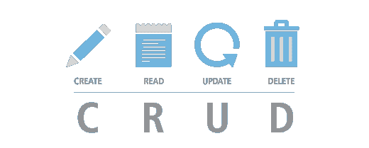
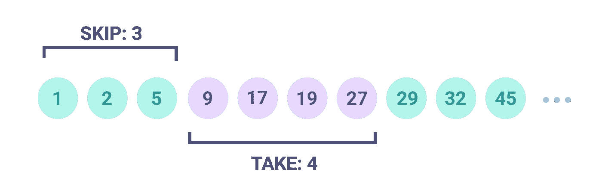
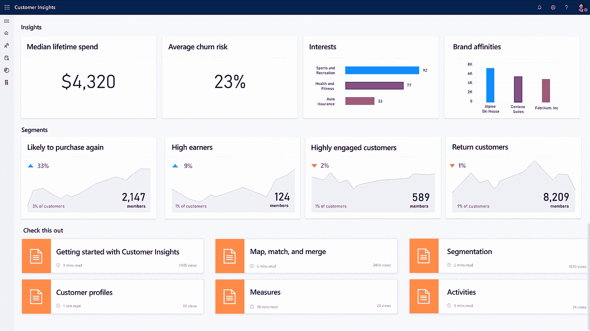

# 低编码商业应用开发指南—第 2 部分—后端

> 原文：<https://medium.com/codex/business-apps-development-guide-with-low-coding-part-2-backend-3016eee91c10?source=collection_archive---------26----------------------->

## 与 Ernesto Diezhandino 合作撰写。


你正在阅读的是关于如何**使用**低编码** **方法**解决方案构建**业务**应用**的三篇系列文章的一部分

在这里你可以获得**开源代码**，可能对你有帮助的提示和见解，特别是如果你是初学者的话。你可以将这些知识应用于任何编程语言，但是源代码已经用**写好了。Net** 标准和。净 5。

在了解更多细节之前，以下是您可以从这种低编码解决方案中获得的亮点:

*   它基于开源软件，Apache 许可或类似的软件。
*   它采用简洁的架构，构建在各种低耦合和可配置的组件之上。
*   遵循坚实的原则和最佳编码实践。
*   这不是黑匣子，是你的。

这是关于用低编码方法构建业务应用程序的三篇文章中的第二篇，它们是:

1.  [架构、最佳实践、想法和编码技巧](/@manueljimenezmatilla/business-apps-development-guide-with-low-coding-part-1-40061b394d5)。
2.  **后端解决方案(就在这里！).**
3.  [前端解决方案](/@manueljimenezmatilla/business-apps-development-guide-with-low-coding-part-3-ui-406694e08bc5)。

# TL；速度三角形定位法(dead reckoning)

在第一篇文章中，我解释了为什么使用组件如此重要，现在，看到这个列表有多长，你可以想象我们将要解决多少重复出现的问题。

也许你认为你不需要这么多组件，但是所有的组件都可以很容易地包含在你的基础项目中，所以没有理由不保留它们。

后端组件集:

1.  身份验证组件。
2.  授权组件。
3.  控制器和处理器*。
4.  基础结构数据库组件。
5.  基础设施 API 组件。
6.  实体管理器组件。
7.  实体列表管理器组件(分页和过滤器)。
8.  验证组件。
9.  业务对象组件。
10.  错误管理器组件。
11.  监控组件。
12.  审核组件。

**注意**:控制器和处理器是规则的例外。

后端通用**额外组件**:

*   通知组件。
*   导入/导出组件。

**注意**:所有的组件配置都将基于第一篇文章中描述的配置器模式，因此您可以利用每个组件都有一组配置的可能性。

# 将业务应用程序的后端分解成组件

在开始这里的组件之前，您有几个共同的建议。

1.  使用 [**中介模式**](https://en.wikipedia.org/wiki/Mediator_pattern#:~:text=In%20software%20engineering%2C%20the%20mediator,alter%20the%20program's%20running%20behavior.&text=This%20reduces%20the%20dependencies%20between%20communicating%20objects%2C%20thereby%20reducing%20coupling) :这将有助于组件编排，它将使功能扩展性变得容易，我们将获得更好的可靠性。
2.  使用 [**配置器模式**](https://github.com/jiman14/Configurall/blob/main/README.md) :这将允许您根据环境、设备类型或为该组件选择的提供商等变量，对同一组件进行多种配置。

# 认证组件


身份验证系统非常普遍，这个组件不是为了开发自己的，而是为了与它绑定并使其可配置。

首先，您需要选择身份验证系统，然后:

1.  使用**配置器模式**添加用于配置的实体。
2.  在**中介管道**中注册组件。

**注**:禁用它需要一个潜在的组件配置。

我推荐使用 [**Keycloak**](https://www.keycloak.org/) ，一个开源的身份解决方案。阅读本文深入了解 key cloak:[https://medium . com/key cloak/key cloak-essentials-86254 b2f 1872](/keycloak/keycloak-essentials-86254b2f1872)

[. net 的 Keycloak 认证中间件开源项目](https://github.com/vip32/aspnetcore-keycloak)

# 授权组件

与前面的组件一样，您不会希望自己开发一个授权组件。您需要绑定它，并使其可配置。

重点是，这个配置并不简单，因为它将基于一个 [RBAC](https://en.wikipedia.org/wiki/Role-based_access_control) ( **基于角色的访问控制**)用于你的后端资源，也许你还需要一个用于 UI 路径的配置。

对于该组件，您需要:

1.  使用配置器模式添加用于配置与授权系统的绑定的实体。
2.  为 RBAC 配置添加实体。
3.  在项目启动时缓存配置。
4.  在中介管道中注册组件。
5.  一旦用户通过身份验证，就调用该组件

RBAC 配置通常很大，存放在哪里？这是一个你应该回答的问题，选项有:代码、数据库或文件。这将取决于所需的灵活性和可用性，数据库是常见的选择，特别是对于大型 RBAC。

一旦选择了存储系统，我建议在开始时缓存所有配置，这样如果出现错误，就可以尽快捕获并通知它们。

如果需要更复杂的系统，我建议对这个组件使用功能强大的:[](https://github.com/casbin/Casbin.NET)**Casbin 库。**

# **控制器和处理器**

****

**这是解决方案的核心部分，从结构上来说，它是数据生命周期的起点和终点，因此我们需要特别关注它。中介模式或 orchestrator 模块在这里会非常有用。**

**我建议使用已经实现的中介库，如 [**中介**](https://github.com/jbogard/MediatR)**

**这种模式将帮助我们:**

*   **减少控制器类中的代码。**
*   **编排数据生命周期。**
*   **扩展功能。**

**使用这些模式的结果是，我们将得到没有定制代码的类，从而提高我们应用程序的可靠性。**

**我们将选择[**mediator 管道行为**](https://garywoodfine.com/how-to-use-mediatr-pipeline-behaviours/) 来创建一个管道，通过该管道，请求将按照先前建立的顺序到达每个下一个组件:**

*   **请求的试演组件。**
*   **身份验证组件。**
*   **授权组件。**
*   **请求验证。**
*   **处理程序类。**
*   **响应的试听组件。**

**注意:审计器组件在我们的三篇文章系列的第一篇中进行了描述。**

**控制器中唯一的自定义元素是路径和一些类属性，它们都可以自动化，你可以从 DB 表或其他什么中自动生成控制器类，但我建议以**片段**的方式来做，而不是直接在解决方案中。**

## **经手人:**

**现在轮到处理程序了，它们是业务逻辑的入口点，在理想情况下，它们位于由服务管理的持久层。处理程序可以有这样的结构:**

1.  **复杂的验证。**
2.  **对业务逻辑所在的持久性/服务层的调用。**
3.  **应答作文。**

**在处理程序中，我们可能会编写一些代码行，但是在持久性/服务层中对定制代码的需求是不可避免的，或者可能不是。下一个组件将有助于减少自定义，保持阅读等。**

# **请求验证组件**

****

**一个经过深思熟虑的验证组件将减少大量的代码行，你可以使用 [**数据注释**](/@mirzafarrukh13/data-annotations-36acbee715a8) 或一些库来实现这个目标:**

*   **一个无缝的**可配置的**验证库。**
*   **可扩展的、可定制的验证器。**
*   **通过错误组件通知错误。**

```
Note: The error management component is described in its own section below.
```

# **基础设施数据库组件**

****

**该组件是数据库连接器库的抽象层，它应该有助于配置、查询构建和执行。**

**如果你使用 [**实体框架**](https://docs.microsoft.com/en-us/ef/) 你可以超越这个组件，只配置连接字符串，但是如果你使用更高效的 DB 连接器，比如 [**Dapper**](https://github.com/DapperLib/Dapper) ，你希望有一些助手来避免编写手动查询。**

**我推荐 Dapper，因为它的性能非常好。如果您不想编写手动查询，这里有一些提示:**

1.  **使用 [**Dapper Contrib 扩展**](https://dapper-tutorial.net/dapper-contrib) 简化操作。**
2.  **使用查询构建器，搜索“Dapper fluent query”:你会找到类似[**DapperFluentQueryHelper**](https://github.com/jiman14/DapperFluentQueryHelper)这样的库。**

**最后，使用泛型类型来概括实体管理是锦上添花。您可以使用 Dapper 直接解决这个问题，因为它适用于一般对象，使用几行代码添加一些包装器方法，会产生如下结果:**

```
// Get an entity from an Id of T type
T Get<T>(Id)// Updating an entity of T type 
bool Update<T>(T entityObject)//Inserting an entity of T type
bool Insert<T>(T entityObject)// Deleting an entity of T type
bool Delete<T>(Id)//List of entities of T type
List<T> GetAll<T>(func<query>)
```

**注 1:也许你还想增加一些批量操作。**

**注 2:*get all*方法接收一个函数，这允许您在该方法之外构建查询，例如使用 Dapper fluent 查询库。**

****逻辑删除提示:****

**一个常见的情况是在一些实体中实现逻辑删除，对于这种情况，您应该这样做:**

1.  **向该组件添加 Activate 和 Deactivate 方法。**
2.  **向所需的数据库实体添加一个“逻辑删除”基类，**
3.  **将基本属性“Active”添加到“逻辑删除”基类。**

**然后，当 de/activate 方法接收到一个从“逻辑删除”类继承的实体时，它们将在更新它之前更改 Active 属性。**

```
bool De/Activate<T>(T entityObject) where T: LogicDeletionEntity
{
   baseLogicEntityObject = T as LogicDeletionEntity;
   baseLogicEntityObject.Active = true / false;
   return Update(baseLogicEntityObject);
}
```

## **使用 CQRS:**

**此外，您可以使用两个连接器使用 [CQRS](/microservicegeeks/the-command-query-responsibility-segregation-pattern-18e5ff8b2a4a#:~:text=TL%3BDR%3A%20The%20Command%E2%80%94,performance%2C%20scalability%2C%20and%20security.) ( **命令查询责任分离**)来提高性能，一个用于读取，另一个用于写入，这种方法会使您的基础架构层稍微复杂一点，除非您使用相同的 DB 连接器进行读取和写入，我建议对两者都使用 MediatR 和 Dapper，但通常它与实体框架一起使用，如您可以在此代码示例中看到的:【https://github.com/kgrzybek/sample-dotnet-core-cqrs-api】T5。**

# **基础设施 API 组件**

****

**记录一个[**restful API**](/edureka/what-is-rest-api-d26ea9000ee6)需要大量的信息，这些信息通常会被频繁审查:**

*   **方法描述。**
*   **受控错误列表。**

**所以这个组件的目的是更新这些信息，而不需要重新编译代码。一种简单的方法是使用数据库或文本文件(json)来存储这些信息，并使用这个组件对其进行热重新加载。**

**如果使用 [**Swagger**](https://swagger.io/) 或类似的工具，步骤会类似:**

1.  **建模工具(swagger)需要的实体类。**
2.  **用来自数据库或文本文件的 Json 转换器填充实体类。**
3.  **将数据映射到工具(swagger)对象。**

**这是一个快速的解决方案，但足以改变 API 信息，而不需要上传应用程序的新版本。**

# **实体管理器组件**

****

**在控制器中，建议该处理器结构:**

1.  **复杂的**验证**。**
2.  **对 persistence / **service** 层的调用，业务逻辑在这里。**
3.  **应答作文。**

**许多 API 资源是单个实体的简单 CRUD，因此上述功能可以用一些助手来解决，每个助手负责一个操作: *Get、Insert、Update、Delete* 。**

**它们都将遵循相同的结构，因此该组件将具有以下功能:**

1.  **从缓存组件获取用户会话数据。**
2.  **调用业务对象组件进行复杂的验证。**
3.  **调用基础设施数据库组件通用函数( *Get、Insert 等*)。**
4.  **构建并返回响应。**

**调用业务对象组件可以通过直接实例化或使用配置器模式来完成，接下来，我们可以使用实体类型和选择正确的业务对象所需的变量来定义业务对象类。**

**该组件可以由通用实体构成。此外，我们还可以创建一个接口来完成该组件的需求，该接口将请求的实体和会话数据作为参数。**

# **实体列表管理器组件(分页和过滤器)**

****

**对结果进行分页有很多原因，但这些原因的根源是导致缺乏安全性的性能。因为任何人都可能导致服务质量大幅下降。所以**分页**结果在任何数据列表请求中都必须是强制性的。我建议使用**光标分页**，如果你想了解它请查看这篇文章:**

**[https://medium . com/swlh/how-to-implementation-cursor-pagination-like-a-pro-513140 b65f 32](/swlh/how-to-implement-cursor-pagination-like-a-pro-513140b65f32)**

**与前一个组件类似，该组件的结构如下:**

1.  **从缓存组件获取用户**会话数据**。**
2.  **调用下面解释的业务对象组件进行复杂的**验证**。**
3.  ****调用**基础架构 **DB 组件**通用函数( *GetAll* )。**
4.  **返回响应。**

**上一节描述了第一点，除了业务对象组件应该返回下一点所需的查询:调用 *GetAll* 方法。**

**这就是我们如何将所有查询放在持久性/服务层各自的业务对象中。**

**在这种情况下，我们可以创建一个与前面的组件非常相似的接口，但是返回一个实体列表。**

# **错误管理器组件**

****

**该组件旨在配置通常用于错误日志记录的第三方库，该库将提供:**

*   **记录不同级别信息的方法:调试、警告和错误(至少)。**
*   **使用类型化的错误列表，这样您就可以为每个启用翻译的错误提供一个代码。**

**查看这篇关于 [**Serilog**](https://serilog.net/) 的文章:**

**[https://Mahdi-karimipour . medium . com/structured-logging-with-seri log-ASP-net-5-0-APIs-and-application-insights-c10a 1b 915634](https://mahdi-karimipour.medium.com/structured-logging-with-serilog-asp-net-5-0-apis-and-application-insights-c10a1b915634)**

```
Note: Remember that each API resource method could returns a HTTP error response.
```

# **监控组件**

****

**这个组件负责处理我们的应用程序的性能，它应该是一个高度解耦的软件，最多需要配置来存储结果数据。**

**有许多监控库，其中一些库，如 [**微软洞察**](https://docs.microsoft.com/en-us/workplace-analytics/myanalytics/use/use-the-insights) ，只需要配置一次，因此对于其他库，或者如果您计划自己创建一个库，需要考虑以下因素:**

*   **监控:**内存消耗，处理器使用百分比，磁盘空间**。**
*   **不同的监控模式，为了调节监控开销或禁用它，应用程序性能将感激你。**
*   **监控查询执行。**

```
Note: Don’t forget timestamps!
```

# **审计组件**

****

**与前面的组件不同，由于项目的自定义试听要求，您的试听几乎在所有情况下都需要自定义代码。对于其他的，如果我们把可审计的事情分开，就没有那么多了，你可能只想审计:应用程序访问、API 调用(请求和响应)和数据库操作。**

**我建议使用[**Audit.Net**](https://github.com/thepirat000/Audit.NET)库来构建这个组件，这样你只需要配置它并将他的方法包装在你的组件中。否则，该组件应具有以下将由相应组件调用的功能:**

*   ****应用程序访问审计**方法:当用户打开会话时，由认证组件调用。**
*   ****API 调用审计**方法:由中介在开始和结束时调用，分别审计请求和响应。**
*   ****DB 操作审计**方法:由基础设施 DB 组件为每个写操作调用。**

```
Note: This component must be registered in the mediator twice, so the easiest way for the second registering is to make an empty child class of this component.
```

# **结论**

**大多数组件通常在业务解决方案中实现，如果你曾经创建过，你会同意我的观点，当你头脑中有了清晰的功能，你会用几行代码更快地完成它。所以我希望这个分析能在某种程度上帮助你理清思路。**

**以这种方式建造，导致了这样的成就:**

*   ****可复用软件**，保证代码强度。**
*   ****职责被分解成组件，这保证了可扩展性。****
*   ****可配置组件**在实施少量更改时建立可靠性。**