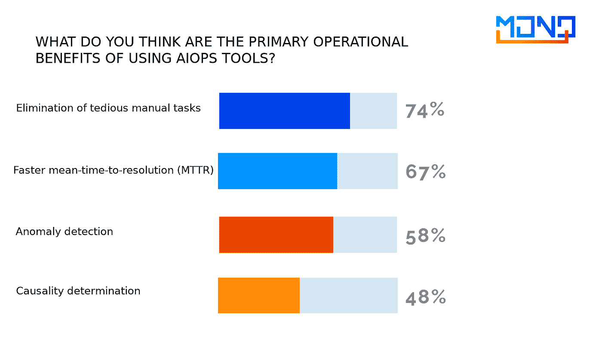

# AIOps 工具的业务优势

> 原文：<https://medium.com/codex/business-benefits-from-aiops-tools-a6c4d4d097a1?source=collection_archive---------4----------------------->

## 或者为什么他们不会解雇一个好的系统管理员

IT 人员全天候盯着他们的 IT 资产的屏幕和性能指标，这是任何 SOC(安全运营中心)或 NOC(网络运营中心)的典型工作转变。通过实施一个能够独立处理这些任务的智能系统，您的天才工程师的资源可以得到更有效的利用。工程师可以被分配去做更需要人和他的智力的工作——例如，开发和控制的任务——而日常工作应该由“机器人”来做。这一目标可以在 AIOps 系统的帮助下实现，但不幸的是，这种系统面临着许多疑问。


**如何计算您的 AIOps ROI？**

成本是显而易见的——产品的价格和部署工作，但是会有利润吗？我们将在本文中讨论这一点，**将主要对 CDTO、CDO、CIO 有用，他们认为 AIOps 是他们公司 IT 开发的一个有前途的方向**。它对系统管理员、sre 和 DevOps 也很有用，他们不害怕变化，而是根据自己的目的利用变化。

作为 MONQ AIOps 解决方案的供应商，我们经常会面临这样的问题:“如果它已经工作了，为什么还要改变它？”，“为什么我们还需要一个 IT 监控？”、“我们还没准备好”、“这很贵”等。

答案一定会让首席财务官满意。**AIOps 的实施以及随之而来的公司职能变化将带来更高的销售额和更高的运营利润**。实施 AIOps 是一项 IT 投资，具有巨大的正 ROI。

**为什么开始实施 AIOps 很难？**

OpsRamp 的一项调查(“AIOps 采用的主要趋势:数字化运营管理的未来？”)解释了为什么企业对 AIOps 有些警惕:

*   有一种观点认为 AIOps 工具实施起来非常昂贵，超过 50%的受访者表示价格是一个关键问题。
*   时间价值比(部署的复杂性)和 AIOps 工具堆栈的当前技术限制在组织内产生了意识形态上的挑战。


*实施 AIOps:IT 领导者心中的阻碍因素*

第一个问题确实存在。但是，正如他们所说，“有不同类型的 AIOps”。从 CA (Broadcom)或 Microfocus 实现 AIOps 的起价为每台主机 300 美元。如果您是一家拥有超过 100，000 台主机的大型企业，这种 AIOps 的成本会非常高。但也有完全不同的系统，例如，云 BigPanda、Moogsoft、LoomSystem 或我们的系统，其中带许可证的 AIOps 实施成本很少会超过 3-5 万美元，因为我们是根据处理的数据量计算成本的。也就是说，客户只为他实际使用的东西付费。

第二个问题是组织变革的必要性。如今，许多大公司的 IT 基础架构支持是这样的:

*   每个产品或基础设施都有一个轮班工作的支持团队。
*   例如，一些员工在 Zabbix 屏幕上监控服务器的状态。
*   另一部分员工在生产环境中观看 kubernetes 上的豆荚。
*   团队的另一部分监控用户活动图，并分析用户对性能不佳的投诉。
*   这个过程通常是被动的:出了问题->用户开始骂人->支持团队开始调查->问题得到解决。
*   基础设施或产品支持团队的领导者“垄断”数据。

对于 AIOps 平台及其混合(伞状)监控特性，支持流程如下所示:

*   来自用户、日志和监控系统的所有数据都由 AIOps 自动收集，无需工程师的参与。
*   该系统本身确定严重程度，自动选择责任人，并在可能的情况下启动自动修复链。
*   该过程是主动组织的:系统持续监控，从用户的角度分析 IT 基础设施和服务的状态->预测故障并评估其对业务的影响->在标准问题的情况下，启动自动修复功能->在非标准问题的情况下，它自动通知负责团队指出故障的根本原因。
*   可以灵活配置对数据的访问权限。

因此，AIOps 的 IT 基础设施支持看起来有所不同，而且组织的变化是不可避免的。如果一个公司的组织文化不包括快速解决问题、以结果衡量绩效和共享信息的习惯，那么 AIOps 实施的过程就可能陷入僵局。

AIOps 有什么好处？

市场对 AIOps 的前景和潜力有极大的兴趣。但许多人仍然认为这只是又一次“炒作”。预测分析可以通过打破运营壁垒、消除长期消防和提高 IT 效率来提高数字生产力。

在 OpsRamp 研究中，受访者期望从使用 AIOps 中获得以下好处:

*   74%的受访者希望有机会实现日常操作的自动化，
*   67%的受访者认为 AIOps 可以减少代价高昂的服务中断的次数和持续时间，缩短平均解决时间(MTTR)，
*   58%的 IT 专业人员认为 AIOps 可以通过预测动态生产环境中正常系统行为的变化来帮助检测异常，
*   48%的受访者认为主要利润是寻找事故根本原因(根本原因分析)速度的提高。



*实施 AIOps 的主要优势*

**对一名 IT 主管来说，投资回报率是多少？**

ROI(投资回报率)是一个表明投资的经济效果(利润或损失)的系数，本质上是一个回收期比率。它是用一个简单的公式计算的:

> ROI =(投资的额外收入—发生的成本)/发生的成本× 100%

就其本质而言，IT 支持和运营是任何依赖 IT 工作的企业都会产生的成本。通常，首席信息官通过降低成本而不是增加收入来证明某些 IT 投资的合理性。这就是问题所在。

AIOps 应该被看作是一个多方面的智能机器和一种新的制造方法。将它整合到您的流程中会带来好处，这些好处可以而且应该以许多其他方式表达出来，而不仅仅是成本。首先，这些是:

**1。生产力。**由于计算机可以处理比人多几个数量级的数据，并保证执行规定的操作，因此对于全自动事故，平均恢复时间(MTTR)最多可减少 90%。这是对手工操作的彻底改进。在我们的案例中，劳动生产率平均提高了 60%左右。也就是说，拥有相同专家人员的 IT 部门将能够为两倍的基础架构提供服务，或者您将能够将他们重新安排到其他重要任务上，压力水平将会降低，参与程度将会增加。首席信息官们现在最大的苦恼之一——资源的持续匮乏——将会得到缓解。

**2。客户服务质量。**更灵活、适应性更强的流程会直接影响客户服务的质量，尤其是在零售连锁店、电信和电子服务行业。以下是一些关于客户体验的事实(黑摩根，福布斯):

*   96 %的客户认为，客户服务在他们选择品牌忠诚度时起着重要作用。
*   拥有卓越客户体验的品牌比在客户服务方面落后的竞争对手多创造 5.7 倍的收入。
*   77%的消费者表示负面的客户体验降低了他们的生活质量。
*   糟糕的客户服务转换让美国企业损失了 1.6 万亿美元。
*   68%的客户认为服务代表是获得良好服务体验的关键。
*   全球 90%使用数据分析的高管表示，他们已经提高了提供卓越客户体验的能力。
*   平均而言，客户告诉 9 个人关于该品牌的正面体验，告诉 16 个人关于负面体验。
*   通过数字化转型的公司利润比同行高出 26%。
*   65%的公司认为更好的数据分析对更好的客户服务至关重要。
*   就利润而言，客户保持率增加 2%相当于成本降低 10%。

```
And what is a positive customer experience? Often this is a well-thought-out pathway for clients and functionality that works like clockwork. Once you understand that AIOps is part of the customer experience improvement process, everything will fall into place.
```

**3。风险缓解**。基于 IT 事件的历史数据预测故障的能力大大降低了停机风险。相比之下，据 IDC 称，“1000 强公司的应用程序宕机平均成本约为每分钟 11，000 美元。这大约是每小时 66 万美元。”

公司直接从解放员工带来的成本节约中获利，这对企业来说可能看起来“惊人”，也可能看起来不“惊人”。接下来是通过消除由于技能水平、疲劳、压力等因素导致的人为错误的可能性来提高效率。但是如何将这种效率的提高推断为利润呢？要做到这一点，评估必须超越 IT 运营的指标，并满足业务运营的要求。

当您将 IT 运营视为业务的驱动力时，您需要记住您服务于哪个业务实体(业务线)、投资组合或领域。对于这样的业务结构，你的效率值是多少？是否保证了你的分销渠道不会被堵塞，进而提高你的客户体验？如果是，你认为你的顾客体验有多少价值？如果你有这样的答案，这就是你对 AIOps 的投资回报。

**为什么一个好的系统管理员不会没有工作(还有谁能实现 AIOps)**

为了实现潜在的商业利益，公司需要开始改变和适应新的工作方式，然后才能充分实现和量化这些利益。

随着 AIOps 平台的引入，创建一个永久性的实现团队变得不可避免。一个典型的实现团队由一个领导者、2-3 个系统管理员、一个编写自动化脚本的程序员和一个改进流程的业务分析师组成。最好是成为你的专家，而不是承包商的顾问。AIOps 不是一个安装后就可以忘记的系统，它需要一种基于持续改进过程的新方法。

项目的思想者应该是首席信息官或数字化转型总监，主要消费者或受益者应该是负责情景中心、监控和运营的人员。那些昨天用手做一切事情的人，今天只要按一下按钮，他们就开始这样的过程，计算机为他们做了大部分工作。建立一个具有明确定义的角色和职责的团队，以及正确的管理结构，对于实现 AIOps 的潜在好处至关重要。一旦您有了这样一个 AIOps 团队，您的 IT 帮助台团队应该与它合作，以便进行监控和持续的学习和发展。应对这种变化需要专注和感同身受的领导技能。最重要的是:AIOps 平台应该被看作是一个帮助者和雇员，而不是一个障碍。

不如逐步开始，让越来越多的新团队参与到这个过程中，通过一个邻单位同事的经历来表明，一切皆有可能，你只需要开始。

从 AIOps 中获益的过程可以用下面的例子来说明:

*   为试点项目选择和购买 AIOps 平台。
*   确定试点区域，选择实施小组，设定试点项目的目标和关键绩效指标。
*   将支持团队转化为 AIOps 解决方案的用户，连接数据源，定义关联规则，设置仪表板，编写规则和自动化脚本。
*   评估已实施的 AIOps 试点对 IT 运营的影响，包括计算 MTTD(平均发现时间)、MTTR(平均响应时间)、TCO(总拥有成本)、减少故障数量、提高生产率方面的变化。
*   扩大试点规模并在组织中实施 AIOps。
*   评估在减少客户投诉数量、增加 NPS、降低成本、降低风险等运营指标方面的效果。
*   评估对公司财务结果的影响，包括销售额和营业利润的增加。

如前所述，AIOps 的价值是多方面的。在首席信息官的世界里，直接收益将以 MTTR、MTTD 和其他基于警报和事件的类似指标来衡量。这些绩效改进对业务结果有直接和间接的影响，如改善客户服务、降低成本、规避风险和增加收入。所有这些结果都是可以量化的，只有在这个层面上，实现 AIOps 的商业价值才能被衡量。但是量化这些结果的里程碑可以在试点项目实施之后实现。在此之前，它只是该组织的一些支出。