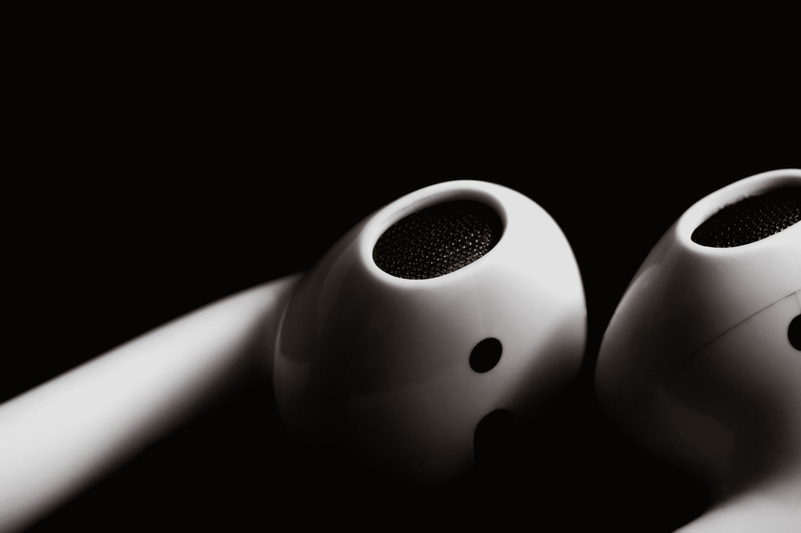
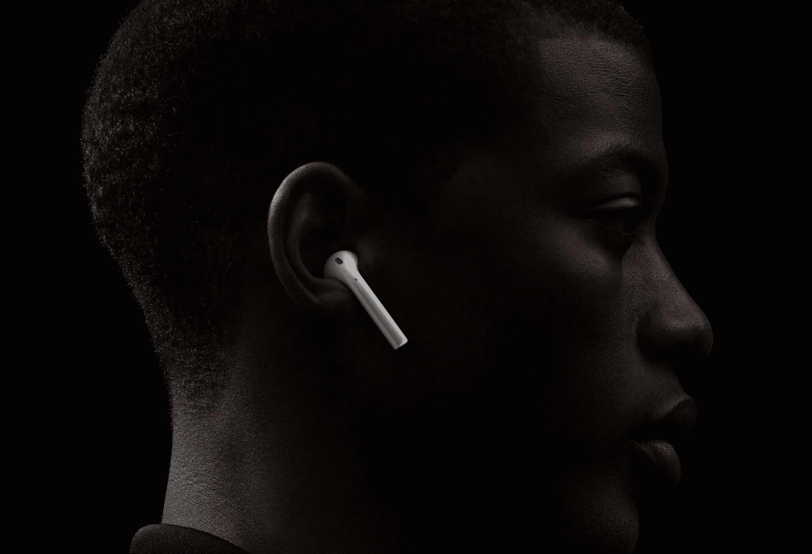
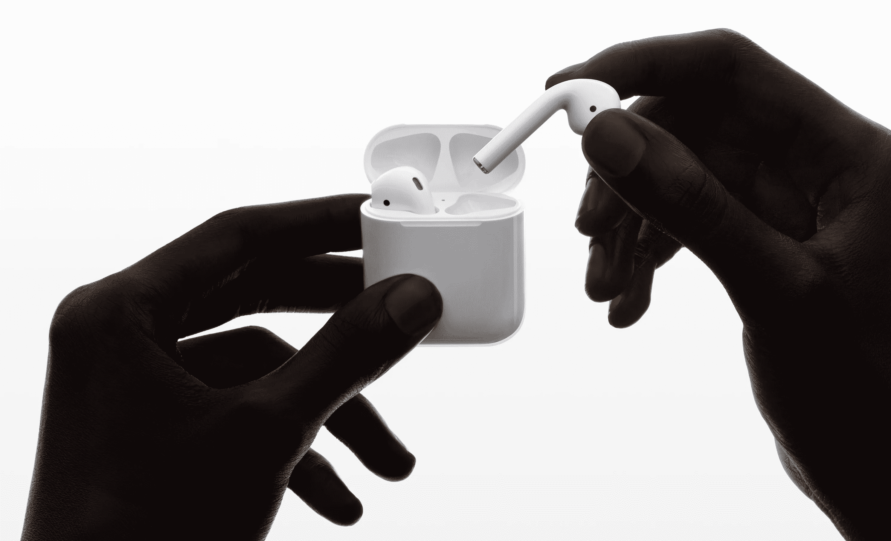
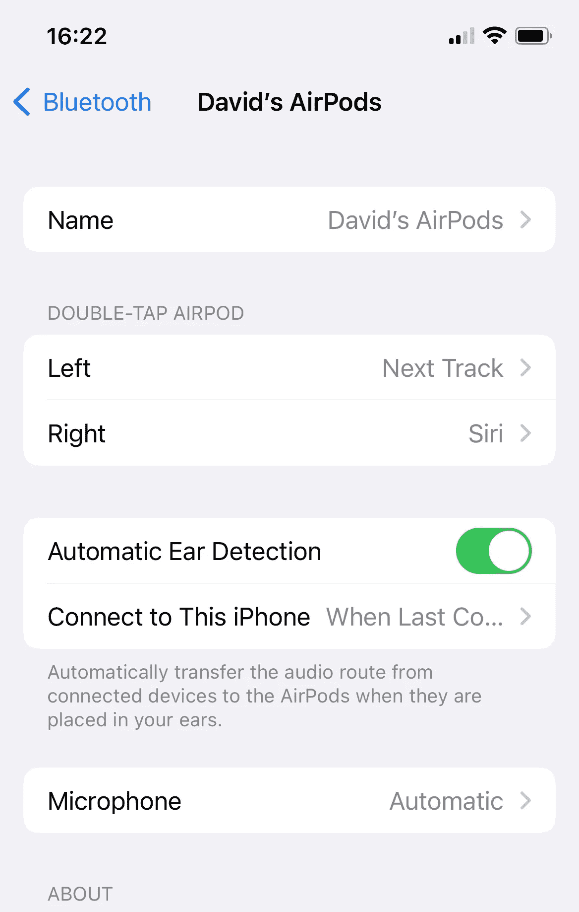
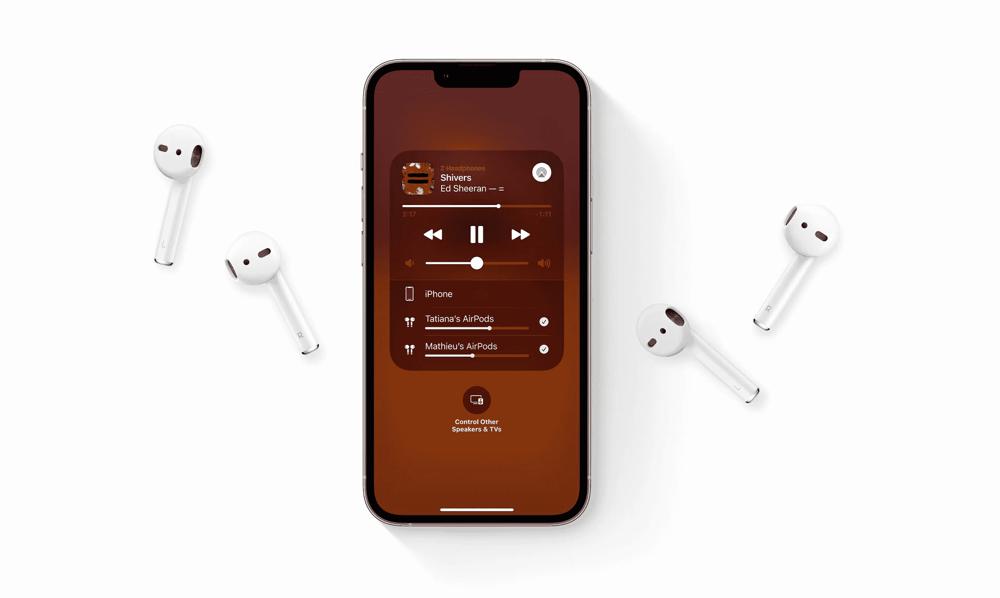

# 但我注定要成为一名音响发烧友！

> 原文：<https://medium.com/codex/but-i-am-meant-to-be-an-audiophile-a1b127da535f?source=collection_archive---------11----------------------->

## 然而在这里，我喜欢我的 AirPods

所以，如果你在 YouTube[https://www.youtube.com/c/DavidLewistalkingtechandaudio](https://www.youtube.com/c/DavidLewistalkingtechandaudio)上关注我，那么你会知道，我戴着耳机，可能会争论得太多了。然而，我仍然发现自己伸手去拿我的 AirPods。这些不是 AirPods Pro Max，它们甚至不是 AirPods 第二代或第三代。不，这些是我已经拥有几年的普通 AirPods。我是你的粉丝。这么多耳机可以选择，为什么我还一直这么用这些？

 [## iCloud+完美的存储解决方案

### 如果您在 MAC 和 iOS 设备上工作，您是否利用了这种备份和存储解决方案？

medium.com](/codex/icloud-the-perfect-storage-solution-741e0c9e1bd4) 

## 耳听为信

对于我的频道，我深入研究了情商、声音传递的平坦度、声景和声音分级。但是，对于消费级、一般、体面、音频传输，这些 AirPods 不会错太多。本质上，它们与多年前我们用 iPhones 得到的东西非常相似，只是每年都有一些改进。鉴于这些耳塞的物理尺寸，它们所能传递的东西总是有局限性的，但对于日常生活来说，我真的挑不出毛病。好的，所以没有壮观的低音，整体声音相当明亮，中音有点强有力。但是，嘿，这不是这个博客的全部。我有另一个平台可以满足所有这些需求！

## 降噪…我希望…

很明显，我主要是在不在工作室的时候使用这些东西。在那些场合，我会伸手去拿“大枪”。不过，外出散步时，这是我的首选耳塞。它们实在太方便了。没有电线，配对，(稍后会有更多的)或瞎折腾。没有。有了这些，我只需打开箱子，把它们放进去，然后就可以跑了。这是我唯一拥有的一对 AirPods。他们现在两岁了，身材依然很棒。唯一的，事实上，也是最主要的原因，我甚至想改变，是为了消除一些噪音。我很少不把这些带出去，因为我知道我想听播客而不丢失任何对话。目前，我在用户体验中使用了一些索尼的耳挂式耳机。但是它们是有线的，而且比我习惯的要大。所以，假以时日，可能早于晚些时候，我可能会升级到一双 AirPods Pro。我每天在散步和锻炼时都使用这些小耳塞。但是，我可以做一些噪音消除，所以仅仅因为这个原因，我可能会改变。实际上，我私下里想要一些 AirPods Pro Max。不过，暂时把这个可笑的价格放在一边，我不知道我是否能成为那个在公共场合穿这个的人。我只是在想，我是否真的见过任何人在 AirPods Max 里走动？有吗？我试过一对带噪音消除功能的 AirPods Pro，它们在切断环境和背景频率方面表现出色。考虑一下我的苹果购物清单上的一双……

 [## 我预测 iPhone 会给你带来更好的消息！

### 如何改善你的信息生活

medium.com](/codex/i-predict-better-iphone-messaging-for-you-7fee06155629) 

## 还有…

当然，我没有把 AirPods 带在身边的另一件事是接打电话的能力。为此，他们又打出了一记重拳。它们与 Siri 的配合也非常出色。无论你是想让 Siri 打电话、接听来电还是设置提醒，这些耳塞上的麦克风都能在任何情况和环境下准确地拾取你的声音。

## 连通性——太聪明了

AirPods 的 USP 之一是，在推出时，它们会在设备之间传输(只要它们都登录到同一个 iCloud 帐户和 Apple ID)。这听起来很棒，但老实说，这是苹果试图变得稍微聪明一点的案例之一，即使是以他们的研究员类型的标准来看。在我的工作室里，在蓝牙范围内，我有两三台 MAC，甚至可能有一台 iPad，这并不罕见。在这种情况下，AirPods 让自己陷入了一种陈旧的状态，不知道该连接什么设备作为主要的音频来源。这个功能已经困扰我太多次了，现在已经被禁用了。我宁愿手动传输，如果你也想这样做，这里是你怎么做。在你的 iPhone 上，插入并连接 AirPods，打开**蓝牙**菜单。在列表中找到你的 AirPods，点击蓝色的小**‘I’**符号。在列表的中间，你会看到一个选项，让**连接到这台 iPhone** 。从那里，检查最后一次连接到此 iPhone 时的**。给你一个小小的忍者提示，作为对你阅读这篇博客的感谢！**

## 我们敢提续航吗？

是的，我们敢！实际上，电池寿命非常好。这个盒子是真正 AirPods 的充电器和电池组，最多每周需要充电一次。至于 AirPods 本身，通过定期和持续的使用，我估计我可能会用上几天。对我来说，一天的使用可能是几个小时左右。因此，从能源的角度来看，没有抱怨。

在较新的型号上，外壳现在支持无线充电，也属于“查找我的网络”范围。这么小，因此很容易乱放，能够在家里找到它们是一个很大的奖励。

至于维护，他们很会照顾自己。经过两年在训练中甚至下雨时的使用，我所做的唯一一件事就是用一个小软刷——嗯，不要画得太粗糙，去除一些不想要的碎片。但事情已经过去了。两年多来，这些耳塞也有 100%的可靠性。

## 总的来说呢？

对于我这个热爱音频的人来说，这是肯定的！正如我提到的，有一定的音频缺点，但鉴于它们的大小，它们已经震惊了我。便利胜于一切。聆听体验舒适，永不枯竭。音频清晰、生动、有趣。如前所述，他们非常擅长自己的工作，我几乎肯定会升级。这些小家伙是我最好的朋友。事实上，在我所有的苹果工具包中，这些可能也是用得最多的！

## 在你走之前

[**加入我的幕后邮件列表**](https://www.talkingtechandaudio.com)

**原载于 2022 年 2 月 24 日**[**【https://www.talkingtechandaudio.com/blog】**](https://www.talkingtechandaudio.com/blog)**。**

查看并订阅我的负十六播客。每两周在 Spotify、苹果播客和谷歌播客上发布新剧集。[https://podcast . apple . com/GB/podcast/the-MINUS-16-podcast/id 1608899642？i=1000550310853](https://podcasts.apple.com/gb/podcast/the-minus-sixteen-podcast/id1608899642?i=1000550310853)