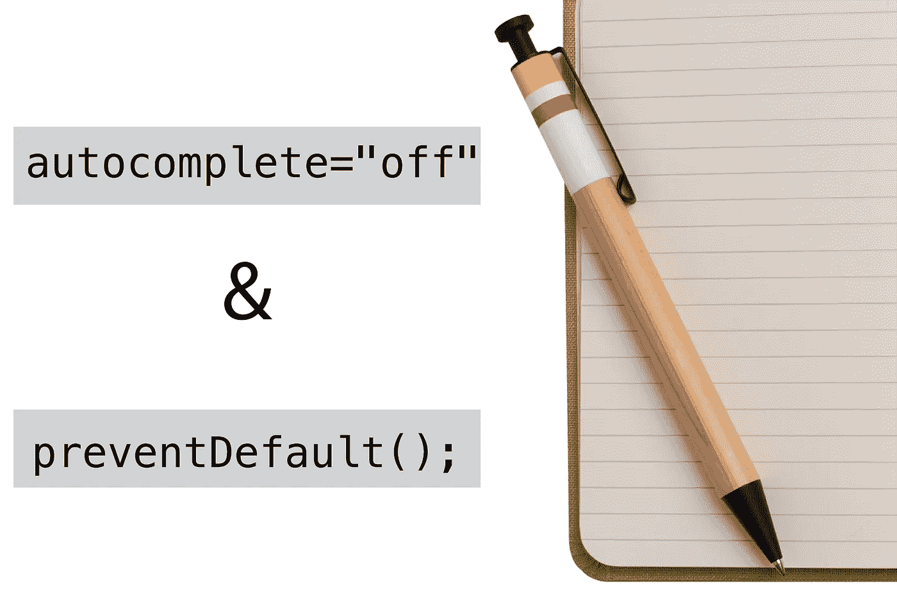

# “但这违背了我的本性！”—

> 原文：<https://medium.com/codex/but-its-against-my-nature-b12aad41267?source=collection_archive---------38----------------------->

## 覆盖 Javascript 和 Html 默认行为-日志条目



今天我们将讨论 Html 及其默认行为，以记住用户在网站的`<input>`字段中输入的数据。我们还将讨论 JavaScript 及其默认行为，当用户代理与一个`event`界面交互时，它会自动重新加载一个新的网站表单。

在写这篇博客的时候，我认为自己是一个经过认证的编码和编程新手，目前我正在学习 JavaScript 和 Html。

我是你的日常编程学习者，似乎对他的代码何时出错和何时工作一样困惑。然而，我偶然发现了一些我觉得有必要讨论的东西，觉得有必要把它保留在博客中作为参考，以帮助像我一样学习的其他人。当通过 JavaScript 和 Html 的前端语言构建程序时，我发现会出现一些默认行为。谁知道 Javascript 和 Html 有本能的行为，不需要我们(编码者)的命令就能运行——嘿，我是新来的，好吧，我有权感到惊讶。但我自然想知道更多。通常，如果我们想让我们的网页以特定的方式工作，我们必须覆盖这些。因此，了解这些行为并知道如何控制它们会更加有益。

## 什么是""字段—

你知道那些在任何网购平台的结账页面上接受个人信息的空白框。是啊。简而言之，这些是`<input>`字段，输入字段被称为 Html *元素*或 Html 中的标签，网页数据被放置在其中，如下所示:

```
<p>Hello World</p> 
```

尽管对于`<input>`字段，定义`<input>`的语法通常写在“胡萝卜”内部，如下所示:

```
<input name=“Username” id= “Username”>
```

具体来说，输入字段接受文本形式的用户数据。

## 什么是“默认行为”

Html 中的字段会自动将用户接受数据的历史保存在下拉菜单中，当你点击它们时会显示出来。这个漂亮的小特性对于重复无数次输入相同内容以确保`<input>`响应用户数据的繁琐工作来说非常方便。当普通用户需要填写大量的输入框或者多次提供相同的输入时，这也很方便。还有其他 Html *元素*，它们不会以同样的方式记录用户数据。这些其他的*元素*是`<textarea>`、`<select>`和`<form>`、*元素，*但是为了节省时间，我们将坚持使用`<input>`字段作为我们的通用示例。切换 *autocomplete* Html 属性“off ”(我们稍后将讨论)将阻止这种默认行为的发生，删除存储数据的下拉菜单，而不是在网站上点击输入时不返回任何内容。但是为什么突然之间我们不希望我们的`<input>`字段记住用户数据呢？也许你是一个银行网站，出于安全/隐私的原因，你不希望你的`<input>`字段记住用户帐户数据，或者你是一个大型多人在线游戏(MMOG)的服务器，出于同样的原因，你拒绝默认设置。

## 什么是“自动完成”

自然，Html 会自动将用户接受的数据存储在`<input>`字段历史中。一个称为 autocomplete 的隐式函数在定义一个`<input>`字段时不需要编写，它在一个提示中显示以前的用户数据，以快速重新填充`<input>`字段。“自动完成”是一个 Html *属性*，或者换句话说，是一个内置函数，Html 语言可以识别它来改变其元素的外观或行为。要禁用自动完成功能，我们需要在`<input>`字段语法中手动调用它作为一个新参数，如下所示:

```
<input name=“Username” id= “Username” autocomplete="">
```

现在它仍然允许`<input>`字段历史，因为它还没有被告知关闭。要关闭自动完成功能，我们需要在自动完成功能中的引号内注销等号，如下所示:

```
<input name=“Username” id= “Username” autocomplete="off">
```

现在假设您刚刚设计了一个 Html 脚本，用“用户名”和“密码”字段提示用户。使用 autocomplete *属性*，您刚刚设计了一个保护第一个用户的“用户名”和“密码”不被后续用户查看的网页。通常在现实世界中的网页上,“用户名”的自动完成属性是单独的，而“密码”的自动完成属性是被禁用的。

好了，我们已经完全理解了 Html 表单中`<input>`字段的特定默认行为，现在让我们讨论基于`event`接口的 JavaScript 表单的默认行为。

## 什么是“事件”界面—

`event`接口表示在文档对象模型中发生的事件或“事件”, DOM 是一个应用程序编程接口或 API，用于定义逻辑结构以及访问和操作文档的方式。简而言之，DOM 是一个幕后工厂，它展示了用户可以看到并与之交互的网页，而`event`界面负责在那里发生一些事情。点击或按下键盘上的按键可以触发`event`界面。DOM 以 html 及其元素如`<div>`、`<button>`、`<span>`等显示。都可以通过侦听器连接到一个事件。这个监听器等待用户或程序采取动作，并执行代码作为响应或(“处理”)它们，称之为事件处理程序。以下是事件处理程序的示例:

*   addEventListener()
*   removeEventListener()

这些是为了响应用户与网页的交互。

## 什么是“默认行为”

请耐心听我说，因为默认行为需要一个例子来说明什么是默认行为。我将向您介绍事件处理函数，并在介绍过程中提到默认行为。这是事件处理函数的语法示例。我简单解释一下。我们需要 JavaScript 和 Html 代码来解释这一点。

## java 描述语言

```
*document*.**querySelector**("#id-checkbox").**addEventListener**("click", *function*(**event**) {*document*.**getElementById**("output-box").**innerHTML** += "*Sorry!* <code>*preventDefault()*</code> *won't let you check this!*<br>";**event**.**preventDefault**();}, *false*);
```

## 超文本标记语言

```
<p>Please click on the checkbox control.</p><form>
  <label **for**="**id-checkbox**">*Checkbox*:</label>
  <input **type**="**checkbox**" **id**="**id-checkbox**"/>
</form><div **id**="**output-box**"></div>
```

JavaScript 代码调用 Html `*document*`并使用方法`**querySelector**` 从 Html `<input>`代码中选择名为`**id-checkbox**`的“id”元素。基于 Html 的“Id”元素在 JavaScript 中用一个`#`标识。然后，我们向`*document*.**querySelector**("#id-checkbox")`添加一个带有参数`("click")`的`**addEventListener**`事件，使第二个参数`*Function()*`能够运行`(**event**)`。实际上，这个`**addEventListener**`使`**id-checkbox**`在做出反应并运行`*function*(**event**)`事件之前，等待对它执行一个动作，在这种情况下是一个`("click")`。在`*function*(**event**)`中，我们再次调用 Html `*document*`并使用`**getElementById**`方法，这是一个选择 Html `"**output-box**"`的方法，它绕过了必须用`#`标识`"**output-box**"`id。`**getElementById**`只能用来引用或选择 Html 中的“id”元素。为了`*document*.**getElementById**("output-box")`，我们添加了`**.innerHTML**`来访问并有效地改变 Html“复选框”`<input>`类型的默认行为。如果我们将 DOM 作为一个网页打开，Html“checkbox”`<input>`类型看起来像一个在线复选框，当点击时接受检查。“checkbox”`<input>`类型在被点击时自然接受检查，但是`**.innerHTML**`在这种`*function*(**event**)`的情况下专门不接受检查，而是在被点击时打印文本`"*Sorry!* <code>*preventDefault()*</code> *won't let you check this!*<br>";`，打印时看起来像这样:

```
“Sorry! preventDefault() won't let you check this!”. 
```

一旦复选框被点击，功能被执行，Javascript 的自然反应是重新加载表单或网页，为下一个事件做准备。为了防止这种默认行为，我们引用函数`(**event**)`的“关键字”并添加关键字`.**preventDefault**()`。我们初始化了`*function*(**event**)`中的`**event**.**preventDefault**();`,以便它指示整个函数的行为在操作后不要重新加载页面。

使用这段代码，我们实际上是在对抗两种不同的默认行为，一种是在 Html 中初始化 Html“checkbox”`<input>`中的“Checkmark ”,另一种是在 JavaScript 中，当单击“checkbox”时，在执行一个事件后刷新网页表单。

## 什么是“prevent default()”—

`preventDefault()`是一个添加到`event`接口的方法，它指示`event`不要遵循它的默认行为。在我们的例子中，它用于防止网页在执行我们的功能后自动刷新。刷新将有效地清除函数已经运行的证据。在我们定义了方法`preventDefault()`的例子中，我们能够停止页面刷新，并报告我们的复选框被点击的证据，提示消息:

```
“Sorry! preventDefault() won't let you check this!”.
```

才能成功展示。