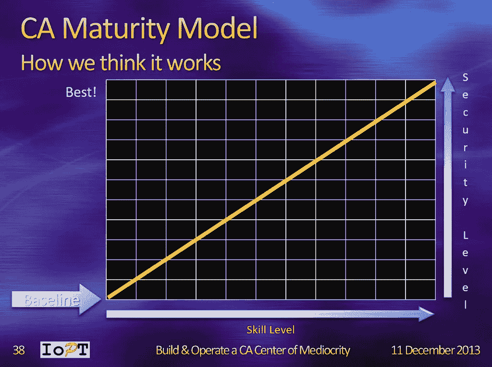

# 与云安全针锋相对

> 原文：<https://medium.com/codex/butting-heads-with-cloud-security-d9c5a374af6b?source=collection_archive---------14----------------------->

2013 年演示文稿的屏幕截图。虽然它是在管理内部公司证书颁发机构的上下文中讨论的，但它通常适用于安全效力与技能水平的关系。人们倾向于认为安全性随着从业者技能的提高而线性上升，但实际上并非如此。

我的咨询客户大多是大型金融公司，近年来，他们都至少在公共云领域有所建树。尽管我的客户之间的文化和工作环境大相径庭，但他们都有一个共同点，那就是在某个时候，平台管理员会失控，在电话会议上用长达几分钟的咆哮来娱乐同事团队，抱怨过于繁重、极其复杂和不必要的武断的安全需求。欢迎来到企业云。

我鼓励我的客户遵守的 T.Rob 的安全格言之一是“如果你不担心你的安全模型，你就不够了解它。”我认为，大公司通常在公共云中应用的安全性的广度和深度应该被接受，而不是与所有的安全组、NACLs、防火墙、授权、VPC 边界和所有其他东西对抗。

在这种情况下，安全研究公司披露的信息可能具有说服力。例如，Orca Research 上周披露了两个 AWS 漏洞，这两个漏洞是由 Dark Reading 等报道的。

> [新漏洞凸显公有云信任风险](https://www.darkreading.com/cloud/new-vulnerabilities-highlight-risks-of-trust-in-public-cloud)
> 黑暗阅读—2022 年 1 月 13 日

在这两个漏洞中，一个允许升级到 AWS Glue 中的管理员，这又促进了升级到启用了 Glue 的 AWS 服务中的管理员。根据 Orca 的说法，云形成中的另一个漏洞“可能允许攻击穿透隔离不同 AWS 用户的保护”[。亚马逊证实，这些问题在被用来对付客户之前已经得到了解决。](https://orca.security/resources/blog/aws-cloudformation-vulnerability/)

反常的是，这样的消息会削弱对安全的承诺，因为它增强了信心。这是一个系统如何在客户被抛弃之前进行捕捉和修补的例子，因此我们应该感到高兴。对吗？

但是考虑到亚马逊知道这件事的唯一原因是 Orca 告诉他们的。恶意的研究团队也非常有能力。也许从这份报告中更好的收获是，我们的安全设计和流程应该假设恶意行为者可以开发(或已经开发了)同样有效的漏洞，并且没有披露它们的计划。如果世界听说过这些，那也只是因为它们被发现是入侵媒介。

在这种情况下，平台管理员在电话会议上大肆宣扬的那些过于繁琐、极其复杂和不必要的武断的安全要求，将是我们遏制主动利用的爆炸半径的唯一希望。考虑到 Orca 能够实现的特权级别和妥协范围，我们可能会想，尽管我们的控制措施繁琐而武断，但在面对这样的攻击时，这些措施是否会显得力不从心。也许我们做得还不够。除了一个缺口，我们永远无法确定，所以我们可能在谨慎方面犯了错误。也许所有这些控件都是我们最好的朋友。

这个屏幕截图更真实地反映了相对于技能水平的安全功效。知道自己不熟练的团队倾向于对人员流程风险保持谨慎，雇佣外部帮助，并遵循给出的建议。随着 skill 进入“知道足够多的危险”阶段，对新的内部安全评估或实施的不合理信任会导致漏洞和暴露，尤其是当这种信任证明不再雇佣外部帮助是合理的时候。高度自信可能导致冒险和规避“繁琐”的流程和控制，有时甚至比什么都不做还要糟糕。随着深度技能的获得，该模型趋于变得更加健壮，并且效率提高。然而，这些改进是渐进的，而不是线性的。但是，安全模型始终是成本和风险的平衡，最高技能的从业者知道哪些控制被认为实施起来成本太高，以及系统可能如何被破坏。因此，他们倾向于担心设计。真的够好吗？因此，我的格言是“如果你不担心你的安全模型，你就不能很好地理解它。”

我试图影响与我一起工作的团队的文化，去拥抱一个健壮的公司安全架构的复杂性、粒度和刚性，而不是与之针锋相对。对一些人来说，这种顿悟是从阅读一个又一个披露直到意识到，如果有的话，也许我们做得还不够。一些人得出这个结论是因为他们在数据泄露后深陷于法庭分析中，他们的股票期权在他们眼前融化。如果你要有这种特殊的顿悟，如果你是通过这两条路线中较容易的一条来的，那你应该认为自己是幸运的。