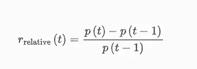
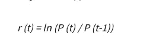

# 买入并持有 Vs SMA 交叉:简单策略带来丰厚利润

> 原文：<https://medium.com/codex/buy-and-hold-vs-sma-crossover-big-profits-with-simple-strategy-92b4a117b50?source=collection_archive---------2----------------------->

股票市场正在蓬勃发展，每个人都想跳上这趟列车创造财富。我敢打赌，这也是把你带到这里的原因，“最佳交易/投资策略”，但是一个简单的谷歌搜索这个报价可以给你一个复杂的交易策略的无底洞，声称是最好的。我们想用传奇投资家沃伦·巴菲特的话来解释这一点，“似乎有某种反常的人类特性，喜欢把简单的事情变得困难。”


由[凯利·西克玛](https://unsplash.com/@kellysikkema?utm_source=unsplash&utm_medium=referral&utm_content=creditCopyText)在 [Unsplash](https://unsplash.com/s/photos/stock-market?utm_source=unsplash&utm_medium=referral&utm_content=creditCopyText) 上拍摄的照片

— — — — — — — — — — **披露:** *本帖内容均不应视为投资建议。过去的结果并不总是预测未来的结果。这些是一些典型的例子，说明如何使用 Pandas 导入不同时间间隔内的小样本股票数据，并比较它们各自的表现。所有与投资相关的疑问都应提交给你的财务顾问。*

— — — — — — — — — — — — — — — — — — — — — — — — — — — — — —

如果你训练有素，目标明确，在股市赚钱是很容易的。说起来容易，但是当我们把我们的钱放在风险上时，我们的情感意图经常随着我们的纪律而移动；因此，我们不得不在这个赚钱机器，也就是股票市场中失去我们辛苦赚来的现金。

算法交易(也称为黑箱交易或算法交易)在现代零售商中越来越受欢迎，以消除情绪管理的障碍。在 Algo 交易中，计算机程序根据你提供的规则/指令执行买入或卖出指令。

**什么是 Algo 交易？**

算法交易是一种基于数学模型识别机会的主动交易的系统方法。数学模型通常基于从股价、成交量、机构买入/卖出、大宗交易等得出的指标。有四种类型的技术指标——动量指标、波动指标和成交量指标，用于预测价格的未来走势。

**算法交易的优势:**

1)以尽可能好的价格执行

2)即时下单

3)减少手动错误

4)减少了由情绪和心理因素引起的错误的可能性。

5)代码可以很容易地进行回测，并根据回测结果进行细化。

我们打赌你已经对记录所有这些指标感到困惑了，但是正如阿尔伯特·爱因斯坦所说，“天才在于化繁为简”我们将坚持两个最有影响力和最有利可图的策略，并比较两者的结果。

# 策略 1-简单移动平均线(SMA)交叉

移动平均线或滚动平均线是分析时间序列数据最常用的方法之一。它包括从整个数据集的不同子集生成一系列平均值，并用于消除股票表现中的“噪音”。

SMA 的计算方法是将前“n”个天数的收盘价相加，再除以天数。


资料来源: [Investopedia](https://www.investopedia.com/terms/s/sma.asp)

SMA 交叉策略通常使用两种长度的移动平均线:

1.  **短移动平均线-** 更快的移动平均线，对每日价格变化更敏感
2.  **长移动平均线-** 较慢的移动平均线，表示较长时期内的价格，更不活跃。

在这个例子中，我们将使用 50 天的短期移动平均线和 200 天的长期移动平均线。其他流行的短均线和长均线分别是:9 日和 21 日。

当短均线和长均线交叉时，会产生两个信号:

**买入(买入)信号**——当较短均线超过时，较长均线，即短均线从下方穿越长均线——也称黄金交叉。

**卖出(做空)信号**l——当较长均线超过较短均线时，即空头均线从上方穿越较长均线——也称为死叉。

# 策略 2-买入并持有

这是一种被动投资策略，投资者购买一项资产并长期持有。遵循这种策略的交易者/投资者不关心市场和技术指标的短期价格波动。像沃伦·巴菲特和杰克·博格尔这样的投资者是买入并持有策略的拥护者。

这是最容易获得的投资策略之一，我们长期的忠诚和承诺会得到回报。

另一种选择是利用与资产货币价值变化相关的时间序列，而不是实际价值。这些时间序列可能并且确实呈现出负面特征，它们的统计特征通常比价格周期更稳定。最常见的回报是相对回报，其定义为



[资料来源:Investopedia](https://www.investopedia.com/articles/investing/102715/computing-historical-volatility-excel.asp)

和日志返回



[资料来源:Investopedia](https://www.investopedia.com/articles/investing/102715/computing-historical-volatility-excel.asp)

为了以数学方式执行这一策略，我们可以使用 log return，它是通过取结束值除以开始值的自然对数来计算的。

使用对数回归的优点是:

1)可以跨不同时间段添加日志返回。(另一方面，增加简单的回报可能会误导结果)

2)对数收益服从正态分布。

3)对数回归可以转换成简单回归。

由于测井返回是累加的，所以可以创建累积测井返回的时间序列。

# 两种策略的详细分析——买入并持有与 SMA 交叉

要在真实市场中回测或运行策略，我们必须遵循以下结构:

1)选择股票/共同基金/交易所交易基金/加密货币

2)提取他们的信息(收盘价、成交量等。)对于定义的时间范围内的所选股票

3)将数据可视化，以便更好地理解

4)运行和比较数学模型

为了在我们上面提到的两个策略中选出一个赢家，我们将从制作股票投资组合开始。

**这个投资组合中使用的股票有:** (AMD)高级微设备公司，(谷歌)谷歌，(WST)西制药服务公司，(DXCM)德克斯康公司(葡萄糖监测)，(NVDA)英伟达公司，(AAPL)苹果公司，(AMZN)亚马逊，(MSFT)微软，(NFLX)网飞，(TSLA)特斯拉

导入库:

```
import numpy as np
import pandas as pd
from datetime import date
!pip install yfinance 
import matplotlib.pyplot as plt
import yfinance as yf
%matplotlib inline
```

我们要用雅虎财经！我们将提取 2020 年至 2022 年期间的收盘价

```
#choose starting date
start_date = '2020-01-01'
end_date= '2022-01-01'
#if using a current date as end date
#end_date=date.today().strftime("%Y-%m-%d")
symbol =['AMD','GOOGL','WST','DXCM','NVDA','AAPL','AMZN','NFLX','TSLA','MSFT']#stock portfolio
df = yf.download(symbol, start=start_date, end = end_date)['Close'] #getting only Closing price values 
df.head()
```

这里我们将显示整个投资组合的前五行收盘价


收盘价格

**可视化数据:**

当我们有时间序列数据时，我们可以在图表上绘制数据，使价格模式和趋势可以直观地识别。

在这里，我们使用 Matplotlib 库来显示收盘价的变动，从中我们可以立即了解特定股票在一段时间内的表现是否良好。

```
#Charting the stock prices for multiple stocks
fig = plt.figure(figsize=(16,12))
ax1 = fig.add_subplot(4,3,1)
ax2 = fig.add_subplot(4,3,2)
ax3 = fig.add_subplot(4,3,3)
ax4 = fig.add_subplot(4,3,4)
ax5 = fig.add_subplot(4,3,5)
ax6 = fig.add_subplot(4,3,6)
ax7 = fig.add_subplot(4,3,7)
ax8 = fig.add_subplot(4,3,8)
ax9 = fig.add_subplot(4,3,9)
ax10 = fig.add_subplot(4,3,10)
ax1.plot(df['AMZN'])
ax1.set_title("Amazon")
ax2.plot(df['AMD'])
ax2.set_title("AMD")
ax3.plot(df['GOOGL'])
ax3.set_title("Google")
ax4.plot(df['NFLX'])
ax4.set_title("Netflix")
ax5.plot(df['WST'])
ax5.set_title("WST")
ax6.plot(df['DXCM'])
ax6.set_title("DXCM")
ax7.plot(df['NVDA'])
ax7.set_title("NVDA")
ax8.plot(df['TSLA'])
ax8.set_title("Tesla")
ax9.plot(df['AAPL'])
ax9.set_title("AAPL")
ax10.plot(df['MSFT'])
ax10.set_title("MSFT")
plt.tight_layout()
# save the figure
plt.savefig('Stock Price Movement.png')#format="png")
plt.show()
```


股票价格变动(作者照片)

**1。分析 AMD 股票**

为了简单起见，我们将只在一只股票上测试我们的策略:高级微设备公司(股票代码:AMD)，然后应用于整个投资组合。

我们将定义简单移动平均线的值:对于短期移动平均线，我们将使用 50 天，对于长期移动平均线，我们将使用 200 天。

为了计算移动平均，我们使用 Pandas 内置函数 rolling(window='n ')。mean(我们可以用天数代替“n”。)

```
# Get the AMD timeseries.
AMD = df.loc[:, 'AMD']
# Calculate the 50 and 200 days moving averages of the closing prices
short_rolling_AMD= AMD.rolling(window=50, min_periods=1).mean()#min_periods calculate the arithmetic average starting from 1st numb 
long_rolling_AMD = AMD.rolling(window=200, min_periods=1).mean()
```

接下来，我们用附加信息为 AMD 股票创建数据框架:信号和位置，使用每日日志回报计算回报率，并计算买入和持有策略的总交易系统回报。

***信号*** 列生成如下:如果 50 天 SMA 大于 200 天 SMA，则设置值 1，如果 200 天 SMA 大于 50 天 SMA，则设置值 0。

*'列是日差的‘信号’列*

****交易'*** 栏的生成与信号相同，只是当 200 日 SMA 比 50 日 SMA>时，将值设置为-1 而不是 0。*

****Return*** 列是使用 log return 生成的，其中首先取价格的对数，然后取连续日志观察值的差值。*

****t Return***’列是总回报，通过将‘Return’和‘Trade’列相乘来计算。*

```
*#creating df for AMD stock
AMD=pd.DataFrame ({'Close':df['AMD'],'50_MA':short_rolling_AMD,'200_MA':long_rolling_AMD})
#generate signals
AMD['Signal']=np.where(AMD['50_MA']> AMD['200_MA'], 1, 0)
#generate trading orders
AMD['Position']=AMD['Signal'].diff()
#calculating trading
AMD['Trade'] = np.where(AMD['50_MA']> AMD['200_MA'], 1, -1)
#to calculate instantaneous rate of return (daily log returns)
AMD['Return'] = np.log(AMD.Close).diff()
#calculating trading system return
AMD['Treturn']=AMD.Return*AMD.Trade
AMD.head(100)*
```

**

*AMD DataFrame(作者提供照片)*

*接下来，我们可以可视化买卖点的交易策略。买入信号是绿色，卖出信号是红色。*

```
*# Plot moving averages 
# plot closing price, short term moving averages and long term moving averages 
plt.figure(figsize=(20,10))
AMD['Close'].plot(color = 'k', label= 'Closing Price') 
AMD['50_MA'].plot(color = 'm',label = '50 days rolling mean') 
AMD['200_MA'].plot(color = 'g', label = '200 days rolling mean')
# plot ‘buy’ signals
plt.scatter(AMD.loc[AMD['Position'] == 1].index, 
         AMD['50_MA'][AMD['Position'] == 1], 
         marker='^', s=250,color = 'g', label = 'BUY signal')
# plot ‘sell’ signals
plt.scatter(AMD.loc[AMD['Position'] == -1].index, 
         AMD['50_MA'][AMD['Position'] == -1], 
         marker='v',s=250, color = 'r', label = 'SELL signal')
plt.title('AMD Buy and Sell signals')
plt.xlabel('Date')
plt.ylabel(' Closing price ($)')
plt.savefig('AMD buying and selling signals.png')
#plt.show()
plt.legend();*
```

**

*AMD 买卖信号(作者图片)*

*现在我们要对两种策略的回报求和:*

```
*#trading system return
total_treturn=np.exp(AMD.Treturn.sum())#total return of moving averages trading system
#Buy and hold return 
hold_return=np.exp(AMD.Return.sum())#total return of buy and hold strategyprint("AMD Trading System total return: {:>10.2%}".format(total_treturn))
print("AMD Hold strategy return: {:>10.2%}".format(hold_return))*
```

**

*结果我们可以看到持有策略的回报率为 293.08%，而交易策略的回报率为 141.76%。*

**

*AMD 交易系统 vs 买入并持有回报(作者图片)*

***2。分析投资组合回报***

*在这一部分，我们将分析整个投资组合的回报。从计算短均线和长均线开始，创建交易柱*

```
*# Calculating the short-window moving average for entire portfolio
short_rolling= df.rolling(window=50,min_periods=1).mean()
df_short = short_rolling.add_suffix('_short')
# Calculating the long-window moving average for entire portfolio
long_rolling = df.rolling(window=200,min_periods=1).mean()
df_long = long_rolling.add_suffix('_long')
#to join two tables into one df 
new_df=pd.concat([df_short,df_long],axis=1)#calculating trading for entire portfolio
new_df['AMD_Trade'] = np.where(new_df['AMD_short']> new_df['AMD_long'], 1, -1)
new_df['AMZN_Trade'] = np.where(new_df['AMZN_short']> new_df['AMZN_long'], 1, -1)
new_df['AAPL_Trade'] = np.where(new_df['AAPL_short']> new_df['AAPL_long'], 1, -1)
new_df['DXCM_Trade'] = np.where(new_df['DXCM_short']> new_df['DXCM_long'], 1, -1)
new_df['MSFT_Trade'] = np.where(new_df['MSFT_short']> new_df['MSFT_long'], 1, -1)
new_df['NFLX_Trade'] = np.where(new_df['NFLX_short']> new_df['NFLX_long'], 1, -1)
new_df['NVDA_Trade'] = np.where(new_df['NVDA_short']> new_df['NVDA_long'], 1, -1)
new_df['TSLA_Trade'] = np.where(new_df['TSLA_short']> new_df['TSLA_long'], 1, -1)
new_df['WST_Trade'] = np.where(new_df['WST_short']> new_df['WST_long'], 1, -1)
new_df['GOOGL_Trade'] = np.where(new_df['GOOGL_short']> new_df['GOOGL_long'], 1, -1)# creating return column
log_returns = np.log(df).diff()
df_return= log_returns.add_suffix('_Return')
new_df=pd.concat([df_return,new_df],axis=1)#remove NA values
new_df.dropna(inplace=True)#calculating instatenious rate of return
new_df['AMD_Treturn']=new_df.AMD_Return*new_df.AMD_Trade
AMD_total_treturn=np.exp(new_df.AMD_Treturn.sum())
print('AMD_total_treturn is:',AMD_total_treturn)
new_df['AMZN_Treturn']=new_df.AMZN_Return*new_df.AMZN_Trade
AMZN_total_treturn=np.exp(new_df.AMZN_Treturn.sum())
print('AMZN_total_treturn is:',AMZN_total_treturn)
new_df['AAPL_Treturn']=new_df.AAPL_Return*new_df.AAPL_Trade
AAPL_total_treturn=np.exp(new_df.AAPL_Treturn.sum())
print('AAPL_total_treturn is:',AAPL_total_treturn)
new_df['DXCM_Treturn']=new_df.DXCM_Return*new_df.DXCM_Trade
DXCM_total_treturn=np.exp(new_df.DXCM_Treturn.sum())
print('DXCM_total_treturn is:',DXCM_total_treturn)
new_df['MSFT_Treturn']=new_df.MSFT_Return*new_df.MSFT_Trade
MSFT_total_treturn=np.exp(new_df.MSFT_Treturn.sum())
print('MSFT_total_treturn is:',MSFT_total_treturn)
new_df['NFLX_Treturn']=new_df.NFLX_Return*new_df.NFLX_Trade
NFLX_total_treturn=np.exp(new_df.NFLX_Treturn.sum())
print('NFLX_total_treturn is:',NFLX_total_treturn)
new_df['NVDA_Treturn']=new_df.NVDA_Return*new_df.NVDA_Trade
NVDA_total_treturn=np.exp(new_df.NVDA_Treturn.sum())
print('NVDA_total_treturn is:',NVDA_total_treturn)
new_df['TSLA_Treturn']=new_df.TSLA_Return*new_df.TSLA_Trade
TSLA_total_treturn=np.exp(new_df.TSLA_Treturn.sum())
print('TSLA_total_treturn is:',TSLA_total_treturn)
new_df['WST_Treturn']=new_df.WST_Return*new_df.WST_Trade
WST_total_treturn=np.exp(new_df.WST_Treturn.sum())
print('WST_total_treturn is:',WST_total_treturn)
new_df['GOOGL_Treturn']=new_df.GOOGL_Return*new_df.GOOGL_Trade
GOOGL_total_treturn=np.exp(new_df.GOOGL_Treturn.sum())
print('GOOGL_total_treturn is;',GOOGL_total_treturn)*
```

**

*交易策略回报(作者图片)*

```
*treturns_total = [AMD_total_treturn,AMZN_total_treturn,AAPL_total_treturn,DXCM_total_treturn,MSFT_total_treturn,NFLX_total_treturn,NVDA_total_treturn,TSLA_total_treturn,WST_total_treturn,GOOGL_total_treturn]potrfolio_trade_strategy = sum(treturns_total) / len(treturns_total)
print("Portfolio return using trade strategy: {:>10.2%}".format(potrfolio_trade_strategy))*
```

*计算买入并持有策略的回报:*

```
*#calculating stock return hold strategy  
log_returns_stock=np.exp(log_returns.sum())#total return of hold strategy
log_returns_stock*
```

**

*购买并持有退货*

```
*portfolio_return=log_returns_stock.mean(axis=0)
print("Portfolio return using hold strategy: {:>10.2%}".format(portfolio_return))Portfolio return using trade strategy:    241.10%*
```

*我们可以看到，买入并持有策略表现更好，年回报率为 358%，而交易策略的回报率为 241%。*

*我们可以用买入并持有策略来想象每只股票的回报。*

```
*fig, ax= plt.subplots(figsize=(20,10))
for c in log_returns:
    ax.plot(log_returns.index, 100*(np.exp(log_returns[c].cumsum()) - 1), label=str(c))ax.set_ylabel('Total relative returns (%)')
ax.set_xlabel('Time period')
ax.set_title('Portfolio return using hold strategy')
ax.legend(loc='best')
plt.show()*
```

**

*采用买入并持有策略的投资组合回报(作者提供图片)*

*此外，收集的回报信息用于风险分析，风险分析是根据预期回报(股票的平均回报)和标准差(风险衡量->标准差越大，风险越大，反之亦然)计算的。*

```
*returns = log_returns #using log_return 
plt.figure(figsize=(20,10)) 
plt.scatter(returns.mean(), returns.std())
plt.xlabel('Expected returns')
plt.ylabel('Risk')
plt.title('Risk vs.Expected Return')
for label, x, y in zip(returns.columns, returns.mean(), returns.std()):
    plt.annotate(
        label, 
        xy = (x, y), xytext = (50, 30),
        textcoords = 'offset points', ha = 'right', va = 'bottom',
        arrowprops = dict(arrowstyle = '-', connectionstyle = 'arc3,rad=0.5'))*
```

*创建了一个散点图来比较股票的预期收益和风险。这有助于我们直观地了解各种股票的风险系数。*

**

*风险与预期回报(作者提供图片)*

*从这个散点图我们可以得出结论，TSLA 有最高的预期收益和最高的风险。另一方面，AMZN 具有最小的预期收益和最小的风险。*

# ***哪种策略更赚钱？***

*在测试了这两种策略后，我们可以得出结论,*买入并持有*在 AMD 股票和整个投资组合上的表现优于交易策略。*

*但请记住，“就像没有一种尺寸的 t 恤适合所有人一样，同样也没有一种策略适合所有资产类别。”上面分享的结果是 AMD 的股票，它可能与 AAPL 的股票(或你投资组合中的任何其他股票)不一致。*

*我们需要在两种策略下测试每只投资组合股票的表现，然后选择能产生最佳回报的策略。*

*参考资料:*

1.  *雅虎[财经](https://finance.yahoo.com/)！*
2.  *[投资媒体](https://www.investopedia.com/technical-analysis-4689657)*
3.  *米（meter 的缩写））Heydt，[学习熊猫-第二版](https://www.packtpub.com/product/learning-pandas-second-edition/9781787123137) (2017)*

*Jupyter 笔记本的详细代码可以在这里找到:*

*[](https://github.com/sivosevic/TimeSeriesAnalysis-) [## GitHub-sivosevic/times eries 分析-:股票市场

### 这个项目的目的是建立股票投资组合，从网上股票交易网站提取信息…

github.com](https://github.com/sivosevic/TimeSeriesAnalysis-) 

你可以在 https://medium.com/@eellaaivo 的[查看我的其他作品](/@eellaaivo)

感谢阅读！*