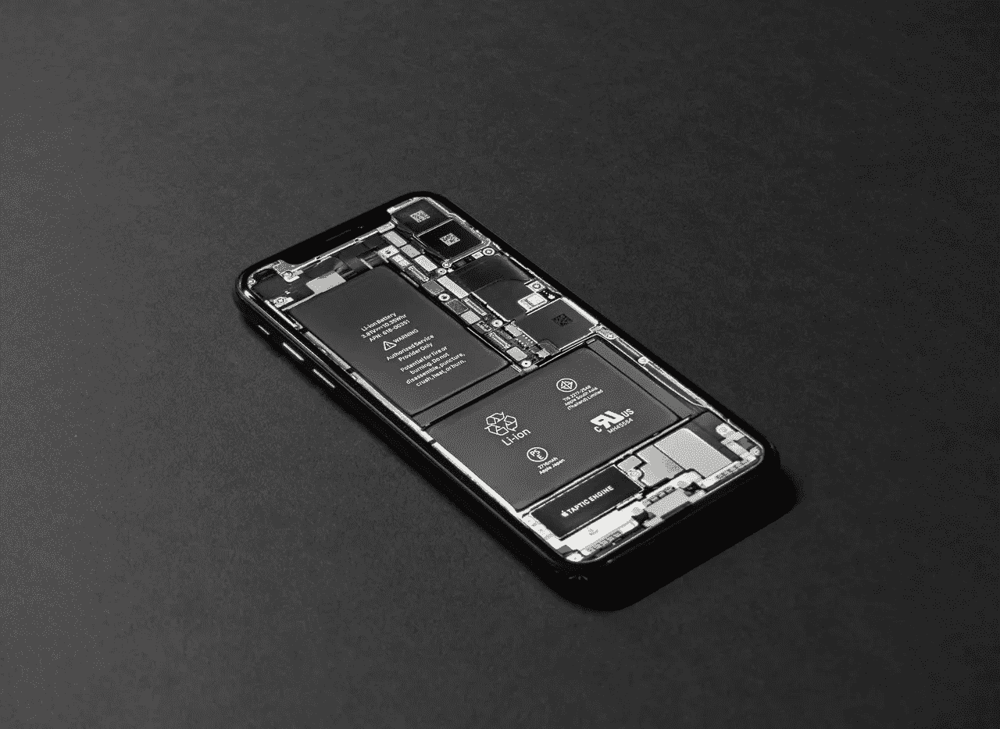

# 从市场上购买价值 200 美元的二手 iPhone 11

> 原文：<https://medium.com/codex/buying-us-200-second-hand-iphone-11-from-marketplace-cabdf73bd60a?source=collection_archive---------8----------------------->

我用了三个月后的体验

泰勒·拉斯托维奇摄于[佩克斯](https://www.pexels.com/photo/black-android-smartphone-on-table-719399/?utm_content=attributionCopyText&utm_medium=referral&utm_source=pexels)

很多人买不起全新的 iPhone 13，就买 iPhone 12、iPhone 11、iPhone X 等上一代 iPhone，然而有时候还是太贵了。然后他们买一部二手 iPhone 或者 preloved。二手市场上有各种各样的价格，所以在这篇文章中，我将讨论我的…