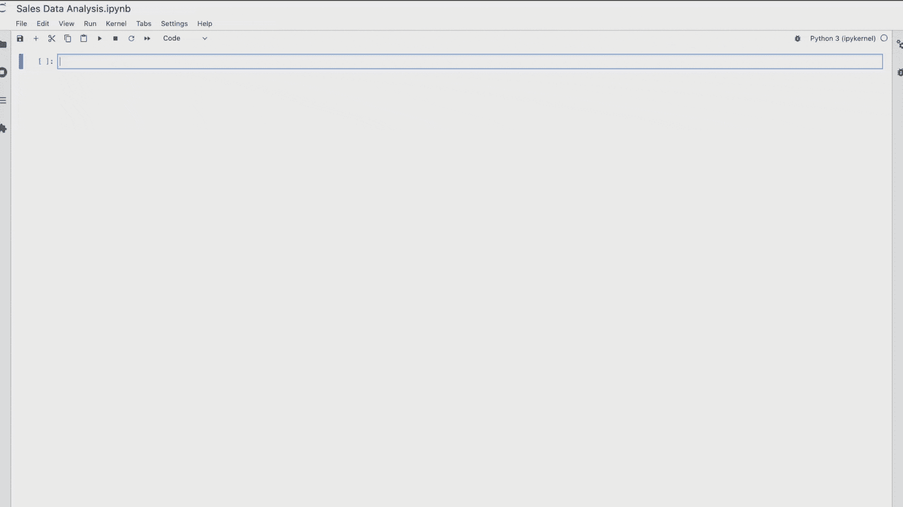
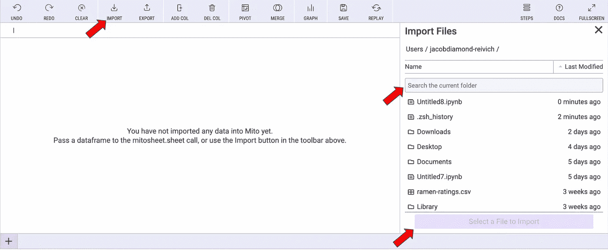
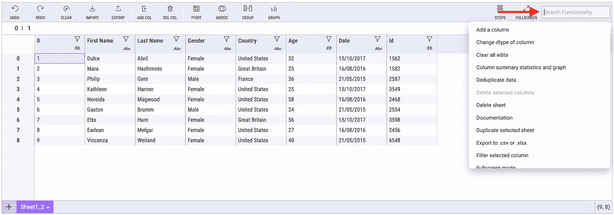
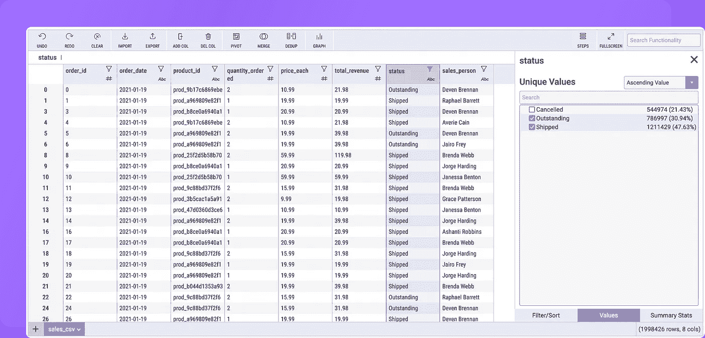
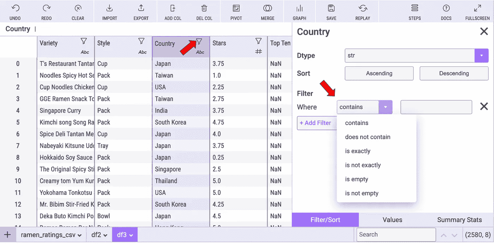
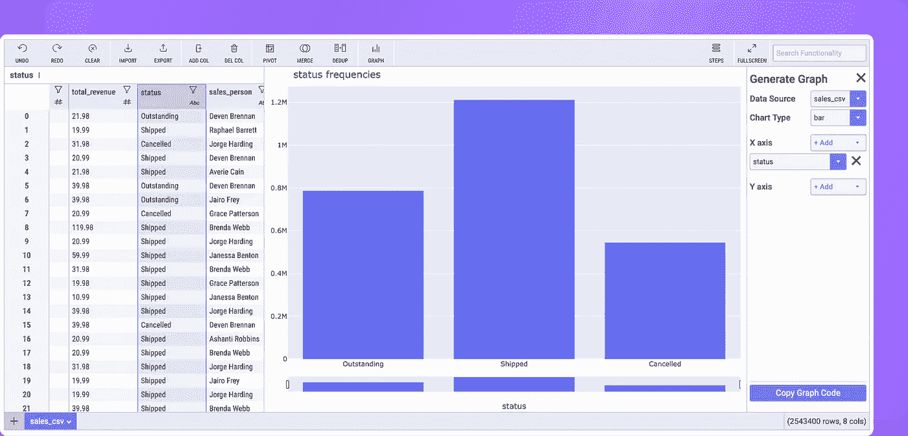

# 再见 Excel，你好米托

> 原文：<https://medium.com/codex/bye-bye-excel-hello-mito-cd7759ea1e56?source=collection_archive---------1----------------------->

## 如果您可以编辑 Excel 文件，现在就可以编写 Python 代码。


这篇文章的标题可能有些自命不凡，但没有什么比这更偏离事实了。我们都认为 Excel 现在是并将继续是电子表格和数据分析之王，但是像我今天与大家分享的这种工具将会使它变得越来越困难。
我说的是米托，它是一个与[熊猫库](https://pandas.pydata.org/)协同工作的 [Python](https://www.python.org/) 图形界面。



视频由[米托](https://www.trymito.io/)

它与 [Jupyterlab](https://jupyter.org/) 一起工作，我建议您使用 [conda environments](https://www.anaconda.com/products/individual) ，对于使用该工具的用户来说，启动该工具会容易得多。

```
conda create -n mitoenv python=3.9
conda activate mitoenv
```

安装它和任何其他 python 库是一样的(我建议先阅读官方文档[这里](https://docs.trymito.io/getting-started/installing-mito)):

```
python -m pip install mitoinstaller
python -m mitoinstaller install
```

接下来，我们打开 Jupyter 实验室并调用 Mitosheet:

```
import mitosheet
mitosheet.sheet()
```

如果您对安装有任何问题，您可以查看常见错误文档或进入令人难以置信的社区 [discord](https://discord.gg/9Z2Tydde) 。

[](https://docs.trymito.io/getting-started/installing-mito/common-install-errors) [## 常见安装错误

### 常见安装错误及解决方法！

docs.trymito.io](https://docs.trymito.io/getting-started/installing-mito/common-install-errors) 

现在，您可以像在电子表格中工作一样使用 python。

只需一次点击即可导入您的 CSV 或 Excel (xlsx ):



图片由[米托](https://www.trymito.io/)

在我看来，最重要的功能是:

**搜索功能**

我想说，甚至比在 excel 中更容易，你可以搜索你需要的功能。只需点击右上角的搜索栏。



图片由[米托](https://www.trymito.io/)

**用电子表格转换数据**

米托让你直接编辑任何单元格的值，重命名列，删除任何列…等等。



图片由[米托](https://www.trymito.io/)

**过滤数据**

它最强大的功能之一。按过滤器组合或按组提供过滤。也可以按值过滤。



图片由[米托](https://www.trymito.io/)

**数据的图形探索**

我最喜欢米托的功能。当我们处理代码时，我们失去了数据集的视角，但使用这个工具，当我们处理数据框架时，我们可以直观地看到它。



**在 JupyterLab 之外使用米托生成的代码**

当然，我们所做的所有更改都会生成 python 代码，您可以在任何需要的地方重用这些代码。

另一方面，如果你是熊猫杀手，不要担心，因为你同时使用 python 代码和米托。

[](/trymito/code-portability-from-mitosheet-to-your-ide-ae3843358f91) [## 代码可移植性——从 Mitosheet 到您的 IDE

### 在不同的 IDE 中使用米托生成的代码有多容易？

medium.com](/trymito/code-portability-from-mitosheet-to-your-ide-ae3843358f91) 

**结论**

当然，米托还有许多其他的强大功能，但这些似乎是让你了解这个工具的威力的最佳方式。

如果你不是一个熟悉代码的用户，你很容易使用它。即使你是一个经验丰富的熊猫用户，米托将节省你很多时间。

哦！是的，[开源](https://en.wikipedia.org/wiki/Open_source)。

感谢您的阅读！

你可以在 [Twitter](https://twitter.com/MoLa_data) 或者 [LinkedIn](https://www.linkedin.com/in/angel-molina-laguna/) 上找到我。