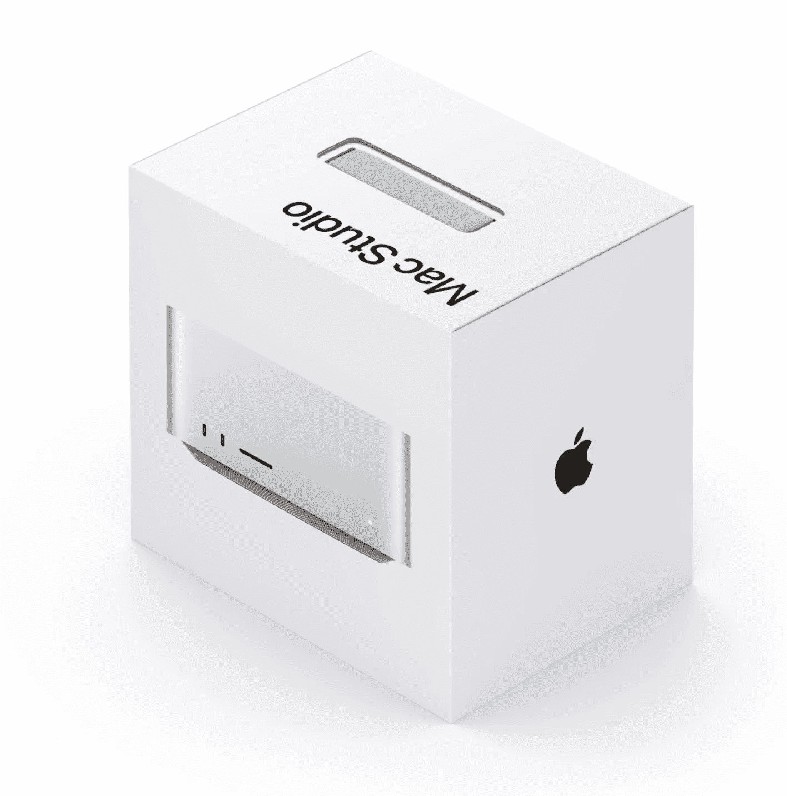

# 拜拜 iMac 和免费 Mac 壁纸！

> 原文：<https://medium.com/codex/bye-bye-imac-and-free-mac-wallpaper-6998c73769bc?source=collection_archive---------2----------------------->

## 苹果观点综述

## 2022 年 3 月 7 日至 3 月 11 日

## 来自俄罗斯，没有爱

苹果已经暂停了在俄罗斯的销售，包括关闭其在线商店，并停止向俄罗斯出口。Apple Pay 已被大规模限制，而乌克兰苹果地图上的交通和现场事件功能已被禁用，以进一步保护该国的居民。剩下的，就是苹果全面关闭 App Store、iMessage 和 iCloud。苹果很快就采取了这些措施，这很好。

## 新冠肺炎热

随着美国的案例，实际上是全球的案例继续下降，苹果公司是众多希望员工回到办公室的公司雇主之一。苹果公司决定采取交错的方式来实施复工政策。从 4 月 11 日起，预计每周有一天。三周后，预期将增加到每周两天。最后，到 5 月 23 日，每个人每周至少有三天不在办公室工作。关于面部覆盖物的规定也将改变。接种疫苗的办公室工作人员，现在可以在没有限制的地方工作，不戴口罩。接种疫苗和未接种疫苗的员工将每周接受两次检测。购物者在商店戴口罩也变得宽松了。与此同时，工作人员的面具要求现在已经取消。最后，关于新冠肺炎的相关新闻，正如上周报道的，*苹果*今天也已经复课。**我已经开始怀念禁闭的日子了，还是只有我这样？**

 [## 这是一件大事，但是…

### 有你想要的东西吗？

medium.com](/codex/it-was-a-great-event-but-d5de6dc6e842) 

## 广告中断时间

2019 年，苹果推出了*Apple in Work*广告活动。在这篇文章中，他们强调了企业用户如何拥抱苹果的世界。一年后，广告的情节在家里开始运作。我们的英雄今年回来了。现在，我们发现我们的团队正在密谋*逃离办公室*，这一切都是为了我们的团队创建一个初创的纸袋生意。这是一部非常棒的短片，值得在 YouTube 上观看。**其实很值得一看，你懂的。**

## 推特疯狂

当 Twitter 最近从按时间顺序排列的时间线切换到显示推荐推文的新提要时，它并没有受到好评。现在，一个新的 Twitter 更新不再让用户默认访问时间表。这一更新现在面向 iOS 用户推出，目前在应用程序顶部有两个标签，可以在主页(建议的推文)和最新推文之间切换。但是，默认情况下，你不能再按时间顺序访问推文，因为主页标签将总是首先出现。Twitter 已经表示，他们可能会在未来变回来，但现在，这是我们所拥有的。你有什么想法？哦，亲爱的推特——为什么要去拨弄！

 [## 快到表演时间了

### 在 Peek Performance 开始之前写这篇文章——以及我们认为我们正在得到什么

medium.com](/codex/its-nearly-show-time-ef323d5cbbf) 

## 最后一个大男孩？

在本周推出 Mac Studio 后，你知道吗，在后台，苹果悄悄地停产了英特尔驱动的 27 英寸机型？很有可能，新的 Mac Studio 和 Studio Display 将被视为备受喜爱的大型 iMac 的天然替代品。从现在开始，我们将从新的工作室级别的机器直接跳到 Mac Pro。硬件工程的 SVP 约翰·特纳斯在结束他的演讲时，告诉我们“我们只剩下一台 Mac 了 Mac Pro”，实际上暗示了这一点。**超级芯片之后，人们还需要多少*更多*的能量？**

## M2 来了

*9–5 Mac*本周报道称，M2 芯片已经在开发中，并将于今年晚些时候面市。我们知道它将首先出现在 MacBook Air 上，然后出现在新的 13 英寸 MacBook Pro 上。M2 不会像 M1 Max、Pro 或 Ultra 那样强大，而是原始 M1 芯片的新版本。我想知道他们会给 M2 带来什么？

## 因为你值得

想为你的 iPad 买一个神奇的键盘吗？嗯，亚马逊(美国)目前正在进行一些很棒的交易。12.9 英寸版本现在有 56 美元的折扣，仅售*293 美元。**我还在爱我的 iPad Mini！！我没有魔法键盘。***

## 在天平的另一端

在苹果宣布 Mac Studio 的同一周，苹果几乎是笑着升级了它的基本型号 Mac Pro。他们给了它 256 GB 的存储空间和 AMD 镭龙 Pro W5500X 显卡。此前，它只有微不足道的 256 GB 和一个功能较差的显卡。费用呢？高达 5999 美元。真的吗，现在谁会买呢？

## 迷你 LED 工作室显示器即将问世

Ross Young 本周报道说，我们最早可能会在 6 月的 WWDC 看到专业版的工作室展示。生产已经开始，它将比本周发布的 27 英寸更大。我真的需要尽快在我的工作室举办一场工作室展览！

## 装箱

想知道全新的 Mac Studio 到货后会是什么样子吗？嗯，大概是这样的！在苹果视图上，这就像是本周的圣诞节早晨，不是吗？

 [## 他们确实泄露了秘密

### 苹果的活动邀请，以及他们实际上意味着什么

medium.com](/codex/they-do-give-the-game-away-38cd06fad3b7) 

## 想要壁纸吗？

点击此处获取 iPhone 和 Mac 版 Peek Performance 壁纸。[https://www . Dropbox . com/sh/yqzxzli 2 hvg 9 rjs/aabsbt 5 jey 3 df 6 ohy 5 o 7 f-BGA？dl=0](https://www.dropbox.com/sh/yqzxzli2hvg9rjs/AABsBT5jEY3Df6OHy5O7f-bga?dl=0) **不客气！**

## 这是春天的颜色

在本周的 Peek 表演活动之后，我们很快就会看到一些 iPhone 13 MagSafe 硅胶保护套，采用一些华丽的新颜色。它们将有黄色、深绿色、紫色和橙色可供选择。据传，这些颜色很可能会延续到他们的表带上。我们还会看到皮革 MagSafe 钱夹的一些新颜色。你知道吗，我是免费的！！

## 影响者时间

你既是 iPad 用户，也热爱 Instagram 吗？好吧，坏消息。不要指望很快会有专门的 iPad 应用。本周在 Twitter 上，Instagram 的负责人表示，对它的需求还不够！亚当·莫塞里承认，虽然他们确实被问了很多，但“仍然没有足够多的人把它作为优先事项”。莫塞里还声称，脸书旗下的 Instagram 没有足够的员工致力于应用程序的开发。**拜托，员工不够吗？真的吗亚当？**

## 滚开

本周，Peloton 开始在其自行车和踏板产品中推出对 Apple Watch 心率集成的支持。这是 Peloton 开始向苹果靠拢的第一个迹象吗？他们还开始销售带有显著 Peloton 标志的 Apple Watch 表带。**啊，看，他们真的是朋友！**

## 在你走之前

## 你订阅媒体了吗？

我只是高端博客网站 Medium 的众多作者之一。这是如此好的价值，你可以在这里加入 https://medium.com/membership

[**加入我的幕后邮件列表**](https://www.talkingtechandaudio.com)

**原载于 2022 年 3 月 11 日 https://www.talkingtechandaudio.com/blog******。****