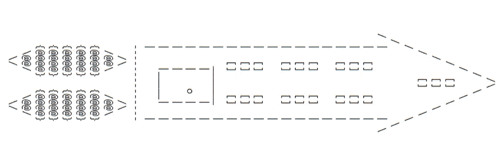

# C++20 三向比较运算符:第 5 部分

> 原文：<https://medium.com/codex/c-20-three-way-comparison-operator-part-5-e986b5ab29d9?source=collection_archive---------3----------------------->



图片:gajendra gulgulia

在教程的 [**第四部分**](/nerd-for-tech/c-20-three-way-comparison-operator-part-4-6a8ea2c0a3f0) 中，我介绍了 C++20 中三元运算符返回类型背后的理论思想，并演示了程序中可能存在语义限制，允许比较等价而不是相等。我还通过一个简单的例子演示了什么时候两个对象在语义上是不可比的，即使程序的语法允许比较它们，以及如何借助于`operator<=>`来处理这种情况。

在教程的这一部分，我将解释`[**compare**](https://en.cppreference.com/w/cpp/header/compare)`头中三个比较类别中的一个，它是三元运算符的返回类型，即`std::strong_ordering`。更具体地说，本教程将有助于理解使用 cpp 参考页中的`std::strong_ordering`的规则，并将指导开发者在定义自定义`operator<=>`时何时返回`std::strong_ordering`。

回忆第四部分的代码片段:

```
MyClass obj1{1, 'a'};
MyClass obj1{2, 'b'};
auto intermediateResult = obj1 <=> obj2;
bool result = intermediateResult < 0;
```

我们想了解当`intermediateResult`的类型为`std::strong_ordering`时的条件，以及 ***强命令*** 意味着什么。

# 1.`std::strong_ordering`

`std::strong_ordering`上的 cpp 参考页说明如下:

> (1)接受所有六个关系运算符(`==`、`>=`、`<=`、`!=`、`>`、`<`)
> 
> (2)隐含可替代性:如果`a`等价于`b` , `f(a)`也等价于`*f(b)*`，其中`*f*`表示一个函数，它只读取可通过参数的公共 const 成员访问的比较突出状态。换句话说，等值是无法区分的。
> 
> (3)不允许不可比的值:`a < b`、`*a ==b*`或`*a > b*`中必须有一个是`true`

让我们试着一个一个地理解上面的规则。

## 1.1 允许所有六个关系运算符…

考虑上面代码片段中初始化`intermediateResult`的部分

```
auto intermediateResult = obj1 <=> obj2;
```

如果我们暂时假设`intermediateResult`属于`std::strong_ordering`类型，这仅仅意味着所有六个关系运算符(`*==*`、`*>=*`、`*<=*`、`*!=*`、`*>*`、`*<*`)都可以应用于`intermediateResult`，但是问题是它只能与文字`0`进行比较:

```
bool res1 = intermediateResult == 0
bool res2 = intermediateResult >= 0
bool res3 = intermediateResult <= 0
bool res4 = intermediateResult != 0
bool res5 = intermediateResult <  0
bool res6 = intermediateResult > 0 
```

***“接受关系运算符……”***简单地说，关系运算符可以与三元运算符一起使用。

## 1.2 隐含可替代性:如果`*a*`等价于`*b*`，`*f(a)*`也等价于`*f(b) ...*`

为了理解第二条规则，我需要再解释几个出现在第二条规则中的术语:

(1)一个对象的 ***值***:
在 C++中，一个对象的 ***值*** 是可以用来比较该对象与另一个对象的属性。对于一个简单的`int i = 29`对象，`i`的值是其寄存器中保存的值，即数字`29`，而不是对象`i`在内存中分配的地址。对于 C 样式字符串:

```
char* str[] = "hello"
```

该值既是字符串`hello`又是指针分配的地址。不严格地说，对象的值取决于程序和所用对象的语义，以及两个值何时相等

(2) ***一个对象的显著属性***:
c++中的一个自定义对象有类成员 ***可以*** 共同定义对象的值。我说.. ***可以*** 合起来……’因为所有成员对定义对象的值都没有用。例如，`std::vector`有一个指向存储数组的内存的指针，成员函数`size()`和`capacity()`、`push_back()`、`empty()`等等。但是在比较两个`std::vector`时，只对数组的内容和大小感兴趣。换句话说，当数组的内容相等时，两个`std::vector`对象相等。因此这些就是`std::vector`的 ***显著特性*** 。

任何能够读取`std::vector`对象的显著属性并基于这些显著属性返回值的函数`f`都被认为是可替换函数，并且可以与关系比较运算符一起使用(关系比较运算符`==`、`>=`、`<=`、`!=`、`>`、`<`中的一个)。这些函数可以是成员函数，也可以是非成员函数。在`std::vector`的情况下，可替代功能的例子有`size()`和`empty()`。不读取对象显著属性的函数示例有`capacity()`和`push_back()`，因此它们是不可替代的。

为了证明这些事实，考虑两个`[**std::vector<T>**](https://en.cppreference.com/w/cpp/container/vector)`对象的例子，这两个对象提供了自 C++20 以来的三路操作符，可用于获得两个对象之间的相等关系:

```
#include <iostream>
#include <compare>
#include <vector>void fillIntVectorFrom1To100(std::vector<int>& vec)
{
    for(int i{0}; i<=100; ++i)
    {
        vec.push_back(i);
    }
}int main(){
    std::vector<int> v1, v2;
    v1.reserve(10000);
    v2.reserve(9999);

    fillIntVectorFrom1To100(v1);
    fillIntVectorFrom1To100(v2); std::cout << "Are vectors equal: " << ((v1 <=> v2)==0) << "\n"; std::cout << "Are capacities equal: " 
              << (v1.capacity() == v2.capacity()) << "\n"; std::cout << "Are sizes equal: " 
              << (v1.size() == v2.size()) << "\n";stdout
------
true
false
true
```

注意在上面的例子中,`operator<=>`是如何在`std::vector`对象上被调用来进行比较的，以证明它在自 C++20 以来的大多数标准库组件中都是可用的。显然，`operator<=>`并不依赖于两个向量的容量来进行比较。它只依靠可替换的函数调用(如果有的话)来检查相等性。上面的例子也可以在[这里找到](https://godbolt.org/z/veMnGsf7o)。

类似地，对于`std::shared_ptr`,值是指针指向的指针对象和非控制计数或我们在解引用指针后得到的值。为了证明这一点，考虑下面的例子，当两个不同的`std::shared_ptr`具有完全相同的被指向的值(值`1`)时，它打印出`false`。

```
#include <memory>
#include <compare>
#include <iostream>int main(){
    std::cout << std::boolalpha;

    std::shared_ptr<int> sptr1 = std::make_shared<int>(1);
    std::shared_ptr<int> sptr2 = std::make_shared<int>(1);
    std::shared_ptr<int> sptr3 = sptr1; std::cout << ((sptr1 <=> sptr2) == 0) << "\n";
   std::cout << ((sptr1 <=> sptr3) == 0) << "\n";stdout
-------
false
true
```

要记住的主要思想应该作为一个强有力的提示来指导开发，以及何时应该从对象上的自定义`operator<=>`返回`std::strong_ordering`:

1.  在`operator<=>`的主体中，成员按照顺序和字典顺序进行比较。在这种情况下，默认值`operator<=>`就足够了。
2.  在`operator<=>`的主体中，成员需要按顺序或无序进行比较，应在每个成员上使用`operator<=>`进行比较。
3.  在比较主体`operator<=>`中对象的成员时，它们本身应该返回`std::strong_ordering`(参见[一致性比较](http://www.open-std.org/jtc1/sc22/wg21/docs/papers/2017/p0515r3.pdf)论文第 1.4.2 节中的示例和下面的第 2.1 节)
4.  在`operator<=>`的主体中，只有可替换函数(成员或非成员)被调用来进行比较，即只使用对象的显著属性来比较值的函数。

让我们最后看看 cppreference 页面中的第三条也是最后一条语句

## 1.3.不允许不可比的值:必须有`*a < b*`、`*a == b*`或`*a > b*`中的一个为`*true*`

如果您还记得本系列教程第四部分 的 [**的第 2.1 节，其中我举例说明了两个对象何时不可比较，除了 1.1 和 1.2 小节中描述的所有规则都成立之外，对象必须是可比较的，并且除了`!=`之外，`>`、`<`或`==`中的一个应该返回`true`，因为自定义`operator<=>`返回`std::strong_ordering`。**](/nerd-for-tech/c-20-three-way-comparison-operator-part-4-6a8ea2c0a3f0)

# 2.需要注意的要点

在这一节中，我想用刚才提到的例子来详细解释一些想法，以支持概念并形成清晰的理解。

## 2.1 类对象必须有返回`std::strong_ordering`的成员

我之前提到过，为了让`operator<=>`的主体返回`std::strong_ordering`，所有成员都应该使用`<=>`进行比较，并且它们都必须返回`std::strong_ordering`，要么显式返回，要么用`auto`进行推导。首先考虑以下带有默认`operator<=>`的示例:

```
#include <compare>
#include <iostream>
#include <typeinfo> //needed to print type of objectclass Person{
    private:
        std::string name_;
        int age_;
    public:
        Person(std::string name, int age): name_{name}, age_{age}
        {           //empty body           }

        auto operator<=>(const Person& rhs) const = default;
};int main(){
    Person john{"John", 26};
    Person jane{"Jane", 27};
    auto resType = john <=> jane; std::cout << typeid(resType).name() << "\n";
};stdout on my machine with gcc 10.2
----------------------------------
**St15strong_ordering**
```

在上面的例子中，默认的三向比较操作符返回的类型名是 **St15strong_ordering** ，也就是`std::strong_ordering`。这是因为当编译器通过`<=>`按字典顺序比较两个成员(`name_`和`age_`)时，它们都返回了`std::strong_ordering`。如果其中一个或两个返回的比较类别不是`std::strong_ordering`，则打印输出会有所不同。

现在，让我们定义一个显式的三路操作符来代替默认的三路操作符，做编译器为我们做的事情。因为我明确地定义了`operator<=>`，所以我也需要定义`operator==`，但是为了不离题，我在这里省略了它:

```
auto Person::operator<=>(const Person& rhs) const
{
    if(auto cmp = name_ <=> rhs.name_; cmp != 0)
    {return cmp;}
    return age_ <=> rhs.age_;
}//explicitly define operator== too ...
```

在这种情况下，我试图展示的是对`Person`成员的`<=>`调用返回`std::strong_ordering`，因此`Person::operator<=>(const Person& rhs)`的整体返回也是`std::strong_ordering`。

## 2.2 类对象包含不返回的成员`std::strong_ordering`

为了完整起见，谨慎的做法是看看当一个类包含一个返回比较类别而不是`std::strong_ordering`的成员，但是类本身的`operator<=>`返回`operator<=>`时会发生什么:

```
#include <iostream>
#include <compare>struct Int{
   int intNum_;
   std::strong_ordering operator<=>(const Int& rhs) const = default;
};struct Float{
    float floatNum_;
    auto operator<=>(const Float& rhs) const = default;
};struct Numbers{
    Int first_;
    Float second_; std::strong_ordering operator<=>(const& Numbers rhs) const
    {
        if(auto cmp = first_<=> rhs.first_; cmp != 0)
        {return cmp;} return second_ <=> rhs.second_;
    }
};
```

编译上述代码会导致编译错误，表明成员`Numbers::second_`无法返回带有`operator<=>`的比较类别`std::strong_ordering`

```
In member function 'std::strong_ordering NumericWrapper::operator<=> (const NumericWrapper& ) const':error: **couldn't convert** '((const NumericWrapper*)this->NumericWrapper::second_.FloatWrapper::operator<=>(rhs.NumericWrapper::second)' **from std::partial_ordering to std::strong_ordering**|        return **second_ <=> rhs.second_**;
|               **~~~~~~~~~^~~~~~~~~~~~~~~**
|                        **|**
|                       **std::partial_ordering**
```

因此，很明显，试图从一个类对象的`operator<=>`返回`std::strong_ordering`而成员本身不返回，就会导致编译错误。即使`operator<=>`是默认的，您也可以预期看到类似的编译器错误。

# 3.`equal`和`equivalent`的区别

所有三个比较类别都可以用来确定两个对象是否是`equivalent`。另外`std::strong_ordering`也可以用来判断两个物体是否是`equal`。在大多数情况下，当我们编写默认版本的三元运算符时，这对我们来说无关紧要。但是当我们被要求定义一个自定义的宇宙飞船操作符时，知道如何编写程序来检查等式和等价性是没有坏处的。

C++ STL 在下面的 way⁴:中区分了相等和等价

```
if(a == b){
     std::cout << "a and b are equal\n";
}
if(!(a < b) && !(a > b)){
     std::cout << "a and b are equivalent\n";
}
```

因此，当编写一个自定义的三向比较运算符时，可以利用这个构造来检查等价性。你可以看看我的教程 [**第 8 部分**](https://ggulgulia.medium.com/c-20-three-way-comparison-operator-ensure-backward-compatibility-part-8-cae984559a08) ，它独立于本系列教程的其余部分，看看上面的构造是如何用于返回`std::strong_ordering::equivalent`的。

# 摘要

1.  对于自定义`operator<=>`中返回`std::strong_ordering`的对象，所有成员都必须与`operator<=>`主体中的`<=>`进行比较，它们都应该返回`std::strong_ordering`。
2.  在大多数情况下包括默认的`operator<=>`，返回类型被推导为`std::strong_ordering`。
3.  在`operator<=>`中被比较的对象的所有成员(显式定义或默认)也必须返回`std::strong_ordering`，以便`operator<=>`总运算符返回`std::strong_ordering`，否则会导致编译错误。
4.  被比较对象的成员必须是可比较的，并且除了`!=`之外，只有`>`、`<`或`==`中的一个应该返回`true`。

# 结论

在本系列教程的这一部分中，我解释了自定义`operator<=>`何时应该返回比较类别`std::strong_ordering`，并且在这个过程中，我解释了一些对本教程接下来的部分有用的概念。在 [**第六部分**](https://ggulgulia.medium.com/c-20-three-way-comparison-operator-part-6-c66a173dcc99) 中，我解释了比较范畴`std::weak_ordering`。敬请期待！

# 参考

[1]经 Jonathan Müller 许可，来自他的博客[比较数学:第 1 部分](https://www.foonathan.net/2018/06/equivalence-relations/)
【2】经 Jonathan Müller 许可，从他的博客[比较数学:第 1 部分](https://www.foonathan.net/2018/06/equivalence-relations/)
【3】[一致性比较](https://open-std.org/jtc1/sc22/wg21/docs/papers/2017/p0515r0.pdf)，Herb Stutter，Jens Maurer，Walter e . Brown
【4】相等与等价之间的区别来自 cpp 参考页上的[比较运算符](https://en.cppreference.com/w/cpp/language/operator_comparison)

# youtube 和课程上的 C++20 个视频

你可以从[这段 youtube 视频](https://youtu.be/C9OTiOJjssI)中了解更多关于**比较显著态**。订阅我的 [youtube 频道](https://www.youtube.com/channel/UCITUBa1OVUC2oc-w3u33leg)以了解更多关于 C++20 的协程和其他高级主题，或者浏览[我的课程页面](https://mastering-modern-cpp-features.thinkific.com/courses/mastering-modern-cpp-features)以访问所有 C++20 视频、测验和个人支持。

# 成为会员来支持我

如果你喜欢我的教程和文章，请考虑支持我，通过我的媒介 [**推荐链接**](https://ggulgulia.medium.com/membership) 成为会员，每月只需 5 美元就可以无限制地阅读 medium.com 的所有文章。