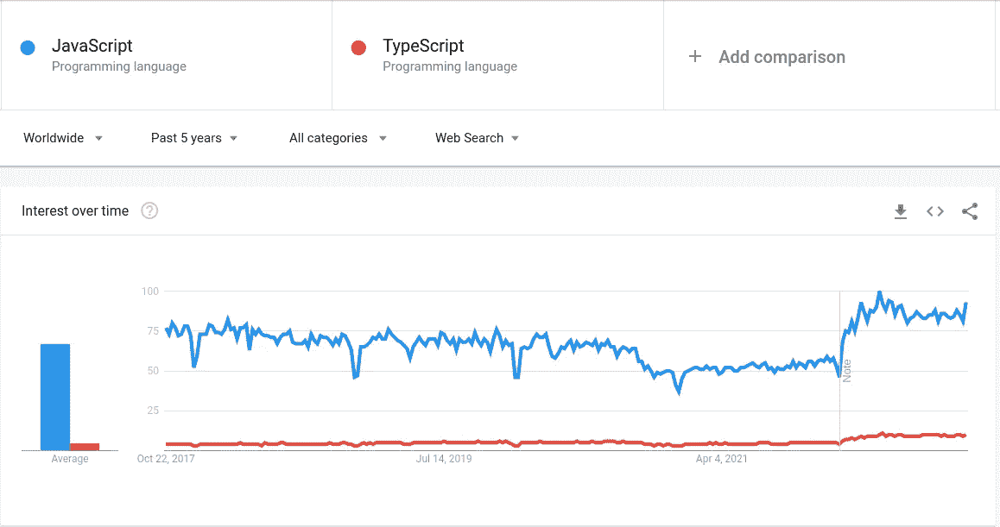
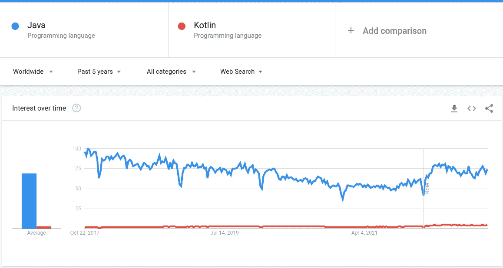

# C、C++、Rust、Python、Carbon(什么时候用哪个？)

> 原文：<https://medium.com/codex/c-c-rust-python-and-carbon-when-to-use-which-2912a88f205b?source=collection_archive---------1----------------------->

在深入探讨这个主题的细节之前，我强烈建议您阅读我之前关于编程语言比较的文章。因为我们将使用那篇文章中提供的思路来决定使用哪种语言。

 [## 未来的编程语言

### 哪种编程语言将主导未来市场？哪种编程语言成为最常用的语言…

medium.com](/@uguryagmur/the-programming-language-s-of-the-future-24af5cfa8479) 

如果你没有读另一篇文章，我想告诉你关于我自己的情况。我专注于性能关键的软件，因此，我通常使用 C、C++和 Rust 等编译语言。此外，对于脚本，我使用 Python。由于我在其他编程语言方面没有足够的专业知识，如果你对其他语言感兴趣，你应该自己研究它们，或者你应该找到其他文章。

让我们深入分析一下我们将要考虑的语言的优缺点。

# 计算机编程语言

Python 是一种脚本语言。它很简单，也很精简，里面有很多你想做的库。软件包管理器 pip 和 conda 非常强大，自动虚拟环境创建系统通过使用其他库的不同特定版本运行 python 软件非常有效。

另一方面，Python 是一种解释型语言。python 中创建的类型总是分配在堆内存中，并且有一个垃圾收集器来防止内存泄漏。此外，对于多线程方法，有一个*全局解释器锁(GIL)* 机制，这对于提高计算性能非常没有帮助。但是，您可以使用它来优化 I/O 队列。因此，考虑到其他方面，Python 的性能并不是很好。

# C

c 是一部杰作。它非常简洁明了。如果你读过我写的前一篇文章，它是最好的能量和性能友好的编程语言。语言的优化非常好，由于这些原因，Linux 大部分是用 C 编写的。老实说，我是这种语言的忠实粉丝，通常，如果项目中有性能需求，人们更喜欢使用 c。例如，VideoLAN 视频编码器项目大多是使用 c 实现的。类似地，OpenGL、GIMP 和其他一些著名的软件都是用 c 编写的。

然而，像所有其他东西一样，c 也有缺点。如果你想要面向对象的特性，c 中没有。它不是类型或内存安全的，所以你需要知道你在做什么；否则，你开发的软件会引起很多问题。此外，我认为 C 中最大的缺失部分是泛型类型。如果你想为不同的类型设计一个算法，通常你需要分别定义它们。此外，没有自动编译系统或包管理器。你需要创建 makefiles，它基本上是编译你的软件的方法。

# 锈

Rust 是一种相对较新的语言。它于 2010 年发布。这种语言背后的主要哲学是迫使开发人员遵循一定的规则，使用 rust 编写的软件是内存安全的、类型安全的、线程安全的和空安全的。编译器写得非常好，它给出了修复代码的好建议。(然而，它会让你发疯，直到习惯为止)。Rust 和 traits 中有泛型*——基本上都是接口——*对设计非常有用的库非常有帮助。能量和性能效率得分非常接近 C，这对于一种内存安全的语言来说是惊人的。此外，它还有一个内置的包和依赖管理器，称为 Cargo。

那么缺点是什么呢？它看起来没有缺点，因为它的性能接近于 C 语言，并且有很多安全问题，同时提供了内置的包管理器的一般和特性功能。当然也有缺点，例如，有一个关于 Rust 是否是面向对象语言的讨论，但它不是。Rust 中没有引入继承等对象关系机制。另一方面，在一些与内存相关的操作中，根据竞争对手的说法，Rust 使用大量内存，这使它成为一个糟糕的选择，特别是对于嵌入式软件开发。此外，许多库是用 C 和 C++编写的，所以如果你想用 C 语言使用这些语言的库，有一个 C API，但是，由于编译器机制非常不同，有时会导致问题。另一个缺点是，尽管这种语言提供了内存安全保护，但仍然有可能导致内存泄漏。

# C++

C++基本上是具有面向对象特性的 C。它能做 C 能做的一切，也能做 Rust 几乎能做的一切*——是的，它能像 Rust 一样实现类似的所有权和借用机制，但它不是由编译器强制的。—* 此外，C++有一个非常强大的标准库，其中包含提供内存安全的智能指针和高效存储数据的容器。它有一个非常类似于泛型的模板机制，有助于开发高质量的软件。

然而，C++有太多的功能，有时可能会令人困惑。如果您不知道自己在做什么，可能会导致分段错误和内存损坏。有很多细节，没有内置的包管理器。此外，由于它所提供的机制和功能，用 C++编写的软件与竞争对手相比，性能稍低，能耗稍高。

# 什么时候用哪个？

尽管 Python 的性能明显低于其他语言，但测试您的想法和算法非常简单快速。因此，如果您需要测试您的想法，并实现一个概念证明软件，Python 可能是开始的最佳选择。

在用 Python 实现了你的想法之后，如果你需要性能，你可以把性能关键的部分转换成 C 语言，因为 Python 中有一个 C API，一起使用它们会非常容易。事实上，有一个名为 Cython 的库，用于将 Python 代码转换为 C 代码。但是，并没有那么优化，所以如果你需要一个非常优化的代码，那么最好的办法就是自己用 C 写。你可以通过用 C、C++或者 Rust 编写来优化你的软件。

如果你不需要 C 库，或者你想强迫你的队友遵守某些所有权借用规则来保证系统安全，那么 Rust 可能是最好的选择。你的软件的性能将接近 C 语言，同时它也是内存、线程、类型和空安全的。此外，亚马逊和脸书宣布他们开始使用 Rust 开发公司工具，这意味着未来我们可能会看到更多 Rust。

C 和 Rust 都是非常优化的好语言。然而，如果你要和一个大团队一起管理和维护一个非常大的项目，或者作为一个开源项目，那么面向对象的特性可能会非常有帮助。如果你也需要性能，那么你的语言就是 C++。

简而言之，你应该选择你最需要的。大多数公司在开发系统时都遵循非常相似的方法。例如，DeepMind 购买了一个名为 MuJoCo 的库，用于强化学习的物理模拟。这种语言的界面是用 Python 编写的，因为他们需要将其与其他深度学习库结合起来，以快速测试他们的人工智能想法。但是，性能关键的部分一开始是用 C 写的，随着项目越来越大，他们加入了 C++来以更好的方式维护和管理代码库。同样的事情也适用于性能关键的 Python 库，如 NumPy、Tensorflow 和 PyTorch。另一方面，在开源社区中，实现了一个名为 RipGrep 的库，它是一个文件系统中的文本搜索软件。它非常有用，因为它不需要与其他库交互，所以它是用 Rust 编写的，其性能令人印象深刻。从这些例子中你可以明白，重要的不是对一个工具的狂热，而是考虑取舍，根据自己的需求选择最适合自己的。

# 碳呢？

如果你从未听说过 Carbon，让我解释一下:Carbon 是由 Google 开发的 C++的后继编程语言。目前还没有发布，还在实验阶段，但如果没有意外的问题，计划在 2024 年发布。正因为如此，我不能将这种语言与其他语言进行比较，因为这种语言还没有完成。

在 Quora 上，我看到了很多关于碳取代 C++的问题。我不理解这样的问题，因为，在项目的 GitHub 页面上，它的创建者写得很清楚，Carbon 不是要取代 C++。这就像是 C++的又一个抽象层。其他语言也是如此，比如 TypeScript 是为 JavaScript 设计的，Kotlin 是为 Java 设计的。然而，他们还没有取代他们的祖先语言。让我来证明一下:我们再来看看谷歌趋势。

JavaScript 和 TypeScript Google 趋势比较

Java 和 Kotlin Google 趋势对比

如你所见，人们通常仍然使用主要语言。但这并不意味着后继语言没有用。我听了很多开发者的意见，他们对后继语言的特性非常满意。

我希望，我们也会喜欢 Carbon，老实说，根据他们在 project GitHub 页面上写的内容，这听起来非常好，非常有趣。很有可能写出更多更好的代码，其性能可能接近 C++。然而，什么都不会改变。我们只是在我们的项目中使用另一个工具，我们仍然会根据我们的需要来决定。因此，我建议您对新项目和新工具持开放态度，但要小心权衡它们之间的利弊，明智地选择使用哪一个。

感谢您的时间，并致以亲切的问候。