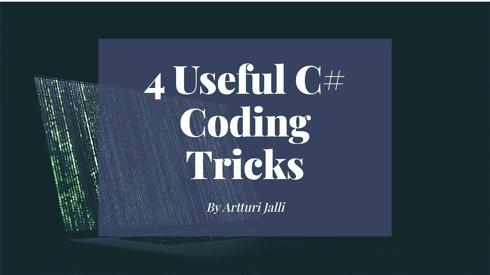

# 2022 年 4 个简单的 C#编程技巧

> 原文：<https://medium.com/codex/c-coding-tricks-you-need-to-know-in-2021-f0ddf4f86b58?source=collection_archive---------0----------------------->

## [法典](http://medium.com/codex)

## 用这些初学者友好的编码技巧提高你的 C#技能。

原图:[马库斯·斯皮斯克](https://unsplash.com/@markusspiske)

编写漂亮的代码对任何软件开发人员来说都是必不可少的。本文展示了四个简单的 C#编程“技巧”,您可以用它们来编写更专业的代码。

# 1.单行 If-Else 语句