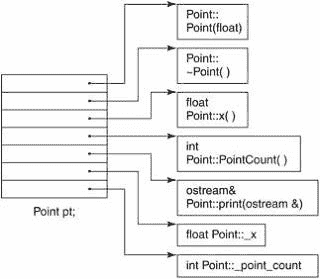
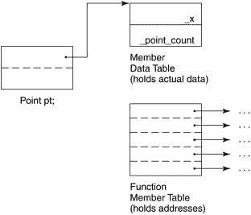
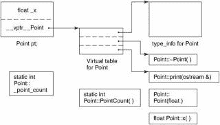

# C++对象模型

> 原文：<https://medium.com/codex/c-object-model-fe10dc3cb74d?source=collection_archive---------3----------------------->

## [法典](http://medium.com/codex)

## **一个简单的对象模型**

我们的第一个对象模型无疑非常简单。它可能用于 C++实现，旨在以空间和运行时效率为代价最小化编译器的复杂性。在这个简单的模型中，一个对象是一系列槽，每个槽指向一个成员。成员按照他们声明的顺序被分配一个槽。每个数据或函数成员都有一个插槽。

简单对象模型

在这个简单的模型中，成员本身不放在对象中。只有指向成员的指针被放在对象中。这样做可以避免由于成员类型不同以及需要不同数量(有时是不同类型)的存储空间而带来的问题。对象中的成员通过它们的槽索引来寻址。比如 _x 的指数是 6，_point_count 的指数是 7。类对象的一般大小是指针的大小乘以该类声明的成员数。

# **一个表格驱动的对象模型**

对于维护所有类的对象的统一表示的实现，另一种对象模型可以提取所有成员特定的信息，将其放在表的数据成员和成员函数对中。类对象包含指向两成员表的指针。成员函数表是一系列槽，每个槽寻址一个成员。数据成员表直接保存数据。

成员表对象模型

尽管这种模型在 C++中实际上并不使用，但成员函数表的概念一直是支持虚函数的有效运行时解析的传统实现。

# **c++对象模型**

Stroustrup 最初的(现在仍然流行的)C++对象模型是通过优化空间和访问时间从简单对象模型派生而来的。非静态数据成员直接在每个类对象中分配。静态数据成员存储在单个类对象之外。静态和非静态函数成员也被提升到类对象之外。虚拟功能分两步支持:

1.  为每个类生成一个指向虚函数的指针表(这称为虚表)。
2.  指向相关虚拟表的单个指针被插入到每个类对象中(传统上，这被称为 vptr)。vptr 的设置、重置和不设置是通过在每个类构造函数、析构函数和复制赋值操作符中生成的代码自动处理的。与支持运行时类型标识(RTTI)的每个类相关联的 type_info 对象也在虚拟表内寻址，通常在表的第一个槽内。

下图说明了我们的 Point 类的通用 C++对象模型。C++对象模型的主要优势是它的空间和运行时效率。它的主要缺点是需要重新编译未修改的代码，这些代码利用了已经添加、移除或修改了非静态类数据成员的类的对象。(例如，双表模型通过提供额外的间接层提供了更大的灵活性。但这是以空间和运行时效率为代价的。)

C++对象模型

*最初发表于*[*【https://emerging-it-technologies.blogspot.com】*](https://emerging-it-technologies.blogspot.com/2021/01/c-object-model.html)*。*