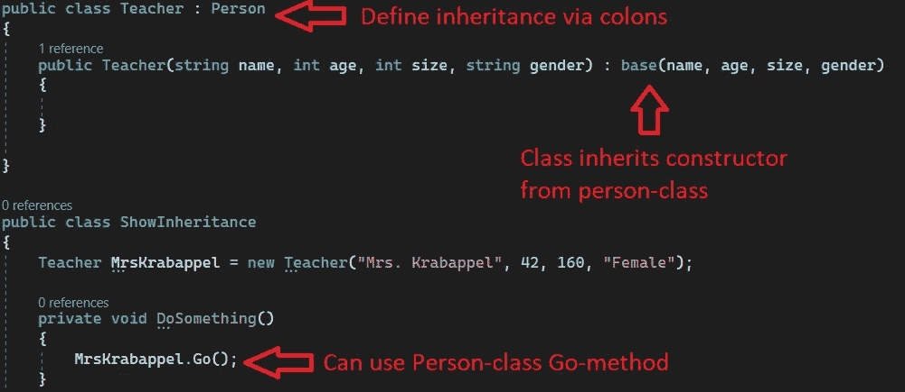
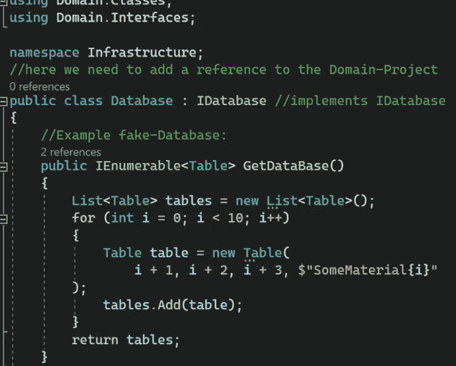

# C# —面向对象编程(OOP)

> 原文：<https://medium.com/codex/c-object-oriented-programming-oop-2d92a5cd336f?source=collection_archive---------1----------------------->

## 用 C#解释面向对象编程的基本概念

人类思考面向对象。他们从桌子、椅子、人等物体的角度来思考问题。面向对象的编程语言模仿人类思维，包含对象的抽象。

[https://unsplash.com/photos/DuHKoV44prg](https://unsplash.com/photos/DuHKoV44prg)

*向我的兄弟和导师* [***托比亚斯·斯特兰***](/@tobias.streng)*——*
*如果你喜欢这篇文章，并想在。* ***网*** *和* ***角*** *，请关注我们:P*

# 内容:

*   类别和对象
*   方法
*   构造函数和析构函数
*   包装
*   访问修饰符
*   Getters 和 Setters
*   代表
*   遗产
*   无商标消费品
*   抽象类和接口
*   静态类和静态方法

# 类别和对象:

面向对象描述了一种更好地可视化编写的源代码的方法。它是软件开发中的一个视角，使用对象描述复杂的系统，并为此使用类和方法。
所以类的实例就是对象。为了更精确地说明一个类的这个原理，这个人作为一个例子。所有人都有某些特征，比如名字或出生日期。每个特别的人都是一件物品。如果现在将属性分配给人物类，例如姓名、年龄、身高和性别，则人物的表面形象逐渐显现。创建类时，指定的属性还没有任何值，因为这里只通过指定相应属性所源自的数据类型来确定后面的对象应该具有哪些属性。在这里，用一种蓝图来定义一个人是什么。
如果需要单个对象，可以使用 new()命令创建一个 Person 类的实例。构造函数被调用，开发人员有机会赋值。例如，这里我们可以创建名为 Peter 的人，年龄 41 岁，身高 1.82，性别男。Peter 是 Person 类的实例/有形体。一个对象也可以包含方法。**一个例子显示了“方法”后的图片**

# 方法:

方法可以理解为一种“子程序”,其中可以组合程序的某些功能。定义方法有不同的方式。使用 **public 和 private** 关键字，可以使方法**对项目中的其他全局类可见或不可见。也可以定义一个**返回数据类型**，例如，当方法被调用时，它可以被赋值为一个变量。这在方法体中用关键字 *return* 返回，并在方法头中作为各自的数据类型提供，例如 integer。如果这不是必需的，关键字 **void** 被写在方法头的相同位置。此外，方法可以包含和使用参数。一个方法可以被绑定到一个对象，方法不被定义为静态的，而是在定义对象蓝图的类中被创建。例如，在前面的 Person 示例中，您可以添加 go()方法。如果该方法不是静态的，则只有在使用类实例(即对象)后面的点标记进行调用时，才能调用该方法。但是，如果要调用的方法没有绑定到对象，可以用关键字 static 将其定义为 static。**

## 下面是一些基本的例子:

# 构造函数和析构函数:

**构造函数**是一个特殊的函数，在初始化一个类时被调用。构造函数的名字总是对应于类名。该函数没有返回值(甚至没有 void ),因为构造函数返回新初始化的对象。如果类中没有创建构造函数，那么总会有一个所谓的默认构造函数，它不执行任何进一步的操作。默认构造函数没有参数。但是，这可以在实现自己的构造函数时进行更改。也可以重载构造函数。重要的是要知道，一旦在类中声明了构造函数，C#自动创建的默认构造函数就不再存在。构造函数的访问修饰符通常是公共的。如果 private 被用作访问修饰符，那么这个类的对象初始化就不再可能。因此，私有构造函数用于防止只包含静态函数的类的对象初始化。

**析构函数**与构造函数相反，因为当对象被销毁/删除时，析构函数被调用。如前所述，一旦对象的。NET Framework 再也找不到引用。如果程序当前没有要处理的进程或者存储空间很关键，垃圾收集器(GC)会自动删除这些对象。此外，还可以使用 GC 类的静态函数 Collect()手动触发未引用对象的删除。析构函数的名称也与类名相同，但以波浪符号为前缀。此外，不能为析构函数指定访问修饰符和返回值

# 封装:

封装被定义为将数据包装成一个单元。它是将代码和它所处理的数据绑定在一起的机制。另一方面，封装是一个保护屏障，防止屏障之外的代码访问数据。

从技术上讲，在封装中，一个类的变量或数据对任何其他类都是隐藏的，只能通过声明它们的类的任何成员函数来访问。

# 访问修饰符:

所有类型和类型成员都有一个可访问性级别。可访问性级别控制它们是否可以从您的程序集中的其他代码或其他程序集中使用。一个[组件](https://learn.microsoft.com/en-us/dotnet/standard/glossary#assembly)就是一个*。dll* 或*。exe* 通过编译一个或多个*创建。cs* 文件进行单次编译。在声明类型或成员时，使用下列访问修饰符指定其可访问性:

*   [public](https://learn.microsoft.com/en-us/dotnet/csharp/language-reference/keywords/public) :该类型或成员可以被同一程序集中的任何其他代码或引用它的另一个程序集中的任何其他代码访问。类型的公共成员的可访问性级别由类型本身的可访问性级别控制。
*   [private](https://learn.microsoft.com/en-us/dotnet/csharp/language-reference/keywords/private) :该类型或成员只能被同一个`class`或`struct`中的代码访问。
*   [受保护的](https://learn.microsoft.com/en-us/dotnet/csharp/language-reference/keywords/protected):该类型或成员只能由同一个`class`中的代码访问，或者由该`class`派生的`class`中的代码访问。
*   [内部](https://learn.microsoft.com/en-us/dotnet/csharp/language-reference/keywords/internal):该类型或成员可以被同一程序集中的任何代码访问，但不能从另一个程序集中访问。换句话说，`internal`类型或成员可以从属于同一编译的代码中访问。
*   [受保护的内部](https://learn.microsoft.com/en-us/dotnet/csharp/language-reference/keywords/protected-internal):类型或成员可以被声明它的程序集中的任何代码访问，或者从另一个程序集中的派生`class`中访问。
*   [private protected](https://learn.microsoft.com/en-us/dotnet/csharp/language-reference/keywords/private-protected) :该类型或成员可以被从`class`派生的类型访问，这些类型在其包含的程序集中声明。

# Getters 和 Setters:

访问器方法，也称为 getter 和 setter 方法，是允许访问变量的方法，从而提供对变量的值进行控制的能力。

**它们是允许类的属性被使用或改变的方法**

## 如果我不设置 getters 和 setters 会怎么样？

在这种情况下，设置属性**不是属性而是字段。**

## 字段与属性:

一个**字段**将数据存储为一个变量。它可以被公开，然后通过类调用，但是限制和隐藏尽可能多的数据是一个好主意。通过确保某人只能通过该类的一个公共方法来访问数据，这给了您更多的控制并避免了意外的错误。

一个**属性**公开了字段。直接使用属性而不是字段提供了一个抽象层次，在这个层次上，您可以修改字段，而不会影响使用您的类的对象访问它们的外部方式。属性还允许您在设置字段值或确保数据有效之前执行计算

# 代表们:

委托是一种表示对具有特定参数列表和返回类型的方法的引用的类型。实例化委托后，可以将该实例与任何具有兼容签名和返回类型的方法相关联。您可以通过委托实例调用方法。
**或者简单点说:
委托是在变量中存储一个或多个方法的一种方式。**

**如你所见，我们还被允许在一个委托中添加多个方法。**

# 继承:

在继承中，子类继承其父类的所有属性(数组和方法——即结构和行为),并添加自己的单独属性或重写父类的方法。父类的属性不必在子类的规范中重复。据说子类是从父类派生出来的。因此，继承的原则简单地说明了类中所有可以从超类继承的属性和方法。下图说明了继承的原理:

[https://blog . 4d . com/object-oriented-programming-in-4d-manage-class-inheritance/](https://blog.4d.com/object-oriented-programming-in-4d-manage-class-inheritance/)

可以看出，教师和学生也是人，但他们被定义为一个独立的阶层。因为两者都需要超类 Person 及其方法的所有属性，所以这里使用了继承。通过使用继承，两个子类都不必实现在超类中实现的属性和方法，而是可以从 Person 类中继承它们并为自己所用。此外，子类中还可以使用其他属性和方法。自上而下的过程因此被称为**专业化**，而自下而上的过程被称为**一般化**。

# 仿制药:

在 C#中，可以使用泛型创建映射到其他数据类型的数据类型。当您希望创建一个足够灵活的数据类型来处理不同的数据类型时，这很有用。例如，您可以创建一个包含任何数据类型项目的列表。当您想要创建包含不同数据类型的对象列表时，这很有用。

# 抽象类和接口

**关于接口的更多具体信息，请查看我的文章** [**清洁架构&依赖倒置**](/@sebastianstreng96/net-c-clean-architecture-dependency-inversion-principle-7ea64f586c58)

## 抽象类:

在编程中，抽象类是不能为其创建对象实例的类。例如，当应用继承时，这种行为变得相关。正如已经解释过的，各种子类从超类继承而来。作为一名程序员，您可以选择自己调用超类，尽管它是一般化的，并没有给开发人员任何关于该类的专门见解。在这种情况下，可以创建 Person 类的一个**实例，尽管它从来不需要**。唯一需要的实例是教师或学生类型的。使用*抽象*关键字将超类定义为抽象类，这意味着**不能再创建更多的实例**。只有**子类可以继续创建实例**，这可以显著降低开发中出错的可能性。

## 接口:

接口也代表抽象。接口首先充当实现该接口的类的一种模板。定义了方法，也可能定义了属性，但是它们没有值或功能。这样做的目的是指示实现该接口的类应该使用哪些方法。为了更准确地理解这个原理，你可以使用一个带有数据库的程序。假设源代码定义了一个读取数据库的部分、一个处理数据库中的条目的部分和一个输出处理过的数据的部分，那么在之后改变数据库**可能会有问题。然而，如果从一开始就定义了选择类的必需方法，**剩余的类独立于这个类**。在其他类中，已经定义的方法和以前一样被调用。在选择类中定义的方法满足接口指定的准则的条件下，开发人员可以选择将数据库替换为另一个数据库，而无需在源代码的其他地方进行更改。例如，方法的准则可以是参数、返回值或通过关键字 public 和 private 的全局可访问性。实现接口的类必须包含接口的所有属性和方法，但它也可以使用其他方法或属性。与继承的不同之处在于，方法是空的，并且**只是作为一个模板。**
在面向对象语言中，实现一个接口的类也可以通过接口直接调用，这也是为什么它们也被称为接口的原因。这里用到的原理是[**依赖反转原理**](/@sebastianstreng96/net-c-clean-architecture-dependency-inversion-principle-7ea64f586c58) 。正如已经解释过的，接口的使用促进了类的独立性，也确保了整个项目更少的错误敏感性，更好的软件架构和干净的编程。**

# 静态类和静态方法:

static 是一个关键字，可以用来标识类、方法等等。声明为静态。静态意味着您不能实例化(创建一个对象)这种类型。所以不能创建静态类的对象，也不能访问静态成员(字段、属性、方法等。)通过一个对象。相反，您可以通过类名来访问成员。

# 结论:

总而言之，面向对象的概念对于程序员来说是非常有用的。它可以让初学者更好地理解编程。即使是有经验的程序员也会从 OOP 的使用中受益匪浅。我希望你喜欢这篇文章，并订阅我的频道

# 请查看我的其他文章:

*   [LINQ——如何避免 C#中的嵌套循环](/codex/linq-how-to-avoid-nested-loops-in-c-ed4ae19886e4)
*   [。Net C# —干净的架构&依赖-反转-原则](/dev-genius/net-c-clean-architecture-dependency-inversion-principle-7ea64f586c58)
*   [编程范例—简介](/dev-genius/programming-paradigms-a-very-short-brief-5324908640bd)
*   [C# —简单解释的单一责任](/@sebastianstreng96/c-single-responsibility-easily-explained-e3fabbf0d877)
*   [OCP——真正重要的是什么](/@sebastianstreng96/ocp-what-really-matters-610159d600dc)
*   [提高程序员积极性的 8 大技巧](/@sebastianstreng96/top-8-tips-to-improve-your-motivation-as-programmer-be63b2baaf7e)
*   [对网络的简要了解](/codex/a-brief-insight-into-networks-2171f1e9aea1)
*   [发送&接收—7 层 OSI 模型](/codex/send-receive-the-7-layer-osi-model-e475829b999)
*   [七层网络协议浅显易懂](/@sebastianstreng96/7-layer-network-protocols-easily-explained-e11e3e09f34d)

# 来源:

 [## 访问修饰符- C#编程指南

### 所有类型和类型成员都有一个可访问性级别。可访问性级别控制是否可以从…使用它们

learn.microsoft.com](https://learn.microsoft.com/en-us/dotnet/csharp/programming-guide/classes-and-structs/access-modifiers)  [## 委托- C#编程指南

### 委托是一种表示对具有特定参数列表和返回类型的方法的引用的类型。当你…

learn.microsoft.com](https://learn.microsoft.com/en-us/dotnet/csharp/programming-guide/delegates/)  [## 计算机基础知识

### 构造函数是一个特殊的函数，我们将它初始化为一个类…

www.das-grosse-computer-abc.de](https://www.das-grosse-computer-abc.de/CSharp/Objektorientierung/Konstruktor-Destruktor)