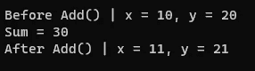
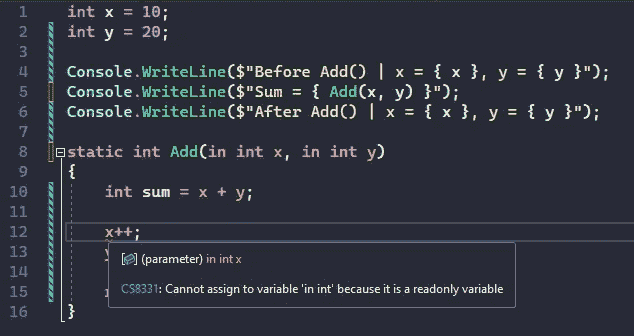

# C#参数修饰符:ref，in，out，params

> 原文：<https://medium.com/codex/c-parameter-modifiers-ref-in-out-params-99742e89dca?source=collection_archive---------5----------------------->

## 使用修饰符更改默认的参数传递行为

默认情况下，参数通过值传递给函数。这意味着，如果我们不使用任何修饰符，数据的副本将被传递给函数。*到底是复制的*取决于参数是 [*值类型*](https://docs.microsoft.com/en-us/dotnet/csharp/language-reference/builtin-types/value-types) 还是 [*引用类型*](https://docs.microsoft.com/en-us/dotnet/csharp/language-reference/keywords/reference-types) 。

> *值类型通过值*传递*，而引用类型通过属性的引用传递*，但通过自身的值传递*。*

C#提供了一些参数修饰符来控制数据如何传递给函数。让我们看一个没有修饰语的非常基本的例子。

如果你不熟悉 C#或者不熟悉最新版本，这段代码可能会让你觉得很有趣。我使用了 [*顶级语句*](https://docs.microsoft.com/en-us/dotnet/csharp/whats-new/tutorials/top-level-statements) *来保持简洁明了。*

假设我们想将两个数相加，并在求和后递增这两个数。因为我们通过值传递数据，所以在函数内部修改 x 和 y 不会反映到其作用域之外的任何变化。

现在，让我们使用[*ref*](https://docs.microsoft.com/en-us/dotnet/csharp/language-reference/keywords/ref)*修饰符来传递对函数的引用。*

*注意第 5 行和第 8 行的 **ref** 关键字*

**

*因为我们现在通过引用传递这两个值，所以我们对函数内部参数的更改将影响调用者的作用域。*

*如果我们想通过引用传递数据，但使它成为只读的，该怎么办？我们可以利用 中的 [*修改器。*](https://docs.microsoft.com/en-us/dotnet/csharp/language-reference/keywords/in-parameter-modifier)*

**

*注意第 8 行的关键字中的**和第 12 行 x 下的红色曲线***

*这样，如果我们试图修改函数中标记为只读的数据，编译器就会产生错误。*

*让我们对代码做一些修改，使用 [*out*](https://docs.microsoft.com/en-us/dotnet/csharp/language-reference/keywords/out-parameter-modifier) 修饰符。这个关键字允许我们将一个参数作为引用类型传递，当一个函数返回多个值时会很有用。*

> *接受 out 参数的函数有义务在退出前赋予一个合适的值，否则我们会得到一个编译错误。*

*Add 函数中声明了 **out** 参数*

**

*在最新的 C#版本中，我们不需要在使用 out 参数之前声明它。我们可以在函数调用中声明它。*

*最后但同样重要的是，我们还可以使用[*params*](https://docs.microsoft.com/en-us/dotnet/csharp/language-reference/keywords/params)*修饰符将一个参数数组(相同类型的)传递给一个函数。我们既可以传递数组，也可以传递由逗号分隔的单个元素。**