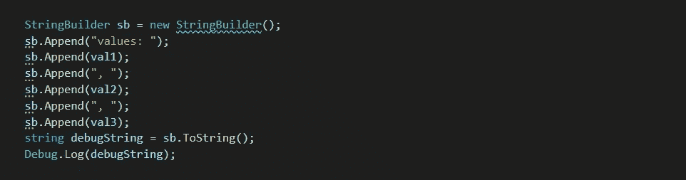

# C#字符串插值

> 原文：<https://medium.com/codex/c-string-interpolation-4c1b4462b1a4?source=collection_archive---------4----------------------->

你是 2021 年的 C#程序员。您需要构建比简单的 ToString()调用更复杂的字符串。

这篇文章将向你展示很多你可以这样做的方法，并以我认为是目前最好的解决方案结尾。

注意:本文一般适用于 C#。它也适用于。NET 时代，但是两者之间的转换取决于您。调试。你在这篇文章中看到的日志是 Unity 引擎的调试。日志。您可能会使用普通的 dot net——在这种情况下，您的日志记录可能会使用[控制台。WriteLine](https://docs.microsoft.com/en-us/dotnet/api/system.console.writeline?view=net-5.0) ，[系统。Diagnostics.Debug.WriteLine](https://docs.microsoft.com/en-us/dotnet/api/system.diagnostics.debug.writeline?view=net-5.0) 或者你那毫无疑问是华而不实的 ASP.NET API 中更奇特的东西。

假设你有这三个值，你需要把它们打印在一行上。

当您需要将这些值放入类似“values: 3，1，2”的字符串中时…

# 串并置

啊，经典。

你会因为这样的代码而遭受痛苦吗？

字符串串联，简短形式

还是这样？

字符串串联，长格式

看起来很快很简单，不是吗？

除了可读性和混乱的语法之外，还有一个重要的问题。

连接两个字符串需要[一次内存分配和两次复制操作](https://referencesource.microsoft.com/#mscorlib/system/string.cs,55b2f6374a7cf7c1)。图片中的代码片段？想想需要多少分配、复制操作和后续的垃圾收集。这是新的内存分配和每个连接的复制操作，加上最终的垃圾收集，这增加得很快！扔到垃圾堆里。

这种构建字符串的风格让人想起 20 世纪 80 年代的 BASIC 语言，那时我们在琥珀色屏幕上一行一行地输入程序，希望我们没有打错。如果你也来自那个时代，让我们一起花点时间意识到那是 40 年前，在我们回去对我们草坪上的孩子大喊大叫之前。

是的，我知道 [Fortran 77 在那之前有字符串连接](https://docs.oracle.com/cd/E19957-01/805-4939/6j4m0vn73/index.html)，我肯定有人能在 [Rosetta Code](https://rosettacode.org/wiki/String_append) 上找到一个更老的。重点是，可能是时候更新了。从那以后有了一些创新。

# StringBuilder

让我们来看看 90 年代和 21 世纪初的一些更高效的技术。

你已经听说过 [StringBuilder](https://docs.microsoft.com/en-us/dotnet/api/system.text.stringbuilder?view=net-5.0) 很好(*是*)，但是仅仅把几个值放在一起可能有点大材小用。

StringBuilder 使用得很好——VS 代码提醒我还可以改进

C#用。NET Framework 1.1，2002 年。

你们中的一些恢复 Java 编码的人会认出 2004 年 Java 1.5 中的 [StringBuilder，或者——如果你还有几根*白头发的话——1998 年原始 Java*](https://docs.oracle.com/javase/1.5.0/docs/api/java/lang/StringBuilder.html) 中的 [StringBuffer。](http://titanium.cs.berkeley.edu/doc/java-langspec-1.0/javalang.doc12.html#14461)

从 C++98 开始，C++在标准库中就有了一个名为 [std::stringstream 的类。仍然值得注意的是](https://www.cplusplus.com/reference/sstream/stringstream/stringstream/)[有一篇最小的维基百科文章](https://en.wikipedia.org/wiki/Sstream)。

StringBuilder 在初始化时完成大部分内存分配，当您调用 ToString()时。否则，当您调用 Append 时，它主要是将值*复制一次*到已经被占用的内存中，根据需要使用额外的“块”分配进行扩展。如果你对这类东西感兴趣的话，可以查看一下来源。

# 复合格式

也许你已经通过[字符串尝试过](https://docs.microsoft.com/en-us/dotnet/api/system.string.format?view=net-5.0)[复合格式](https://docs.microsoft.com/en-us/dotnet/standard/base-types/composite-formatting)。格式。

复合格式——现在我们真正看到了 20 世纪 90 年代

更紧凑的版本

复合格式问世时非常好。它给了我们模板风格的字符串构建作为官方语言特性。当你用它来做一些不重要的事情时，感觉很笨拙，这会导致一些非常长的代码行，但是它就在那里，你不需要写或者找到一个字符串模板库。你可以使用格式化字符串，就像你在 String 中使用的一样。格式！

CPU 中的 SHL/SHR 电路是…轮班工作者吗？

这很好，直到你需要改变你正在做的事情。例如，如果您需要对值重新排序，或者在字符串中间插入新值。现在，您正朝着在 API 中不经意地创建 bug 的方向前进。处理这些争论会成为一个明显的精神负担。

对了，[串串。Format 在幕后使用了 StringBuilder。](https://referencesource.microsoft.com/#mscorlib/system/string.cs,bdf91919a8d3537e,references)

# 字符串。加入

你可能听说过使用[弦。Join](https://docs.microsoft.com/en-us/dotnet/api/system.string.join?view=net-5.0) 也可以将对象列表转换成字符串。对于特定的用例来说，这是一个优雅的工具。它的历史和 StringBuilder 一样长。

最初，你可以连接字符串数组，仅此而已。

全世界的人们，加入弦乐团

人们编写了一些[聪明的自定义变通办法](https://stackoverflow.com/a/3610795/691749)来支持加入其他类型。

字符串。Join 在 2010 年接受了将通用对象连接在一起的支持。NET 框架 4.0。(Unity 直到 2017 年才会获得支持。)

全世界的人们，加入进来

[弦。Join 在幕后做自己独特的事情](https://referencesource.microsoft.com/#mscorlib/system/string.cs,06d13c9cb8b83f5d)。

# 字符串插值

既然我们已经看到了所有的老方法，让我们看看在 2021 年写这篇文章时还不到 10 年的东西。

字符串插值已经存在一段时间了。多久了？它是由 C# 6 在 2014 年推出的[，这是与。NET Framework 4.6 / CLR 4，对早期版本](https://docs.microsoft.com/en-us/dotnet/csharp/whats-new/csharp-version-history#c-version-60)的[有限支持和警告。NET 框架。Visual Studio 2015、Visual Studio 2013(通过一个插件)和 Unity 2017 对其提供了本机支持。当时，](https://stackoverflow.com/a/28921749/691749) [Unity 称他们 2017 年的 C# 6 支持为“实验性”](https://blog.unity.com/technology/introducing-unity-2017)，你必须手动选择。NET 4.6 来使用它。

是啊是啊。无聊的历史课，我说的对吗？关键是，它已经存在了足够长的时间，应该有更普遍的用途。

您希望您的弦乐作品变成这样吗？

字符串插值的两种方式:新的热点

这被称为字符串插值。敏锐的读者可能会说“嘿，这看起来像其他语言的模板。”你基本上是对的！

但是，它不是一个简单的特定字符串函数的包装器。有一篇关于编译器在幕后做什么的好文章，但是它的美妙之处在于你不需要关心它是如何工作的。

我将总结并给出几个真实的例子。文档中有一个不错的[教程。还有一个](https://docs.microsoft.com/en-us/dotnet/csharp/tutorials/string-interpolation)[参考，里面有所有血淋淋的细节](https://docs.microsoft.com/en-us/dotnet/csharp/language-reference/tokens/interpolated)。

要告诉编译器您想要在字符串上进行插值，只需在开始的双引号字符前加上一个$字符。重要的是两个角色之间没有任何东西。好吧，除了在 C# 8 和更高版本中可能有一个@之外，因为这样你也可以做内插的[逐字字符串](https://docs.microsoft.com/en-us/dotnet/csharp/language-reference/tokens/verbatim)。

在插值字符串中，您可以在花括号中命名变量和属性，如{myVal}，这样您的代码可读性会更好。如果你在字符串中需要一个花括号，你必须把它加倍，作为一种转义机制，因为单个花括号现在有了特殊的含义。

你不仅仅局限于变量或属性。您可以将任何值表达式放在花括号内。函数调用，数学表达式，你能想到的——只要它有值，它就能去那里。您甚至可以像使用 String.Format 一样进行格式化

有时候你只对一小块圆周率感兴趣

它将使用默认的 ToString()方法来转换对象，所以要确保这些方法是正确的。如果你需要通过代码获取一个值，比如用一个三元运算符，你也可以这样做…虽然不是很可读，但是请继续。请在您的代码中留下注释，以便下一个人/您以后维护它。

你能写出好的、简洁的代码吗？你当然可以。你是专家。

# 何时避免

这对调试和格式化来说是一个巨大的福音，它帮助我们克服了程序员的第一个也是最重要的美德:懒惰。

这可能很诱人，但是 ***永远不要*** 使用字符串插值来处理**未净化的用户输入**用于参数化 SQL 查询、汇编命令行或 API 调用，或者其他任何真正需要净化的事情。有此意图的用户很容易造成缓冲区溢出。

这个建议适用于任何字符串操作，但是值得重复一遍:**总是净化用户输入。**

# 表演

我听到你问:“性能怎么样？”

它足够快，如果我想让任何东西更快，我会在我的游戏开发和数据处理目的收益递减的错误一边。它和 StringBuilder 一样好。

你想要基准？客观证据？非常好。请查看:

*   [本文针对许多不同的字符串构建方法进行了基准测试](https://dotnetcoretutorials.com/2020/02/06/performance-of-string-concatenation-in-c/)
*   [本文针对串联、StringBuilder 和 String 对其进行了基准测试。格式](https://koukia.ca/string-interpolation-vs-string-format-string-concat-and-string-builder-performance-benchmarks-c1dad38032a)
*   [此文字记录将其与字符串进行比较。格式并提出更有效的使用方法](https://stackoverflow.com/a/63904747/691749)

# 记录器

如果您使用第三方日志程序，还有一些替代方法。马上想到的是 Serilog。如果您正在构建一个 ASP.Net 应用程序，您可能应该使用它的 enrichers，如果不是类似的东西。

# 感谢阅读！