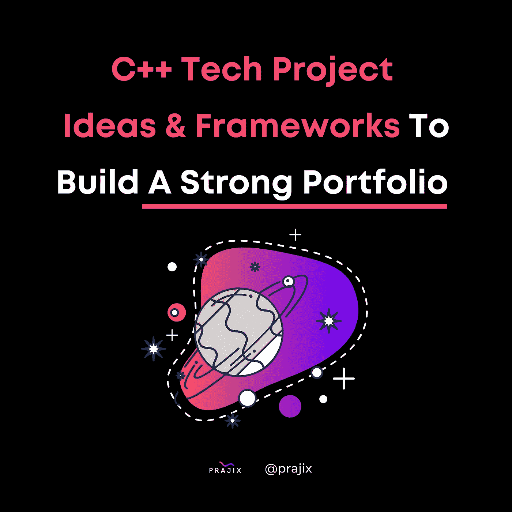

# 构建强大投资组合的 C++技术项目理念和框架

> 原文：<https://medium.com/codex/c-tech-project-ideas-and-frameworks-to-build-a-strong-portfolio-889dd6bf805f?source=collection_archive---------5----------------------->

C++是一种多用途编程语言，主要用于创建操作系统、视频游戏、数据库和浏览器。

以下 C++项目旨在帮助您展示 C++的创造力和精确性。

让我们开始吧！

**3D 渲染器**

框架:Urho3D

Urho3D 是一个成熟的框架，集成了输入、声音、物理、资源加载等功能。API 是高效设计的，引擎提供了 50 个展示独特功能的不同示例。

**汽车模拟器**

框架/类:燃料表类，里程表类，

FuelGage 类模拟了一个真实的 fuelgage，就像你在汽车中看到的那样。它会跟踪并报告油箱里还剩多少油。里程表类记录你的汽车行驶了多远。

**摄氏到华氏转换器**

科学计算应用总是展示你的数据/数学能力的有效方式。

源代码:[https://github . com/pontes da/Portfolio/blob/master/farenheitcalculator . CPP](https://github.com/pontesda/Portfolio/blob/master/farenheitCalculator.cpp)

**赌场号码猜谜游戏**

框架/库:cstdlib

这个应用程序的目标是创建并运行一个代码，要求你在吃角子老虎机式游戏中下注并猜一个数字，如果用户猜对了，那么他们就赢了钱。如果猜错了，他们就会输钱，直到输光为止。

**人脸检测 App**

框架/库:OpenCV 库

展示你对 AI/ML 的熟悉程度的一个很好的方式就是通过面部检测 app。这是一个有趣的中级项目。点击查看源代码[。](https://github.com/elador/FeatureDetection)

**信用卡验证器**

框架:Luhn 算法

这是 Visa、Master Card 之类的公司常用的有用 app。Luhn 算法确认信用卡号是否有效以及它是什么类型的卡。

源代码:[https://github . com/karan codes/信用卡验证器/blob/master/信用卡验证器. cpp](https://github.com/karancodes/credit-card-validator/blob/master/credit-card-validator.cpp)

**直升机游戏**

还记得 7 年级坐公交车回家时，每个人都在玩当时流行的手机应用程序吗？那么你可能还记得 Jetpack Joyride。直升机游戏是同样的概念。您可以使用 SDL 图形创建玩家界面，并设计一个使用键盘控制直升机高度的程序。

源代码:[https://github . com/karan-Khan na/Helicopter-Game/blob/master/HELI _ C-1。CPP](https://github.com/karan-khanna/Helicopter-Game/blob/master/HELI_C-1.CPP)

**其他资源**

如果我们没有用这些有趣的项目想法来激发你的兴趣，我们实际上策划了 10 个额外的技术项目想法，这些想法非常简单，今天就可以开始工作！[点击这里](/codex/ten-simple-tech-project-ideas-to-get-started-on-19ae9b3542ca)查看我们的名单。

**更多信息:**

[https://pontesda.github.io/Portfolio/](https://pontesda.github.io/Portfolio/)

[https://hackr.io/blog/cpp-projects](https://hackr.io/blog/cpp-projects)

[https://www . Reddit . com/r/game dev/comments/fzsh 5y/what _ c _ 3d _ renderer _ in _ 2020 _ for _ a _ small _ hobbyist/](https://www.reddit.com/r/gamedev/comments/fzsh5y/what_c_3d_renderer_in_2020_for_a_small_hobbyist/)

[https://coders packet . com/credit-card-validator-in-c#:~:text = It % 20 实现% 20Luhn %算法，使用% 20% 20 2B % 20 2B % 20 编程% 20 语言](https://coderspacket.com/credit-card-validator-in-c#:~:text=It%20implements%20the%20Luhn%20algorithm,using%20the%20C%2B%2B%20programming%20language)。

**什么是 Prajix？**

对你来说，掌握编码世界的最好方法是把这个世界放在你的指尖。我们的使命是让世界各地的开发者通过在线协作来彻底改变我们希望拥有的未来。

我们允许开发人员在我们的平台上创建或加入项目想法，他们可以在我们的协作室中找到志同道合的个人进行团队合作。

我们正努力将全世界最有价值的程序员、编码员和开发人员的网络集中到一个地方，创建一个技术发电站，帮助全球的个人和社区。

如果你对此感兴趣或者想了解更多，请访问我们的网站:[https://www.prajix.com/](https://www.prajix.com/)