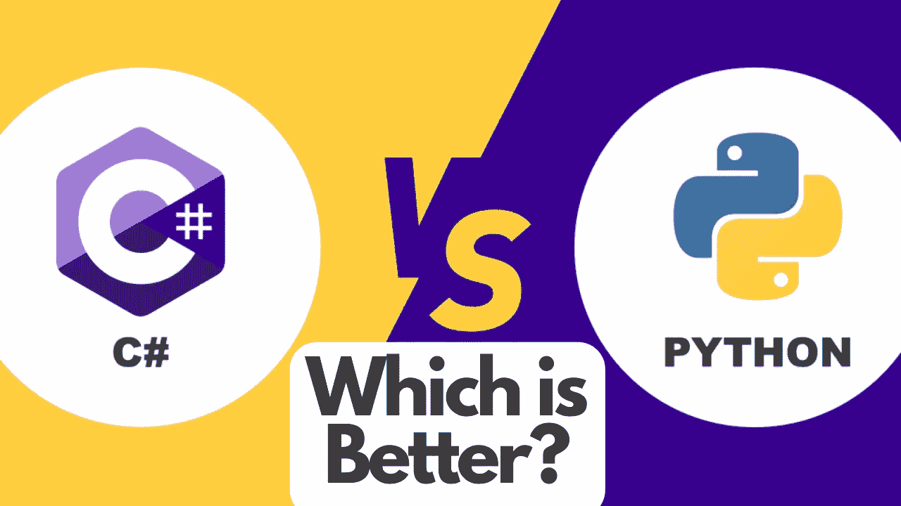
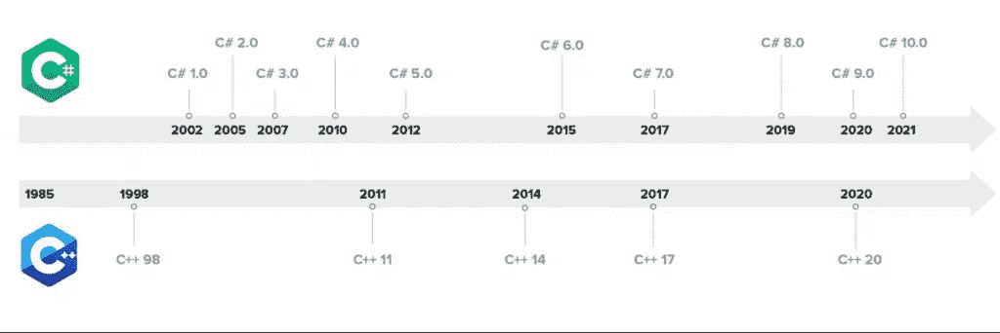
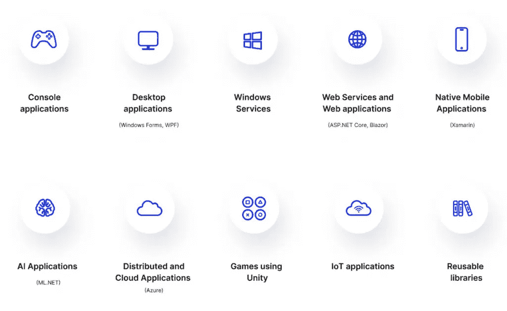
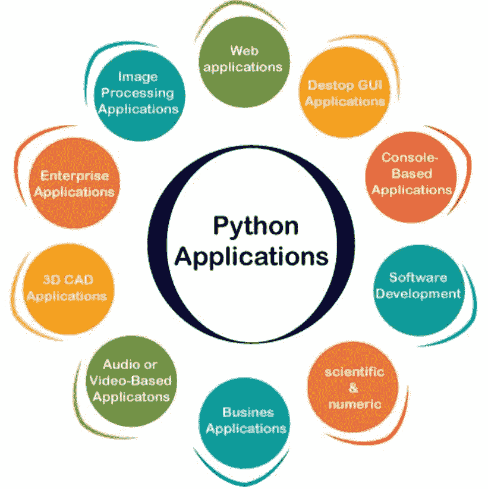

# C#与 Python——哪个更好！？！

> 原文：<https://medium.com/codex/c-vs-python-which-is-better-comparison-between-which-is-the-better-programming-language-168b9335c9cd?source=collection_archive---------6----------------------->

## 比较哪种编程语言更好！

C#和 Python 都是非常流行的语言，经常会出现这样的问题；哪个更好？

为了回答这个问题，我们需要了解这两种语言是什么，它们的好处，它们的用例，并让它们摊牌。

# 什么是 C#:

C#(读作“See Sharp”)是一种现代的、面向对象的、类型安全的编程语言。C#使开发人员能够构建多种类型的在. NET 中运行的安全可靠的应用程序。C#源于 C 语言家族，C、C++、Java 和 JavaScript 程序员会很快熟悉它。

# C#和 C++的历史:

# C#的优势:

●功能强大且高效

●面向对象的语言

●跨平台

●开源

● C #是类型安全的

●易于书写

# C#用例:

# 什么是 Python:

● Python 是一种解释性的、面向对象的、具有动态语义的高级编程语言。

●其高级内置数据结构与动态类型和动态绑定相结合，使其非常适合快速应用程序开发，以及用作将现有组件连接在一起的脚本或粘合语言。

● Python 简单易学的语法强调可读性，因此降低了程序维护的成本。

● Python 支持模块和包，这鼓励程序模块化和代码重用。

Python 解释器和广泛的标准库在所有主要平台上都可以免费获得源代码或二进制形式，并且可以免费分发。

# Python 的优势:

●易于学习、阅读和书写

●高效

●动态类型

●免费和开源

●图书馆支持

●便携性

# Python 用例:

# 最终想法:

●简而言之，C#和 Python 都是高级的，面向对象的，而且

简单易学的语言。

●两者都保证快速开发和良好性能。

● C#更清晰，更有条理，运行时快很多。

● Python 比 C#更容易学习和编写，并且有大量的标准库。

# Python 的独特使用案例

●数据分析

●数据可视化

除了以上两种语言，这两种语言都提供了开发各种软件需求的方法。

# StartupHakk:

无论是做一些专门的业务流程。我们专门让这些专家进入他们的领域，教他们如何开发，教他们成为全栈开发人员。你将会得到的是，你将会得到一个既能成为全栈开发者，又能成为其领域专家的人，我们认为这最终将会是， 最好的混合体之一，真正成为企业界的最佳利益所在，他们可以让这些专业人士成为开发人员，这最终将帮助他们在他们的领域变得非常优秀，我认为这是我们将真正努力的专业之一，所以请确保您了解 startuppack.com。

这是一个很好的机会，我们刚刚开始启动我们的编码训练营，这样你就可以找到你所在领域的专家，教他们成为一名开发人员，然后开始构建和学习你所获得的所有这些最重要的技能。所以一定要去看看 startuphack.com 的。

这是一个很好的机会，我们刚刚开始启动我们的编码训练营，这样你就可以找到你所在领域的专家，教他们成为一名开发人员，然后开始构建和学习你所获得的所有这些最重要的技能。所以一定要去 startuphack.com 的[看看。](http://startuphack.com)