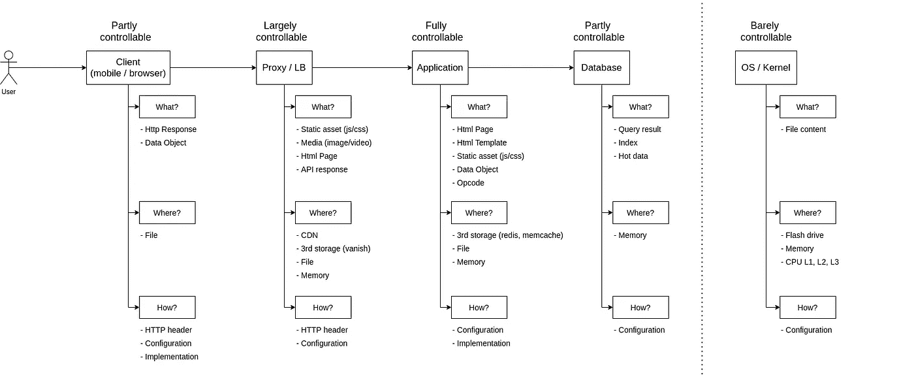
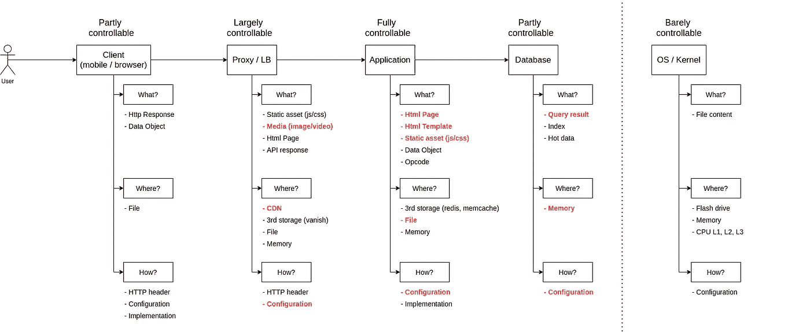
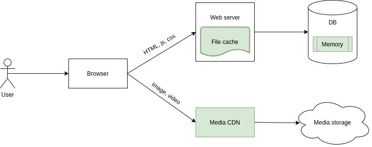
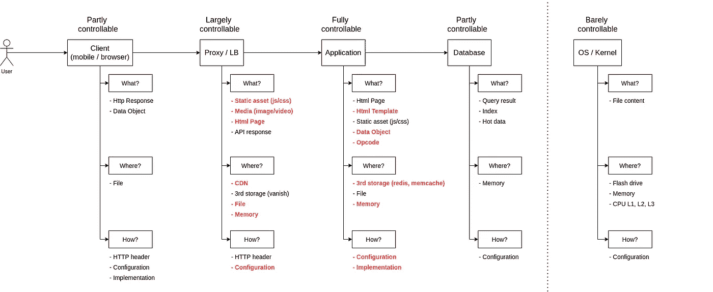
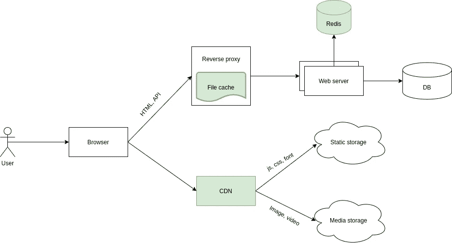

# 缓存——下一级开发人员的基本概念

> 原文：<https://medium.com/codex/caching-basic-concept-for-next-level-developers-889dd85ee6eb?source=collection_archive---------3----------------------->

缓存在拥有数百万用户的大型(和小型)系统的成功中扮演着重要的角色。这是一种技术或技能或任何你想称之为的东西，每一个开发者从后端到前端，从网络到移动，或从 ML/AI、区块链等新领域。应该意识到。在某种程度上，对于任何系统，总有某些组件在进行缓存。这可能出现在像 CPU 的 L1 高速缓冲存储器这样的小东西中，也可能出现在像 CDN 这样的大型系统中，该系统广泛用于部署高流量需求的网站。

对于那些希望自己的背景更上一层楼的人来说，在谷歌上搜索数百万条结果只会让他们更快地放弃。你在哪里，你的水平如何，应该研究哪种类型的缓存，希望你能在这个系列中找到这些问题的答案。

# 0 级—基本概念

不管是什么，这些是其中的基本原则:

*   缓存就是保存/存档/ **存储**(你可以说出来)一个**耗时动作**的结果，以便让它更快地恢复(以便**重用**)。IMHO，这是对缓存最好的解释。如果不了解这个原理，就很容易不知所措，甚至把缓存误解为 Redis(？？？)，RAM(？？？).只要把粗体字记在心里，就没问题了。
*   通常以键值的格式表示(因为在键值数据结构中查找数据只需要 O(1))。我敢打赌，您知道代码、键值数据库(Redis、Memcache)或文件(以名称作为键)中的 hashmap。
*   缓存的基本操作是获取(通过键)、设置(通过键)和删除(通过键)
*   一个值通常与一个名为 TTL(生存时间)的参数一起存储在缓存中。此参数指示从高速缓存中删除值以刷新高速缓存并释放高速缓存大小的到期时间。
*   缓存的一个常见问题是**过时数据**，即数据与原始数据不一致。

我们需要考虑以下因素来决定是否需要缓存:

*   时间或资源消耗
*   结果可以重复使用多次

在做任何决定之前，记住这两点。举个例子，

*   从数据库中获取数据需要 500 毫秒，但是对于来自一个没有人感兴趣的网页的一个请求=> **还没有缓存**
*   构建一个 CSS 代码需要 100ms，但是所有用户都需要加载= >是的，**你需要它。**

## **大图**

典型的支持缓存的系统

如您所见，一个常见的应用程序有 4 个主要层:客户端、代理、应用程序和数据库。每一层都有相应的缓存系统，我们可以监控不同的级别。请注意，在操作系统/内核级别有一个缓存层，这超出了我们(应用程序开发人员)的范围。

**客户端**:这一层实际上来自终端用户设备，即手机 app、浏览器。这里，缓存只有一个目标——提高用户体验的质量。因此，应该缓存什么以及缓存多长时间的问题是为了改善用户体验，而不是系统。

在这一层，我们可以通过以下方式在一定程度上控制缓存

*   设置 HTTP 头以控制请求的缓存(不确定)
*   配置库的缓存 HTTP 请求
*   使用本地存储实现缓存

请注意，任何对缓存的调用都可能会耗费时间/资源，并且很难排除故障。

**代理**:在最终用户的请求到达应用程序之前，这些被认为是中间层。它们可以是 CDN、反向代理、网关等。这一层的缓存主要是针对大量用户的静态内容。

在这一层，我们可以通过以下方式管理缓存

*   设置 HTTP 头以控制请求的缓存
*   在中间服务器上配置缓存 HTTP 请求。

虽然可以从缓存中自动获取数据，但这需要时间，并且在出现问题时依赖于第三方。

**应用**:对，应用缓存。它适用于来自大量用户的动态内容。

我们通过以下方式完全控制缓存

*   配置现有插件或插件
*   甚至从头开始实施

通过完全控制，我的意思是我们可以决定缓存什么，在哪里，因此有知识来修改，定制以及故障排除。这一层的缓存对最终用户是透明的，并且不太依赖第三方。

**数据库**:用于检索数据。

作为数据库用户，数据库实际上是一个黑盒，并根据提供者推荐的参数进行优化。您可以做的包括:

*   配置查询缓存
*   配置内存使用

**OS/Kernel** :这一层驻留在整个系统的任何地方，用于数据处理操作。

通常，作为开发人员，我们无法控制操作系统如何使用内存来缓存东西。优化操作系统/内核缓存与微优化有关，在大多数情况下，我们并不真正关心。

# 第 1 级:具有单个服务器的整体网页

或许，您可能像我一样，从老派的应用程序开始您的旅程:单块的，在单个服务器上运行，呈现 HTML 数据，等等。让我们回顾一下这一级别的一些要求:

*   主要是新闻、帖子、支持 CRUD 的应用程序，它们可以通过使用 WordPress、Joomla 等框架自行实现或部署。
*   HTML 和数据是从 web 服务器呈现的，而不是使用 React 或 Vue 这样的新型 JS 框架。
*   HTML 模板，静态 JS，CSS 存储在 DB 中或使用视图引擎。
*   通常是现有的系统，因此重用现有的东西，即代码，并减少系统修改是很重要的。
*   关注单个用户的体验，而不是扩展系统。
*   少量数据

以下是降低应用程序速度的因素

*   在对数据库运行 10–50 次查询后，可以呈现一个 HTML 页面，延迟时间为 2–3 秒。
*   加载图像、视频等媒体数据需要时间，因此页面会“空白”大约 2-10 秒。

我在下图中突出显示了可以优化的项目。

具体来说，

**1。启用数据库中的查询缓存**

像 MySQL、PostgreSQL 这样的 RDBMS 数据库提供了一种内置机制来缓存查询结果，并且可以作为一种配置来启用。你可以用谷歌搜索每种类型的数据库缓存，比如说 **< db-name > cache。**

在这一级别的应用程序中，不仅在不同用户的请求之间，而且在单个用户请求的单个页面的不同部分之间，查询都被高度重用。这可以使用数据库的查询缓存机制来管理。

考虑数据库缓存的另一个因素是您的数据大小。如果它很小，并且可以完全驻留在数据库的 RAM 中，那么查询缓存就足够了。

例如，要启用 MySQL 缓存:

> Maria db[(none)]> SET GLOBAL query _ cache _ type = 1；查询正常，0 行受影响(0.00 秒)

**2。按文件启用缓存 CSS、js、HTML 模板**

使用文件作为包含从数据库渲染的数据的零件的缓存。

**优点:**

*   没有依赖性，可以在任何应用程序上完成。
*   由 WordPress 或 Xenforo 等框架完全支持，以加速页面加载。你需要的只是启用它，这很容易做到。

**3。通过文件缓存整个 HTML 页面或部分页面**

WordPress，Xenforo 都有插件来做这个。使用视图引擎的框架也支持 HTML 格式的缓存结果。

> 常见的误解是低估了使用文件缓存的重要性，认为磁盘 IO 很慢(比如，与 Redis 相比)。记住，如果 Redis 运行在它自己的服务器上，那么那将是在**磁盘 IO 本地文件**和**到服务器 redis** 的网络通信之间(不是磁盘 IO 对内存)。

例如，在 Laravel 中缓存整页的方法如下:

**4。使用 CDN 提供媒体服务**

您可以将视频、图像等媒体文件上传到 CDN(内容交付网络)上。CDN 基本上是一个根据地理位置的缓存系统，使美国或越南的用户能够以低延迟访问这些媒体文件。这些因素会显著影响用户的应用体验，因此需要从一开始就单独考虑。

为了将 CDN 用于媒体内容，您需要:

*   将媒体文件上传到单独的系统或使用不同的路由到不同的域。一种选择是将它们部署在 AWS S3 上。
*   配置 CDN，即 Cloudflare，以提供媒体文件

有很多类似 S3 的存储提供商供你选择，比如 AWS、GCP、数字海洋。

# 第 2 级:具有多个服务器的整体网页

在这个级别上，您可能会看到系统中有多个服务器，并且相同类型的应用程序有更多的流量负载。现在，缓存还需要提高系统的响应能力，同时可以将页面加载时间减少到比级别 1 稍低一点。

这些应用程序的一些共同特征包括:

*   运行在多个服务器上，因此需要考虑使用缓存导致的数据差异。
*   高流量负载要求集中缓存整个页面，以减少应用程序和数据库层的负载。
*   对于一个没有很好配置的数据库，有大量的数据
*   代理或负载平衡器的存在。

具体来说，

**1。使用第三存储缓存数据对象 và HTML 模板**

数据库的查询缓存有锁定限制，会降低整个数据库系统的性能。因此，我们从数据库中移出，在应用层对数据进行缓存。由于应用程序在多个服务器上运行，我们通过使用共享缓存系统更加重视数据完整性。特别是，我们在单独的服务器上使用 Redis/Memcache，而不是在每台服务器上运行缓存文件。

我们专注于缓存

*   HTML 模板(用于基于模板的系统，如 Laravel blade)
*   数据对象，即查询结果、HTTP 结果

> 如果我的应用程序中有很多这样的对象，我应该缓存哪些对象？考虑前面提到的两个问题来决定:I)时间或资源消耗，以及 ii)结果可以重复使用多次。

示例:

**2。使用内存的缓存操作码**

这仅适用于像 PHP 这样的解释型语言。启用缓存操作代码可以显著提高具有大型代码库的应用程序的性能，并且可以减少发送请求的时间。

你可以用关键字“opcache”来搜索这个选项。

**3。使用 CDN 缓存静态资产**

我们将 CDN 用于静态内容，如 CSS、JS、字体等。为此，我们需要:

*   将 CSS、JS 从动态内容分离到静态文件中
*   通过 querystring，file hash 等实现 CSS，JS 失效的机制。如果需要的话。
*   配置 CDN 为静态文件服务。

**3。在反向代理上缓存整个页面**

我们使用反向代理如 Nginx，HAproxy 来缓存整个 HTML 页面。我们所做的是

*   确定哪个部分对所有用户是静态的，哪个部分对每个用户是动态的。动态的可以用 AJAX 调用，静态的完全缓存。
*   配置反向代理以缓存 HTML 响应。

该解决方案在代理层阻止了来自最终用户的请求，并减少了应用程序的负载。对于基于 posts 的系统来说，这是一种重要而有效的方法，因为它既能改善用户体验，又能对大量流量做出响应。

使用 Nginx 配置缓存的示例

# 结论

我就写到这里吧，这样你就能有时间消化一下了。当实现一个大规模系统时，我会用另外 2 到 3 个级别的缓存来回答你。

# 承认

我想对光明(又名明孟门)允许翻译他的[原文](https://viblo.asia/p/caching-dai-phap-1-nac-thang-len-level-cua-developer-V3m5WdO8KO7)表示我的感谢。