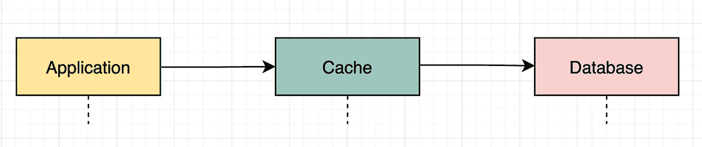
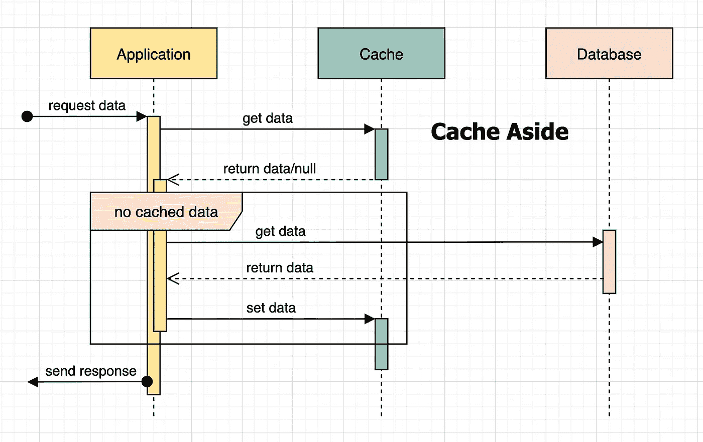
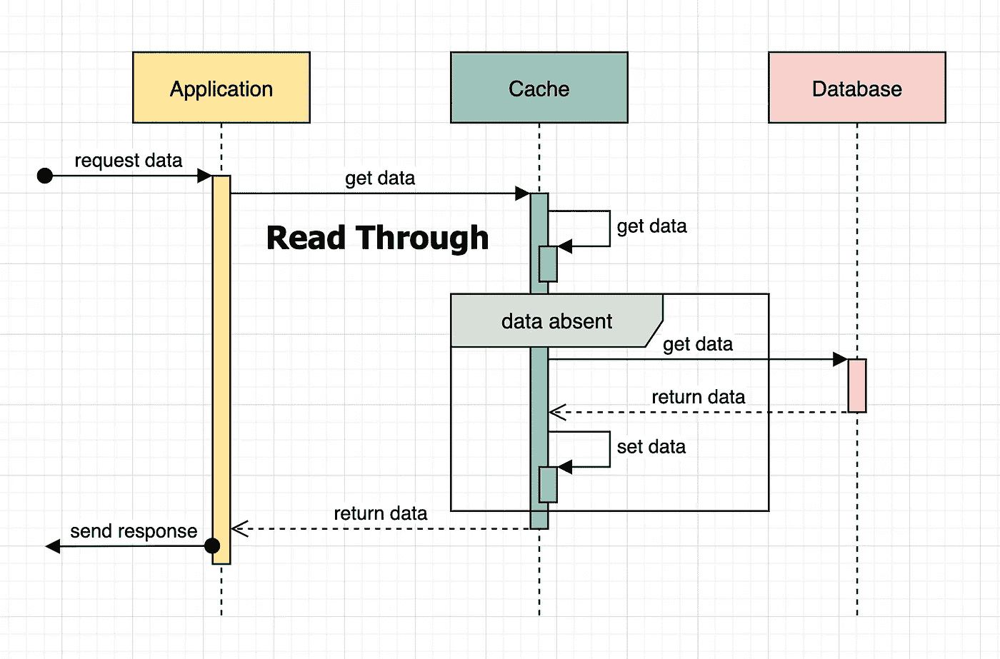
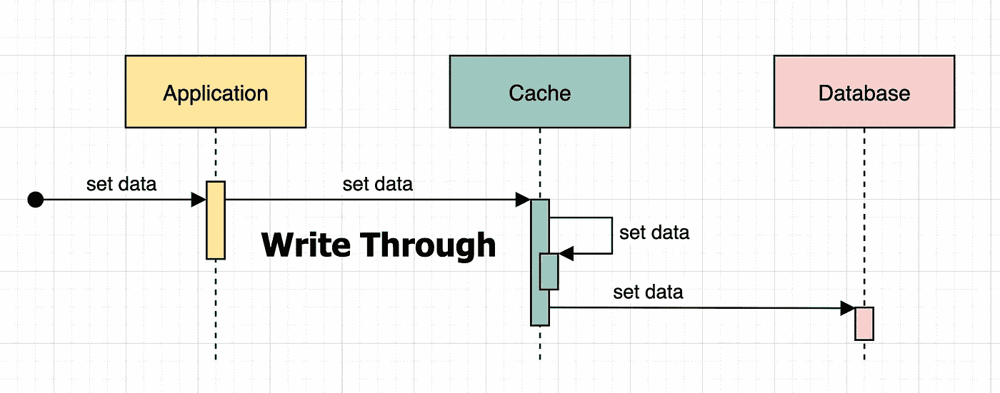
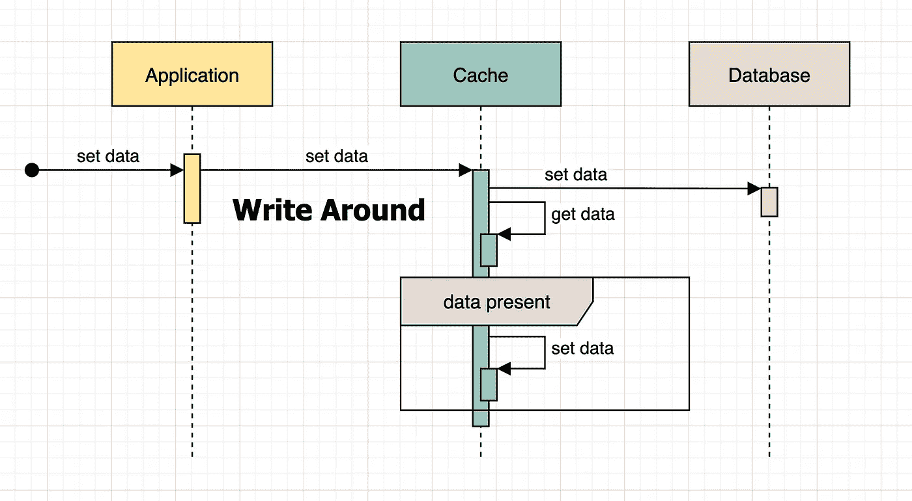
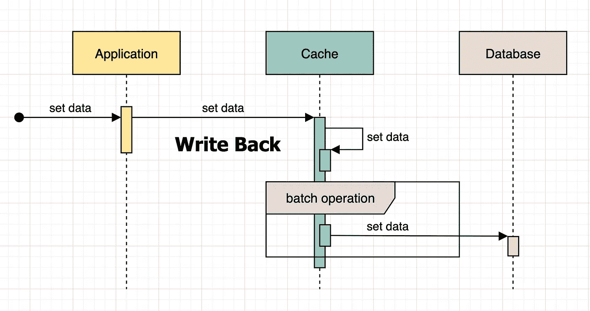

# 缓存—快速响应

> 原文：<https://medium.com/codex/caching-for-quick-response-s-d164e130a131?source=collection_archive---------7----------------------->

大规模数据系统通常会收到多个获取数据的请求。这些数据可以存储在内存中，并在需要时随时检索，而不是使用数据库。如果这些数据本质上是可变的，那么它在内存中的版本很快就会过时，可能需要更新。

> 为了保持内存和数据库中数据的最终正确性，两者应保持同步。

有多种方法可以使这两个数据存储保持同步，并通过确保数据不陈旧来确保依赖于存储在缓存中的数据的应用程序做出正确的决策。下面描述了一些广泛使用且易于识别的模式。

# 缓存在一边

当使用**缓存在**旁边时，只有当数据不在缓存中时，才从数据库中提取数据；并且随后也被推送到高速缓存，以确保对相同数据的新读取请求的快速访问。

> 当使用**缓存备用**策略时，应用程序享有对数据访问和存储的完全控制。

如果有适当的缓存失效机制作为补充，缓存和数据库将与该策略保持完全同步。它非常适合读取量大的应用程序，在这些应用程序中，很少对数据库进行新的写入操作。

# 通读

**通读**策略将控制权从应用程序转移到缓存提供商。当应用程序请求数据时，缓存提供者必须返回数据。在缓存未命中的情况下，缓存提供者从数据库中检索它，更新缓存并将其返回给应用程序。**通读**策略适用于读取量大的应用。

# 直写

**直写**策略将控制权从应用程序转移到缓存提供商。写入新数据的请求被发送到缓存提供程序，缓存提供程序将数据添加到缓存中，随后也添加到数据库中。在使用“直写”策略时，数据一致性仍处于检查状态，但它也会将每次写入应用到缓存中，这是许多应用程序的过度使用，尤其是那些写入量大的应用程序。

> 根据实施情况，如果没有基于时间的驱逐机制，该策略可能还需要等效的存储。如果建立了驱逐机制，**读通**策略可以有效地补充**写通**并提供更好的数据一致性。两者都由缓存提供商控制，一个负责读取，另一个负责写入。

# 四处写

**绕写**策略是对**直写策略的扩展，**只有当缓存中存在该数据的先前版本时，缓存中的数据才会更新。

> 与**读通**一起使用的**写绕**策略是一个很好的选择，因为它提供了一个很好的机制来管理缓存无效和更新，这是**读通**中所缺少的。

# 回复

**写回**策略是**写通**的另一个扩展，不同之处在于数据是如何以批处理和机会方式被推送到数据库的。数据会立即存储在缓存中，但只有在一批写操作准备就绪时才会被推送到数据库。

> 与缓存相比，数据库中的一些数据不存在或过时，只有在数据库更新时才能被视为一致。如果在数据库上执行批量操作之前缓存关闭，也会有丢失一些数据的风险。

# 写入无效

当数据库中的数据更新时，**写无效**策略删除缓存条目。它通过管理缓存失效过程来补充**缓存备用**策略。duo 可以一起使用，以确保数据在两个数据存储中最终保持一致。

很大程度上取决于数据是如何被访问的？谁在访问它？从哪里来的？虽然使用像**读通**和**写通**这样的策略消除了编写 boiler plate 代码的需要，但它们也限制了应用程序对数据管理的完全控制。另一方面,**缓存备用**策略为应用程序提供了更多的控制，同时从开发的角度来看需要执行更多的工作。

有时需要应用验证，验证哪些数据可以从缓存中存储和访问，以及由谁来访问。还可能需要在缓存中以多种格式存储相同的数据。在这种情况下，最好将控制保持在应用程序级别。

在缓存中保存同一数据的多个版本也是有可能的，也有一些用例。虽然有些缓存实现提供了现成的这种功能，但其他实现需要包装器来完成。我们将在另一篇文章中更多地讨论它，因为它需要自己的讨论。