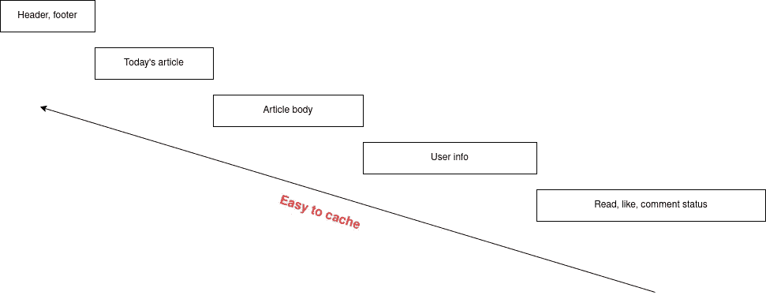

# 缓存—如何以适当的方式进行

> 原文：<https://medium.com/codex/caching-how-to-do-in-a-proper-way-6e40693d74d2?source=collection_archive---------5----------------------->

**缓存很容易**，不开玩笑。任何人看了 10 分钟教程都可以。就像一个 3 岁的孩子可以用笔画东西一样(我说的东西，实际上什么都不是)。**会画**跟**会画东西**不一样，绝对不会**会画很酷的东西**。**缓存**也是。

在[之前的文章](/codex/caching-basic-concept-for-next-level-developers-889dd85ee6eb)中，我解释了一些与缓存相关的基本概念以及在不同层次使用的不同技术。在这篇文章中，我试图通过一个具体的网络应用程序来帮助你自己找到 3 个主要问题的答案。

*   我们真的需要缓存这些数据吗？
*   如果有，在哪里？
*   多长时间？

# 首先

我们来看看下面这个 PHP:

这是最常见的缓存策略— **缓存放在一边**。它之所以常见，是因为它可以用于不同的应用程序，尤其是那些发出读请求多于写请求的应用程序。

旁边缓存策略的流程如下所示:

事实上，您可以在相当多的库、框架中找到该代码，并且由于其简单性，您可以轻松地将其克隆到您自己的代码中。这就是我在大学一年级时所做的——将这段代码放在任何有数据库查询的地方，以提高系统性能。事实是，当你的应用程序很简单，用户数量很少的时候，在任何时间任何地点缓存任何东西似乎都是有效的。我曾经以为缓存会自动让系统变得可伸缩，(或者完美)。

随着时间的推移，我意识到任意缓存策略对系统性能的贡献并不大。除了常见的问题，如磁盘满、内存不足(由于缓存许多东西)，它实际上需要各种技术来减少开销，而不是缓存。也就是当我后退一步，思考**什么时候缓存**、**什么时候缓存**、**哪里缓存**和**如何做**那。

关于这个问题的文献不多。是因为缓存太简单了，不能成为讨论的话题，也不能写成一本书？当然，你可能会找到 O'Reilly 出版的一些关于缓存技术的书籍，即通过 HTTP 头缓存 HTTP 请求。就我所知，我所说的“技术”是指没有任何关于方法论的讨论。

# 我们真的需要缓存这些数据吗？

当应用程序由于各种数据类型的存在而变得更加复杂时，这一点非常重要。我们应该缓存所有的 HTML 页面，还是缓存计算后的数据，或者从数据库检索的数据，或者共享的配置数据？

正如我在[上一篇文章](/codex/caching-basic-concept-for-next-level-developers-889dd85ee6eb)中提到的，我们需要考虑以下因素来决定是否需要缓存:

*   **时间或资源消耗:**即时间、CPU 使用率、磁盘 IOPS、网络带宽、文件描述符等。需要执行任务。如果需要重新执行任务，使用缓存有望减少时间或资源。
*   **结果可以多次重用**:即缓存的输出要重用。如果不是那么频繁，即 0~50%的命中率，那么缓存输出是没有效率的或无用的。

另外要考虑的是

*   **数据不一致的可接受水平**:即使满足上述两点，如果数据不一致，你可以接受吗？

## 自上而下分析

下图显示的是请求的详细信息/见解。上层实际上是下层的结果/输出。我们越深入，所需的延迟/资源就越低，数据重用就越频繁。

上图的自上而下的视图说明了我们对请求的深入程度，因为顶层的内容通常包括底层的内容。越深入，所需的资源/延迟就越少，数据的可重用性就越高。因此，我们的策略是:

*   **最好缓存系统顶层**:减少请求的处理时间，从而获得结果。
*   **尝试从底层“复制”一些属性到顶层:**比如，把静态数据或者共享数据带到顶层。

对于博客网站，应该是:

越深入，就越容易缓存数据，当然，缓存在请求处理时间方面的优势也会减少。根据流量要求以及数据错误/完整性的可接受阈值，我们有特定的缓存策略:

*   如果您的博客站点只有几次访问，那么在层站点配置或内容数据进行缓存就足够了
*   否则，我们可能会考虑缓存整个 HTML 或 body 页面，因为我们知道动态数据中的差异，比如*like*data。

**注意**从上到下有助于选择要缓存的特定层。缓存多个层没有害处，但会导致数据重复，而且可能没有必要，因为顶层的数据已经包含底层的数据。

## 左右分析

让我们从基于通用/特定特征(即共享/私有数据)的左右视图来看请求，即:

这样，为上述博客站点缓存的数据被分成不同的部分，即:

*   页眉、页脚(整个页面的配置数据)
*   今日热门文章(侧栏)
*   主要内容(正文)
*   当前用户信息(显示在右上角)
*   与当前文章相关的用户信息(阅读、喜欢、评论等。)

这些数据组件通常是独立的，可以根据数据特征单独缓存。采用左右分析方法使您能够确定哪个组件最需要资源、最高延迟、哪个组件最可重用。这有助于确定哪个组件需要被缓存。

*   如果加载在多个位置重用的主体需要 100 毫秒= >应该缓存
*   如果加载用户信息需要 120 毫秒，但并不经常需要，例如大多数用户是访客= >尚未缓存

# 如果是，我们应该在哪里缓存数据？

在这篇文章中，我将重点关注可用于缓存后端应用程序数据的位置。两种常见的方法是 I)在运行代码的服务器上缓存，以及 ii)通过网络远程缓存。

## 在服务器代码上

缓存数据有两种方法——内存和文件。

**内存(进程内)**:将数据缓存为应用进程的变量，如数组、哈希映射等。

*   不序列化而按原样保存
*   快的
*   对于用 NodeJS、Python、Java、.Net，主进程和请求间共享内存
*   适用于低延迟、高访问频率、小容量的数据。这类数据的延迟通常小于 1 毫秒。

例如来自数据库或 HTTP 端点的配置信息、所有请求的公共数据或从请求中提取的信息，即用户代理、令牌。

**本地文件**将数据以字符串/文本或二进制形式保存到服务器上的文件中。

*   连载
*   取决于本地磁盘速度，但通常很快
*   对于用 PHP 写的应用，没有主进程或者非共享内存。
*   在虚拟机上运行的应用程序，裸机
*   开发的早期阶段(开始缓存)或具有特定目的的后期阶段。
*   大数据或原生像 HTML，CSS，JS，图像，视频。

例如静态资产缓存、会话数据、完整的 HTML 页面、模板视图。

在部署代码的服务器上缓存数据可能是高效的，因为它很快。但是，对于作为几个实例或独立实例运行的应用程序，应该这样做。可伸缩性受限于节点的内存，在分布式(多节点)系统中，命中/缺失率方面的缓存性能可能会降低。

## 远程缓存

**远程内存存储:**这些是将数据直接缓存在内存中的第三方解决方案，如 Redis、Memcached 等。

*   可用于基本预定义的数据类型
*   取决于网络条件
*   适用于大多数应用
*   易于扩展而不会(或至少不会显著)影响性能，与代码服务器的数量无关。延迟要求通常在 1-10 毫秒之间。
*   高命中率，因为它与多个代码服务器共享缓存
*   由于 RAM 限制(以及大数据的网络瓶颈)，对于小数据项
*   生存时间值低的数据。

这实际上是最广泛采用的缓存解决方案，因为它满足了许多要求，可接受的速度和可伸缩性。但是**不要忘记**一件事:*即使它使用内存来存储数据，它也会遭受网络延迟*。

我们应该在远程内存存储上缓存哪种类型的数据？嗯，基本上你可以缓存任何类型的数据，除了 HTML 页面或大型数据。对于实时数据，我建议使用**内存**。

**远程磁盘存储:**这种方法选择在磁盘上或者在内存和磁盘上缓存数据。例如像 Aerospike、Hazencast 这样的键值数据库。

*   提供更多功能和更多支持的数据类型
*   比普通数据库更快，因为它们通常针对 SSD 存储进行了优化。
*   轻松扩展资源或节点数量，同时将性能保持在可接受的水平。
*   针对大数据或个性化数据(推荐、广告、跟踪、分析)
*   适用于要求高可用性、弹性、自动故障转移等的应用程序。
*   TTL 值高的数据。

## 减去

总的来说，我认为我们要的东西都可以归为以上四种储藏方法。如果您的应用程序很小，选择用于缓存的存储可能并不重要，也就是说，选择您手中的任何存储

*   对于解释语言，像 PHP 这样的非共享内存，我更喜欢本地文件**(如果运行在单个实例上)和网络内存存储**(比如 Redis/Memcached )(多个实例)****
*   对于 NodeJS、Python、Golang 这样的语言，可以尝试内存**和网络内存存储**和**。对于小的和常见的(高度请求的)数据，我会使用 in memory 和 Redis/Memcached otherwhise。**
*   **对于 Java，。NET，我会用内存中的**来利用处理复杂数据类型的能力以及强大的服务器能力。****

**但是，当您的应用程序必须处理大量流量时，它需要谨慎选择缓存位置。我可以分享一些建议:**

*   ****从数据访问的角度来看**:冷热搭配**本地缓存**，均匀分布搭配**远程缓存**。**

**热意味着被多次访问的数据，冷意味着相反(当然)。让我们考虑这样一种情况，我们使用 1 个密钥用于配置(热)，1 个密钥用于用户数据(冷)。如果我们使用像 Redis/Memcached 集群这样的分布式缓存，节点之间的数据分片会导致节点上的缓存不平衡。具有热项目节点将被更频繁地访问，而具有冷数据的节点则不会。因此，最好在内存中进行本地缓存，并在进程间进行复制。**

**均匀分布用于访问频率相等的项目，即每个用户一个键。如果我们在本地缓存，命中率/未命中率将会降低，因为数据需要在服务器上复制，而像 Redis/Memcached 集群这样的分布式远程缓存由于其分片和负载平衡能力而更加高效。**

*   ****数据量**:如果数据量小，可以提前确定，则为本地数据，否则为远程数据。**
*   ****性能**:本地明显比远程快:)**

# **多长时间？**

**这是最具挑战性的问题。在某些情况下，优化 TTL 值比决定在内存或 Redis 中缓存更重要。因为缓存数据的持续时间直接影响数据差异和性能。**

**让我们从命中率和**存储成本**的角度来看下面两张关于缓存 TTL 值的增加和**缓存性能**之间关系的图。**

****

*   ****增加高速缓存 TTL 将需要更多存储空间****
*   ****增加缓存 TTL 会以非线性方式增加命中率。**意思是在某些时候，提高缓存 TTL 并不能像预期的那样帮助提高缓存命中率。**

**另一个问题是数据完整性，我不知道如何通过图来说明，高缓存 TTL 值将更容易受到攻击。**

**实际上，如果不努力调整系统，就无法获得缓存 TTL 的最佳值。一些提示是:**

*   **将缓存 TTL 设置为尽可能高的命中率，即至少为 **85%** ，最好为 **> 90%** 。**
*   **增加缓存 TTL 会消耗存储资源。为了命中率从 88%提高到 90%，付出 3 倍内存大小值得吗？对我来说，不。**
*   **设置缓存 TTL 时应考虑数据的新鲜度。问问你自己，对于数据差异的敏感程度，你会感到舒服吗？**
*   **有时，缓存用于限制数据库中的查询。在许多情况下，5-10 秒的缓存足以避免数据库中热数据的峰值查询负载。**

**通常，我为后端应用程序设置的缓存 TTL 不会超过 1 天。1-30 分钟足够了(甚至很多)。如果缓存需要在那里超过 6 小时，我必须考虑实现使缓存无效的机制。**

> **注意:如果您可以控制缓存失效，那么您可以安全地增加缓存 TTL。**

**总结一下“多长时间”的问题:没有“一刀切”的解决方案，请**不要临时设置**(就让它这样吧)，继续监控**缓存命中/未命中比率**以及**存储大小**并进行调优。**

# **结论**

**到目前为止，我试图给你使用缓存的主要问题的答案:什么，在哪里，多长时间。在下一篇文章中，我将带您了解一些使用缓存和策略来解决(或至少减轻)后果时可能出现的问题。**

# **承认**

**我非常感谢光明(又名明孟门)允许我翻译他的原文。**