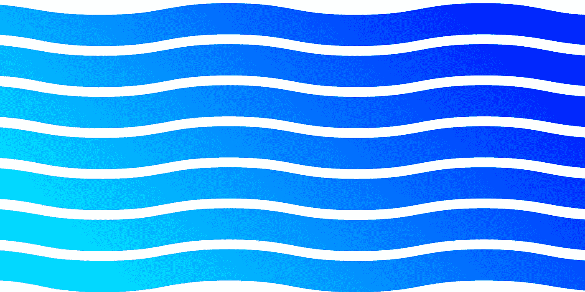

# CAGradientLayer 教程—如何使用 Swift 5 创建渐变

> 原文：<https://medium.com/codex/cagradientlayer-tutorial-how-to-create-a-gradient-with-swift-5-2817a393dad?source=collection_archive---------1----------------------->

# CAGradientLayer

CAGradientLayer 是一种 CALayer 类型，您可以在其中创建渐变。您可以使用任意多的颜色，并修改其他属性，如角度和位置。您可以使用它来创建应用程序背景的渐变或自定义按钮的外观。

# Xcode 设置