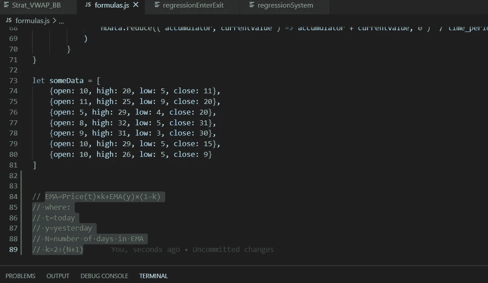

# 在 JavaScript 中计算指数移动平均值

> 原文：<https://medium.com/codex/calculating-the-exponential-moving-average-in-javascript-84dfea8d55cc?source=collection_archive---------0----------------------->

上周，我们开始用简单移动平均线在 JavaScript 中构建市场数据指标。我们还添加了帮助器公式 *extractData* 来快速返回我们想要在数据集对象上运行计算的数据键(即开盘价、最高价、最低价或收盘价)。今天，正如前一篇文章结尾所承诺的，我们将探索指数的计算…