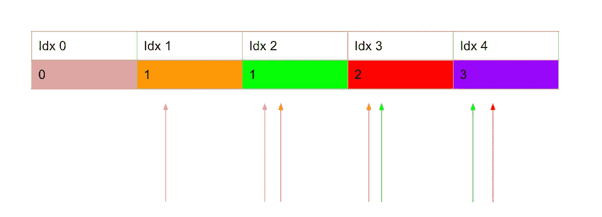

# 用列表法计算第 n 个斐波那契数

> 原文：<https://medium.com/codex/calculating-the-nth-fibonacci-number-using-tabulation-3a64a4dda71b?source=collection_archive---------1----------------------->

米卡·鲍梅斯特在 [Unsplash](https://unsplash.com?utm_source=medium&utm_medium=referral) 上的照片

除了是一个常见的面试问题，计算第 n 个斐波那契数是一个有趣的练习，因为有许多不同的实现方式，有实现一个解决方案。在我写的前一篇文章中，我演示了一种迭代方式，一种递归方式，然后我们修改了递归算法，以利用记忆化来降低指数级的运行时复杂性。如果你对这些技术不熟悉，你可以点击查看文章[。在这篇文章中，我想演示另一种使用制表来计算斐波那契的技术。在我们开始之前，我想提一下这个问题有不同的提问方式。有的面试官希望你从 0 开始，有的从 1 开始。此外，我见过一些面试官认为 N 是数组中的索引，而其他人认为 N 是元素的可视编号，意味着没有真正的第 0 个元素。对于本文，我们将从 0 开始我们的序列，我们也将第 0 个元素视为 0。](/geekculture/so-you-need-to-calculate-the-nth-fibonacci-number-b9ae9b70fc12)

# 什么是制表？

制表实际上是一种动态编程技术。描述起来非常简单，但要正确实现却很困难。从我的角度来看，这些不是你马上就能看到的直观联系，但是当你深入问题时，你可能会开始看到一个制表解决方案是如何产生的。就我个人而言，我会先用不同的方式解决问题，以确保你在进入列表解决方案之前完全理解它。所有的制表方法都是通过建立某种表格来解决问题。一旦表建立起来，在表中的某个地方，基于问题，我们将找到问题的解决方案，然后我们可以返回它。

# 将制表应用于斐波那契问题

计算第 n 个斐波那契数的问题可以分解成一些基本的数学步骤。假设我们从序列的前两个数字 0，1 开始。然后，我们可以很容易地通过将 0 + 1 = 1 相加来计算第三个数字。现在我们有 0，1，1。当然，下一个数字是 1 + 1，也就是 2。这应该很清楚，因为斐波纳契是通过将前面两个数字相加计算出来的。这是解决斐波纳契数列的全部基础。

显示价值观影响的图表，作者截图。

您可以看到图表中的每个值都有一种颜色。相同颜色的箭头试图显示这些值如何影响未来的值。在这里，我们可以看到，例如，第一个值粉红色会影响接下来的两个位置，依此类推。一旦我们成功到达紫色，我们就有了答案，3。从这个图中可以看出，对于我们迭代的每个值，我们应该把它加到前面的两个索引中。其实这就是制表，也是这个算法的正确解。让我们试着把它编码出来。

我们从搭建桌子开始。我们希望从零开始，以第 N 个位置结束，所以我们需要一个长度为 N + 1 的数组。此外，我们正在做一些加法，所以用零填充数组是有意义的。我们需要考虑我们的“基本情况”。我们说过我们将从 0 开始，所以它应该在位置 0，我们知道第二个数字是 1，这就是为什么我们在数组中将它设置为位置 1。最后一步是遍历整个表，对于每个索引位置，取存储在该位置的值，并与下两个索引位置的值相加。这是通过加法向前推动值来计算斐波那契，而不是传统的回头看最后两个计算值来计算下一个值的方法。一旦我们到达循环的末尾，我们现在只需要返回表中的第 n 个位置。这个斐波纳契数列的表格版本非常好。执行这个计算只需要 O(N)时间。请注意，我们检查以确保我们没有设置超出数组界限的值，因为这将导致无限循环。

# 结论

这只是制表的基本介绍。这个计算第 n 个斐波那契数的特殊版本，一开始可能看起来不太直观。一旦您查看了图表并看到了代码中的解决方案，您可以看到当我们遍历表时，制表是如何尝试构建函数调用的结果的，然后一旦我们完成了表的填写，我们只需返回正确的位置和正确的数字。