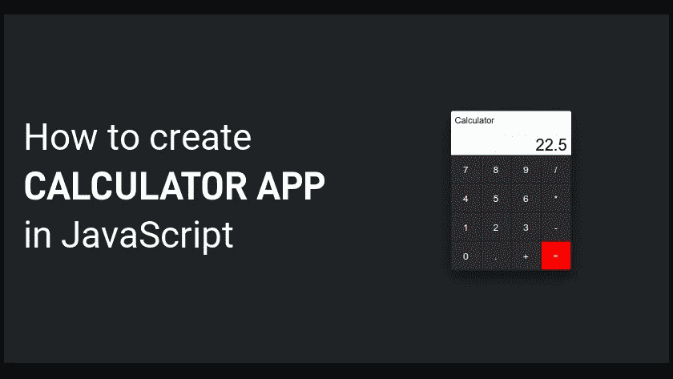
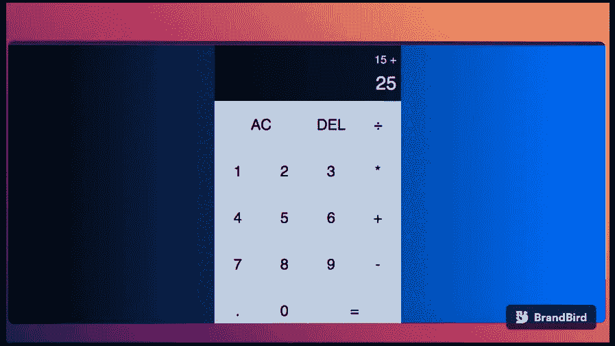

# 计算器:学习如何使用 JavaScript 构建一个现代计算器

> 原文：<https://medium.com/codex/calculator-learn-how-to-build-a-modern-calculator-using-javascript-9f0bda18ff8e?source=collection_archive---------6----------------------->



用 JS(Kebean)制作的现代计算器

你可能听说过，要想做得更好，你需要更多的练习。这是真的，因为通过有意识的练习，你发展了肌肉记忆。这就是**项目**出手的地方。项目是学习 **JavaScript** 的最好方式，计算器是最好的选择项目之一。计算器涵盖了与 **UI** 和 **JavaScript** 的所有复杂交互。

在这篇文章中，我将带你浏览使用**普通 JavaScript** 最佳实践和**现代 ES6** 实践构建一个完全现代的计算器的步骤

该计算器将能够:

*   加、乘、除和减运算
*   删除操作
*   清除所有操作
*   使用十进制数
*   连锁经营

**我们开始吧**

**项目设置** : *如何设置您的项目*

按照以下步骤设置您的项目:

*   创建一个名为“ ***项目*** 的新文件夹，并打开你的代码编辑器(例如:visual studio code)
*   创建****styles . CSS***和 ***index.js****
*   *链接 HTML 中的文件*

# *超文本标记语言*

*用一个类创建一个 **div** 。**计算器**会将所有东西包装在 body 标签内。*

*您还需要创建另一个带有类**的 **div** 。带有两个嵌套的 **div** 的输出**带有类**。前一操作数**和**当前操作数**分别在计算器屏幕
中显示前一操作数和当前操作数，如下所示:*

```
*<div class="calculator">
  <div class = "output">
     <div class="previous-operand"></div>
     <div class="current-operand"></div>
  </div>
</div>*
```

*接下来，创建计算器上从“ **AC** ”到“ **=** ”按钮的所有按钮*

*像这样:*

```
*<div class="calculator">
   <div class="output">
     <div class="previous-operand"></div>
     <div class="current-operand"></div>
   </div>
   <button class="span-two">AC</button>
   <button>DEL</button>
   <button>÷</button>
   <button>1</button>
   <button>2</button>
   <button>3</button>
   <button>*</button>
   <button>4</button>
   <button>5</button>
   <button>6</button>
   <button>+</button>
   <button>7</button>
   <button>8</button>
   <button>9</button>
   <button>-</button>
   <button>.</button>
   <button>0</button>
   <button class="span-two">=</button>
</div>*
```

*Ps:记住，你得包含**这个类。span-在“ **AC** ”和“ **=** ”按钮上的两个**，使它们稍后跨越两列。*

*注意，你可能很难得到“+”这个符号。如果是这样，你可以谷歌一下这个符号，复制粘贴。*

*到目前为止一切顺利。*

*HTML 部分到此为止，让我们跳转到 **styles.css** 并开始设置计算器的样式，让它看起来更漂亮。*

# *半铸钢ˌ钢性铸铁(Cast Semi-Steel)*

*在这里，您将添加 *CSS* 来样式化计算器。首先，让我们通过执行以下操作来移除默认的*浏览器样式*:*

```
*/** changing default styles of the browser **/
*{
    margin:0;
    padding:0;
    box-sizing:border-box;
}*
```

*接下来，您需要更改 body 元素的样式:*

```
*body{
   font-weight:normal;
   font-family:Gotham Rounded, sans-serif;
   background: linear-gradient(to right, rgb(0, 0, 0),rgb(0, 110, 255));
}*
```

*接下来，您需要通过选择**来设置屏幕样式。计算器**(包装所有不同的按钮和元素)类和样式*

*像这样:*

```
*.calculator{
    display:grid;
    align-content:center;
    justify-content:center;
}*
```

*哎呀！！好像不是垂直居中！！你可以通过给出**来解决这个问题。计算器**将整个高度分类，这意味着它将一直填充*高度的 100%* :*

```
*.calculator{
    /** previously written code **/
   min-height: 100vh;
}*
```

*好吧！！解决了这个问题，让我们继续设计**。计算器**类。为了让按钮看起来像计算器的按钮，你需要在这种情况下使用**网格模板行**和**网格模板列**。因此，我们让*列*重复 4 次，同时给它们 100 像素宽。*行*重复 5 次，同时给它们 100 像素宽，给它们 120 像素高的初始最小值，但最大值是 auto(本质上说；大到适合任何东西)*

*像这样:*

```
*.calculator{
    display:grid;
    align-content:center;
    justify-content:center;
    min-height:100vh;
    grid-template-rows:minmax(120px, auto) repeat(5,100px);
    grid-template-columns:repeat(4,100px);
}*
```

*然后，要正确定位按钮，您需要选择它们并添加以下样式:*

```
*.calculator-grid > button {
    outline: none;
    background-color:rgba(255, 255, 255, .75);
    font-size: 2rem;
    border: 1px solid #fff;
    cursor: pointer;
}*
```

*添加悬停效果:*

```
*.calculator-grid > button:hover {
       /** previously written code **/
    background-color:rgba(255, 255, 255, .9)
}*
```

*现在，让我们来设计一下**的样式。span-两个**类使“ **AC** ”和“ **=** ”按钮横跨两列:*

```
*.span-two{
    grid-column: span 2;
}*
```

*到目前为止还不错，但正如你在浏览器中看到的，**。输出**部分样式不正确。*

*为了解决这个问题，您需要对实际的**进行样式化。使用此技巧整体输出**:*

```
*.output{
    background-color: rgba(0, 0, 0, .75);
    grid-column: 1 / -1;
    display: flex;
    justify-content: space-around;
    align-items: flex-end;
    flex-direction: column;
    padding: 9px;
    word-wrap: break-word;
    word-break: break-all;
}*
```

*关于 CSS 的最后一件事是设计操作数的样式。前一操作数和**。当前操作数**。你能做到的*

*像这样:*

```
*.output .previous-operand {
    font-size : 1.5rem;
    color: rgba(255, 255, 255, .75);
}.output .current-operand{
    font-size: 2.5rem;
    color: #fff;
}*
```

*恭喜你。！你已经完成了 CSS。请休息一会儿，然后回来看有趣的部分，那就是 JavaScript。*

# *Java Script 语言*

*好吧！！让我们从最有趣的部分开始，编写 JavaScript 代码。要开始，首先你需要选择所有不同的数字，操作数和所有的按钮(清除按钮，删除按钮等)。为了更容易，您需要在 **HTML** 中添加**属性**，以便于选择。这很重要，因为你不需要用 javaScript 设计类的样式。这样做的代码片段是这样的:*

```
*<!-- Modifying the HTML by adding attributes to be able to select by. -->

<div class="calculator">
   <div class="output">
     <div data-previous-operand class="previous-operand"></div>
     <div data-current-operand class="current-operand"></div>
   </div>
   <button data-all-clear class="span-two">AC</button>
   <button data-delete>DEL</button>
   <button data-operation>÷</button>
   <button data-number>1</button>
   <button data-number>2</button>
   <button data-number>3</button>
   <button data-operation>*</button>
   <button data-number>4</button>
   <button data-number>5</button>
   <button data-number>6</button>
   <button data-operation>+</button>
   <button data-number>7</button>
   <button data-number>8</button>
   <button data-number>9</button>
   <button data-operation>-</button>
   <button data-number>.</button>
   <button data-number>0</button>
   <button data-equals class="span-two">=</button>
</div>*
```

*给你。既然您已经添加了**属性**来选择 HTML 元素，那么您可以使用 JavaSript 来选择它们*

*像这样:*

```
*const currentOperandElement = document.querySelector('[data-current-operand]');
const previousOperandElement = document.querySelector('[data-previous-operand]');
const numberButtons = document.querySelectorAll('[data-number]');
const operationButtons = document.querySelectorAll('[data-operation]');
const equalsButton = document.querySelector('[data-equals]');
const deleteButton = document.querySelector('[data-delete]');
const allClearButton = document.querySelector('[data-all-clear]');*
```

*现在一切都被选中了，让我们看看如何使用 JavaScript 让计算器像普通计算器一样工作。你需要考虑的第一件事是如何存储用户输入的数字的所有信息。最简单的方法就是使用一个**类**就可以了*

*像这样:*

```
*class Calculator {
  constructor(previousOperandElement, currentOperandElement) {
    this.previousOperandElement = previousOperand,
    this.currentOperandElement = currentOperand
  }

delete() {

  } 

appendNumber(number) {

  }

clear() {

  }

chooseOperation(operation) {

  }

compute() {

  }

updateDisplay() {

  }

}*
```

*那么，目前情况如何？上面我们已经创建了一个**计算器*类**，它保存了**构造器**。这个**构造器**将接受用户将要输入的所有输入，以及计算器的所有*函数*。这些职能将是:*

*   ****【delete()】***:此功能将删除一个单号。*
*   ****【append number()***:该功能将在用户每次选择该数字时添加该数字。*
*   ****Clear()*** :该功能将清除所有不同的变量。*
*   ****choose operation()***:该功能让用户选择使用哪个操作并使其有效运行。*
*   ****【compute()***:该函数将获取计算器内的所有值，并计算出我们需要在屏幕上显示的单个值。*
*   ****【update display()***:该函数将更新输出内部的值。*

*接下来，让我们考虑计算器需要存储的不同属性。首先，你需要知道用户正在操作的*当前操作数*，用户输入的*前一个操作数*，以及他们选择的操作(如果有的话)。所以你需要能够移除所有这些值，这可以在一个清晰的函数中完成*

*像这样:*

```
*class Calculator {
  constructor(previousOperandElement, currentOperandElement) {
    this.previousOperandElement = previousOperand,
    this.currentOperandElement = currentOperand
    this.clear()
  }

clear() {
    this.previousOperand = "";
    this.currentOperand = "";
    this.operation = undefined;
  } 

}*
```

*注意:记住，我们一创建我们的 ***计算器*** ，就需要调用 **clear()** 函数，如上图。这是因为一旦我们创建了一个新的 ***计算器*** ，我们就需要清除所有的输入来将它们设置为默认值。*

*现在我们已经知道了计算器将使用的所有函数，让我们让之前创建的所有变量对计算器对象进行如下操作:*

```
*const calculator = new Calculator(previousOperandElement, currentOperandElement);*
```

*接下来，让我们制作 ***数字按钮*** 功能*

*像这样:*

```
*numberButtons.forEach(button => {
  button.addEventListener('click', () => {
    calculator.appendNumber(button.innerText)
    calculator.updateDisplay()
  })
})*
```

*现在，您需要编写***appendNumber()***和***update display()***函数来使它们工作*

*像这样:*

```
*class Calculator {
  /** previously written code **/

    appendNumber(number){
     if (number === "." && this.currentOperand.includes(".")) return
     this.currentOperand = this.currentOperand.toString() + number.toString()
   }
    updateDisplay(){
     this.currentOperandElement.innerText = this.currentOperand;
     this.previousOperandElement.innerText = this.previousOperand;
   }

}*
```

*接下来，让我们让 ***操作按钮*** 也起作用:*

```
*operationButtons.forEach(button => {
  button.addEventListener('click', () => {
    calculator.chooseOperation(button.innerText)
    calculator.updateDisplay()
  })
})*
```

*现在，你需要编写 ***选择操作*** 函数来使其工作*

*像这样:*

```
*class Calculator {

    /** previously written code **/

    chooseOperation(operation) {
      if (this.currentOperand === "") return
      if(this.previousOperand != "") {
        this.compute()
      }
      this.operation = operation;
      this.previousOperand = this.currentOperand;
      this.currentOperand = "";
  }

}*
```

*接下来，我们让 ***等于按钮*** 功能也:*

```
*equalsButton.addEventListener('click', button => {
  calculator.compute()
  calculator.updateDisplay()
})*
```

*现在，让我们来实现 ***compute()*** 函数:*

```
*class Calculator {

    /** previously written code **/

    compute() {
    let computation
    const prev = parseFloat(this.previousOperand)
    const current = parseFloat(this.currentOperand)
    if (isNaN(prev) || isNaN(current)) return
    switch (this.operation) {
      case '+':
        computation = prev + current
        break;
      case '-':
        computation = prev - current
        break;
      case '*':
        computation = prev * current
        break;
      case '÷':
        computation = prev / current
        break;
      default:
        return
    }
    this.currentOperand = computation;
    this.operation = undefined;
    this.previousOperand = '';
  }

}*
```

*接下来，让我们让***all clear button***的功能也一样:*

```
*allClearButton.addEventListener('click', button => {
  calculator.clear()
  calculator.updateDisplay()
})*
```

*接下来，让我们使 ***删除按钮*** 功能也:*

```
*deleteButton.addEventListener('click', button => {
  calculator.delete()
  calculator.updateDisplay()
})*
```

*现在，让我们来实现 ***delete()*** 函数，但是这里您需要使用 **slice** 方法从**字符串**中获取最后一个值并将其删除*

*像这样:*

```
*class Calculator {

  /** previously written code **/

    delete() {
    this.currentOperand = this.currentOperand.toString().slice(0, -1);
  }
}*
```

*恭喜你。！现在，计算器在基础值上完全起作用，但是我们的计算器的实际显示不是那么好！！我们在数字之间没有逗号，操作数没有显示在前面的操作数中，所以需要修正。只有几行代码。首先我们需要修改***update display()***函数和创建***get display number()***函数来用逗号分隔数字*

*像这样:*

```
*/** previously written code here **/
updateDisplay() {
    this.currentOperandElement.innerText =
      this.getDisplayNumber(this.currentOperand)
    if (this.operation != null) {
      this.previousOperandElement.innerText =
        `${this.getDisplayNumber(this.previousOperand)} ${this.operation}`
    } else {
      this.previousOperandElement.innerText = ''
    }
  }

/** getDisplayNumber acting like a helper function to delimit numbers with commas **/
getDisplayNumber(number) {
    const stringNumber = number.toString() // for splitting on decimal characters inside it.
    const integerDigits = parseFloat(stringNumber.split('.')[0]) // turning a string to an array.
    const decimalDigits = stringNumber.split('.')[1] // getting second portion out of the array, which is number after decimal place.
    let integerDisplay
    if (isNaN(integerDigits)) {
      integerDisplay = ''
    } else {
      integerDisplay = integerDigits.toLocaleString('en', { maximumFractionDigits: 0 }) // "en" in the localeString means : english.
    }
    if (decimalDigits != null) {
      return `${integerDisplay}.${decimalDigits}`
    } else {
      return integerDisplay
    }
  }*
```

*这是项目的最终版本:*

**

***结论:***

*既然您已经完成了这个项目，那么您就拥有了一个可以在浏览器中运行的功能完整的现代 JavaScript 计算器。如果你觉得这篇文章有帮助，请给它一个大拇指。编码快乐！！*