# 数据科学的基本数学

> 原文：<https://medium.com/codex/calculus-basics-190d0fd9f91f?source=collection_archive---------10----------------------->

## 做数据科学需要知道的基本定义、微积分理论和线性代数。

## 限制

因为一个函数可能无法用特定的输入来计算，所以我们在它接近该输入时计算它，以获得近似结果。

为了确定一个函数的极限，无论是从右边还是从左边逼近，它的值都必须相同。

以值 0.9 为例从左边逼近 1，以值 1.1 为例从右边逼近 1。

在极限方程中，我们努力尽可能简化方程，因为当我们立即在方程中插入近似值时会产生误差。

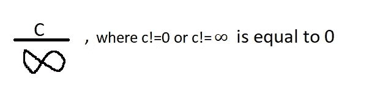

当 C 是一个不等于零或无穷大的常数时，C 除以无穷大就是零。

你可以这样想:如果你把一块蛋糕分成无限多份，你会得到一块小得你可以接受的蛋糕，因为它不存在。

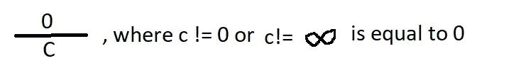

零除以常数，其中常数 c 不为零或无穷大为零。

如果你吃了蛋糕，你就没有蛋糕可分了。

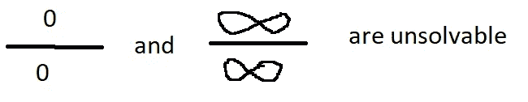

无限上的无限和零上的零是不可计算和未知的，(不，结果不是 1)。我们不知道如何划分没有蛋糕没有时间和无限数量的蛋糕无限次。如果你遇到这些未知的结果之一，试着将方程简化为非零/零或者非无穷大/无穷大的除法。

## 衍生物

导数是当函数的输入变量发生很小的变化时，函数输出的变化量。

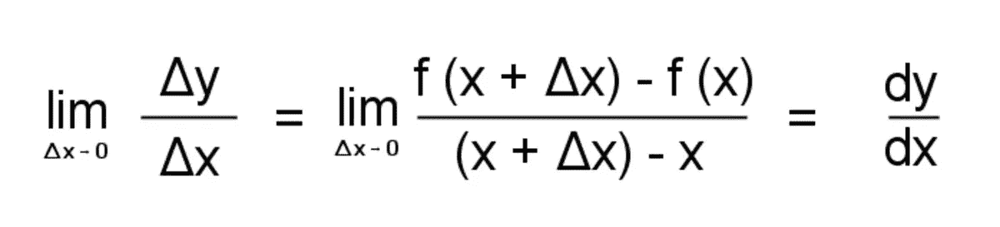

极限与求导的关系[2]

正如你在上面的图像中所看到的，当 x 的变化接近零时，y 和 x 之间的关系显示为导数。

同理，当以 x 为输入，y 为输出绘制函数的正切曲线时，图形的斜率给出了导数。

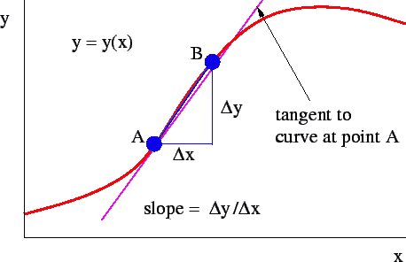

斜率是导数[3]

要求函数的导数:

让我们举两个例子。 **x^2** 的衍生物是 **2x^1.T** 他的衍生物 **x^3** 就是 **3x^2.你能看出其中的关系吗？我们将值乘以功率，并将功率减 1。这是记忆的方法，如果你要用这种方法，你需要记住众所周知的数学值的基本导数(sin cos，等等)。).也可以用斜率公式，计算一段路程。**

**积分**

积分是导数的倒数，它是寻找以给定函数 f(x)为导数的函数 F(x)。积分也是曲线下的面积。

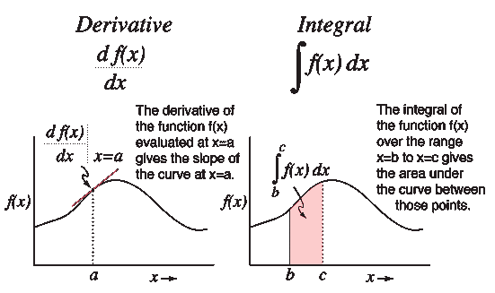

积分和导数[4]

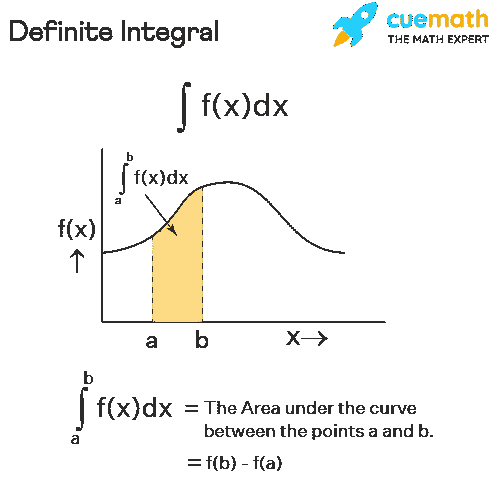

积分公式[4]

我们想找到曲线下的面积，所以我们把这个面积分成矩形。我们分割的矩形越多(存在的矩形越多)，它看起来就越接近我们想要达到的区域。因此，我们需要将该区域分成无限个矩形。

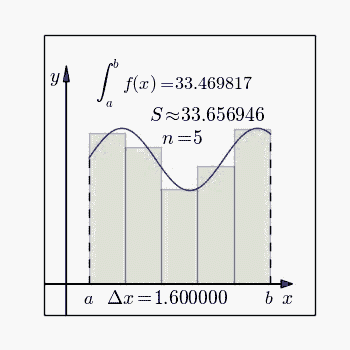

积分黎曼方法[5]

要找到一个函数的积分，你还需要记住众所周知的数学值的基本导数(sin cos 等。).同样对于指数值，将幂增加 1，并将该值除以它前面的常数。

**矢量**

矢量是一个方向量。物理学家认为矢量是空间中的箭头。计算机科学家认为向量是数字的列表。数学家认为向量既是向量又是向量，他们对称为线性代数的向量运算更感兴趣。这些观点都是正确的。

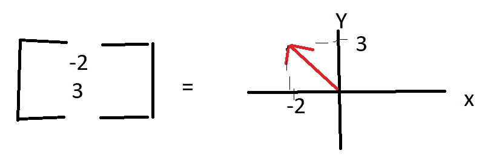

二维向量示例

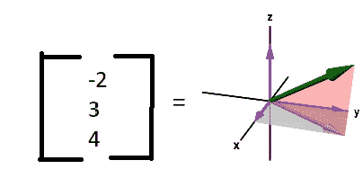

一个三维向量的例子

向量有助于描述和操纵空间。它们还帮助数据分析师可视化数字列表，这可以极大地澄清数据中的模式。

**矢量运算**

我们可以把两个矢量相加。我们可以用一个值乘以一个向量，乘法只会影响它的长度(如果值是正的)，另一方面，将两个向量相加可以改变方向和长度。如果我们把一个向量乘以一个负数，它会改变相反方向的点。这种操作称为“缩放”，因此我们与向量相乘的非向量值称为“标量”。

**基本向量**

μ表示 x 轴上的 1(单位)向量，ĵ表示 y 轴上的 1(单位)向量。所以我们可以把[-2，3]向量表示为(-2)ì+(3)ĵ向量。**μ和ĵ称为 XY 坐标系的基向量**。

将向量显示为 **(a)v̂ + (b)ŵ** )其中 a 和 b 是标量，称为向量的**线性组合**。v̂and ŵ的跨度是它们所有线性组合的集合。跨度是矢量的所有可能的组合(你可以把它想象成它们所有可能的到达点)。

当你有多个向量并且你不能改变一个向量而不减少跨度时，这些向量被称为线性相关的。线性相关也意味着如果我们不使用另一个向量就不能描述一个向量。

向量空间的基础是一组跨越整个空间的线性独立向量。

**线性变换**

转换是功能的一个奇特的词。函数将输入转换成输出。在向量中，将箭头转换为另一个箭头。

如果我们认为 XY 坐标中的所有箭头都是点，我们就创建了一个网格。现在你可以在我们改变网格形状的时候思考。但是为了使它成为线性变换，原点不能移动，并且网格线应该相互平行(查看[6]以获得更直观的解释)。**矩阵给了我们一种描述这些转换的语言。**

**矩阵乘法**

剪切向量=[1_0，1_1]。

注意:我已经用“_”符号表示了底部值。

如果我们将一个矩阵乘以剪切矩阵，我们最终得到矩阵的组成(乘积)。

剪切[1_0，1_1]旋转[0_1，-1_ 0] =合成[1_0，-1_1]

等式的左边部分与这个逻辑 f(g(x))一起工作，因此你需要从右向左读。

让我们用线性代数来找一个变换

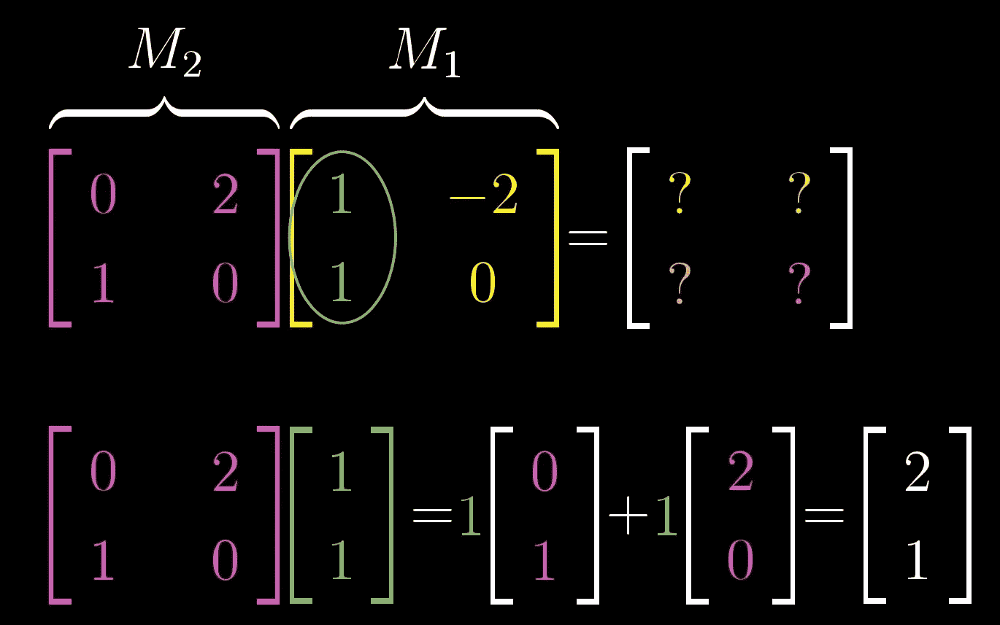

用线性代数进行线性变换[6]

顺序很重要。M1·M2！M2·M1。

括号无关紧要。M1(M2·M3)=(M1·M2)M3。

**行列式**

向量在坐标系中在它们之间创建一个区域。这在进行变换时不会改变，但它只能通过将矩阵乘以一个常数来改变。这个区域是决定性的(由 det(M1)表示)。例如，假设 M1= [1_0，0_1]，det(M1)等于 1。

矩阵的行列式可以是负的(即使是面积)，也就是说面积方向有反转。

可以用(a*d)-(b*c)计算行列式，其中 matrix=[a_c，b_d]。

**行列式的乘积等于行列式的乘积。**

det(M2M1)= det(M2)det(M1)

我们可以用下面的方法展示矩阵来做线性代数:

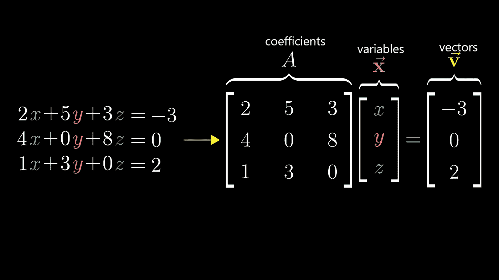

矩阵的表示[6]

**逆矩阵**

假设 A 是一个矩阵。A^(-1)是矩阵 a 的逆矩阵。如果我们把 a 和 a 的逆矩阵相乘，我们最终什么都没有，它们互相抵消。当它们彼此抵消时，输出变成单位矩阵[1_0，0_1]。

大小为 *n* 的**单位矩阵**是主对角线上为 1，其他地方为 0 的 *n* × *n* 方阵。

如果矩阵的行列式(由矩阵生成的面积)为零，则该矩阵没有逆矩阵。你可以想象它们和向量在同一条线上。正因为如此，他们没有可能降低自己的排名。

**秩**表示矩阵输出**中的维数。**

**列空间**表示所有可能矩阵输出的集合。

**零空间**

当与矩阵相乘时导致空矩阵(充满零)的值是该矩阵的零空间。

**基础变更**

现实生活中，空间没有坐标系，没有网格。因此每个人都可以接受不同的原点和坐标系，这是他们的基础。我们可以把别人的基础改造成我们的。

那么我们如何将一个矩阵从其他基转换到我们的基呢？让我们说 M1 是 M2 在我们基础上的翻译，M2 是另一个矩阵，有另一个基础。我们想找到相当于 M2 的地方。首先，我们找到基差，它是基矩阵的变化，我们把它乘以 M2。同样，如果我们将 M1 乘以给出 M2 的变化矩阵的逆矩阵。

**点积**

点积(也叫标量积)是两个矩阵相同位置的元素相乘。此动作会增加相同方向的元素值。点积也可以通过|V1|*|V2|*cosθ来计算，其中 V1 和 V2 是矢量，θ是它们之间的角度。点积给出了一个独立于基础的形式。

**坡度**

在推导过程中，我们改变了变量 x，并检查了乘积的变化。现在我们想同时改变 x 和 y，并检查乘积的变化。这个动作叫做偏导数。梯度总是显示最大方向。

梯度和步长向量的标量积给出了函数的变化。当它们之间的角度为 0 时，由于余弦(余弦 0 为 1，这是最大的三角值)，梯度变得最大。所以，他们是同一个方向。

**转置**

“在线性代数中，矩阵的转置是**一种在对角线上翻转矩阵的算子**；也就是说，它通过产生另一个矩阵来切换矩阵 a 的行和列索引，通常用 A^T(以及其他符号)来表示[7]

转置用于获得可以用矩阵求逆的方法求解的方程组。转置在估计回归中的方差和协方差时也起着重要的作用。大多数情况下，它们用于表示线性变换(如旋转、缩放等)。取代表某种线性变换的**矩阵**的**转置**可以揭示变换的一些性质。

**喜欢我的帖子请别忘了鼓掌。谢谢你。**

**参考**

[1]Patika.dev，(2021)，Temel Matematik:

[https://app.patika.dev/moduller/temel-matematik](https://app.patika.dev/moduller/temel-matematik)

[2] [尤金·布伦南](https://owlcation.com/@eugbug)，(2021 年 8 月 6 日)，什么是微积分？极限和微分入门指南:

[https://Eugene Brennan . medium . com/what-is-calculus-a-初学者-极限与微分指南-8b03f93188d0](https://eugenebrennan.medium.com/what-is-calculus-a-beginners-guide-to-limits-and-differentiation-8b03f93188d0)

[3]WikiBooks，(2018 年 2 月 6 日)，衍生品:

 [## Waves/Derivatives - Wikibooks，开放世界的开放书籍

### 图 1.15:导数的估计，即切线的斜率。当 B 点接近 A 点时,…

en.wikibooks.org](https://en.wikibooks.org/wiki/Waves/Derivatives) 

[4]卡尔·r·纳夫，(？)、导数和积分:

 [## 导数和积分

### 微积分的基本工作工具，导数和积分渗透到建模自然的所有方面

hyperphysics.phy-astr.gsu.edu](http://hyperphysics.phy-astr.gsu.edu/hbase/Math/derint.html) 

[5]维基媒体，(2020 年 9 月 27 日)，积分黎曼阿尼马达:

 [## 积分 riemann animada.gif

### 来自维基共享，自由媒体仓库

commons.wikimedia.org](https://commons.wikimedia.org/wiki/File:Integral_riemann_animada.gif) 

[6]3Blue1Brown，(2021 年 5 月 7 日)，《线性代数的本质》播放列表

[7]维基百科，(2021 年 7 月 13 日)，转置:

 [## 转置-维基百科

### 在线性代数中，矩阵的转置是将矩阵翻转到其对角线上的算子；那就是，它…

en.wikipedia.org](https://en.wikipedia.org/wiki/Transpose#:~:text=In%20linear%20algebra%2C%20the%20transpose,T%20%28among%20other%20notations%29.)