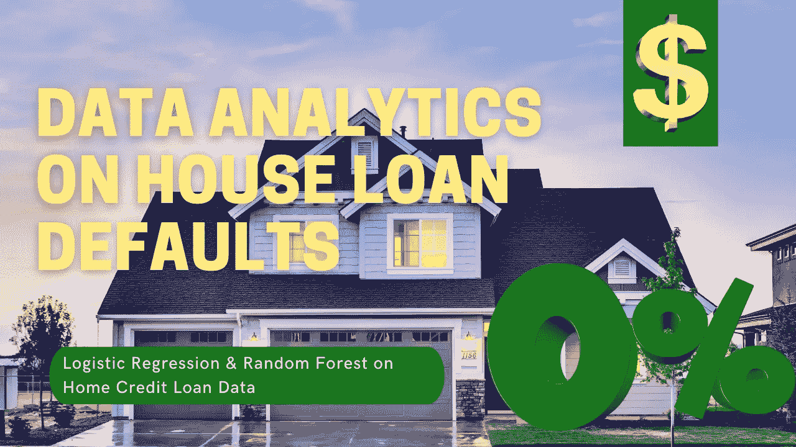

# 机器学习模型可以检测一个人是否会拖欠房屋贷款吗？

> 原文：<https://medium.com/codex/can-a-machine-learning-model-detect-if-a-person-will-default-on-their-house-loan-c4cbde3375a0?source=collection_archive---------4----------------------->

## 家庭信用贷款数据的逻辑回归和随机森林

在我们开始之前，如果你能在这篇文章上留下一些掌声就太好了，如果你觉得它有帮助或有趣，它真的很有帮助，我真的很感激！那么，既然如此，我们就开始吧！！