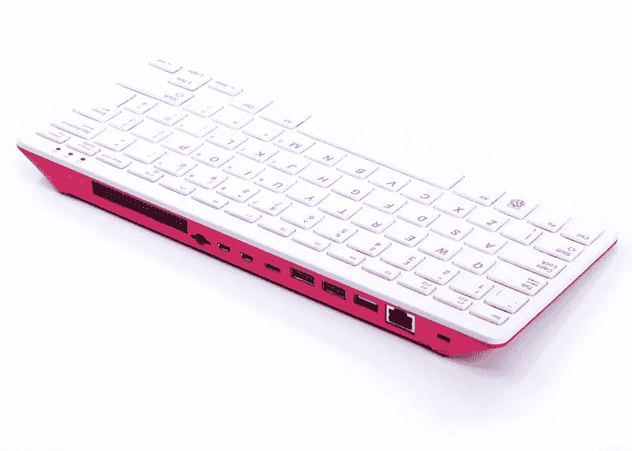
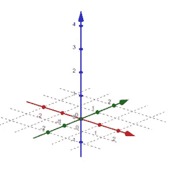

# 一个树莓派能做任何机器学习吗？

> 原文：<https://medium.com/codex/can-a-raspberry-pi-do-any-machine-learning-71608a7e7eba?source=collection_archive---------6----------------------->

嘿，很高兴再次见到你。你最近在忙什么？真的吗？不错！很高兴听到你过得很好。

哦，题目？啊，当然！如果你做了正确的事情，那就是。嗯，“合适的东西”有点主观。如果是小项目，应该不会太难。今天早些时候，我想出了一个主意:我们应该能够拍摄一幅图像，然后用一点聚类的魔法，得到代表该图像的调色板。我们想怎么做呢？



树莓 Pi 400。图片来自 RaspberryPi.com。这是一个功能惊人的设备！

我最近在我的新树莓 Pi 400 上做一些编程。那么，我的项目唯一真正的要求就是它必须足够简单，我的 pi 可以做到。

那么，方法是什么？嗯，我认为图像本质上有红色、绿色和蓝色(当我们谈论计算机上的图像时。我知道这是一种简化；我希望真正的图像处理爱好者不要在评论中消灭我。)，所以我们可以得到每个像素，它的 RGB 值，然后……把它们放到空间里。



三维空间，我们的老朋友。

我是说，真的。想象每个轴是一种颜色。然后取任意一个像素。它的 RGB 值介于 0 和 255 之间。所以…只是…把它们放在太空中。不使用 x，y 和 z 作为坐标，而使用 r，g 和 b。因此，如果我们有一个 rgb 值，如 rgb(120，200，115)，我们会在红轴上找到 120，在绿轴上找到 200，在蓝轴上找到 115。空间中的点代表了那种特殊的颜色(可以说是一种[相当不错的绿色](https://www.colorhexa.com/78c873))。

那么为什么我们要把颜色表示成空间中的点呢？因为这样我们就可以用聚类算法把它们从空间中分组取出来，这就是为什么！当我们聚类时，我们可以从空间中得到代表颜色组的点组。一旦我们有了颜色组，我们就可以得到每组的平均值，每个平均值代表调色板中的一种颜色。

现在这里的*是*的一个缺点。我们使用 KMeans 进行聚类，并选择聚类中心作为调色板的颜色。这意味着，如果一幅图像色彩特别丰富，一些不常用的颜色会在混合中消失。这是因为它们不够多，算法将指定一个新的聚类中心，并且它们将与不一定能很好地代表它们的聚类中心相关联。这是我们以后要探讨的事情。

所以本质上，这就是我们的想法。我真的不是一个很好的机器学习者…嗯，主啊，但是我的数学很好，所以希望这个结果会很好。我觉得我的做法多多少少有点道理！
(免责声明:方法可能有意义，也可能没有意义。)

现在现在。在我们开始幻想之前，有一点小技巧要处理。为了打开图像，我们使用了[枕头库](https://pillow.readthedocs.io/en/stable/)，它非常酷，因为它让你只需说“Pillow.open()”，你就可以在一个你可以操纵的对象中获得图像。

```
size = image.size                                 
width = size[0]                                 
height = size[1]                                                               pixels: List[Tuple] = list()                                 
for x in range(width):                                     
    for y in range(height):
        pixels.append(image.getpixel((x, y)))
```

因此，我们得到了一个元组列表，每个元组包含该像素的 RGB 颜色信息。也许我有点太努力了。如果你是一个枕头爱好者，如果我做得很傻，请给我一个评论。

好了，现在我们有了像素列表的图像。老实说，选择聚类算法很难。我想使用 [DBSCAN](https://scikit-learn.org/stable/modules/generated/sklearn.cluster.DBSCAN.html) ,因为它看起来真的很适合我的应用程序(空间集群——有点特别，对吧？没有吗？也许吧？)但不幸的是，即使针对性能调整了参数，运行时也变得相当荒谬。一旦它…退出。它向终端发送“杀死”并死亡。伤心！

那么，该怎么办呢？记住，它必须在圆周率上运行…所以，让我们简单点，只做 [K 表示](https://scikit-learn.org/stable/modules/generated/sklearn.cluster.KMeans.html)。这就像传统的聚类算法。但是有多少个集群呢？

嗯，9 个。无论如何，从撰写本文开始。因为我妻子的调色板里有这么多颜色，我觉得那会非常可爱。太好了！怎么会？

哈哈，这就像 3 行代码:

```
numpy_pixel_data: ndarray = numpy.array(pixels)
model = KMeans(n_clusters = 9)                                 
output_dataset: ndarray = model.fit_predict(numpy_pixel_data)
```

先把像素变成 sklearn 可以处理的`ndarray`。然后，用 9 个集群实例化模型。终于…适合了。就是这样。好吧，好吧。我们有了集群，现在我们如何制作调色板呢？枕头盖住了我们！

在你完成装配之后，你的`model`将会有`cluster_centers_`，我们将会使用它作为调色板的颜色！

```
def mkpalette(colors: ndarray) -> Image:
    width = 200
    height = 900
    row_height = 100
    image_size = (width, height)
    palette_image = Image.new('RGB', image_size)
    for index, color in enumerate(colors):
        color_tuple = tuple(floor(component) for component in color)
        for x in range(width):
            for y in range(index * row_height, (index + 1) * row_height):
                palette_image.putpixel((x, y), color_tuple)
    return palette_image
```

发生了什么事？

对于我们的`cluster_centers_`中的每种颜色，我们将通过给给定行的所有像素着色来向调色板图像添加一行。宽度是 200 像素，高度是 100 像素。一旦我们有了那个，我们就可以用枕头来展示图像了！

老实说，我不认为第一次尝试有什么不好。

马尔科·费拉林[拍摄的这张照片:](https://www.flickr.com/photos/marcoferrarin/16367443658/)


马尔科·费拉林的《天空》

我们会收到一个类似这样的调色板:


生成的调色板

还不错！但是性能呢？

我们说过它应该在树莓派上运行。原始图像相当大(大约 1200 x 700)，运行时间…老实说不算太差。KMeans 集群步骤花费了大约 50 秒，我认为在这样一个小设备上这是完全合理的。

你怎么想呢?我认为它看起来很不错。我已准备好接受拉动式请求、问题等。在 [github 库](https://github.com/svidovich/img2palette)上！请随意发表评论。我很想听听你们的想法，尤其是你们这些机器学习和图像处理的专业人士！

等等，你说这只是统计学而不是真正的机器学习是什么意思？来一个，K 的意思至少是*迭代，*对吧？等等，你要去哪里？嘿，别就这么走了！