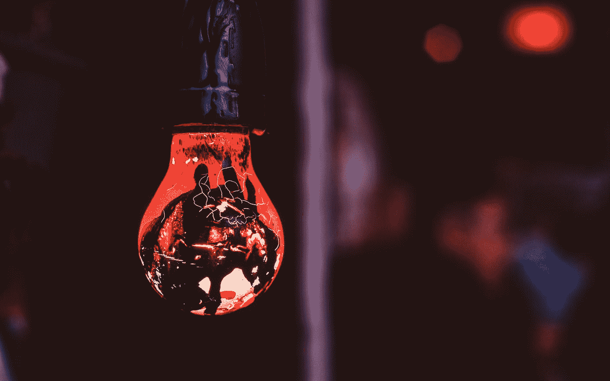

# 人工智能可以成为专利或已发表作品的作者吗？

> 原文：<https://medium.com/codex/can-an-ai-be-the-author-of-a-patent-or-published-work-31170d3eb09f?source=collection_archive---------8----------------------->

肖恩·朗斯在 [Unsplash](https://unsplash.com?utm_source=medium&utm_medium=referral) 上拍摄的照片

## [抄本](http://medium.com/codex)

## 人工智能还没有被认为是一个发明家，但很快，它可能会改变。

美国专利商标局去年裁定，企业不将人工智能(AI)设备 [**列为专利申请的发明人**](https://www.theverge.com/2020/4/29/21241251/artificial-intelligence-inventor-united-states-patent-trademark-office-intellectual-property) 是合法的，并且…