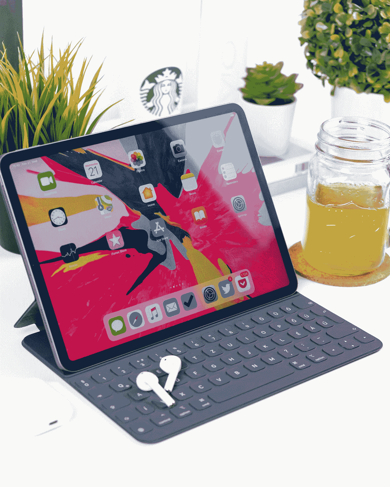

# 2022 年 iPad 真的能取代电脑吗？

> 原文：<https://medium.com/codex/can-an-ipad-really-replace-a-computer-in-2022-af916b7eba68?source=collection_archive---------11----------------------->

## 我们准备好扔掉我们的电脑了吗？

丹尼尔·科尔派在 [Unsplash](https://unsplash.com?utm_source=medium&utm_medium=referral) 上拍摄的照片

iPad 自首次发布以来已经成长了很多，最近，苹果似乎有了一个目标。让 iPad 成为电脑的替代设备。

通过他们最近的广告，他们想改变我们使用电脑的方式，让 iPad 成为一个足够强大的设备，一个多样化的…