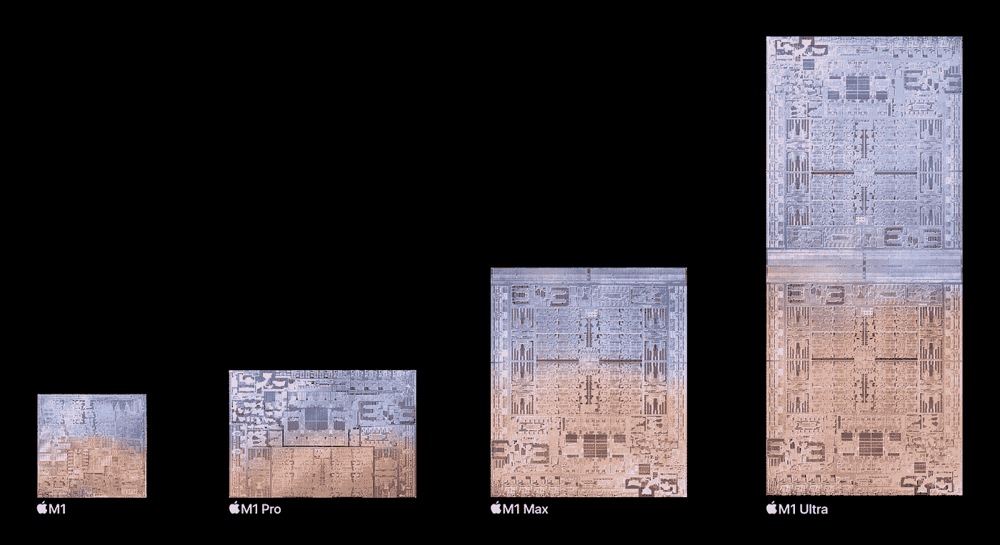

# 苹果的超融合技术是否意味着 M2 还需要一段时间？

> 原文：<https://medium.com/codex/can-apples-ultrafusion-technology-mean-that-m2-is-still-a-while-away-150089387104?source=collection_archive---------3----------------------->

## 如果他们把两个 m1“粘”在一起，他们可能还能粘三个、四个……?

给我一点时间理清思绪，把我的 home-pod mini 从抽屉里拿出来，放在苹果抛光布上，用一只手摇动苹果品牌包里的一套苹果 Mac Pro 轮子，同时用另一只手…