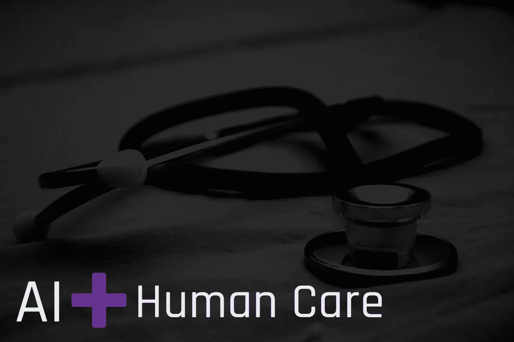

# 人工智能能否将人类的关怀带回医学？

> 原文：<https://medium.com/codex/can-artificial-intelligence-bring-human-care-back-to-medicine-433cf62fbd6b?source=collection_archive---------7----------------------->

## [法典](http://medium.com/codex)

这里有一个再熟悉不过的医生出诊场景:你提前到达，填写一份篇幅很短的文书工作。你被带进一间检查室，一名私人助理或医疗助理询问今天就诊的原因，以及你的健康或药物治疗是否有任何变化？接下来，你的医生(或私人助理)走进检查室，坐在…