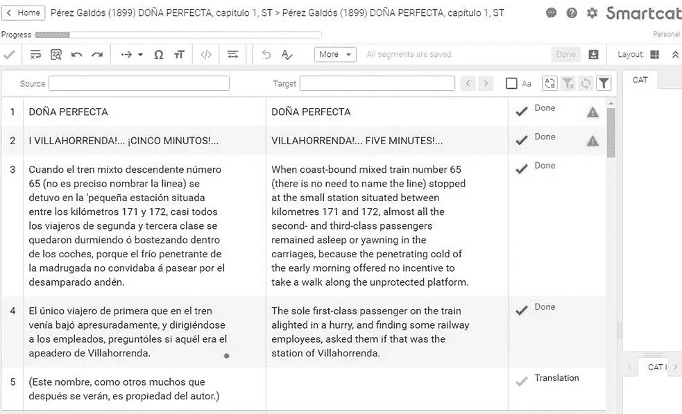
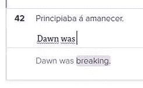

# 人工智能能帮助文学翻译者吗？

> 原文：<https://medium.com/codex/can-artificial-intelligence-help-literary-translators-845884591aab?source=collection_archive---------9----------------------->

人工智能支持人工翻译。照片:Philippos Vassiliades

文学翻译与其他形式的翻译有何不同？再简单一点，非文学翻译如商业、法律、医学等。倾向于关注文本的意义，而文学翻译几乎同样强烈地关注文本的风格。

*作者罗伊·尤戴尔*

文学风格不仅关系到*说什么*，还关系到*怎么说*。文学评论家特里·伊格尔顿认为文学写作“是一种内容与语言不可分割的写作”。例如，下面的两个句子基本上意思相同，但表达方式却大不相同，阅读体验也是如此。

1.  她从地上摘了一朵紫色的风信子。
2.  紫色是她从地上摘下的风信子的颜色。

把第二句翻译成第一句是对原文的严重歪曲。

因此，一个文学译者必须同时考虑风格和内容，这涉及到语言的选择，人们常说没有两个译者会以完全相同的方式翻译相同的文本。那么，文学翻译者如何着手试图再现文本的意义以及他们认为对读者的影响呢？基本上是通过寻找原文中使用的语言模式，并试图用另一种语言再现它们，这个过程我称之为“创造性逆向工程”。

# 人工智能和语言模式的检测

人类既是习惯的生物，也是个体。正如我们总是以一种特殊的方式行走，与其他人不同，并有独特的指纹，所以当我们写作时，我们使用有意识和无意识的表达模式。这些可以用来确定我们是作家，并在有人将我们的作品翻译成另一种语言时成为重要因素。其中一些语言模式相对容易识别。如果一个作家使用了大量的俚语或者喜欢使用像*混乱*这样的大词，这很容易被注意到。然而，文学风格的一些重要方面影响着读者的体验，而这些方面并不容易被发现。这些包括句子长度，标点符号的使用和重复。如果我们不知道这些语言模式的存在和重要性，我们就不能试图在文学翻译中再现它们。

如果人工智能(AI)可以帮助译者识别作家使用的语言模式，会怎么样？好消息是它可以，而且方式越来越复杂。像 Sketch Engine 这样的软件，只需点击几下鼠标，就可以根据出现的频率列出文本中的所有单词；对句子长度进行分析(包括总的平均句子长度和由 2、3、4 等组成的句子数量的细分)。话)；列出 n-grams，3，4 等的重复序列。单词)的长度和出现频率；并分析词汇丰富度(不同类型单词的数量占单词总数的比例)等。文本可视化程序 Voyant Tools 可以直观地显示文本的各种语言特征，将词频显示为词云，将文本中各个单词和短语的使用频率显示为图表。只需点击一下鼠标，文本分析程序 Coh-Metrix 就能提供 200 多种语言使用和可读性的统计方法。

在要翻译的原文中找到各种各样的语言模式是一回事，但是找到了之后，译者如何在另一种语言中再现它们呢？如果人工智能能做的不仅仅是分析译者提示的语言模式，而是自己进行翻译，那会怎么样？同样，任何使用过谷歌翻译的人都知道，答案是可以，而且方式不同。该档案中的另一篇文章“人工智能和文学翻译”，展示了全自动神经机器翻译(NMT)在过去几年中如何被用于翻译文学。这篇文章及其引用的研究表明，尽管全自动文学翻译在有望与人工翻译相媲美之前还有很长的路要走，但它作为初稿的一种形式，然后由译者编辑(行话是“后期编辑”)的使用正受到越来越多的重视。但是文学翻译者还可以使用人工智能的另一种方式:在他们打字时提出实时翻译建议。

# 人工智能与两种翻译技术的融合

为了理解这一点，首先有必要简要解释一下几乎所有非文学和少数文学译者使用的计算机辅助翻译(CAT)软件是如何工作的。这些软件程序被称为卡特彼勒工具，是在 20 世纪 60 年代和 70 年代开发的，自 20 世纪 80 年代以来就已经上市。他们的核心技术叫做翻译记忆库。这背后的想法是，当同一个句子在文本中再次出现时，译者不应该需要翻译两次。换句话说，当翻译人员在文档中工作时，程序会自动存储所有已翻译的内容，当已翻译的句子再次提交翻译时，程序会识别这一点，并向翻译人员提供他/她已经完成的翻译，从而节省时间和精力，并有助于确保翻译的一致性，这通常非常重要。事实证明，计算机辅助翻译工具最适用于重复的、语言规则的、用相当短的句子写成的文本。

CAT 工具用户界面通常以表格的形式显示要翻译的文本，这些文本被分解成句子(或称之为“片段”)，每个句子占据一个单元格。这种“源”文本出现在表格的左栏中，而右栏提供空白单元格，在其中键入翻译或“目标”文本，如下所示:

Smartcat 翻译界面。图片(截图):Roy Youdale | Smartcat | CC-BY-SA

在 Smartcat(一款免费的在线 cat 工具)中，屏幕截图中显示的栏目右侧会出现一个窗格，其中会出现自动 TM 建议，译者可以接受或拒绝。在早期的 CAT 工具中，所有这些建议都是从当前文档中已经翻译的片段的数据库中提取的。然而，自那以后，CAT 工具中翻译建议的来源范围大大增加了。现在可以将一个或多个相关翻译的 TM 导入到 CAT 工具中；利用并创造专业术语表(或“术语库”)；并且搜索 TMs 以查看单个单词和短语以及完整的句子是如何被翻译的。在这方面，机器翻译(MT)与卡特彼勒工具的结合改变了游戏规则。

机器翻译基本上是使用计算机来搜索和比较源文本中的单词与已经翻译成目标语言的非常大的文本数据库(数十亿单词)。除了翻译单个单词之外，计算机还会搜索相应的单词序列或“字符串”，这个过程称为“字符串匹配”。随着最新机器翻译 NMT 的进步，计算机现在不仅可以寻找直接的字符串匹配，还可以扫描每个句子的上下文，查看周围的句子。这有助于处理像“权利”这样的词所产生的歧义问题，例如，它可能意味着一个方向、正确、公平或权利。CAT 工具在提出翻译建议时使用机器翻译数据库以及机器翻译模块和术语库的能力显示了人工智能的作用。

# 将机器翻译集成到卡特彼勒工具中

现在有两种主要的方式将由 TMs 和 MT 数据库的组合资源生成的翻译建议嵌入到 CAT 工具中。第一种包括软件提出完整翻译正在处理的片段的建议，即一个完整的句子。然后，译者可以接受、拒绝或编辑建议。这通常被称为后期编辑方法。另一种方法是使用交互式机器翻译(ITM)。在这里，软件使用相同范围的资源，但以建议自动完成的形式实时呈现结果，就像预测文本一样。正如翻译研究人员安娜·扎雷茨卡娅、格洛丽亚·科尔帕斯·帕斯托尔和米丽娅姆·塞吉里解释的那样:“每次输入一个字符，这些建议就会被计算出来，用户可以通过按一个特殊的键来接受它们，也可以通过继续输入来拒绝它们。这样，当用户打字时，系统不断地调整建议，“有效地‘学习’它。

这里，我们在一个较新的 CAT 工具 Lilt 中看到了这一点。

Lilt 中的实时翻译建议。图片(截图):Roy Youdale | Smartcat | CC-BY-SA

这有可能提高翻译人员的创造力，为他们提供翻译解决方案，而他们自己可能想不出来。另一方面，一些翻译认为这个系统对他们施加了压力，迫使他们接受建议的自动完成功能，从而实际上限制了他们的创造力。

# 文学翻译器和 CAT 工具

大多数文学翻译者不使用 CAT 工具进行翻译。他们认为，这种工具不适用于文学文本中的语言，他们也经常对将文本分解成孤立句子的用户界面感到不舒服，从而剥夺了他们在处理叙事时经常需要的段落、页面或章节的上下文。他们还倾向于拒绝文学翻译，指出谷歌翻译等程序的输出质量很差，并认为为了翻译文学，译者必须知道的不仅仅是页面上单词的意思。他们还需要理解文化、政治和历史参考资料、习惯用语以及构成我们所说的“真实世界知识”的一切。

然而，人们的态度似乎确实在改变，尤其是年轻的文学翻译似乎更愿意考虑尝试 CAT 工具。虽然不必重复翻译整个句子的好处在文学翻译中通常不是一个优势，因为这种重复的程度通常要低得多，但 CAT 工具提供的其他功能原则上同样适用于所有类型的翻译。这些能力包括:

*   休息一会儿或离开去查资料后，很容易找到你在译文中的位置，这样你就不太可能漏掉译文中的句子，这是一件非常容易做到的事情
*   查看每个已完成部分的以前版本，提醒您如何获得当前版本，并允许您在必要时进行修改
*   搜索翻译，查看您以前是如何翻译特定单词或短语的
*   以不同格式导出翻译，如句子对齐的表格或标准 Word 文档。

# 结论

> ***【人工智能的一个定义是】能够执行通常需要人类智能的任务的计算机系统的理论和开发，如视觉感知、语音识别、决策和语言之间的翻译。”***
> 
> *牛津词典*

虽然计算机(还)不能创造文字游戏或理解语域的概念(一种语言的语气和正式程度)，但它非常擅长对单词进行计数和分类，并对字符串匹配进行大量搜索。以半自动和全自动的方式，它可以帮助文学翻译的工作。人工智能和计算机在文学翻译中何时何地以及如何使用仍然是一个相对较新的领域，它将被称为计算机辅助文学翻译(CALT)，涉及到人类和机器之间微妙且不断变化的平衡。反思这种平衡的当前状态是恰当的。

## **定义**

*   [CAT(计算机辅助翻译)](http://www.pangeanic.com/knowledge_center/computer-assisted-translation-tool-cat/)
*   [ITM(交互式机器翻译)](http://link.springer.com/chapter/10.1007/978-0-85729-479-1_6)
*   [NMT(神经机器翻译)](http://machinelearningmastery.com/introduction-neural-machine-translation/)
*   [文本可视化](http://courses.cs.washington.edu/courses/cse512/15sp/lectures/CSE512-Text.pdf)
*   [TM(翻译记忆库)](http://www.sdltrados.com/solutions/translation-memory/)
*   [字云](http://monkeylearn.com/blog/word-cloud-generator/)

## **参考文献**

Boase-Beier，J. (2010) *文体翻译方法。第三版。伦敦和纽约:劳特利奇。*

陈世伟(2015)“计算机辅助翻译:主要概念”，载于陈世伟(编。)*《劳特利奇翻译技术百科全书》。伦敦和纽约:劳特利奇出版社，第 32-67 页。*

Doherty，S. (2015)“翻译技术对翻译过程和产品的影响”，*国际传播杂志*，9(2 月)，第 1–23 页。doi: 10.1300/J009v26n03_04。

伊格尔顿，T. (2014) *如何阅读文学？*纽黑文和伦敦:耶鲁大学出版社。

Garcia，I. (2015)“计算机辅助翻译:系统”，载于 Chan，s-w .(编辑。)*《劳特利奇翻译技术百科全书》。伦敦和纽约:劳特利奇出版社，第 68-87 页。*

[Lombardino，R. (2014) *我为什么要用一个 CAT 工具来翻译书籍，eWordNews。*](http://ewordnews.com/literary-news/2014/4/11/why-i-use-a-cat-tool-to-translate-books?rq=swordfish)

Melby，a .和 Wright，S. (2015)“翻译记忆”，载于 Chan，s-w .(编辑。)*《劳特利奇翻译技术百科全书》。伦敦和纽约:劳特利奇出版社，第 662-677 页。*

奥哈根，m。)*《劳特利奇翻译与技术手册》。阿宾登和纽约:劳特利奇。doi: 10.4324/9781315311258。*

Prachi，k .,“N-grams 简介:它们是什么，我们为什么需要它们？”

Rothwell，a .和 Youdale，r .(即将出版)“计算机辅助翻译(CAT)工具、翻译记忆和文学翻译”，载于 Deane-Cox，s .和 Spiessens，a .(编辑 Routledge 翻译与记忆手册。伦敦和纽约:劳特利奇。

Ruffo，P. (2018)“翻译中的人机交互:技术上的文学译者及其角色”，*第 40 届翻译与计算机会议论文集。*伦敦:阿斯林出版社，第 127-131 页。

Schiaffino，R. (2016) *计算机辅助翻译工具和翻译风格，关于翻译。*见:[http://www . about translation . com/2016/04/cat-tools-and-translation-style . html](http://www.aboutranslation.com/2016/04/cat-tools-and-translation-style.html.)

斯莱塞(2020)“顽固的技术恐惧者还是新生的技术爱好者？文学翻译的技术实践和需求调查。泰勒&弗朗西斯，28 (2)，第 238–252 页。doi:10.1080/0907676 x . 2019.1645189

[Wasaty.pl (2019)“使用 CAT 工具进行文学翻译”。十月二十日。](http://wasaty.pl/blog/2019/10/20/literary-translations-with-cat-tools/)

在文学风格翻译中使用计算机:挑战与机遇。伦敦纽约:劳特利奇。

Zaretskaya，a .，Pastor，g .和 Seghiri，M. (2015)“机器翻译在 CAT 工具中的集成:最新技术、评估和用户态度”， *SKASE 翻译与口译杂志*，8 (1)，第 76–88 页。

## 作者

罗伊·尤戴尔是布里斯托尔大学翻译研究的副研究员，他于 2017 年完成了博士学位。他教授本科最后一年的翻译，他的研究是计算机辅助文学翻译，特别是在文学翻译实践中使用计算机辅助翻译工具，语料库语言学和文本可视化。他是《在文学风格的翻译中使用计算机:挑战和机遇》(2020)的作者，并在布里斯托尔大学、斯旺西大学、曼彻斯特大学和东安格利亚大学以及罗马和乌得勒支的研讨会上展示了他的作品。他也是来自西班牙的文学翻译。

版权所有:正文:[歌德学院，罗伊·尤代尔](https://www.goethe.de/en/index.html)。本作品根据[知识共享署名 4.0 国际版(CC BY-SA 4.0)](http://creativecommons.org/licenses/by-nd/4.0/) 许可证进行许可。

2020 年 9 月

*原载于*[*https://www . Goethe . de*](https://www.goethe.de/prj/one/en/aco/art/21967545.html)*。*