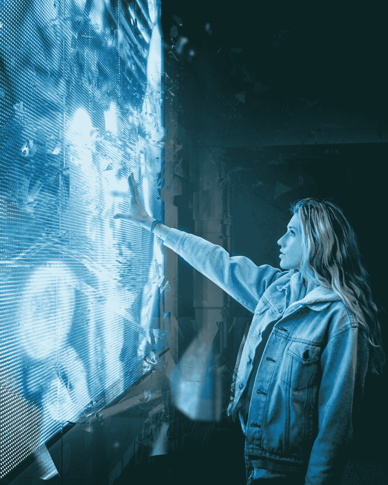

# 人工智能能提高你的创造能力吗？

> 原文：<https://medium.com/codex/can-artificial-intelligence-improve-your-creative-ability-c718f6ab2c0e?source=collection_archive---------9----------------------->

## 将你的创造力融合到它的可能性中，这就是你如何使用人工智能来帮助你的创造力获得优势

乔希·希尔德在 [Unsplash](https://unsplash.com?utm_source=medium&utm_medium=referral) 上的照片

老实说，有时候想出一个好主意是可以想象的最难的事情，更不用说制作另一个有创意的内容了。所以，你需要一个优势。