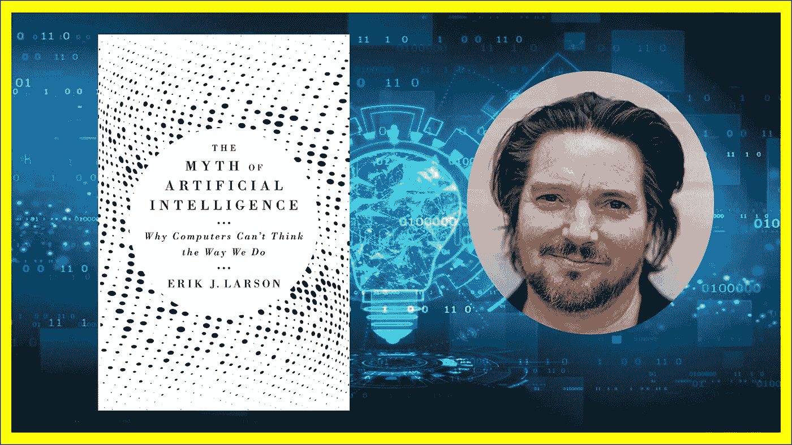
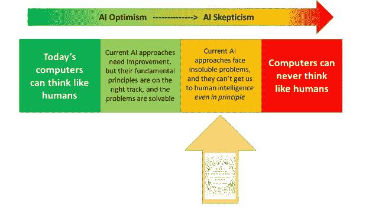
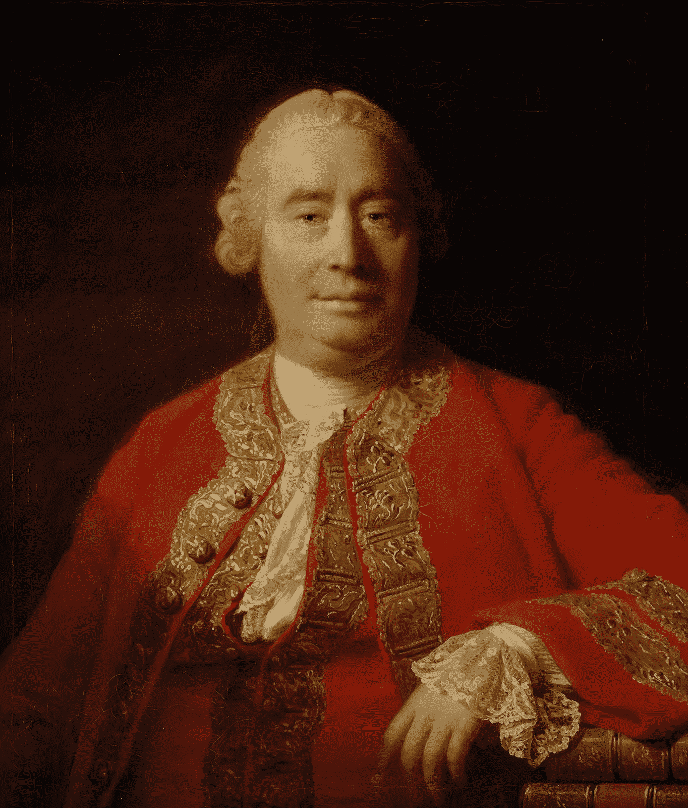
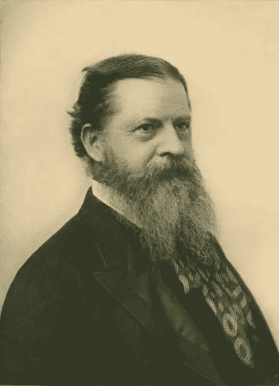

# 计算机能像人类一样思考吗？评埃里克·拉森的《人工智能的神话》

> 原文：<https://medium.com/codex/can-computers-think-like-humans-reviewing-erik-larsons-the-myth-of-artificial-intelligence-4dc282847318?source=collection_archive---------3----------------------->

在他最近的书《人工智能的神话:为什么计算机不能像我们一样思考》中，人工智能研究员埃里克·j·拉森捍卫了这样一种说法，即就今天的情况而言，人工智能研究中没有合理的方法可以导致普遍的、类似人类的智能。

理解作者想要表达什么，以及他*没有*表达什么是很重要的。他并没有像一些心灵哲学家声称的那样，声称计算机永远不会像人类一样思考。相反，他的立场是——如果确实有一种方法可以让计算机像人类一样思考，我们对那是什么一无所知。我们目前的方法——不管它们看起来多么有希望——都是死胡同。他将这一点与对人工智能的普遍乐观态度进行了对比:认为当前的方法正在走向广义智能，并且这种方法的问题至少在理论上是可以解决的。如果有必要进行彻底的反思，那是在细节层面，而不是基本原则。以这种方式思考，类似人类的计算机似乎只是时间问题。另一方面，拉尔森认为，即使是当前人工智能方法的基本理论原则也是不可行的。

如果我们想象一系列关于人工智能的乐观主义/怀疑主义的观点，这就是这本书的落点:

关于人工智能实现类似人类智能的一系列假设意见，从乐观到怀疑。箭头表示书本所处的位置。注意，这是一个假设的范围:我真的不知道谁持最左的观点

作者提出了两个论点为自己辩护:

## ***1。归纳推理的不足。***

目前所有的人工智能方法(或者至少是最有前途的方法)都是基于一种特定的思维模式:归纳推理。然而，仅仅依靠归纳推理永远无法开发出广义的人类智能。也就是说，只要人工智能方法共享这个原则，它们都注定要失败。

这个论点有趣的一个原因是，这本书正在研究的问题——计算机是否能像人类一样思考——可能会让人觉得太“哲学化”:这难道不取决于我们如何定义人类智能的构成吗？随之而来的是对主观目标设定的担忧。然而，这个论点完全回避了这个问题，因为作者试图表明任何基于归纳推理的人工智能都会犯人类永远不会犯的错误。不管我们如何定义“智能”，很明显，犯这些错误的人工智能不是*那么*(比较:我们可能没有“健康”的精确定义，但我们可以同意，一个从 COVID 住院的人显然不合格)。

## ***2。*** ***人类的智力是不可言喻的。***

人类的智力主要基于一种叫做溯因推理的推理模式。这种类型的推理不能简化为其他形式(如归纳或演绎)，我们也不知道如何编码或编程。换句话说，人类智力最基本的推理模式是一个完全的谜。由于目前没有一种人工智能方法是基于(真正的)溯因推理，而且由于我们甚至不知道如何开始编写这样的程序，因此目前的人工智能真的没有办法达到类似人类的智能。

作为一个案例研究，作者谈到现存的人工智能无法在自然语言理解方面取得进展。然而，我并不认为这是一个独立的论点，它只是前面几页中已经提出的概念的一个演示。

我现在将重新构建这些论点并给出我的评价，但首先:

***免责声明***

**一、**我是以一个完全外行的身份来看这本书的。我不仅没有相关的专业知识，而且这实际上也是我第一次读到关于这个主题的长篇论述。因此，我没有背景知识来进行分析:我只能评估这本书论点的有效性，而不能核实前提。此外，我的反对意见在文献中可能有相当简单的答案——但我不会知道它们，因为我只是在回顾书中包含的案例。

**第二，**除了这个人工智能到人类智能的讨论，这本书还有另外两个部分是关于当前人工智能文化的历史和社会学，但我不会对它们进行评论。这绝对不是说这些部分不有趣:例如，前两章讲述了艾伦·图灵如何从一个本质上的人工智能怀疑论者变成一个人工智能希望者，因为他参与了战争努力；最后一部分讨论了理论化在科学中的作用，以及过度沉迷于数据的人工智能文化可能会如何危害它。然而，由于它们是叙述性的叙述，而不是争论，我不能提供太多的评价。此外，我对人工智能变得像人一样的前景更感兴趣，我认为这是这本书的核心。

也就是说…

# **论据 1:归纳推理的问题**

***又笨又窄又脆的电脑***

一个有用的起点是首先掌握人工智能目前面临的问题。计算机智能的范围往往非常“狭窄”，这是由设计决定的:一个下棋的人工智能，由于其高度的专业化，不能同时玩跳棋。这方面的一个极端例子是作者所说的“脆性”问题:不仅狭窄的人工智能*不能*完成其他任务，甚至设置中的轻微偏差——人类甚至不会注意到——也会完全扰乱计算机输出。考虑一个可以完美玩游戏*突围*的人工智能，这需要来回移动球拍将球弹回到砖块上。将球拍移近砖块几个像素不会严重影响人类玩家的表现，但对人工智能来说却是一样的，它的“整个系统都崩溃了”。图像检测软件也是如此:它们通常有很高的成功率，但只是在这里或那里改变几个像素就会完全搞乱系统。

知道这些问题告诉我们关于人工智能能力的什么是很重要的，特别是因为它很容易被现代人工智能在各种重要任务中的成功所误导(特别是对于像我这样的门外汉)。为此，考虑一下这个类比。假设我，一个人类，有十个高中数学问题要解决。我已经离开高中数学有一段时间了，所以我甚至不知道从哪里开始。我交的答卷实际上是空的。意识到我需要训练，我买了一本高中数学书，开始努力学习。这被证明是一个相当严峻的考验，但下一次我出现在测试中时，我的分数确实有了显著的提高——事实上，我得到了 9 分。这清楚地表明了我对高中数学的熟练程度。

“但是等一下”，我的教授说，“让我们来看看问题，看看你错了哪一个”。事实证明，试卷上的所有问题几乎都是从书上抄来的，但我答错的那道题措辞略有不同。这很奇怪:它与书中的内容基本相同，只是在措辞或价值观上有相对较小的变化。我怎么会弄错呢？

事实证明，我准备考试的方式并不是真的让*学习*数学，而是把整本书都背下来。这样，如果书中的一个问题一字不差地出现在试卷上，我会认出它，并完美地复述出答案。然而，由于我的学习完全基于记忆，即使稍微偏离考试中出现的问题也会让我束手无策。

考虑到这个新的事实，我的数学水平将如何被评估呢？我想人们会同意，自从我第一次参加考试以来，我没有取得任何进步。我在第二次测试中的高分实际上是一个非常误导的成功指标，因为测试问题无法区分纯粹基于记忆的表现和基于理解/学习的表现。事实上，当我接受另一个 10 个问题的测试时，每个问题的措辞都与书中的略有不同，我一个也答不上来。显然，我的数学能力——如果可以称之为数学能力的话——非常狭窄和脆弱，只能记忆和复制书本上的答案。

当一个人工智能在“测试”中出现轻微偏差后，在玩*突破*或图像识别时失败，这种错误表明整体缺乏“智能”——无论他们的成功率有多高。不管人类的智力可能是什么，它不是*而是*。这就是为什么关注这些问题很重要，并问——为什么这些问题在当前的人工智能中持续存在？代码细节缺乏微调的结果会随着技术的进步而得到解决吗？还是说它们来自于当前方法所基于的基本前提？

作者赞成后者。所有当前的人工智能都是基于某种被称为归纳的思维或推理模型，而暴露系统的错误是这种推理中固有的约束的直接结果。

***归纳推理***

非常简单地说，归纳推理就是从经验中学习。如果我们每天都能看到东方的日出，我们自然会得出这样的结论:明天太阳也会如此。让我们对这一论断充满信心的是这样一个事实，即我们总是看到这种情况发生。同样的道理也适用于没有白色乌鸦或蓝色祖母绿的情况:在我们所有的观察中，我们没有看到任何这样的例子，这意味着它们可能不存在。更一般地说，归纳法是将一个结论从一个样本推广到一个群体，将我们的发现从已知推广到未知。哲学家经常指出，这种推理模式从根本上说是不合理的:我们已经看到一些事情发生的事实，无论多么频繁或一贯，都不应该给我们任何在未来继续观察它的信心。这个“归纳问题”，虽然仍然是科学和认识论哲学家争论的问题，但与人工智能的争论并不严格相关。我们关心的是计算机是否能显示出类似人类的智能，而不是完美的智能。证明人类推理的问题是一个完全不同的问题，我们将让哲学家们思考这个问题。

大卫·休谟——有力地提出了归纳法问题的苏格兰哲学家

然而，作者认为，目前的人工智能面临着一个更实际的归纳问题，这个问题实际上是相关的。归纳推理的成功依赖于获得足够的样本量。例如，仅仅基于 10 人试验就对疫苗或药物效力做出判断是错误的推断。为了做出好的推论，我们需要考虑足够多的数据，而且通常是各种各样的数据。这就是人工智能的不足之处:虽然它可以在非常狭窄的背景下做出成功的推理——比如用设定的规则玩游戏——但现实世界太动态、太复杂，它无法做出准确的预测。换句话说，这里的问题是无法达到足够大和足够多样的样本量。当然，人工智能系统可能在足够窄的任务中表现出色，但它也有不可忽视的错误，这些错误暴露了它完全缺乏智能(考虑上面的数学问题类比)。继作家和统计学家纳西姆·尼古拉斯·塔勒布之后，作者将这些失败的推论描述为涉及复杂(非二元)选择和高度随机性。事实上，现实世界充满了具有这两个特征的问题，而且这些决策通常会导致严重的后果。

更具体地说，作者确定了两个限制因素，它们甚至限制了我们最有前途的人工智能方法(涉及机器学习和大数据)。第一个他称之为**经验约束**:系统只有在我们教它的时候才是聪明的。例如，如果我们告诉一个人工智能去识别所有对一家名为“蓝盒子公司”的公司的引用，它只能基于单词“蓝”和“盒子”按顺序出现的显式证据来这样做。然而，考虑这样一种情况，有人在脸书上发布了一个关于该公司的状态，下面的评论者使用代词“它”来指代它。这条评论是对该公司的引用，但人工智能将无法识别它——因为这需要解析上下文，而这不能仅通过初始信息输入来完成。或者，有人可能在谈论蓝箱公司的产品，而不是公司本身——这在系统中显示为误报。与自动化人工智能不同，在这些情况下，人类可以很容易地找到参考文献。

基于归纳的人工智能方法固有的第二个约束是**频率假设**:事物根据它们的频率以某种方式分类。例如，如果计算机注意到每当“Inc .”跟在一对单词(如“蓝框”)后面时，它最经常指的是一家公司，那么下次计算机看到“X Y Inc .”时，它就会非常自信地在上面贴上“公司”标签。当然，在现实世界中,“Inc.”标签也可能用在其他上下文中:可能是一个缩写。讽刺或幽默的新闻就是一个很好的例子。例如，一篇恶搞文章可能涉及暴力和手枪，计算机会尽职尽责地将这篇文章归类为“严肃”主题。同样，这些线索很容易被人类识别，但不能处理上下文信息的人工智能却不容易识别。与高成功率相比，像这样的错误例子可能是低的，但就像我在数学考试中犯的一个问题一样——这些错误暴露了 AI 没有智能，从一开始。

**T3【盘点】**

在这一点上，这将是有用的，以评估该案件迄今为止，看看作者是否真的成功，他想要达到的目标。在第一个论点中，作者想让我们相信，任何基于归纳推理的人工智能——仅仅凭借其基本前提——永远不会是智能的。归纳推理系统原则上不能成功*。为了取得成功，作者需要证明这些问题不能仅仅通过添加更多的数据来解决，随着技术的进步，我们总是希望这样做(至少可以想象)。*

*不过，到目前为止，我不认为作者能够展示这一点。他给出的关于人工智能限制的例子——不能识别代词指代物或讽刺性的低频实例——在我看来并不是不可克服的问题。也许，有了更多的数据，计算机就可以被训练去捕捉一篇文章中的线索，告诉它这是为了幽默。在这种情况下，计算机将忽略其基于较高频率的假设(例如，“涉及手枪和暴力的新闻是严肃的”)，并为该文章选择不同的类别。当然，人工智能研究人员可能会给出为什么这些事情在技术上是不可能的原因，但我的问题是——这些原因是因为归纳是整个方法的前提吗？因为这就是作者试图展示的——人工智能系统注定会失败，原因很明确:*因为*它们是基于归纳的。不是因为缺乏数据，这似乎是可以解决的。我不认为作者能够令人信服地证明这一点。*

*不过，他还有另外一个理由:增加更多数据本身就可能是个问题。*

****只是添加数据？****

*为了表明基于归纳的方法不能通过增加更多的数据来改进，作者引用了自己的研究经验。*

*以数据为中心的解决方案有两个问题，一个比另一个更严重。首先，有一个问题，要让人工智能开始做出准确的预测，需要添加多少数据。显然，即使被要求回答一个简单的问题，如*为什么街道是湿的*，计算机也需要输入惊人数量的数据。这是因为许多我们认为是“常识”的东西实际上包括了一个隐含知识的宇宙，我们甚至不认为它是信息。当向计算机输入数据时，人们必须小心翼翼地加入突破性的见解，例如*将液体倒入没有裂缝的玻璃容器中，只有一个开口就能填满它*。*

**

*第二个，也许是更基本的问题是作者所说的选择问题。为了让人工智能回答问题，它需要访问按主题排列的知识体系。例如，为了训练计算机回答问题*为什么街道是湿的*，我们想要包括*所有关于街道潮湿的可能原因:下雨、孩子使用超级透雨器、消防栓、消防部门、洪水、故障洗衣机、下水道溢出等等。然而，面对如此多的信息，计算机现在很难选择与手头问题相关的信息。换句话说，为了全面，你需要将“奇怪”的信息(例如，故障的洗衣机)包括在你的街道潮湿解释列表中——这违背了通过“主题”组织计算机知识的目的。似乎越来越多的数据将不得不在有效分类数据之间进行权衡，因此计算机不会与相关性作斗争。**

****再次盘点****

*很大程度上取决于人们如何解释添加更多数据的问题。对于作者来说，这表明如果他们完全依赖于从可用数据中进行归纳，无论数据集有多少或如何变化，他们都无法推断出他们在世界中的道路。事实上，从你的知识库中选择正确的信息本身就需要推理。不管这种推理形式是什么，都不是归纳。如果你被这种论点说服了，那么我认为你应该被作者的整体案例说服，即当前基于归纳的人工智能方法都注定要失败。然而，如果你能想出一种方法来摆脱这种大数据相关性的混乱(或者你对人工智能文献足够熟悉，知道一个解决方案)，那么你可能不同意作者的观点。你也可能在这个问题上犹豫不决。我认为我属于这一阵营:我确实看到了选择问题的严重性，但我并不完全相信这是推理模式的基础。*

*不是低估他的情况，但这是作者的整个第一个论点的决定。人们可以阅读他以前关于人工智能错误的例子，但不相信它们的棘手:更多的数据可以解决它们似乎不是不可能的。阻止这种怀疑的唯一方法是证明添加更多的数据本质上是有问题的，事实上，在处理过程中，它需要一种独特的推理。*

# ***论据 2——人类的智慧是不可言喻的***

***溯因推理***

*根据作者(以及他广泛引用的哲学家查尔斯·桑德斯·皮尔士)的观点，人类智力最基本的推理模式是溯因推理。溯因推理本质上是猜测——在观察到一种现象后，我们如何能够识别其原因，而无需花费大量时间归纳处理数据。因此，在看到路面被弄湿后，我们几乎可以立即从上下文中得出结论:可能是下雨，还是下水道，或者完全是其他原因。这有点不可思议，因为这相当于在无数的假设中立即选择了正确的假设——或者至少是一个看似合理的假设。作为形式化这种推理模式的第一次尝试，皮尔士观察到这是对惊讶的反应:*

*观察到了令人惊讶的事实 C。*

*但如果 A 为真，C 也就顺理成章了。*

*因此，有理由怀疑 A 是真实的。*

**

*查尔斯·桑德斯·皮尔士*

*这种推理模式在侦探小说和科学调查中最为明显，尽管手头的数据存在严重的不确定性，但仍选择了似是而非的理论。但是绑架也发生在最平凡的决策关头——甚至在观察花园里的一朵花并断定它确实是一朵花的时候。*

*然而，作者认为，我们不知道如何向 abduce 教授程序。更根本的是，我们不知道如何精确地形式化绑架。不跨过那座桥，AI 永远无法达到人类的智能。*

*这个论点比前一个简单得多，但它建立在两个关键的前提上——第一，诱拐是人类智力的基础；第二，我们在人工智能领域的绑架问题上没有任何进展。*

****外展是人类智力的根本吗？****

*作者用大量的例子解释了这种推理模式，但只给出了一个论据来证明它的根本——溯因推理不能简化为演绎或归纳(或两者都简化)。事实上，当写出来的时候，溯因推理的公式看起来像是糟糕的推理，用皮尔士的术语来说就是“破碎的演绎”。作者用这些有代表性的例子证实了这一点:*

***演绎:**这袋里的豆子都是白色的。这些豆子是这个袋子里的。因此，这些豆子是白色的。**(A->B；a；因此 B)***

***感应:**这些豆子就是这个袋子里的。这些豆子是白色的。所以，这个袋子里的豆子都是白色的。**(一；b；因此 A - > B)***

***诱拐:**这个袋子里的豆子都是白色的。这些豆子是白色的。所以，这些豆子都是这个袋子里的。**(A->B；b；因此 A)***

*特别是当一个人把溯因推理和演绎进行对比时，似乎很明显前者不能被简化为后者。如果这个论证是成功的，那将确实证明诱拐的不可还原性。然而，在我看来，溯因推理并没有告诉我们完整的故事:这个例子可以被拆开来产生一些隐藏的前提。也许类似于:*

*这个袋子里所有的豆子都是白色的。这些豆子是白色的。豆子靠近袋子。咖啡豆的来源需要靠近它，并且含有白豆。所以，这些豆子都是这个袋子里的。*

*这听起来真的很笨拙，一个逻辑学家可能会进一步理顺公式，但我认为它表明，如果足够明确的溯因推理，有可能被转化为演绎和/或归纳。例如，这个新方案中的倒数第二个前提可以从归纳法中获得支持。*

*然而，在没有充分排除溯因推理可还原为演绎和/或归纳的情况下，我不认为这个论点的第一个前提——溯因推理是人类智力的基础——能够成立。也许我们是令人难以置信的推理归纳机器，但是结论来得如此之快——反射性地——以至于它显得“不可思议”，甚至“像猜测一样”。这只是一种可能性，而且我个人确实偏向于我们的智力除了演绎和归纳之外还有一个组成部分——只是我没有被作者的案例说服。*

****绑架型 AI？****

*这让我们想到了我认为这本书相当明显的遗漏:作者没有讨论至少声称包含溯因推理的人工智能系统。在这本书的注释部分，他提到这样的尝试确实已经被做了，但是他们是伪装的归纳。对此，我有两个评论:第一，溯因人工智能是否可以简化为归纳人工智能似乎是一个非常实质性的讨论，我认为让读者在提供相关细节后决定这一点会更好。第二，说“溯因人工智能”是有缺陷的，因为它们实际上是归纳的，就是说，你需要确信我的另一个论点，这个论点才有意义。但是，正如我在对第一个论点的评价中提到的，读者可能会对作者是否确实用归纳法确定了基本的、原则性的问题有所不同。这不是论点本身的问题，只是两个论点合二为一，这个案例不再是累积的。因此，我认为增加一章关于基于溯因推理的人工智能——甚至一个长长的附录——可能对作者的案例非常有益。*

****一种点评风格****

*因为这是一篇书评，所以我也想对这本书的结构提出一些善意的批评。为了重新构建第一个完整的论点，我必须从三章中提取材料:10，11，12。第 10 章介绍归纳的一般“实际”问题:生命太复杂，无法成功归纳，因此计算机预测往往如此狭隘和脆弱。第 11 章谈到了作者所说的与归纳推理有关的两个限制。最后，第 12 章的后半部分认为，仅仅增加更多的数据是无法克服这些限制的。正如我的第一篇“评估”部分所显示的，我完全不相信这个论点，直到我读到关于选择问题的部分(那时我理解了这个论点，但仍然有些犹豫不决)。然而，作者在第 10 章和第 11 章的结尾强烈地排除了归纳，甚至在完成他的案例之前。第 10 章以“为了在人工智能上取得进步，我们必须超越归纳”结束，然而作者甚至还没有介绍这两个约束。同样地，第 11 章在结尾说:*

> *从根本上说，推理的基本理论是问题的核心。归纳需要从数据分析中产生智能，但智能是作为一个预先和必要的步骤被带到数据分析中的。我们总是希望特征工程或算法设计的进步将在未来导致更完整的计算推理理论。但我们应该对此深表怀疑。正是经验约束和频率假设限制了可检测特征的范围和有效性——毕竟，这些特征存在于要进行语法分析的数据中。这是各种哲学家和科学家很久以前学到的另一种说法:归纳是不够的。*

*同样，作者可能在所有这些方面都是正确的——但是他还不能在没有解释添加更多数据的问题的情况下做出这个声明。在阅读第 10 章和第 11 章的结尾部分时，我不禁想到“这就是他的全部情况吗？”*

*此外，第 12 章的前半部分是对溯因推理的讨论，然后才结束归纳不充分的情况。当作者讨论前面提到的选择问题时，他是在溯因推理的背景下进行的——尽管这应该是他反对唯归纳方法的理由的一部分。要么是这样，要么是我从根本上误解了作者的观点。*

*我认为一个更好的结构应该是对只有归纳的方法(一般问题，两个约束，增加更多的数据是没有帮助的)做一个连续的案例，然后对溯因的不可约性做一个单独的案例。当然，我也喜欢另一个关于“绑架人工智能”的章节。*

*尽管有这些评论，这本书非常容易理解，我绝对可以推荐给任何想了解更多人工智能及其局限性的人作为第一本书。*