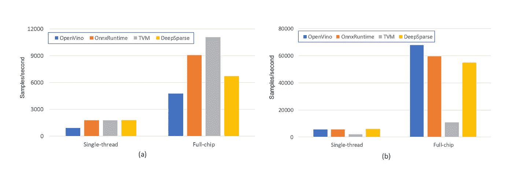
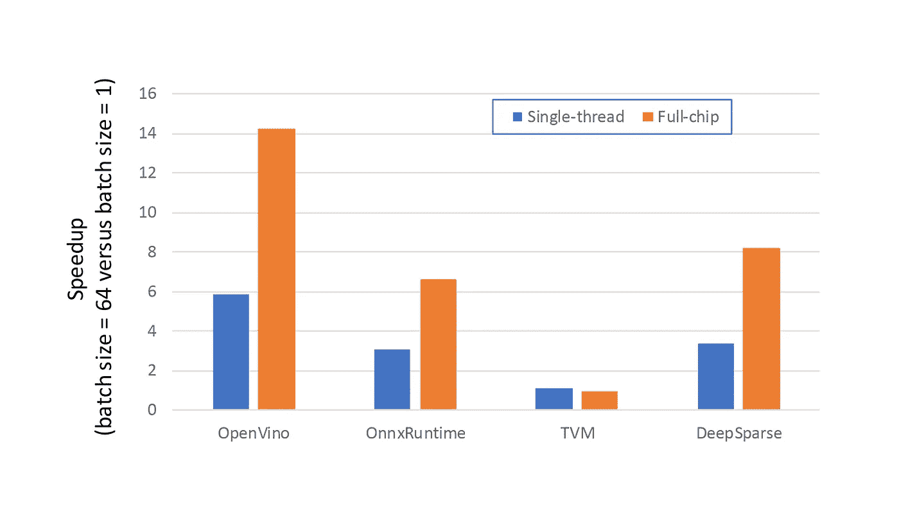
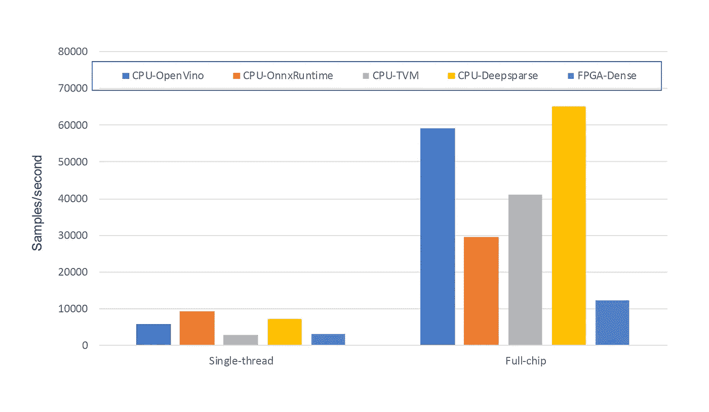
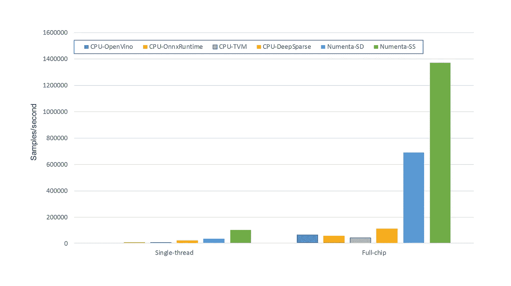
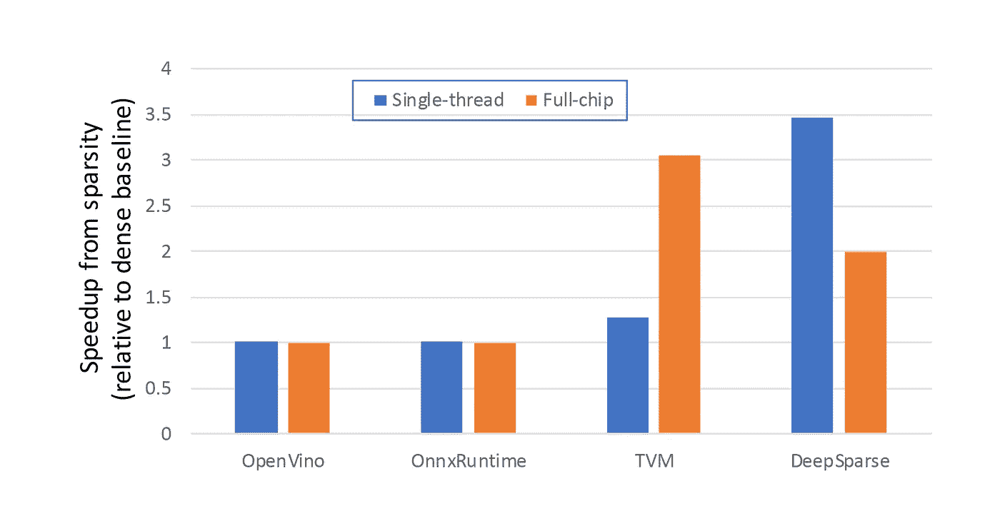

# CPU 可以利用稀疏性吗？

> 原文：<https://medium.com/codex/can-cpus-leverage-sparsity-ddf23362350b?source=collection_archive---------4----------------------->

由机器学习架构的 Numenta 主管 Lawrence Spracklen 撰写

在我的[上一篇博文](https://numenta.com/blog/2021/05/27/fast-and-accurate-sparse-networks)中，我讨论了我们最近的公告，即我们已经利用极度稀疏性将深度神经网络推理性能提高了 112 倍以上。这种性能改进是在 FPGA 平台上实现的，FPGA 固有的灵活性允许充分利用稀疏性带来的计算效率。

虽然这显然是一个令人印象深刻的加速，但当我们的稀疏模型在 FPGA 上的绝对性能与在其他通用计算平台上使用稀疏模型所能实现的性能相比时，这种加速甚至更有影响力。

# 什么是网络稀疏？

大多数当前的深度学习网络被称为“密集”网络。在这些密集的网络中，神经元高度互联，高度活跃。这种高活动性和互连性的结合确保了计算每个神经元的输出需要大量的计算，使得使用这些密集的网络成为一项昂贵的任务，需要大量的计算能力，并导致不可持续的能源成本。

在 Numenta，我们应用神经科学的见解来提高机器智能系统的性能和智能，我们很早就认识到这些密集的网络与人类的新大脑皮层几乎没有相似之处。在人类的新大脑皮层中，神经元相互连接非常稀少，每个神经元只连接到大脑皮层总神经元的一小部分。同样，在任何给定的时间点，只有百分之几的神经元是活跃的。我们可以将这些神经科学见解应用于深度学习，并创建“稀疏”的神经网络。令人难以置信的是，可以创建与可比的密集网络具有相同精度的稀疏网络，但是其中神经元连接到前一层中少至 5%的神经元，并且神经元激活被限制在 10%以下！

不难想象，创建连接数量比标准密集网络少 20 倍的稀疏网络，同时达到相当的准确性，需要复杂的技术。这是人工智能社区中一个活跃的研究领域，近年来有各种各样的技术被提出和改进。在许多情况下，稀疏网络是通过首先训练密集网络，然后作为最后一步，移除(或“修剪”)最不重要的神经元连接，直到达到期望的稀疏水平来创建的。通常，需要对稀疏网络进行某种程度的额外微调，以便在修剪后恢复精度。相比之下，Numenta 专注于能够训练稀疏网络的技术，并且还开发了有效限制神经激活的技术，从而能够创建极其稀疏的深度神经网络。

与相应的密集网络相比，这些极其稀疏的网络将计算网络输出所需的计算量减少了一个数量级或更多。因此，使用它们将会带来显著的性能和功耗优势。这正是 Numenta 在 FPGA 上演示的内容。在这篇博客中，我研究了 CPU 上的稀疏网络是否也是如此。

# CPU 和 ONNX 引擎

在这篇博文中，我将我们的 FPGA 稀疏模型性能与现代 CPU 上运行的稀疏模型性能进行了比较(我将在后续的博客中讨论 GPU)。为了创建在 CPU 上使用的稀疏模型，我使用了微软的开源库来修剪预先训练好的密集网络。由此产生的 CPU 稀疏网络与 Numenta [白皮书](https://numenta.com/assets/pdf/research-publications/papers/Sparsity-Enables-100x-Performance-Acceleration-Deep-Learning-Networks.pdf)中详述的稀疏网络具有相同的稀疏级别。

为此，我使用 PyTorch 来训练在[白皮书](https://numenta.com/assets/pdf/research-publications/papers/Sparsity-Enables-100x-Performance-Acceleration-Deep-Learning-Networks.pdf)中描述的基线密集卷积神经网络(CNN)。该模型是在谷歌语音命令(GSC)数据集上训练的深度 CNN 模型，该数据集由成千上万个人说出的 65，000 个一秒长的关键词话语组成。任务是从音频信号中识别出正在说的单词。该模型具有大约 250 万个参数，并且实现了 96%以上的准确性。

然后使用 [open ONNX 模型交换格式](https://onnx.ai/)导出 PyTorch GSC 模型，并在 24 核(48 个硬件线程)英特尔至强 8275CL(在 AWS 上，该系统为 C5.12xlarge)上调查峰值推理性能。选择这款处理器是因为它支持英特尔最新的 DL Boost 矢量神经网络指令，并提供充足的内存带宽，以确保计算性能不会受到内存瓶颈的不必要限制。一旦 CNN 网络被导出为 ONNX 格式，就有各种各样的开源和商用 CPU 推理引擎可以用来运行网络。使用几种常见的 ONNX 推理引擎和 ML 编译器对性能进行了研究，包括:

*   [英特尔 OpenVINO](https://docs.openvinotoolkit.org/latest/index.html)
*   [微软 ONNX 运行时](https://www.onnxruntime.ai/)
*   [阿帕奇 TVM](https://tvm.apache.org/)
*   [神经魔深疏](https://github.com/neuralmagic/deepsparse)

这些推理引擎分析网络，执行各种复杂的优化，并产生定制的实现，该实现被定制为在目标硬件平台上运行特定的网络。因此，使用这些 ONNX 引擎的推理性能明显快于 PyTorch 中通常可以实现的性能(即使使用 PyTorch TorchScript)。

# 密集网络性能

作为初始步骤，选择的 CPU 推理机用于运行基线密集 GSC 模型，并测量推理性能。这些实验的结果如图 1 所示。推断性能在很大程度上取决于批量大小(基本上就是有多少样本可供系统并行处理)。图 1(a)显示了只包含一个样品的批次的性能，图 1(b)显示了一批 64 个样品可用时的性能。

*图 1:使用普通 ONNX 引擎的密集 CNN 推理性能。(a)显示了当一个批次包含单个样本时获得的结果，以及(b)显示了当批次大小增加到 64 个样本时的结果。*

在图 1(a)和图 1(b)中，有两组不同的结果。最左边的“单线程”结果说明了当推理引擎被限制使用 48 个可用硬件线程中的一个时的推理性能。最右边的结果显示了允许引擎充分利用整个处理器时的性能(尽管它们通常需要手动指导来实现最佳性能)。

从图 1 中的结果可以得出一些有趣的观察结果:

*   即使当批量大小被限制为单个样本时，允许引擎使用多个硬件线程也提高了性能，说明引擎可以多线程化单个推理操作。
*   当多个样本可用于并行处理时，引擎可以显著更高效地利用可用的计算资源，即使在受限于使用单个硬件线程时也是如此，如图 2 所示。尽管没有用图形显示空间限制，但我们发现，对于大多数推理引擎来说，存在与批量大小相关联的“幻数”。选择一个“好的”批量可以将性能提高 20%或更多。选择的批量大小 64 是一个神奇的数字。
*   TVM 似乎对两个批量产生了相似的结果，虽然它是单样本推断的性能领导者，但它在 64 个样本运行中明显落后(如果 Apache TVM 项目的任何人有关于是否有我省略的酷标志/选项/开关来提高性能的指导，请 ping 我！).

*图 2:普通 ONNX 发动机批量较大时观察到的性能优势*

# 模型量化的影响

这个初始 ONNX 模型对模型权重和激活都使用 32 位浮点表示。FPGA 上使用的基线密集网络使用 8 位整数权重和激活。为了在 CPU 和 FPGA 性能之间进行公平的比较，我使用 ONNX 引擎附带的工具将 CPU GSC 模型中的权重和激活量量化为 8 位整数。请记住，这款英特尔 8275CL 处理器支持 AVX512 [VNNI](https://en.wikichip.org/wiki/x86/avx512_vnni) (矢量神经网络指令)指令，能够高效处理 INT8 量化网络。

该量化网络的结果如图 3 所示，包括与密集网络的 FPGA 性能的直接比较(这些实验中使用的 FPGA 是 Xilinx Alveo U250)。为了清楚起见，接下来我只显示 64 个批量的 CPU 结果，这在所有情况下都优于单个样本的结果。

*图 3:与 FPGA 密集网络结果相比，使用普通 ONNX 引擎的量化密集 CNN 的 CPU 性能*

从图 3 中，可以看到一些关键的观察结果。首先，对于标准的密集网络，24 核 CPU 的性能远远超过 FPGA。CPU 针对密集的常规计算进行了优化，显然非常出色！其次，将图 3 中的结果与图 1 中的结果进行比较，可以清楚地看出，除了 TVM 结果之外，量化带来的性能改善并不明显。这与预期相反，预期性能提升高达 4 倍(我们正在从 32 位浮点运算转向 8 位整数运算，使处理器的 512 位 AVX 向量指令能够并行处理 4 倍以上的元素)。经过调查，很明显 GSC 网络中最大池层的存在给 ONNX 量化工具集带来了问题。在某些情况下，甚至需要手动禁用某些层的量化来实现加速！总的来说，ONNX 中的量化支持似乎仍在发展，各种 ONNX 论坛上都有许多关于速度慢、脆弱和不可移植性的报告。

# 稀疏模型性能

最后，我们可以比较 CPU 上运行的稀疏网络与 FPGA 上运行的 Numenta 稀疏模型的性能。如前所述，在这篇博客中，我没有使用 Numenta 的技术来创建这些 CPU 网络。我们的稀疏模型针对 FPGA 进行了优化，不会在使用现有 CPU 工具的 CPU 上运行得更快。我们正在将我们的方法移植到 CPU 上。在这篇博客中，我使用当前可用的第三方工具来创建优化的 CPU 稀疏模型，即基于修剪。因此，为了创建 CPU 模型的稀疏版本，我使用微软神经网络智能软件来修剪原始的密集模型。CPU 稀疏模型的总体稀疏度为 95%，与我们的 FPGA 稀疏模型中使用的稀疏度一致。在图 4 中，运行在 CPU 上的稀疏模型的性能与运行在 FPGA 上的 Numenta 稀疏模型进行了比较。

图 4 显示了两个稀疏 FPGA 结果，分别称为 Numenta-SD 和 Numenta-SS。这些指的是 Numenta 创建的 FPGA 稀疏网络。Numenta-SD 是我们的稀疏-密集模型，其中权重是稀疏的，但激活被认为是密集的，而 Numenta-SS 是我们的稀疏-稀疏模型，它充分利用了权重和激活的稀疏性。CPU 上使用的稀疏 ONNX 模型是稀疏密集的。以一种高性能的方式同时利用 CPU 上的权重和激活稀疏性的能力仍然是一个公开的问题:零权重的位置是预先知道的，允许精心制作的利用它们的存在的内核被构造。零值“激活”的位置是动态的，迫使它们的位置在运行时被动态计算。据我所知，目前没有 CPU 推理引擎试图利用结合两种形式的稀疏性的乘法能力。

*图 4:使用不同 ONNX 引擎的稀疏 CPU CNN 模型的性能与 Numenta 的 FPGA 稀疏模型性能的比较*

图 4 中有许多有趣的观察结果。

*   在 FPGA 上运行的稀疏网络优于 24 核 CPU。差很多！事实上，FPGA 稀疏-稀疏(Numenta-SS)网络的性能比最佳 CPU 结果高出 12 倍以上。即使 FPGA 上较慢的稀疏-密集网络也比 CPU 快 6 倍！
*   虽然有点难以辨别，但是对于 OpenVINO 和 OnnxRuntime 来说，当迁移到稀疏网络时，观察到的性能改进为零。这个观察结果似乎并不是这个模型特有的，而且目前看来这些引擎并没有利用稀疏性的优势！
*   TVM 和深度稀疏都利用了模型的稀疏性。对于 TVM，目前不能利用 GSC 网络卷积层中的稀疏性，并且性能改善仅限于线性层。

虽然令人鼓舞的是，TVM 和深度稀疏引擎利用网络稀疏性来降低推理成本，但通过利用 CPU 上的稀疏性获得的性能优势比在 FPGA 上观察到的要有限得多，如图 5 所示。不幸的是，在 CPU 上观察到的稀疏 GSC 网络的性能改善(即 2–3 倍)并不罕见，文献中讨论的性能改善也在类似的范围内。这个 2–3 倍与 FPGA 实现的 112 倍形成鲜明对比。这种显著差异的原因有两个:

*   正如我在[之前的博客](https://numenta.com/blog/2021/05/27/fast-and-accurate-sparse-networks)中所讨论的，稀疏性引入的零值权重和激活的有效随机位置很难在具有面向密集计算的宽向量引擎的 CPU 上有效利用。对于 8 位权重和激活的计算，向量 VNNI 指令允许通过单个指令执行 64 次乘累加(MAC)运算。因此，在所讨论的稀疏度水平上(20 个元素中有 1 个是非零的)，与强力密集计算相比，即使与显式定位和处理非零开销相关联的较小开销也会迅速削弱性能优势。这与 FPGA 上的情况形成鲜明对比，FPGA 的灵活特性允许有效利用稀疏性。
*   FPGA 上的稀疏-稀疏网络同时利用权重和激活稀疏性。并行利用两个维度的稀疏性可以成倍减少执行推理所需的计算量，从而极大地提高 FPGA 的性能。

*图 5:与从密集 CNN 切换到 95%稀疏版本模型相关的 CPU 上的推理性能优势。在 FPGA 上，Numenta 使用稀疏技术实现了 112 倍的性能提升*

# 摘要

让我们总结一下讨论的内容:

*   深度神经网络通常是“密集的”和计算密集型的。
*   有可能创建“稀疏”神经网络，其匹配密集网络的精度，但是通常需要 10 到 100 倍的较少计算来计算结果。理想情况下，我们期望看到与这种降低相称的性能改进和/或功率节省。
*   网络权重和激活可以从典型的 32 位浮点表示量化为 8 位整数。这不仅减少了模型的内存占用，还为使用向量指令的系统提供了加速，向量指令通常可以并行处理 4 倍以上的操作。
*   不幸的是，GSC CNN 网络的量化改进是混合的，CPU 对量化 ONNX 模型的强大支持似乎仍在发展。
*   对 CPU 和 FPGA 上的密集 GSC 网络性能的比较显示，CPU 处于非常有利的位置。CPU 针对密集的常规计算进行了优化，并擅长执行密集的网络。
*   遗憾的是，在 CPU 上观察到的稀疏网络的性能优势被弱化了。对于 95%的稀疏 CNN，相当于神经权重减少了 20 倍，推理性能的提高被限制在 2-3 倍左右。事实上，对于两个最著名的 CPU 推理引擎来说，相对于密集模型，没有任何改进。这不是一种异常现象，这些加速与 CPU 上稀疏网络通常观察到的情况一致。
*   在 FPGA 上，Numenta 通过稀疏性实现了 112 倍的性能提升。稀疏性带来的相对加速不仅令人印象深刻，在 FPGA 上运行的 Numenta 稀疏-稀疏网络的性能比在 24 核 CPU 上运行的稀疏网络高出 12 倍以上。

总之，从相对和绝对角度来看，稀疏性在 FPGA 上实现的令人印象深刻的性能优势清楚地表明了稀疏模型的潜力。不幸的是，虽然 FPGA 的灵活特性使其成为稀疏模型的理想平台，但观察到针对常规密集计算进行优化的 CPU 难以有效利用稀疏性带来的计算减少。需要新的稀疏技术来在 CPU 上实现更大的性能优势。

在后续的博客中，我不仅会对比稀疏网络在 GPU 上的性能，还会讨论如何使用 Numenta 的稀疏技术来控制稀疏网络中非零元素的放置，同时保持模型的准确性，从而创建更适合在 CPU 上高效执行的稀疏模型…敬请关注…

如果你喜欢阅读这篇文章，请点击下面的“鼓掌”图标，推荐给你的关注者。要了解我们的工作如何帮助推进大脑理论和机器智能的发展，请访问我们的 [*网站*](https://numenta.com/) *或关注我们的*[*Twitter*](https://twitter.com/Numenta)*和* [*脸书*](https://www.facebook.com/OfficialNumenta/) *。*

*原载于 2021 年 6 月 14 日 numenta.com**的* [*。*](https://numenta.com/blog/2021/06/14/can-cpus-leverage-sparsity)