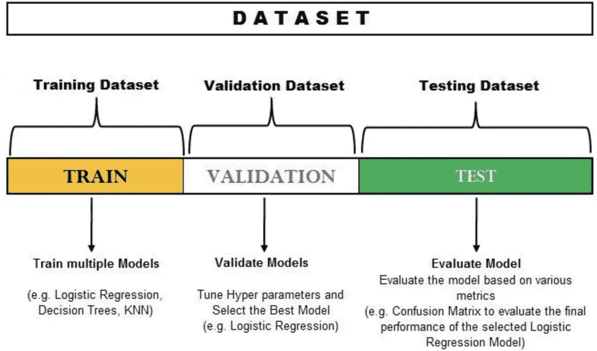
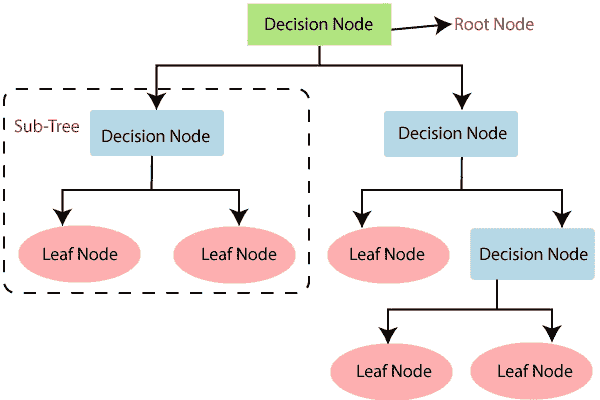
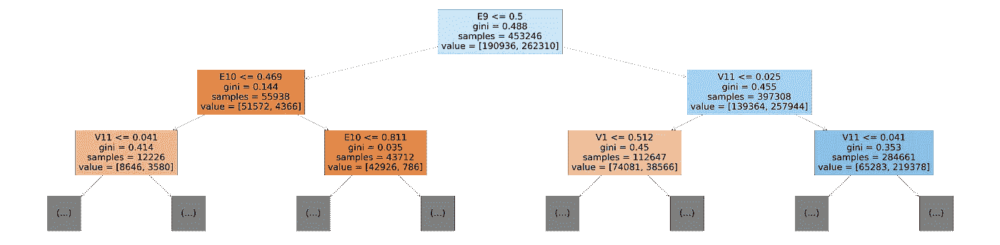
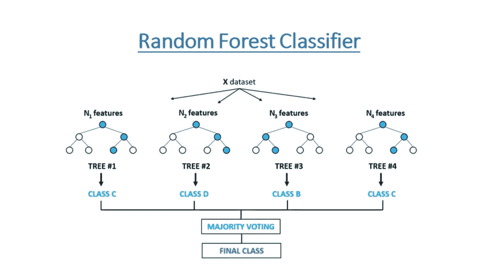
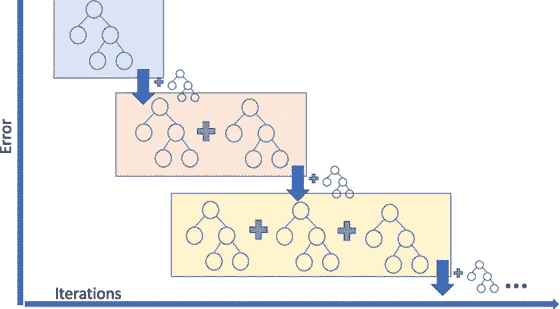

# 驾驶员的警觉性可以预测吗？

> 原文：<https://medium.com/codex/can-driver-alertness-be-predicted-721728e26a67?source=collection_archive---------15----------------------->

## 使用 Python 和机器学习算法的驾驶员警觉性分析和预测

Getty Images 上的无系统图片

> 要查看完整代码，请点击[此处](https://jovian.ai/herambhd03/zerotogbms-project)。

根据国家安全委员会(NSC)的数据，每年，疲劳驾驶导致大约 **100，000 起车祸**， **71，000 起受伤**，以及 **1，550 起死亡**。根据美国汽车协会的数据，疲劳驾驶导致了大约 9.5%的车祸。

我们将设计一个分类器，利用驾驶时获得的数据检测和分类驾驶员是否警觉，并观察影响驾驶时个体警觉性的重要特征。

分类器是一种机器学习算法，它将数据分成一组或多组“类”这些“类”是我们的目标标签/类别，在这种情况下是简单的“是”或“否”,表示驾驶员是否警觉。

**方法**

该项目使用 *Python、Pandas* ，以及 *sklearn* 、 *matplotlib* 和 *seaborn* 等库对数据进行操作、可视化并进行预测*。使用了三种不同的分类器来比较和选择最适合的算法——决策树分类器、随机森林分类器和 XGBoost 分类器。*

顾名思义，决策树分类器是一个包含一组决策的树，这些决策是根据数据的行为逐步做出的。在决策树的每一步(称为节点),我们试图在特征上形成一个条件，以分离数据集中包含的所有“类”。

虽然决策树分类器可以提供很好的标签分类，但是更有效的策略是组合用稍微不同的参数训练的几个决策树的结果。这种算法叫做*随机森林分类器*。这背后的想法是，平均后，每棵树产生的误差将相互抵消。

XGBoost 分类器是一个梯度增强分类器。术语“梯度”指的是算法旨在逐迭代地减少损失函数的事实。“助推”是一种特殊类型的学习技巧，可以将一群弱学习者转变成强学习者。因此，梯度提升分类器将新的预测器拟合到由前一个预测器产生的残余误差，以提高精度。

以下是涉及的步骤:

1.  下载数据
2.  数据分析和清理
3.  特征缩放
4.  分成训练集、验证集和测试集
5.  训练决策树分类器
6.  训练随机森林分类器
7.  训练梯度增强模型

# 下载数据

第一步是下载我们打算使用的数据。该数据集可在 https://www.kaggle.com/c/stayalert/data?获得 select = for train . CSV。使用 Jovian 的 [opendatasets](https://github.com/JovianML/opendatasets) 库，我从 [Kaggle](https://www.kaggle.com/stanford-open-policing/stanford-open-policing-project-bundle-2) 下载了数据。

# 数据分析和清理

为了使数据准备好用于机器学习模型，我们必须首先分析它，并删除任何特殊的数据。

卢克·切瑟在 [Unsplash](https://unsplash.com?utm_source=medium&utm_medium=referral) 上拍摄的照片

前两列似乎是关于驱动程序的一些信息。第三列表示驾驶员是否警觉——1 表示他/她警觉，0 表示他们不警觉。接下来的 8 列标题是 P1，P2，…..，P8 代表生理数据。接下来的 11 列带有标题 E1，E2，…..，E11 代表环境数据。接下来的 11 列标题是 V1、V2……..V11 表示车辆数据。

# 特征缩放

由于每列中的值都在变化，我们需要将它们调整为 0 到 1 之间的值，以便我们可以比较它们各自的权重，并了解这些参数如何影响驾驶员的警觉性。

# 培训、验证和测试集

为了训练我们的数据，我们需要一个训练集。为了在以前看不到的数据上测试这个数据，我们将看到它在验证集上的表现。最后，我们将看看测试集，它代表了我们的模型在实际应用中的表现。

训练集有 75%的数据，验证集有 25%的数据。测试套件已单独提供。

# 决策树分类器

我们可以使用 sklearn.tree 中的 DecisionTreeClassifier 来训练决策树。

在决策树中，为了预测给定数据集的类别，算法从树的根节点开始。该算法将根属性的值与记录(真实数据集)属性的值进行比较，并根据比较结果，沿着分支跳转到下一个节点。

模型的决策树

这显示了主要影响驾驶员警觉性的特征

看来，车辆和环境因素似乎比物理因素对驾驶员的警觉性有更深刻的影响。

# 超参数训练和调整

通常，我们不知道最佳的模型架构，因此我们希望能够探索一系列的可能性。**超参数**定义模型架构，搜索理想模型架构的过程称为*超参数调整*。

为了防止过度拟合训练集并减少验证集的错误，我们可以调整各种超参数，使我们的模型表现更好。

对于决策树分类器，我们在训练集上的准确率为 100%，在验证集上的准确率为 98.647%，在测试集上的准确率为 67.266%。因此，我们可以说决策树分类器不是预测我们结果的最佳模型。

# 随机森林分类器

随机森林通过平均/组合几个决策树的结果来工作。我们将使用 sklearn.ensemble 中的 RandomForestClassifier 类。

对于随机森林分类器，我们在训练集上的准确率为 100%，在验证集上的准确率为 99.398%，在测试集上的准确率为 80.198%。随机森林分类器无疑比决策树分类器做得更好。

# 梯度推进模型

术语“梯度”指的是每个决策树被训练的目的是减少来自前一次迭代的损失(类似于梯度下降)。术语“提升”是指训练新模型以改进现有模型的结果的一般技术。为了训练一个 GBM，我们可以使用 XGBoost 库中的 XGBRegressor 类。

对于随机森林分类器，我们在训练集上的准确率为 100%，在验证集上的准确率为 99.569%，在测试集上的准确率为 86.954%。梯度推进模型似乎是最好的选择，因为它产生了更大的准确性，而且计算速度很快！

# 总结和最终想法

基于各种物理、车辆和环境因素，可以以大约 87%的准确度预测驾驶员的警觉性！这表明，事实上，使用机器学习分类器来预测驾驶员的警觉性是可能的。

*要更详细地了解所有这些步骤，请点击 *查看完整的项目笔记本* [。](https://jovian.ai/herambhd03/zerotogbms-project)*