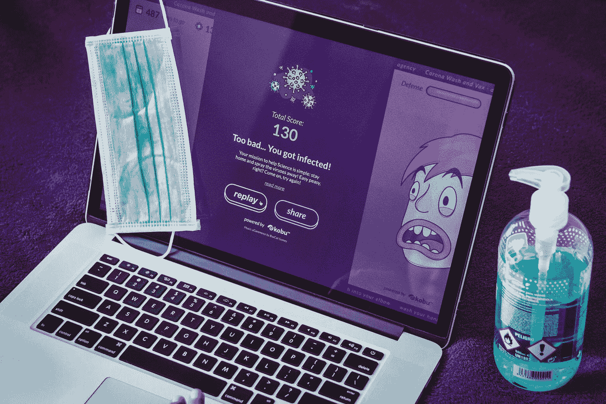

# 我可以对我的恶意软件感染使用青霉素吗？

> 原文：<https://medium.com/codex/can-i-use-penicillin-on-my-malware-infection-661cc8f6ea07?source=collection_archive---------41----------------------->

## 不，你不能。恶意软件就像疱疹:无处不在，抗生素也杀不死它…哎呀！当谈到恶意软件时，最好了解如何防止它。因此，我们将涵盖识别和预防，以及它是如何偷偷安装在我们的机器上。此外，能够识别感染症状也非常方便。外加恶意软件删除技巧！

照片由 [KOBU 机构](https://unsplash.com/@kobuagency?utm_source=medium&utm_medium=referral)

# 恶意软件感染

当谈到感染时，我们需要注意两个概念:*威胁媒介*和*攻击媒介*。*威胁向量*指的是一种方法，攻击者可以通过这种方法访问受害者的机器。*威胁载体*的示例包括未打补丁的软件、网络钓鱼活动、USB 闪存驱动器等等。通常，这只是描述了允许未授权访问的潜在漏洞。另一方面，我们有攻击媒介。攻击媒介更进了一步，指的是用来访问受害者的机器并使其感染恶意软件的方法。

# 常见的交付方式

通常，恶意软件有三种传播途径。这些包括

*   软件——就像下载一样
*   消息—电子邮件和即时消息
*   媒体设备—CD、USB 和软盘(过去)

即使有危险，也要喝点水。照片由[埃伦·怀特](https://unsplash.com/@evwhite2?utm_source=medium&utm_medium=referral)

另一件需要警惕的事情是关于*水坑*的想法。这有助于想象那些自然纪录片中的场景，尽管有狮子或鬣狗在场，斑马还是在水坑边喝水。从数字的角度来说，一个水坑指的是像某人每天经常光顾的网站一样的东西，比如脸书或学校的在线学生仪表板。攻击者可以利用水坑挑选受害者作为目标，还有其他功能。

攻击者可以通过实施名为*域名抢注*的策略来利用水坑。这基本上是利用了人们拼写错误的网址。攻击者将复制脸书的网站，但会使用 fasebook.com 的网址来吸引那些不小心拼错网址的受害者。在这个 copy-cat 站点上，攻击者可以获取受害用户可能输入的任何数据，例如登录凭据。

攻击者还可以利用水坑收集电子邮件，为网络钓鱼活动做准备。

## 僵尸网络和僵尸

攻击者可以使用您的计算机资源来实现他们邪恶的意图。他们会把你的电脑变成僵尸！僵尸是指受黑客的主节点(C2)控制的受损计算机。当黑客控制了几台僵尸计算机时，这就叫做僵尸网络。换句话说，僵尸计算机受恶意黑客操作的 C2(命令和控制)节点控制，以创建僵尸网络。

他们相当狡猾，因为大多数时候你可以完全访问你的计算机，但在后台，几乎不引人注意的一部分资源将被黑客利用。这可能看起来不多，但当黑客积累了几千个僵尸，他们就可以利用一些严重的计算能力。

当黑客积累了它所需要的僵尸之后，它会开始使用它们作为支点/代理来服务他们的色情网站或其他类型的黑暗网站。他们还可以使用僵尸网络发送垃圾邮件，进行 DDoS 攻击，甚至挖掘加密货币。基本上，当黑客需要执行处理器密集型功能时，就会利用僵尸网络。

## 主动拦截和权限提升

主动拦截是“中间人”的另一种说法对于那些不知道这个术语的人来说，它指的是黑客计算机被放置在发送方和接收方之间，能够捕获或修改发送方和接收方之间的流量。

**权限提升**发生在黑客利用系统中的设计缺陷或 bug 获得普通用户无法访问的资源时。这是黑客获取 root 访问/管理员权限的地方。

## 后门、逻辑炸弹和复活节彩蛋

**后门**最初被用来绕过正常的安全和认证。这是一种方便的方式，因此开发人员无需登录就可以访问任何内容。然而，这是在 80 年代和 90 年代出现的，当时攻击并不常见。如今，后门编码被认为是非常糟糕的安全实践。然而，如今黑客会试图通过在受害机器上放置远程访问特洛伊木马(RAT)来创建自己的后门，以保持持续访问。

**逻辑炸弹**是一种恶意代码，它被插入到程序中，只有在满足特定条件时才会执行，比如只在特定的一天执行。

此外，**复活节彩蛋**也值得一提，不是因为它们是恶意的，而是因为它们制造了更多的漏洞。当这种类型的代码被调用时，隐藏的消息或秘密特征可能被解锁。这些通常是无害的，目的是为了好玩，但它们确实创造了更多被利用的可能性。

一般来说，不管意图如何，根据安全编码标准，不应使用后门和复活节彩蛋！

# 感染的症状

如果您的计算机表现出以下一种或几种症状，则可能受到了感染:

*   运行速度变慢
*   锁定/频繁停止
*   如果计算机经常重启或崩溃
*   新图标出现或旧图标消失
*   防病毒软件被阻止运行
*   硬盘、文件或应用程序不再可访问
*   出现奇怪的噪音
*   异常错误消息
*   显示器看起来很奇怪
*   混乱的打印输出
*   显示双文件扩展名，如`textfile.txt.exe`
*   创建了新文件/文件夹，或者文件/文件夹丢失或损坏
*   系统还原将不起作用
*   弹出广告
*   浏览器上的默认主页更改

# 移除恶意软件

*   识别恶意软件感染的症状-如果怀疑是恶意软件，则备份任何重要文件并运行扫描。
*   隔离受感染的系统—关闭网卡/断开网络电缆，将受感染的机器与生产网络隔离
*   禁用系统恢复(如果使用的是 Windows 计算机)—确保 Windows 不会拍摄受感染计算机的快照
*   修复受感染的系统-重新引导至安全模式并转到预安装环境，然后运行反恶意软件
*   启用系统还原并创建一个新的还原点—您将需要一个最新的“已知良好的备份”
*   之后，提供最终用户安全意识培训(如果您在某个组织中这样做)
*   如果怀疑有引导扇区病毒，请从外部设备重新启动计算机，然后对其进行扫描

# 防止恶意软件

下面，我将列出各种类型的恶意软件以及您可以用来保护自己的防范方法:

**病毒** —防病毒、服务包更新、操作系统补丁、良好的基于主机的防火墙，尽量避免在非 HTTPS 网站上输入数据

**蠕虫、特洛伊木马、勒索软件** —反恶意软件，确保您的反恶意软件是最新的，这些类型的恶意软件是通过检测它们的交付形式来防止的

**间谍软件** —反间谍软件，必须保持最新；将浏览器安全设置设置为不可信的方法，以防止弹出窗口和跟踪 cookies

**rootkit**—难以检测，但一些扫描程序可以在安装之前检测到包含 rootkit 的文件；拆卸很困难，最好从已知良好的基准重新映像机器

**垃圾邮件** —垃圾邮件过滤器

组织应该实施的其他一些快速预防技巧:

*   验证电子邮件服务器未配置为开放邮件中继或 SMTP 开放中继
*   从网站中移除电子邮件地址
*   使用白名单和黑名单

最后，这通常被认为是最具成本效益的预防策略，培训和教育组织内的最终用户:

*   自动更新反恶意软件和扫描他们的机器
*   定期更新和修补操作系统和应用程序
*   使用安全的网上冲浪实践，也就是良好的数字卫生

…现在你知道了。我希望这有助于您识别、防止和/或清除您机器上的任何有害物质。

感谢阅读