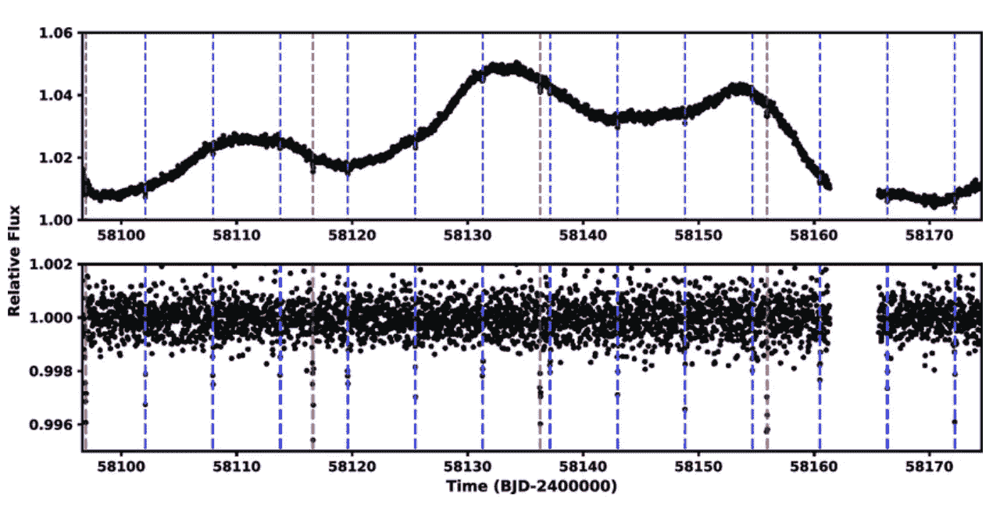
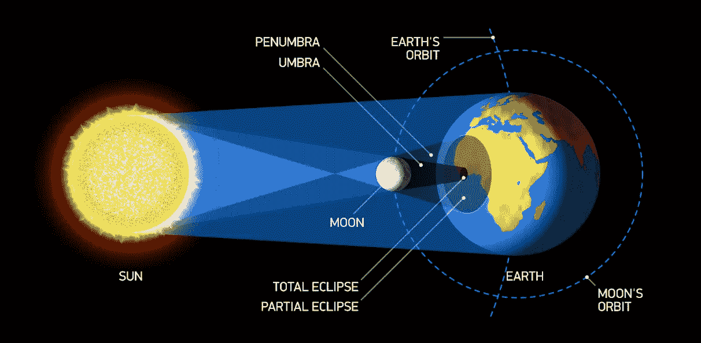
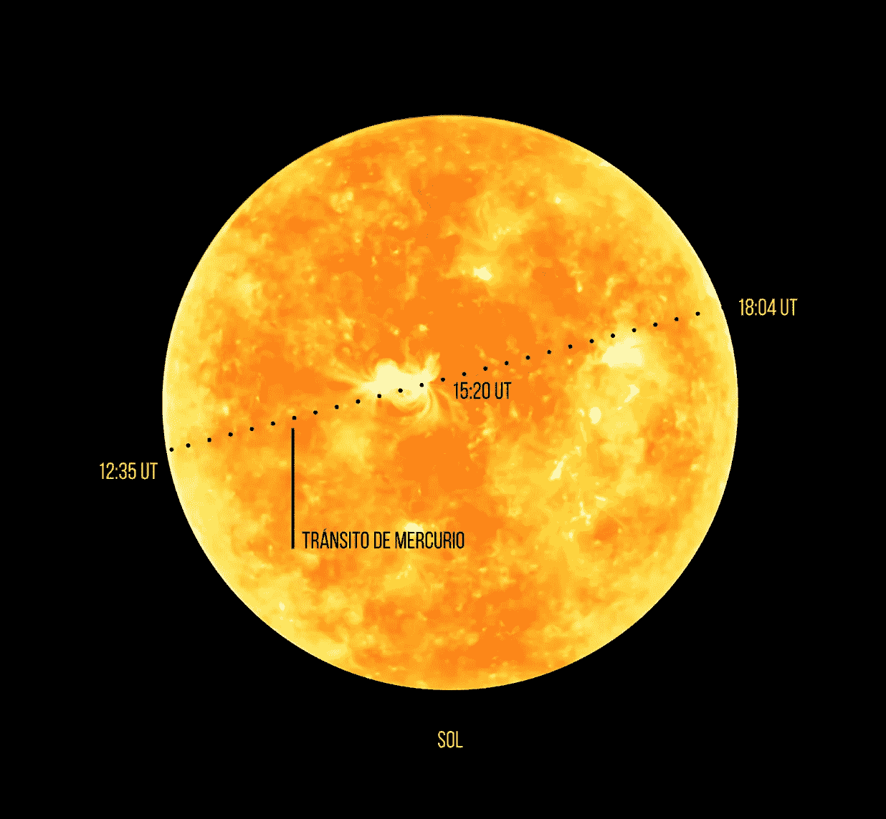
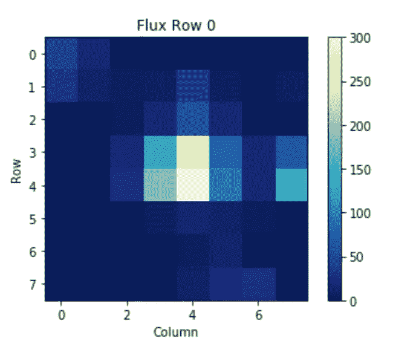
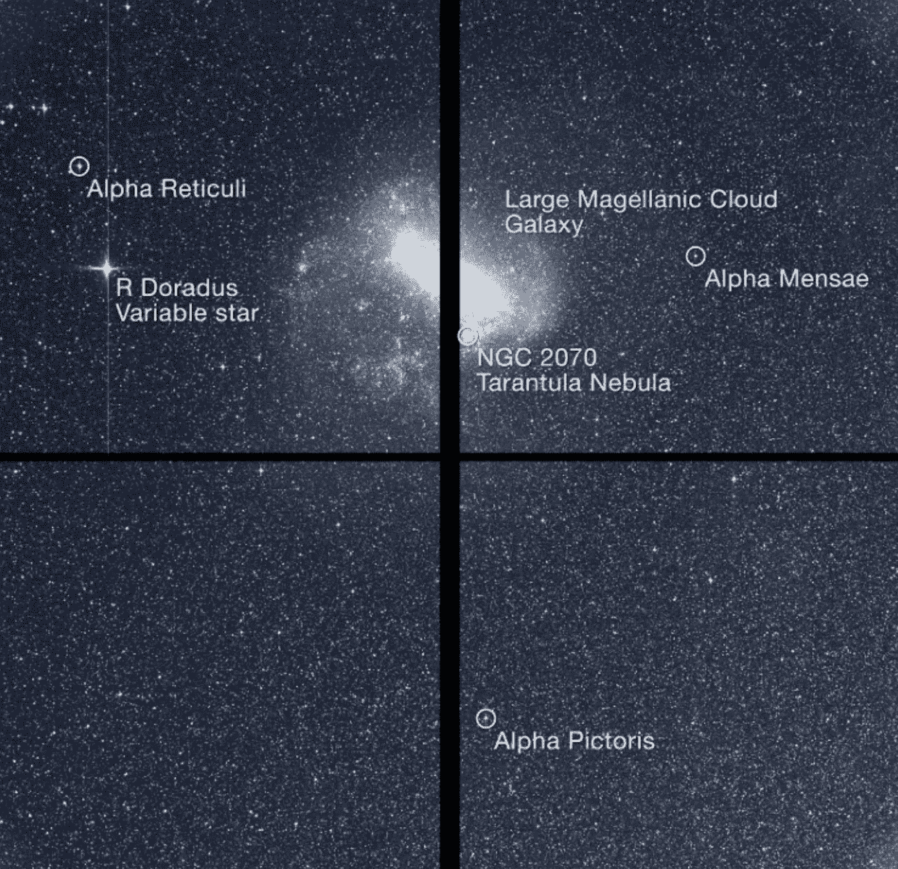
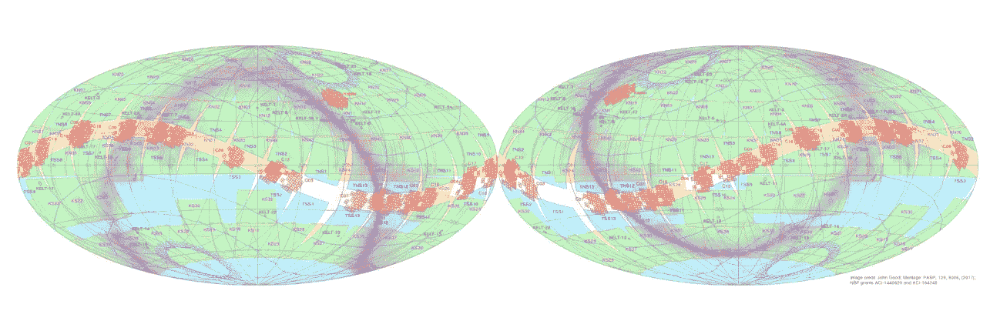

# 机器学习能帮助我们找到新地球吗？

> 原文：<https://medium.com/codex/can-machine-learning-help-us-find-new-earths-ddab467435a6?source=collection_archive---------14----------------------->

## 寻找系外行星的挑战可以通过机器学习和深度学习来解决

dyvenia 使用 Canva 生成的图像

随着机器学习(ML)和深度学习(DL)技术变得越来越复杂，它们正被应用于越来越多的任务。一个这样的应用是寻找系外行星。在这篇博文中，我们将讨论后者目前是如何完成的，并特别关注 Transit 方法以及机器学习在成功克服相关挑战中可以发挥的作用。

# 介绍

机器和深度学习技术将继续存在。它们的自动化特性和最强的学习能力提供了管理任何类型数据的可能性。其多种多样的技术支持多种学科，包括天体物理学，特别是寻找系外行星，与所谓的凌日法特别相关。

一颗**系外行星**是一颗在我们太阳系之外围绕一颗恒星运行的行星。大多数系外行星都是用**径向速度法**发现的，这种方法可以探测到恒星因绕其运行的系外行星的引力牵引而产生的微小摆动。其他探测系外行星的方法包括**凌日测光**，它寻找当一颗系外行星从它面前经过时恒星亮度的轻微下降，以及**直接成像**，它直接捕捉系外行星的图像。

在本文中，我将重点介绍 Transit 方法。这种方法可以用一句话来概括:“凌日是指系外行星阻挡光线从它所围绕的恒星到达地球”。然而，探测一个是一项极其复杂的任务。

不要太专业，寻找系外行星的主要探测地点在外层空间，不受我们热爱的大气层的影响，原因很简单，我们从太空接收的大部分光线都被它吸收了。这就是为什么当太空望远镜被用来探测系外行星时，寻找系外行星的技术得到了极大的发展。首先是 [COROT](https://en.wikipedia.org/wiki/CoRoT) ，然后是 [Kepler](https://en.wikipedia.org/wiki/Kepler_space_telescope) /K2，以及最近的 [TESS](https://en.wikipedia.org/wiki/Transiting_Exoplanet_Survey_Satellite) ，为我们在我们所围绕的各种系外行星中拓展视野开了一枪。截至 2022 年 8 月 23 日， [NASA 系外行星档案](https://exoplanetarchive.ipac.caltech.edu/)已经确认存在 5071 颗系外行星，有超过 7000 个可能的候选者。

当我开始攻读博士学位时，最令人畏惧的事情之一是必须处理大量的数据。开普勒太空望远镜最近完成了它的主要任务，幸运的是，美国国家航空航天局能够从其指向系统的双重故障中恢复它，继续执行更名为 K2 的任务。

# 两个挑战:太多的光曲线和太多的噪音

为了让我们对寻找系外行星的问题有一个概念，开普勒在第一次任务中产生了大约 150，000 条光变曲线，在 K2 任务的近 6 年运作中，每个季度产生大约 40，000 条光变曲线。**光变曲线，**简而言之，就是一个天体或区域的光强作为时间函数的曲线图。

换句话说，仅开普勒任务，我们就有超过一百万条光变曲线需要分析和分类。在 TESS 任务中，我们收到了数百万条光变曲线。这是当今该领域面临的最大问题之一:

*   存在大量的数据需要分析，这对于一个专家或者甚至一小组专家来说将需要数年的工作，并且这几乎肯定会导致分析和分类中的错误。
*   进一步的问题来自于处理充满恒星的图像和明确地选择目标恒星:
*   为每颗恒星选择合适的孔径，以尽可能减少来自附近恒星的信号污染。

让我们再次跳到光曲线的定义。最简单实用的定义是:“单位收集面积(我们望远镜的直径)和单位观测时间内到达地球的实测光量”。这种形式的观测被天文学家称为“光度学”，通常情况下，开普勒光线曲线具有图 1 所示的形状。

**图 1:** 开普勒太空望远镜获得的 K2–264 光变曲线。两颗凌日行星的行星系统。垂直的红线和蓝线表示它们的位置。上图对应展平前的光线曲线，下图对应展平后的光线曲线。([来源](https://www.researchgate.net/figure/Light-curve-of-K2-264-from-K2-Campaign-16-The-top-panel-shows-the-light-curve-after_fig1_328256388))

但要理解这个定义及其在天体物理学领域的具体应用，最好回答以下问题:光变曲线是如何获得的，什么是系外行星凌日？

为了理解这一点，我们需要仔细看看我们的太阳系。到目前为止，每个人都知道日食背后的动力学，本质上，就是我们的恒星太阳的光被我们的卫星月球阻挡(见图 2)。

**图二**:日食示意图([来源](https://ar.pinterest.com/pin/755690012459763383/)

我们可以把这种阻挡太阳光的现象应用到离太阳最近的行星水星上。当水星位于太阳和连接地球和太阳的假想线(视线)之间，挡住一小部分光线时发生的现象被称为凌日。通常这种现象用肉眼是看不到的，我们需要用望远镜才能看到细节(图 3)。

**图 3**:2019 年 11 月 11 日，太阳的图像和水星凌日在不同时间的表现。

想象一下，我是一个伟大的业余摄影师，我把相机改装成望远镜，在水星凌日期间拍摄太阳的照片。早上，我拍一张照片(时间单位，t)，通过将太阳所在的相机的所有像素相加，我获得了一些计数(光子)，我将把这些计数转换成一些可测量的物理量。我们姑且称这些量为“光度”(L)。获得了一个点(t，L)，然后，我以有规律的方式取另一个，再取另一个，以此类推，直到夜晚到来。如果我现在制作学校的典型笛卡尔图形表示，假设“x”轴为时间轴，“y”轴为太阳的光度，我们会看到与您在下面的视频中看到的非常相似的东西。

现在我们清楚了什么是光变曲线，让我们把同样的推理应用于其他恒星。然而，由于它们的光度非常小，从地球表面观察其他行星的凌日非常困难，我们必须去太空才能看到它们。水星凌日与从太空观察到的系外行星凌日之间的差异在于观察时间，即我们如何拍摄照片，对于开普勒/K2 太空任务，通常是 3 个月内拍摄 3 秒钟。这就是我们在图 1 中观察到的情况。

# 开普勒和苔丝:两条路，一个目标

在不涉及细节的情况下，区分开普勒/K2 拍摄的照片和 TESS 拍摄的照片非常重要，因为它们是完全不同的解决方案。开普勒任务的技术限制意味着它只能从组成它的 84 个 CCD(电荷耦合器件)中的每一个向地球传输几个像素的小片段。当我们谈到 CCD 时，像素的工作方式与平板电视中的类似:但它们不是发射光，而是收集光，或者更确切地说，是电子。这些像素剪裁如图 4 所示。

**图 4:** 图像以目标恒星为中心，附近至少有三个源能够污染样品([源](https://spacetelescope.github.io/notebooks/notebooks/MAST/Kepler/Kepler_TPF/kepler_tpf.html))。

相比之下，TESS 任务的照片空间分辨率低得多，但采用了更好的数据传输技术，能够将 4 个 CCD 收集的所有信息传回地球。在图 5 中可以看到该信息的详细示例。

**图 5**:TESS 太空望远镜拍摄的单个 CCD 图像，显示了大麦哲伦星云及其周围的数千颗恒星。

两台望远镜的技术差异使得观测策略(拍照)完全不同。虽然最初的开普勒任务侧重于观察天空的一个角落，其扩展的 K2 任务针对黄道平面的某些区域，但 TESS 空间任务仍然继续每年观察半个天穹。参见图 6。

**图 6** :天穹地图。橙色表示开普勒/K2 太空任务的视野。绿色的是 TESS 太空任务的视野([来源](https://keltsurvey.org/about))。

从广义上讲，开普勒/K2 任务专注于天空的小区域，拍摄了近 100 万颗恒星的小图像片段，而 TESS 任务能够拍摄几乎整个天空(有无数颗恒星)的照片，并将整幅照片发送到地球。

一旦解释了问题并简要介绍了每次飞行任务的特点，科学界面临的挑战是找到最佳方式来获取存储在每张照片中的宝贵信息。到目前为止，该解决方案的效果比效率更好，基本上，它包括从先前由固定孔径定义的那些像素中提取信息，给定先前从星表中获得的恒星光度。

对于开普勒/K2 的情况，问题更简单，但不是微不足道的，因为通常恒星在照片剪切的中心，这使得如果我们发现一个信号，它更有可能与孔径内的主源相关联。但是也有可能在源中探测到的信号被背景或附近的恒星污染，其强度足以将其信号引入选定的孔径。此外，目标星之前已经被选择为具有足够高的相对星等，使得来自背景星的污染最小。

美国宇航局为开普勒/K2 采用的解决方案很简单，根据每颗恒星的相对星等为其应用一个固定的孔径，这意味着在 80%至 90%的情况下它是一个有效的孔径，并允许这种简单的技术来探测系外行星信号。

对于 TESS 望远镜来说，事情发生了实质性的变化。在这种情况下，我们在每个 CCD 中有数千颗恒星，因此对每颗恒星的选择必须是个体化的和个性化的，并且具有比开普勒更低的空间分辨率，很难使这些恒星没有来自另一个附近源的相关量级的污染。

TESS 任务采用的解决方案取决于研究小组对图像的分析，因为美国航天局分发的图像没有经过任何事先过滤，即我们获得了空间望远镜直接拍摄的图像，我们需要对这些图像进行“清理”和处理，以提取高质量的数据。在大多数(如果不是全部的话)研究小组中，使用前述的恒星和星系目录来选择光源，然后选择具有最高相对星等的光源。除了孔径的选择之外，这将导致额外的缺点。光源就在星表上说的地方，因为，正如我们所知，天穹中的所有光源都有自己的运动。

# 表面闪电成问题

说了这么多，还是花几行字更好的解释一下问题吧。从空间进行光度测量的最大缺点之一是缺乏对测量系统组件的监控。但这意味着什么呢？我们根本没有对仪器进行校准的物理通道，在我们的特殊情况下，除了在实验室从地球上进行的最后一次测量之外，很难知道每张照片的像素灵敏度随时间的退化情况以及其他参数。

空间望远镜中空间分辨率的特殊条件，即光源仅占用几个像素(最多几十个像素)，以及缺乏校准，使得孔径和校准都成为至关重要的任务。

至于校准，几种成熟的技术与不同的方法一起使用，可以得到非常好的结果。而光圈的选择，除了设定一个固定的光圈，还是一个有待推敲的问题。可用于研究的大量光源意味着对这个问题没有给予太多的重视，由于有太多的光源要搜索，这导致搜索信号的效率损失。

开普勒/K2 和 TESS 空间任务都存在这个问题，第一个任务处于完全数据丢失的状态，并且有可能继续找到更多有希望的信号。而 TESS 仍在运行，在确定亮源位置和改进孔径恢复方面有很大的改进潜力。考虑到我们在测量时可能遇到的各种缺点，实现像素拾取的自动化至关重要，因为:

*   选择天空背景。在像素如此之少的照片中，根据获取光线曲线的方法，获取天空背景进行比较是非常重要的。
*   选择图像中出现的其他光源，并遮蔽它们，使它们不会将信息引入我们的光圈。
*   丢弃来自附近光源的坏列像素，这些坏列已经使 CCD 饱和，并最终覆盖了比预期更多的像素。

一般来说，第一点在选择开场时是最不重要的。然而，另外两点至关重要。对于 TESS 来说，问题甚至更大，因为它的空间分辨率，正如我们已经提到的，甚至更低，并且找到一个与其余光源充分分离的明亮光源以获得良好的孔径是非常不可能的情况。此外，大部分的源都没有编目或编目只在天空的某些限制部分，这使得预先知道附近的源非常困难。但是，即使我们知道它们，每个源的运动使得我们今天所知道的关于它的位置在一定时期内是有效的，但是我们谈论的是几年。的确，盖亚在这一点上做了非常重要的工作，随着时间的推移，这个问题正在减少，但是我们必须考虑到，一旦任务结束，这个问题将会再次出现。

这就解决了所有的问题吗？没有什么比这更偏离事实了。对于开普勒来说，看到 150，000 条光曲线对于一个专门研究光曲线的人来说不是一件容易的事情，如果你把它分给几个有经验的人，事情会有所改善，但缺点仍然存在。这些转化为更多的人，更多的评估标准，对一些人来说可能是一个信号，对其他人来说不是，或者只是被忽视了。世界各地有不同的研究小组，这一事实使得开普勒解决了在数十万条曲线中丢失一些信号的不便，但 K2 的情况严重恶化，因为它增加了噪声和近百万条光曲线要研究，使得许多周期性信号在开始时没有被注意到。对于 TESS，从人的角度来看，情况简直无法控制，因为有几百万条光变曲线，您至少需要几个全职人员来整理所有的光变曲线。这种解决方案是不可行的，因为仅仅是厌倦执行一项常规任务的事实，就会使你在执行任务时失去效率。

# 人工智能在科学中的应用:升级！

我们如何解决这些问题，以便在这些类型的太空任务中优化对系外行星的搜索？我们有几个选择。

首先，我们可以将光圈的选择问题和光源的单义定位问题结合在一起。在这些问题中，我们可以使用称为图像识别的技术，它可以包括:

1.  检测图像中的光源。
2.  每个光源的分段，即图像中每个光源所占据的像素的特定标识。

下一个大问题是我们将获得的成千上万条生成的光变曲线的分类(几乎肯定有数百万条)。从定量的角度来看，它们都是时间序列，但节奏不同，最重要的是，它们都有相同类型的信息，尽管获取信息的方式不同。

传统上，时间序列是用自回归预测模型来研究的。然而，神经网络由于其多功能性和准确性，特别是与卷积网络结合的递归网络，近年来经历了非常快速的增长。实施这些技术以便能够对任何类型的光变曲线进行联合分类，对于能够通过凌日方法将系外行星的搜索提高到一个更高的水平至关重要，因为否则我们将把这些方法应用到特定的任务中，因此，我们将浪费我们以前拥有的所有信息。

这两种通过凌日方法解决当前寻找系外行星问题的方法非常广泛，可以成为一篇博士论文的主题，因为它们的研究和实施非常广泛。然而，我们可以获得的回报将是对系外行星探测的质的飞跃。

# 结论

凌日法是搜寻行星最常见的方法，它包括探测当行星从它前面穿过时恒星亮度的下降。然而，这种方法并不完美，可能会受到恒星或其他来源的噪声的影响。机器学习可以帮助克服其中的一些问题，并提高我们使用凌日方法探测行星的能力。我们对机器学习在系外行星发现中发挥作用的潜力感到兴奋，并期待着在未来看到它对这一领域的影响。

*本文作者为* ***迭戈*** *。*

*Diego 是一名数据工程师，他在加那利群岛天文研究所获得了天体物理学博士学位。完成学业后，他在不同的领域工作，然后在 dyvenia 找到了现在的工作。Diego 喜欢与数据打交道，并发现不同类型的数据管理之间的相似之处令人着迷。*

*如果您对有关数据分析、数据工程和数据领导力的更多信息感兴趣，请关注我们。*