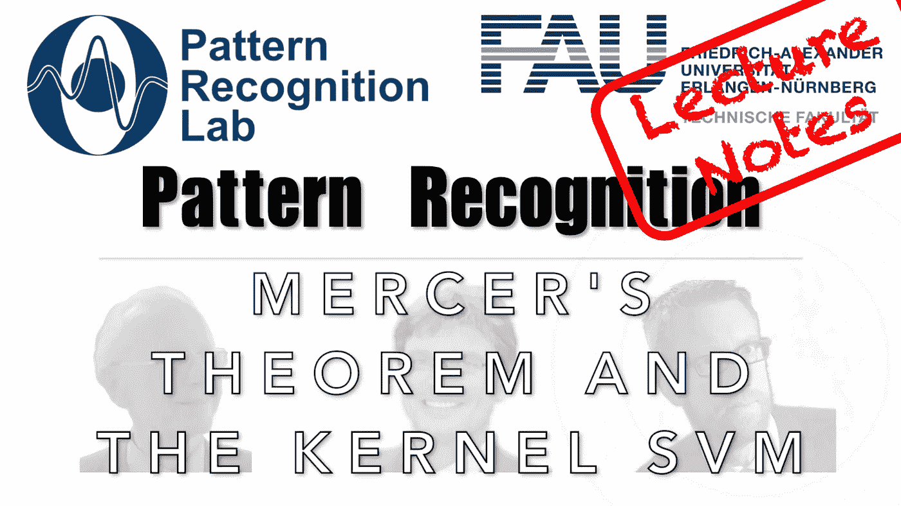

# 我的内核真的可以实现为转换吗？

> 原文：<https://medium.com/codex/can-my-kernel-really-be-implemented-as-a-transform-c38a3a85e9e9?source=collection_archive---------12----------------------->

## 模式识别中的 FAU 讲义

## 默瑟定理和核 SVM

来自[模式识别讲座](https://www.youtube.com/playlist?list=PLpOGQvPCDQzsWvT_bqmexrJ359RTQQuMO)的 [CC BY 4.0](https://creativecommons.org/licenses/by/4.0/) 下的图片

**这些是 FAU 的 YouTube 讲座“** [**模式识别**](https://www.youtube.com/playlist?list=PLpOGQvPCDQzsWvT_bqmexrJ359RTQQuMO) **”的讲义。这是讲座视频&** [**配套幻灯片**](https://doi.org/10.5281/zenodo.4429576) **的完整抄本。幻灯片的来源可在** [**此处**](https://github.com/akmaier/pr-slides) **获得。我们希望，你会和**一样喜欢这个…