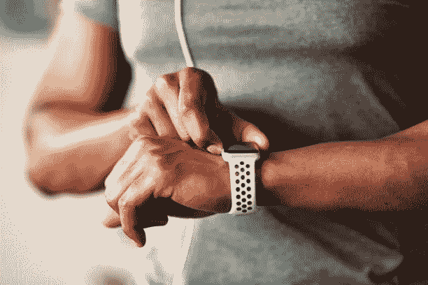

# 技术会破坏性格吗？

> 原文：<https://medium.com/codex/can-technology-undermine-character-1cff0d747571?source=collection_archive---------12----------------------->

什么是“人品”？一般来说，我们可以说某样东西的特性是它区别于其他东西的地方。例如，沉积岩有一种区别于火成岩的“特征”。然而，石头没有个性(据我所知)。人类有个性，人们认为个性和性格之间有某种联系，但我的兴趣不在于这种关系究竟是如何运作的，因为在这里我将特别关注性格。为此，我们可以规定，性格是一个属性的集合，它将一个人与另一个人区分开来。当我们说“她很聪明”时，我们是在谈论她的个性，但我们也在评判她的性格:实际上，我们声称我们*钦佩*她，因为她性格的某些特征。这可能有无数的原因。也许她对周围的世界有着浓厚的兴趣，有着结构良好的信仰，读了很多书，等等。在她确实表现出与智慧相关的美德的情况下，我们会说我们对她的性格的评价是*合适的*，也就是说，这样的评价正确地识别了她所代表的事物的种类和价值。我想考虑的问题是，技术承载价值的本质是否削弱了我们做出这种性格评估的能力。

当评价一个人的品质时，我们可能会列出他所拥有的某些美德:例如，他们可能是诚实、勇敢或智慧。这些美德大致可以归纳为他们*所代表的*或者*所关心的*。我们关心或代表的东西可能被认为是我们经历的结果——我们的教育、父母和社区，以及这些因素与我们的自然禀赋相互作用的方式。然而，对于性格来说，我们所代表的东西是我们做出的深思熟虑和有意选择的结果，这似乎很重要。它们不能仅仅是“取决于自然”，因为那样的话它们就不能恰当地归因于我们。因此，性格涉及那些指导我们决策的潜在态度和信念，在这些价值观和我们的行为之间有着密切的联系。对于一个可以恰当地归因于我的角色的行为来说，这个行为应该是源于我*重视*或关心的事情。当然，在某些情况下，我们可能会说某些行为*不是*归因于我们，因此*不符合*的性格。例如，如果你的伴侣通常非常关心和体贴，但最近在工作中承受了很大的压力，导致他们对你厉声说话，你不会鄙视他们。他们的爆发不符合他们的性格，因此不能反映他们真正代表的价值观。既然我们已经大致了解了性格，让我们转向技术。

嗯，有人认为技术能够将价值观嵌入其中，因此,*代表了某些价值观。这些价值可能是有意设计并成功嵌入的(例如，体现安全价值的减速带)，但也可能是有意设计但未成功嵌入的(例如，[“安全香烟”本应体现“健康”的价值，结果却导致了不利的健康结果](https://www.jstor.org/stable/29733944))。这里的要点不是找出如何成功地将价值嵌入技术中，而是注意到技术可以体现与它们被设计来体现的价值截然不同的价值。*

因此，技术有可能以我们无法控制的方式影响或反映我们的价值观。例如，可穿戴技术(如健身追踪器或智能手表)为我们提供了一系列生物识别信息。这些信息改变了我们体验自我和周围世界的方式。在这些信息的轰炸下，我们可能会使用这种技术来迫使自己锻炼(苹果允许你获得更新，直接传输到你的手表上，当你的朋友锻炼时)，或者我们可能会使用它来保持最新的消息(通过启用智能通知)。无论是哪种情况，关键是这些技术反映或代表了某些价值观，我们利用它们来提高自己。我们使用可穿戴健身追踪器来保持健康，我们使用社交媒体应用程序来填补空白，我们使用通知来提醒我们莉安娜的生日。我们有时利用技术让自己看起来比没有技术时更好。然而，是否有理由认为，在这种情况下，我们实际上并没有“代表”这些价值，而技术(由于它充满了价值)破坏了这些行为正确归于我们的能力？

这可能发生在我们依赖技术系统来影响我们的行为的情况下，从而潜在地使我们的决定不“取决于我们”，并使这些决定的合理性复杂化，因为这些决定来自我们的性格。当我们坚持我们的训练制度，因为我们的手表直到我们这样做才会停止，我们真的能为自己这样做而感到骄傲吗？从某种意义上来说，该技术是否通过提供负面刺激(以巨大噪音的形式，或者通过我们知道如果我们*不*锻炼，这种疏忽也会因当天缺乏活动上传而成为公共知识)来强迫我们以某种方式行事。

我不认为这完全反映了正在发生的情况。我们的鄙视或钦佩感，虽然可能受到技术的调节和影响，但并不依赖于技术。即使当我们利用人工智能或更简单的技术系统来鼓励这种或那种行为时，如果这些行为符合我们的二级欲望，那么这些行为仍然可以归因于我们。也就是说，它们是*我们想要*的东西。例如，我可能想减肥，但很难做到，所以我请私人教练帮助我锻炼，让我合理饮食。让这个人成为我的生命，并遵循他们的指示，并不会使这些行为少于我自己的行为。这是因为我想成为那种健康的人，这是我实现这个目标的一种手段。虽然随着时间的推移，科技可能会*引发*我们性格的这种变化，但它不会*导致*这些变化。此外，我们所重视的和我们所代表的东西(健康，关心他人，等等。)是促使我们首先使用技术的原因。因此，这些价值观和承诺仍然是我们的，即使技术让我们更容易或更方便地去实现它们。最终，责任始于我们，止于我们。