# SVM 能告诉你一篇新闻文章属于哪一类吗？

> 原文：<https://medium.com/codex/can-the-svm-tell-you-which-category-a-news-article-belongs-to-86f012dc22e0?source=collection_archive---------12----------------------->

# 项目启动

几周前，我的一个朋友参军了。在训练的前 5 周，他不允许用手机看新闻。于是我通过网信给他发每日新闻。

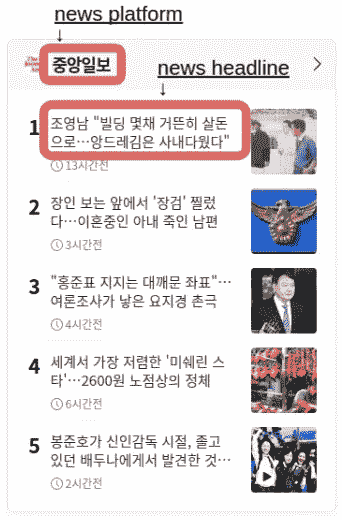

我收集新闻的面板是什么样子的

一个繁琐的步骤是阅读所有的标题，并手动对新闻进行分类。如果我能自动对新闻进行分类，岂不是既方便又节省我的时间？这个问题启动了这个项目。

# 公制的

这个项目的主要目标是正确分类新闻。因此，这是一个多类分类问题，重点是一个模型如何识别真阳性。因此，精确和回忆比准确更合适。

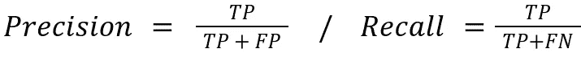

精确度和召回率的等式(T:真，F:假，P:正，N:负)

然而，很难同时比较两个指标，所以使用 F1 分数可能更好:精确度和召回率的调和平均值。

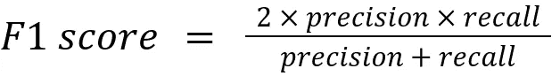

F1 分数等式

# 数据收集

有两种方法可以为我的训练集标记新闻。首先，我可以自己阅读和标注。第二，我可以收集已经被某个平台分类的新闻。由于第二种方法更快，我决定使用第二种方法。

对于一个新闻平台，我选择了*韩联社*，它将新闻分为 10 类。这 10 个类别是政治、经济、工业、社会、国际、地方、文化、生活方式、娱乐和体育。

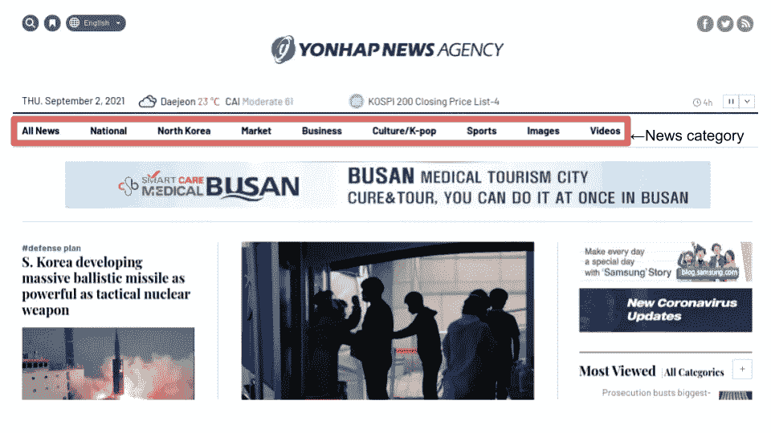

韩联社主页

为了抓取新闻，我研究了它的 HTML 结构。而我发现，无论新闻属于哪一类，都是位于同一个架构下的。所有的标题都位于

**标签中。新闻文章的链接被传递到标签内的 href 参数中。**

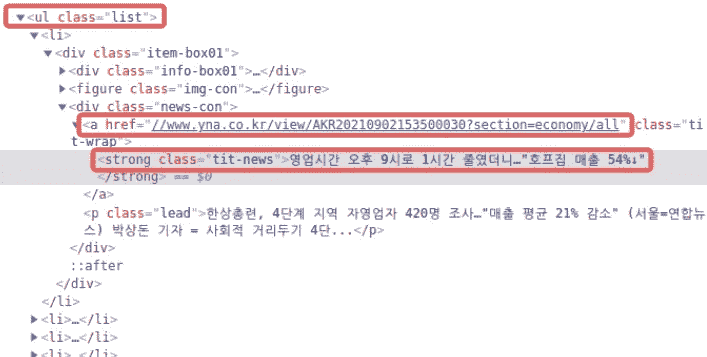

包含新闻文章列表的页面的 HTML 结构

当我点击链接时，所有的内容都放在了

标签中。

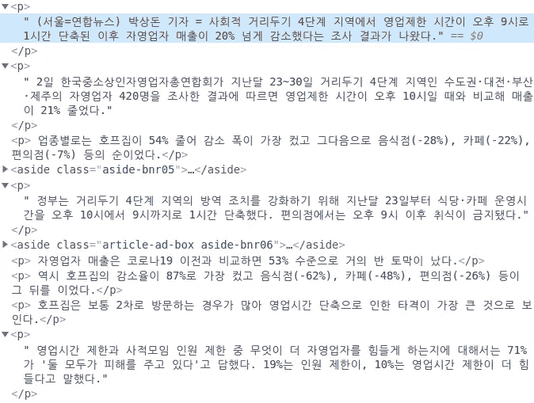

每条新闻的 HTML 结构

由于一致和简单的结构，我可以很容易地用 Python 和 BeautifulSoup 提取所有的标题和内容。为了给每个类别搜集足够的数据，我试图提取多达 20 页的标题和内容。由于每个页面包含 25 篇新闻文章，我希望为每个类别收集 25 篇 **×** 20=500 篇新闻文章。然而，由于一些类别的页面较少，我无法为每个类别收集 500 篇新闻文章。

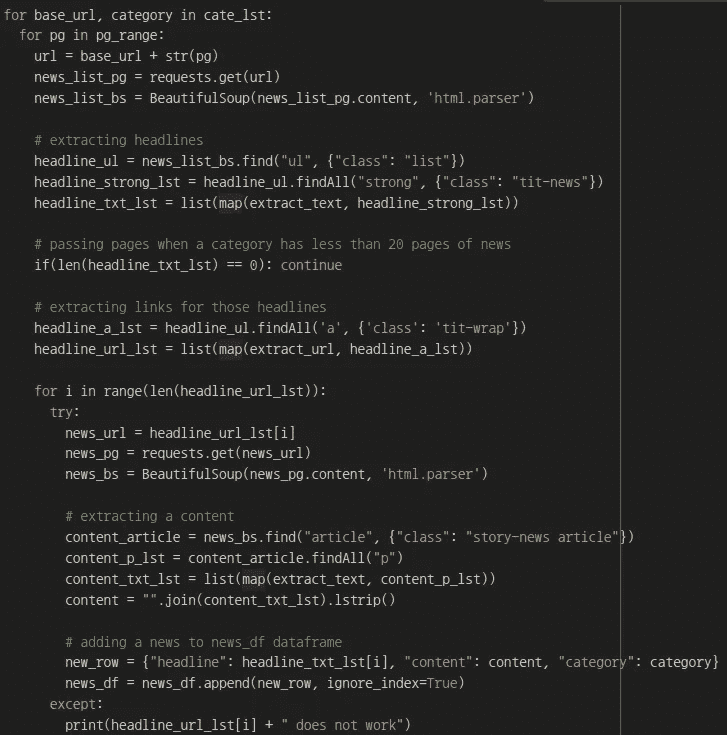

用于网络抓取新闻标题和内容的 Python 代码

因为这篇文章不是关于网络抓取的介绍，我就不赘述了，但是基本过程是

> 1.请求带有新闻文章列表的页面
> 2。摘录标题
> 3。提取这些标题的链接。通过链接循环提取内容
> 5。将每篇新闻文章作为一行添加到数据框中

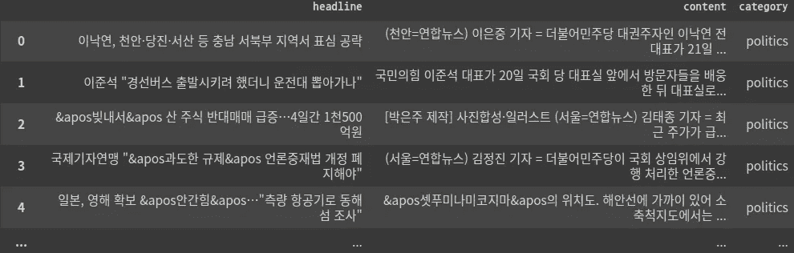

网页抓取后生成的数据框

# 数据预处理

## 我将如何处理

在分析之前，需要考虑两件事:我如何分割文本&我要使用什么词。首先，我们来看看分裂。

当处理文本时，简单地用空格分隔句子不是一种合适的方法。考虑以下三个词:*唱，唱，唱*。这些单词有相同的来源，但是用空格分开会认为它们是三个独立的单词。因此，它不会给出一个准确的上下文图片。为了避免这个问题，人们通常在分析之前从文本数据中提取标记，以便单词的变体被认为与原始单词相同。

但是我们是不是把每一个令牌都当作一个特征呢？有些词没有意义，但重复出现，如“一个”、“这个”、“是”。这些被称为停用词，可以忽略。除此之外，我认为新闻的主旨可以用名词来概括。例如，从下面的新闻标题来看，

《洛杉矶时报》新闻标题的一个例子

“网站 cookies”、“互联网”、“数据”等名词比“是”、“影响”等动词更能描述新闻。因此，我决定只保留标题中的名词。

## 我将使用哪个工具

对于令牌化，有一些其他人构建的包。其中，我使用了 Konlpy ( *朝鲜语自然语言处理*)包。在这个包中，有 5 个类(Hannanum、Kkma、Komoran、Mecab、Twitter)，下图显示了每个类处理不同数量的字符所需的时间。

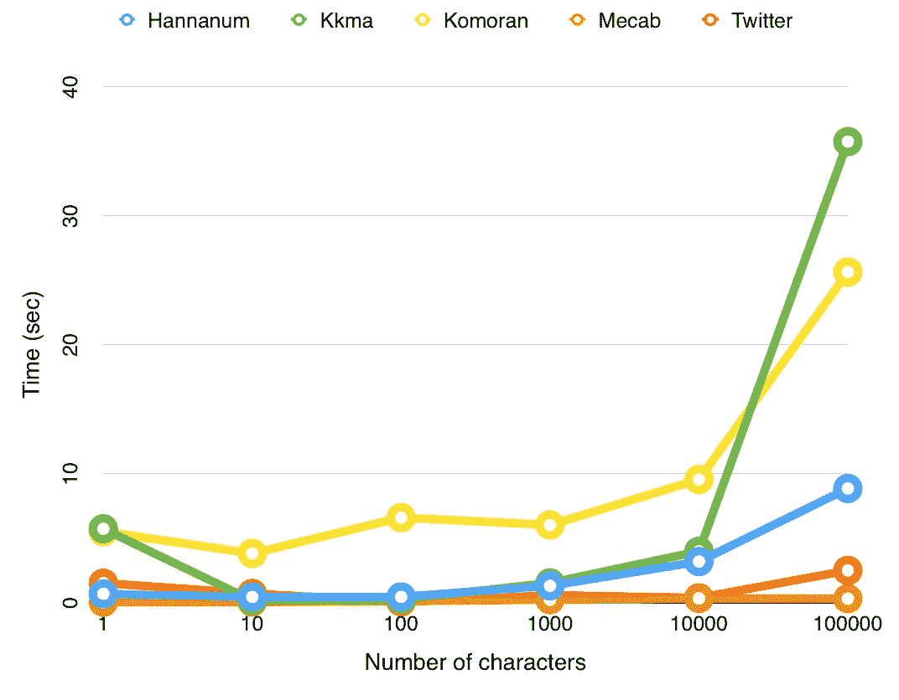

直观对比每个职业做记号化需要多长时间/来源:【konlpy.org[/Twitter 改名为 Okt](https://konlpy.org/ko/v0.4.3/morph/#comparison-between-pos-tagging-classes)

然而，在我因为速度而选择 Mecab 之前，我需要用示例标题进行测试，看看哪一个效果最好。但是由于安装问题，我无法使用 Mecab。所以我只能测试其他 4 个类。

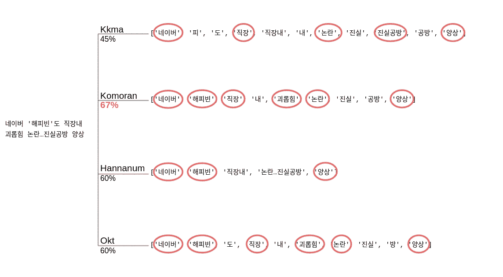

4 个班的测试结果。红色圆圈表示正确的名词

在 4 个职业中，Komoran 的表现最接近我的预期。因为我不打算将这个项目用作实时算法，所以我可以牺牲运行时间的准确性。因此，我为这个项目选择了 Komoran。

## 数据处理进行得如何

第一步是将所有的标题组合成一个大字符串。然后，我将字符串传递给 Komoran 类，并提取所有唯一的名词。根据名词列表，我创建了一个数据框，其中所有的名词都是列。

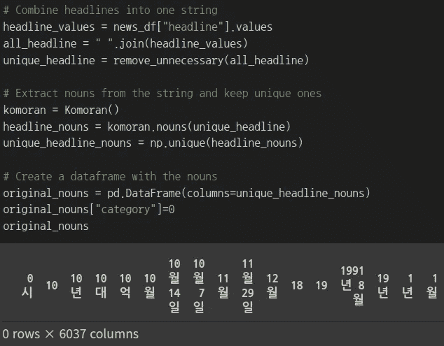

用于提取唯一名词和创建数据框的 Python 代码

初始化完数据框架后，我浏览了所有的新闻文章，记录了每个标题中出现了多少次哪些名词。

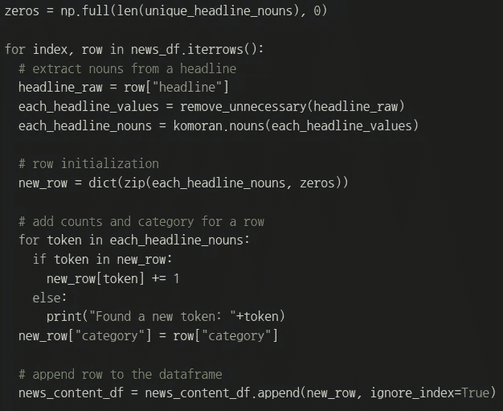

Python 代码，用于计算每个标题的名词，并将其附加到数据框中

# 算法

这个项目的主要焦点是我能多好地自动分类新闻，而不是我能多好地理解预测和反应之间的关系。最重要的是，与观测相比，有许多特征。考虑到这两点，我认为支持向量机是一个不错的选择。

简单解释一下支持向量机，它是一种找到一个线性或非线性超平面，对大部分观测值进行正确分类的方法。要获得对 SVM 更全面的解释，请点击此[链接](/codex/introduction-to-the-support-vector-machine-cd4a5857246e)。

使用 SVM 时要选择的超参数之一是一种内核。在三种流行的选择中——线性、多项式、径向——线性核似乎是一个不错的选择，因为当特征多于观测值时，它往往表现良好。在线性内核中，我还必须选择对跨越其边界的分类的容忍程度。这可以通过 e1071 包中 svm()内的成本参数进行调整。通常，通过交叉验证来选择合适的值。

# 实施和结果

首先，我从完整的数据集中随机选择 80%的观察值作为训练集，将其余的作为测试集。然后，我尝试使用 tune()来选择一个合适的成本值。但是，tune()使用分类误差作为评估指标。因为我决定使用 F1 分数，所以我需要在 caret 包的帮助下自己执行交叉验证。

createFolds 函数从 caret 包中创建 k 组随机划分的索引，这取决于我传递给函数的 k 值。有了这个，我就能做 10 个折叠。然后，我创建了一个嵌套的 for 循环，首先遍历 0.01、0.1、1、10、100、1000 的成本网格，然后遍历每个成本值的 10 个折叠。在最深层次，我提取真阳性、假阳性和假阴性来计算每个类的 F1 分数，这样我就可以取这些分数的平均值。

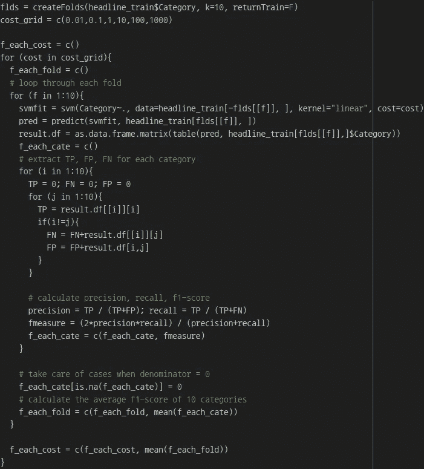

r 代码执行 10 倍 cv 以计算每个类别的平均 f1 分数

F1 分数的结果如下表所示。

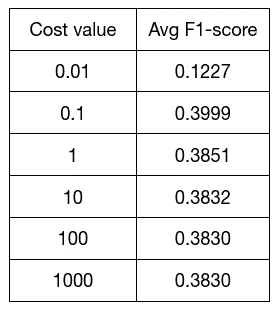

10 倍交叉验证后的 F1 平均分数表

如你所见，0.1 给出了最高的 F1 分数。因此，我使用 0.1 对测试集(原始数据集的 20%)再次执行 SVM。

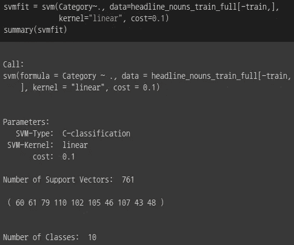

在测试集上使用成本=0.1 的 svm 的结果

结果显示，它使用 761 个支持向量，并对标题进行分类，如下所示。

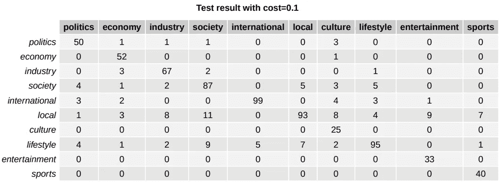

测试结果的混淆矩阵

考虑到最高值位于对角线上，并且大约 83%的观察值被正确识别，它不是最好的，但它完成了它的工作。

# 限制

这个项目最关键的限制是从新闻中提取名词并不完美，因为处理朝鲜语仍然是一个活跃的研究领域。因此，我可能错过了一些重要的名词或提取了非名词性的单词，最终导致识别错误的关系。

另一个限制来自我的环境。因为我现在只有一台计算能力较低的计算机，所以我在这个项目中使用了 Google Colab。它比我现有的电脑好，但它的内存仍有限制。因此，不可能加载和计算包含新闻内容的数据帧。因为内容通常包含更多关于新闻的信息，所以使用内容可以带来更好的性能。很遗憾我不能尝试它。

我担心的一件事是很难概括这个模型。由于 SVM 自然包含一个黑匣子，所以不可能确切知道 SVM 是如何做出决定的。它可以基于最近发生的特定事件或与每个类别相关的特定单词。如果先验是原因，那么模型就不能一般化，除非模型定期更新唯一名词列表。另一方面，如果后来是原因，那么模型有更多的可能性被推广。为了测试这一点，一周后我收集了新的数据并运行了这个模型。

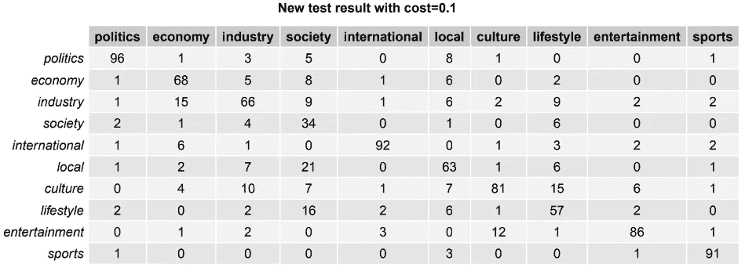

新测试结果的混淆矩阵

最高值仍然位于对角线上，但是只有大约 73%的新闻文章被正确识别。所以它不如原始数据集工作得好，但除了社会之外的类别表现得相当好。回到这篇文章的主要问题，SVM 能给新闻分类吗？我想对大多数类别来说答案是肯定的，但对社会类别来说答案是否定的。