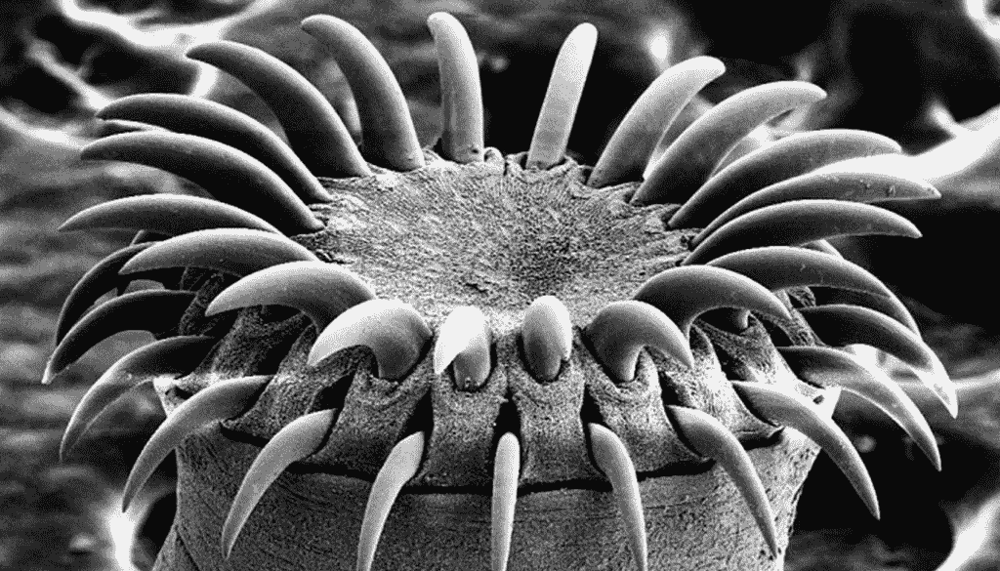

# 我们能不能都承认反应钩是个坏主意？第三部分

> 原文：<https://medium.com/codex/can-we-all-just-admit-react-hooks-were-a-bad-idea-part-3-31cc0ab89772?source=collection_archive---------1----------------------->

案例研究

图片来自[维基媒体](https://commons.wikimedia.org/wiki/File:Tapeworm_SEM.jpg),作者 Mogana Das Murtey 和 Patchamuthu Ramasamy

当我写这个系列的前两个部分时，我预测在这篇文章中我会展示一些来自博客的例子，这些博客足够自信，他们理解 hooks 为他人提供建议，并展示如何遵循他们的建议是有问题的。