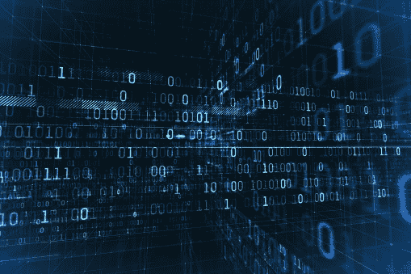

# 我们不再是知识的守护者。艾是。

> 原文：<https://medium.com/codex/can-we-save-the-past-from-the-future-7f5942cf6d05?source=collection_archive---------4----------------------->

数字未来正在改变我们认识自己的方式。任何自我和身份感都是由存储系统和人工智能技术塑造的。

图片由鲍里斯·布朗通过 Pixabay 提供

“让我用谷歌搜索一下”——这是这一代人常用的短语。这是记忆保持不那么重要的标志。事实上，对当今学校教育的一个重要批评就是坚持记忆。学校强调要记住数学公式或历史细节才能通过考试。在某些学校，不允许使用计算器。这显然与现实脱节。记忆保持不相关的原因是因为记忆在很大程度上是外在化的。我们可以简单地在手机和笔记本电脑上存储信息。云技术造就了一个社会，世界上的一切都自发地存储在全球档案馆中。

由 [Giles Crouch |数字人类学家](https://medium.com/u/f21ac1ba763a)撰写的一篇有趣的[文章](https://gilescrouch.medium.com/in-our-digital-future-will-we-lose-our-history-6bb4253c9465)也暗示了云计算技术和人工智能算法将同时成为数百万文化历史的承载者和保管者。它们是我们许多文化艺术品的存放地，比如音乐、艺术、文学、地图、播客、视频和照片。记忆的外化使得我们的许多文化历史能够自动存档。作为讨论的一部分，克劳奇提出了一个关于每项技术进步都会导致数据丢失的关键观点:

> 存储的问题在于它一直在变化，每次重大变化都会丢失一些数据。

随着存储系统变得越来越先进，人们担心会丢失数据和文化历史。

我想给这个观点一个特别的轨迹。如果我们看看文物，它们往往会把“T4”和“我们”联系在一起。例如，在一个家庭中代代相传的“家庭食谱”的概念将家庭的所有个体(我)与作为家庭一部分的身份(我们)联系起来。因此，像家庭食谱这样的文化人工制品是个人和集体之间的桥梁。同样，这种想法可以推广到几个例子。像国旗和国歌这样的文物将个人的 *I* 带到了国家的 *We* 。用哲学术语来说，我和我们共有的这种关系被称为过渡个体化。

正如已经确定的那样，只有通过文化艺术品，才有可能实现跨个体化。在数据驱动的社会中，文化艺术品以比特和字节的形式存在。在信息丢失的威胁下，不仅个人会受到伤害，集体身份的形成也会受到伤害。

这里还有一个更大的威胁。我们低估了算法对互联网技术中数据管理方式的影响。算法处理决定信息必须如何排序的关键词，从而实际上重写了记忆。我给你举个例子。假设我要访问我的宗教中某一特定实践的信息。在这种情况下，算法会根据关键字为我检索它们。这个算法根据它的搜索引擎写下我对宗教活动的记忆。这脱离了代际记忆的概念。我们不再是祖先知识的簿记员。艾是。在这里，每次后续迭代都会重写内存。

我将以一个问题来结束这篇文章:我们是否正在走向这样一个未来:机器系统的出现将把不同的人类身份中和成一个单一的“人类”？