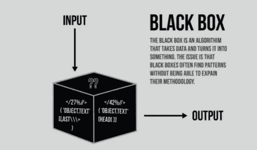
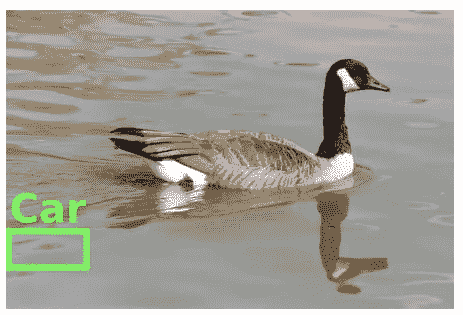
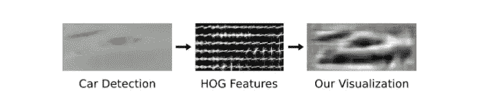
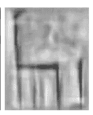
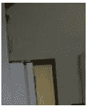

# 你能解释这个吗？机器学习可解释性的故事。

> 原文：<https://medium.com/codex/can-you-explain-this-221130c6e264?source=collection_archive---------14----------------------->

## [法典](http://medium.com/codex)

现在是 2030 年，我们生活在一个日益自动化的时代，人工智能机器人正在为此提供动力。所有琐碎的决定都是由机器驱动的，它们正在重新设计我们的生活方式。Lorem Ipsum 最近对工作感到沮丧，头痛欲裂，他的谷歌健康自动推荐没有帮助，他预约了医生。他只需要 30 分钟就可以完成大脑测试的所有艰难阶段，直到最后去看医生。“扫描结果看起来没有任何异常，大脑健康得分是积极的”，医生认为这只是头痛，并开了药。Lorem Ipsum 可以以同样的方式继续下去，直到他被脊椎突然发冷吓了一跳，头痛突然变得难以忍受。当 Lorem Ipsum 意识到他的高级健康测试结果显示肿瘤晚期时，他感到震惊。这次手动分析每个扫描结果的医生注意到，机器预测完全错误，尽管扫描图像清楚地显示了肿瘤的发展，但在每个图像中存在一些奇怪的分布，后来发现这是由于错误的扫描输出造成的。仅仅增加一种独特的噪声模式就已经打乱了算法。

“这是 bug！”，医院 IT 团队很惊讶。尽管所部署的模型在医院图像上进行了测试，并且达到了 99p 的准确率，并且所有指标都高于安全标准。
虽然 2030 年似乎是一个有点乐观的时间表，但如果我们在关键时刻使用模型时不考虑模型的可解释性，这种情况就一定会发生。

## 解读什么？

简单来说，模型的可解释性就是
**人类能够理解模型决策原因的程度。**这有助于我们理解模型到底在学习什么，模型必须提供哪些其他信息，以及其决策背后的理由，并在我们试图解决的现实世界问题的背景下评估所有这些。作为一个例子，我们可以想到一个分类器，它的工作是识别输入图像属于动物或车辆类别。期望该模型获得最高的准确度，并且能够以最小的误分类对来自大范围环境的图像进行分类。即使一个模型确实如我们所愿，我们如何定量地衡量为什么这个模型表现出我们的行为方式？我们需要大致了解这个结果与输入和模型的特征表示之间的因果关系和相关性。否则，模型很可能会行为不端，因此这是人类信任模型的先决条件。

## 为什么我们需要可解释性？

可调试性和审计是在软件程序的有效运行中扮演重要角色的关键方面。机器学习也不例外，在机器学习模型部署在高风险环境中的理想世界中，对错误预测的解释有清晰的理解是至关重要的。这有助于理解错误的原因。它为如何修复系统提供了一个方向。继续我们的动物与车辆的例子，假设我们的模型将一张可爱的狗图片归类为一辆卡车(无意冒犯小狗爱好者)，难道你不想知道哪里出了问题，模型到底在哪里混淆了吗？

一个我们不了解其工作原理的黑盒模型

## 更多解释模型的理由

*   信任和公平——我们在现实世界中部署该模型的舒适度如何。我们更有可能相信更好理解的模型，尤其是在高风险决策中(如金融或医药)。这并不一定与模型的准确性相关，只要我们清楚地了解它何时会失败，它就可以有缺点。
*   因果关系—监督模型学习变量和结果之间的关联。一个例子可能是沙利度胺使用和出生缺陷之间的已知关系；一旦在数据中发现这种关联，科学家可以进行临床试验来测试是否存在因果关系。
*   迁移能力——随着迁移学习解决更多的问题，归纳能力是机器学习模型的一个重要参数。模型的可解释性有助于我们理解当测试环境从训练环境转移时，模型会如何发展。模型概括能力差的一个例子是对抗性攻击。模型容易受到这种攻击，因此会犯人类永远不会犯的错误。当面部识别系统等机器学习模型部署在现实世界中时，这些对抗性攻击可能会产生灾难性的后果。理解模型如何工作将有助于我们更好地意识到潜在的问题并防范这种可能性。

*对抗性攻击导致卷积神经网络将熊猫归类为长臂猿的经典例子。人类永远不会犯同样的错误，我们需要模型的可解释性来意识到并防范这样的攻击。(古德菲勒，2015 年)*

## **举个例子**

现在让我们看一个例子，什么是可解释性，以及我们如何实现它。解释模型的常用方法是文本解释、可视化和举例说明。这里我想举一个有趣的例子是“HOGgles:可视化物体检测特征([链接](http://cs.columbia.edu/~vondrick/ihog/))”。本文的作者介绍了算法可视化特征空间所使用的对象检测器。本文中的工具允许人类戴上“功能护目镜”，像物体探测器看到的那样感知视觉世界。这个项目介绍了可视化特征空间的工具。由于大多数特征空间的维数太高，人类无法直接检查，因此它提出了一种算法来将特征描述符反转回自然图像，以便我们可以将“特征图”可视化为算法看到的图像的每个部分。

根据这种新方法，让我们继续我们的车辆与动物的例子。

探测器为什么会失灵？

上图显示了一个物体探测器的高分探测。为什么探测器认为海水看起来像汽车？

可视化提供了一个解释。以下是虚假车辆检测功能的可视化输出。这种可视化显示，虽然在原始图像中明显没有汽车，但是在特征描述符中隐藏着汽车。

物体探测器看到的视觉世界与人类看到的略有不同，通过可视化这个空间，我们可以对我们的物体探测器有更直观的了解。([卡尔·冯德里克](http://mit.edu/vondrick)等人，2013 年)

一个明显看起来像椅子的猪特征可视化。([卡尔·冯德里克](http://mit.edu/vondrick)等人，2013 年)

上面的图像看起来像一把椅子，如果人类看到这一点并仅仅根据上面的图像进行分类，他们可能会被误导。模型将此解释为椅子。但是你能猜出这是别的什么东西的可能性吗？

上述特征表示的实际输入图像片段。([卡尔·冯德里克](http://mit.edu/vondrick)等人，2013 年)

## 线性回归模型中权重的解释

简单的线性回归模型有一个直观的解释概念，它由模型行为的一些自然语言解释组成。例如，对于对今天是否会下雨的分类的肯定预测，一种解释可能是“该模型预测很可能会下雨，因为风很大并且天空上的云分布很高。然而，由于过去在夏季和冬季观察到的降雨不足，如果不是季风季节，该模型可能会给出略低的概率。”

我们可以将这一点推广到几乎任何具有不到几个单独特征的线性模型。给定模型的权重，我们可以设计一个过程来提取对给定预测贡献最大的成分，并用一个语言模板来总结它们。对于一个功能很少的小模型来说，这可能传达了正在发生的事情的合理图景。

但是随着参数数量的增加，这种方法可能会失去控制。但是如果模型有一百万个特征呢？如果预测的证据分散在所有特征中会怎样？像这样的场景经常出现。考虑用于基因组学研究的高维数据集。如果我们的解释生成过程通过解释几个突出的特征来总结模型的行为，这能如实地描述模型的行为吗？号码

## 事情的另一方面

值得考虑的是，对复杂的机器学习模型进行简单的口头解释可能会误导用户。再以线性模型为例。查看哪些功能权重较高，缺少更广泛的背景可能会产生可疑的解释。如果一个权重很高，但它是针对一个在 95%的时间里取相同值的特性的，该怎么办？在这种情况下，这个权重可能无法解释一些决策是如何做出的。

对于真正复杂的模型，用简洁的语言来解释它们的全部动力学可能是不合理的。或许做出简单解释的困难并不令人惊讶。有时候，我们构建复杂模型的目的就是为了让它们能够表达我们可能无法精确描述的复杂假设。我们应该质疑这样一个命题，即期望一个简短的总结来有意义地解释一个复杂的模型是合理的。(利普顿，2017 年)

## 结论

虽然了解机器学习模型的输入和输出是非常可取的，但有时这种练习会导致我们陷入僵局。因为，有时我们求助于机器学习而不是手工制作的决策规则，因为对于许多问题来说，简单、容易理解的决策过程是不够的。在这些情况下，我们想要发现的假设，可能实际上对某些任务表现良好，可能比那些可以直观得出或解释的假设更复杂。对可解释性的渴望通常是合理的。但是，我们应该始终批判性地思考，理解为什么我们需要可解释性，并在开始追求之前设置好基础。

我将在接下来的文章中更多地讨论具体的可解释性方法以及它们的进展。

参考资料:

*   HOGgles:可视化对象检测特征，Carl Vondrick 等人，2013 ( [链接](http://www.cs.columbia.edu/~vondrick/ihog/iccv.pdf))
*   模型可解释性的神话，[扎克里·c·利普顿](https://arxiv.org/search/cs?searchtype=author&query=Lipton%2C+Z+C)，2017( [链接](https://arxiv.org/abs/1606.03490))
*   论文来自 UTCS 可解释的人工智能小组会议。([https://www.cs.utexas.edu/~ml/xai/](https://www.cs.utexas.edu/~ml/xai/))
*   Sanjay Subramanian 等人
    [从复合神经网络](https://arxiv.org/pdf/2005.00724.pdf)、ACL 中获得可靠的解释。