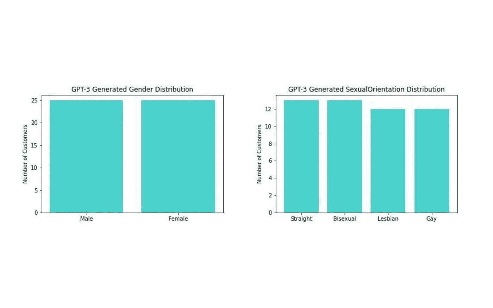

# 你能用 GPT-3 生成真实的数据吗？我们用假数据探索假约会

> 原文：<https://medium.com/codex/can-you-generate-realistic-data-with-gpt-3-we-explore-fake-dating-with-fake-data-54e936d29cbb?source=collection_archive---------2----------------------->


*“萨尔瓦多·达利风格的心形熔钟”使用* [*DALL-E*](https://openai.com/dall-e-2/) 生成

## 大型语言模型因生成类似人类的对话文本而受到关注，它们在生成数据方面也值得关注吗？

*TL；博士，你现在已经听说过 OpenAI 的 ChatGPT 的奇迹，也许它已经是你最好的朋友了，但让我们谈谈它的堂兄，GPT-3。同样是一个大型语言模型，GPT-3 可以被要求从故事、代码甚至数据中生成任何类型的文本。在这里，我们测试了 GPT-3 的能力极限，深入研究了它生成的数据的分布和关系。*

客户数据是敏感的，涉及许多繁文缛节。对于开发人员来说，这可能是工作流中的一个主要障碍。对合成数据的访问是通过解除对开发人员测试和调试软件的能力的限制来解除团队障碍的一种方式，并训练模型以更快地交付。

在这里，我们测试了预训练的生成式 Transformer-3 (GPT-3)使用定制分布生成合成数据的能力。我们还讨论了使用 GPT-3 产生合成测试数据的局限性，最重要的是 GPT-3 不能在本地部署，这为与 OpenAI 共享数据的隐私问题打开了大门。

## 什么是 GPT-3？

GPT-3 是由 OpenAI 构建的大型语言模型，具有使用深度学习方法生成文本的能力，约有 1750 亿个参数。本文中关于 GPT-3 的见解来自 OpenAI 的[文档](https://beta.openai.com/docs/guides/completion/prompt-design)。

# 虚假实验的虚假数据

为了演示如何使用 GPT-3 生成虚假数据，我们假设一个名为 *Tinderella* *的新约会应用程序中的数据科学家的帽子，在这个应用程序中，你的匹配对象每天午夜都会消失——最好尽快获得这些电话号码！

虽然该应用程序仍在开发中，但我们希望确保我们正在收集所有必要的信息，以测试我们的客户对该产品的满意度。我们知道我们需要什么样的变量，但是我们希望对一些虚假数据进行分析，以确保我们正确地设置了数据管道。

我们调查收集客户的以下数据点:名字、姓氏、年龄、城市、州、性别、性取向、喜欢次数、匹配次数、客户加入应用程序的日期，以及客户对应用程序的评分(1 至 5 分)。

# GPT-3 完井终点入门

[GPT-3 文档](https://beta.openai.com/)带你了解如何创建账户和获取 API 密钥。

首先，我们安装并导入 OpenAI API 库:

```
$ pip install openai
import os 
import openai
```

我们适当地设置端点参数:我们希望模型生成的最大令牌数`(max_tokens)`，我们希望模型在生成数据点时具有的可预测性`(temperature)`，以及我们希望数据生成何时停止`(stop)`。

```
prompt = "input: prompt"

#function to make GPT-3 API call
def get_gpt_3(prompt, <API_KEY>):

    openai.api_key = <API_KEY>

    response = openai.Completion.create(
        model="text-davinci-003",
        prompt=prompt,
        temperature=0.6,
        max_tokens=3700,
        top_p=1.0,
        frequency_penalty=0.0,
        presence_penalty=0.0, 
        stop=["input:"]
    )

    return response
```

文本完成端点交付一个 JSON 片段，其中包含作为字符串生成的文本。该字符串需要重新格式化为数据帧，以便我们可以实际使用该数据:

```
#defining function to process data
def gpt3_to_df(reponse):

    #split rows into strings
    text = response['choices'][0]['text']
    text_split = text.split('\n')
    text_split = text_split[1:]

    #split rows into lists
    rows = []
    for i in range(len(text_split)):
        row = text_split[i].split(',')
        rows.append(row)

    #creating a dataframe
    rows_df = pd.DataFrame(rows, columns=app_columns)

    return rows_df
```

# 构建我们的提示

把 GPT 三号当成同事。如果你要求你的同事为你做一些事情，你需要尽可能具体明确地描述你想要什么。这里，我们使用 GPT-3 通用智能模型的文本完成 API 端点，这意味着它不是为创建数据而显式设计的。这要求我们在提示中指定我们想要的数据格式——“逗号分隔的表格数据库”使用 GPT-3 API，我们得到如下所示的响应:

```
"\n\nName,Age,Gender,Location,Interests,Height,Weight\nJohn,27,Male,New York City,Travelling,5'10,180lbs\nSamantha,25,Female,Los Angeles,Reading,5'4,125lbs\nMatthew,30,Male,Chicago,Cooking,6'2,200lbs\nEmily,21,Female,San Francisco,Hiking,5'6,135lbs\nMichael,28,Male,Dallas,Gardening,5'11,190lbs"
```

还不错！它实际上给了我们逗号分隔的数据，我们可以很容易地用熊猫格式化。

下面是从提示符得到的数据帧:

> “从约会应用程序创建逗号分隔的客户数据表格数据库”


GPT-3 提出了自己的一套变量，不知何故决定在你的约会档案中暴露你的体重是一个好主意(😬).它给我们的其余变量适合我们的应用程序，并展示了逻辑关系——姓名与性别匹配，身高与体重匹配。GPT-3 只给了我们 5 行数据，第一行是空的，它没有产生我们实验所需的所有变量。

本着与我们的同事 GPT-3 女士良好沟通的精神，我们实际上会告诉它我们想要什么——同时也采纳了包括一个兴趣变量的建议。

下面是从提示符得到的数据帧:

> 从约会应用程序创建逗号分隔的表格形式的客户数据数据库，包含以下各列:名字、姓氏、年龄、城市、州、性别、性取向、兴趣、喜欢数、匹配数、客户加入应用程序的日期，以及客户对应用程序的评分(介于 1 和 5 之间)


GPT-3 没有给我们任何列标题，给了我们一个表格，每隔一行没有信息，只有 4 行实际客户数据。当我们只寻找一个兴趣时，它也给了我们三列兴趣，但是公平地说，GPT-3，我们确实使用了复数。尽管如此，它确实为我们提供了不错的数据——姓名和性取向符合正确的性别，它给我们的城市也处于正确的状态，日期也在适当的范围内。

希望如果我们给 GPT-3 一些例子，它会更好地理解我们到底在寻找什么。不幸的是，由于产品的限制，GPT-3 不能读取整个数据库来学习和生成合成数据，所以我们只能给它几个示例行。

这一次，我们举 GPT-3 号以下的例子:


我们还要求它给我们列标题和 50 行数据。

以下是提示符下产生的数据帧的前五行:

> “创建一个逗号分隔的表格数据库，其列标题包含约会应用程序中的 50 行客户数据。例如:ID，FirstName，LastName，年龄，城市，州，性别，性取向，兴趣，NumberofLikes，NumberofMatches，DateCustomerJoined，CustomerRating，Df78hd7，Barbara，Prime，23，田纳西州纳什维尔，女，女同性恋，(徒步烹饪跑步)，2700，170，05/09/2017，4.0，87hbd7h，Douglas，Woods，35，伊利诺伊州芝加哥，男，同性恋，(烘焙绘画阅读)，3200，11


给 GPT 3 号一些创造的基础真的帮助它产生了我们想要的东西。这里我们有列标题，没有空行，兴趣都在一列中，数据通常有意义！不幸的是，它只给了我们 40 行，但即使如此，GPT-3 刚刚确保自己一个体面的性能审查。

# 评估 GPT-3 的合成数据

我们感兴趣的数据点并不是相互独立的，这些关系为我们提供了评估生成的数据集的标准。


总的来说，GPT-3 能够生成各列之间具有适当自然关系的数据。


使用 GPT-3 生成的数据的数值分布

GPT-3 给了我们一个相对正常的年龄分布，这在 Tinderella 的背景下是有意义的——大多数客户都在 20 多岁。这有点令人惊讶(也有点令人担忧)，它给了我们如此低的客户评级峰值。我们没有预料到在这个变量中会看到任何模式，我们也没有预料到喜欢的数量或匹配的数量，所以这些随机分布是意料之中的。



使用 GPT-3 生成的数据的分类分布

最初，我们惊讶地发现顾客中的性取向分布几乎是均匀的，我们以为大多数是异性恋。考虑到 GPT-3 抓取互联网上的数据进行训练，这种趋势实际上有很强的逻辑。针对 LGBTQ+人群的约会应用 Grindr 已经存在了很长时间(美国东部时间。2009 年)超过其他流行的约会应用程序，如 Tinder(预计 2012 年)和 Hinge(预计。2012).因为 Grindr 存在的时间更长，所以有更多的相关数据可供 GPT-3 学习，这可能会使模型产生偏差。

GPT-3 可以给我们一个列和敏感数据分布之间有精确关系的数据集，这很好……但是我们能从这个高级生成模型中期待更多吗？

# 向 GPT-3 询问统计关系

我们假设，如果我们的客户有更多的匹配，他们会给应用程序更高的评级。我们要求 GPT-3 提供反映这一点的数据。

> 提示:“创建一个逗号分隔的表格数据库，列标题为约会应用程序中的 50 行客户数据。确保匹配数量和客户评级之间存在联系。例如:ID，FirstName，LastName，年龄，城市，州，性别，性取向，兴趣，NumberofLikes，NumberofMatches，DateCustomerJoined，CustomerRating，df78hd7，Barbara，Prime，23，田纳西州纳什维尔，女，女同性恋，(徒步烹饪跑步)，2700，170，05/09/2017，4.0，87hbd7h，Douglas，Woods，35，伊利诺伊州芝加哥，男，同性恋，(烘焙绘画阅读)，3200，11

从这个提示中，我们获得了与客户评级匹配的数据，分布如下。


好的，GPT 三号！它实际上能够得到这一个正确的…但是这个观察到的关系重要吗？


一个快速的线性回归显示，尽管很弱，但 GPT-3 能够生成数据，在某人拥有的匹配数量和他们给应用程序的评级之间存在统计上显著的正相关关系。

# GPT-3 在生成虚假数据方面的弱点

## 差异

生成的数据不能准确反映我们的生产数据的实际情况。实际上，我们的客户群会在地理上聚集在一起，可能会有大多数直接用户，我们客户的名字可能会反映人口的多样性。降低请求的温度使输出更可预测，增加了重复数据的可能性。然而，降低温度并没有充分改善这些列中的方差，反而导致我们的名称数据中的同质性被放大。

由于 GPT-3 生成的数据基本上与我们的生产数据无关，对于我们在本文中介绍的用例(为数据而数据)来说，这不是问题。但是，如果您希望生成测试数据，这将是一个更严重的限制。

## 输出不一致

在本例中，我们尝试向 GPT-3 询问来自 50 个客户的数据，但是，每次我们进行呼叫时，它都返回不同数量的行，从 8 到 50 不等。我们调整了 API 调用的参数来解决这个问题(尽可能地增加`max_tokens`，上下调整惩罚)，但是，这些并没有帮助获得模型生成的一致的行数。

解决这个问题的方法是使用 while 循环，但是，这需要进行多次 API 调用，计算量非常大。

## 计算成本高且没有本地部署

大型语言模型在计算上非常昂贵，GPT-3 的 1750 亿个参数需要 700GB 的内存。生成数千行合成数据将需要极大的计算量。此外，由于 GPT-3 只能通过 OpenAI 的 API 访问，以这种方式生成测试数据可能需要传输敏感数据，这在大多数情况下显然是行不通的。

# 外卖食品

GPT-3 不像 Faker 那样受到同样的限制，它能够生成任何数据点并维护列之间的关系。然而真实的数据是复杂的，我们不能确定 GPT-3 真的模拟了这些复杂性。然而，令人印象深刻的是，我们可以明确要求 GPT-3 在数据中给我们一个统计关系，它会提供。

GPT-3 当然有自己的一套限制，最重要的是 OpenAI 拥有模型和所有输入输出，因此，真实的生产数据永远不能在提示中用作示例。这限制了我们生成与生产数据紧密匹配的数据的能力。

如果您正在寻找快速生成少量 POC 数据的方法，那么 GPT-3 是一个很好的选择。如果您正在寻找一种方法来生成高质量的测试数据，模拟生产数据中的实际关系，那么人工智能驱动的合成数据解决方案可能适合您。

在 tonic.ai/blog 的[上阅读原文。](https://www.tonic.ai/blog/can-you-generate-realistic-data-with-gpt-3)

**使用 GPT-3* 生成