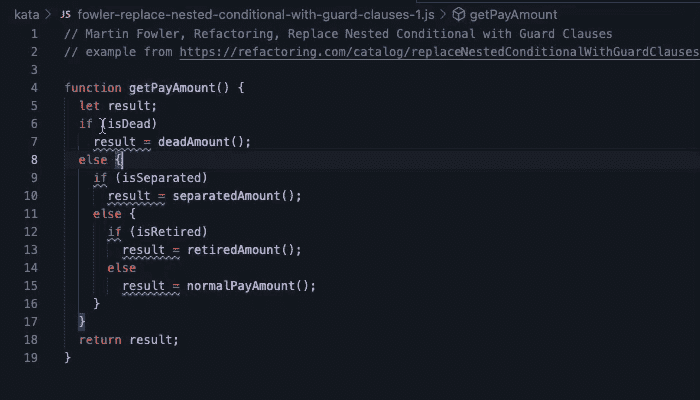

# 没有测试覆盖能安全重构 JavaScript 吗？

> 原文：<https://medium.com/codex/can-you-refactor-javascript-safely-without-test-coverage-d721917224b3?source=collection_archive---------7----------------------->

传统观点认为，在重构代码之前，你应该有良好的测试覆盖率。如果在测试过程中没有发现，在重构过程中犯错误会在软件中引入缺陷。这种回归缺陷会惹恼用户，破坏软件，甚至导致客户放弃产品。

JavaScript 尤其需要自动化测试。在像 JavaScript 这样具有函数构造的动态语言中，静态地检测破损是很困难的。此外，JavaScript 有[许多](https://developer.mozilla.org/en-US/docs/Web/JavaScript/Reference/Operators/Logical_AND_assignment#description) [语言](https://developer.mozilla.org/en-US/docs/Glossary/Falsy) [细节](https://developer.mozilla.org/en-US/docs/Web/JavaScript/Reference/Operators/Operator_Precedence#table)和[怪癖](https://developer.mozilla.org/en-US/docs/Web/JavaScript/Equality_comparisons_and_sameness#a_model_for_understanding_equality_comparisons)，这些都不太为人所知或容易记忆。

然而，在实践中，有可能**您会遇到需要在未测试或未充分测试的遗留代码中工作的情况**。通常，这恰恰是那种可以从重构中获益的代码，它可以使代码更容易理解和扩展。但是为了测试它，我们需要使它可测试，这涉及到重构。

我们如何解决这个问题？如果我们后退一步，自动化测试帮助我们回答的潜在问题是信心和风险的问题:

**我有多大把握我的重构没有改变程序的行为？**

测试帮助我们回答了这个问题，但是当测试覆盖中有缺口时，重构有可能引入错误。因此，这个问题的答案是一个程度的问题，即使有测试。

另一种方法是采取一系列小步骤。如果我们确信每一步都是正确的，那么最终的结果就是正确的，因为没有一步会改变程序的行为。**理想情况下，采取小的、低风险的步骤与优秀的测试覆盖率相结合，从而产生高置信度。**

然而，显著的变化、更复杂的编程语言(如 JavaScript)和复杂的遗留代码库导致了单个步骤引入缺陷的高风险。特别是，跨越模块或服务边界的重构、大规模的重命名(不是每个符号都出现)或者大量的手动更改往往容易出错。

但是**对于单个函数、类或模块，可以将自动重构的序列链接在一起，以实现更广泛的重构**。然而，大多数重构工具确保重构机制被正确执行，但是它们不会告诉你对代码的影响。

我想要一个重构工具，它内置了许多难以记忆的 JavaScript 细节，可以分析相关代码来评估重构的安全性。考虑到这一点，我为 Visual Studio 代码 创建了 [**P42 JavaScript 助手。如果可能的话，P42 会评估重构对逻辑和代码流的影响(不包括性能)，并通知您它是否安全，或者是否需要检查特定的细节。**](https://marketplace.visualstudio.com/items?itemName=p42ai.refactor)

这里有一个 P42 如何表明小的重构步骤的安全性的例子:

p42 VS 代码的 JavaScript 助手

使用像 P42 这样的自动重构工具，将相关源代码的静态分析与编程语言的广泛知识结合起来，可以更安全地重构代码。**结合自动化测试和类型检查工具，如**[**TypeScript**](https://www.typescriptlang.org/)**，这使得即使在像 JavaScript 这样的动态语言中也可以进行高度可信的重构。**

重构快乐！