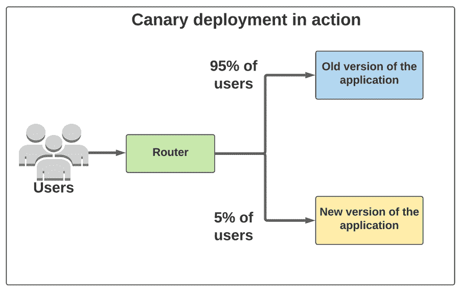

# 金丝雀部署

> 原文：<https://medium.com/codex/canary-deployment-90c5e3656f42?source=collection_archive---------11----------------------->

众所周知，持续集成和持续部署是开发和部署软件应用程序的新的和改进的方法。在过去的几年中，CI/ CD 在软件开发中的应用经历了巨大的转变。

CI/CD 环境与生产环境有很大不同。大多数 bug 只有在更新或更改影响到用户后才会自己暴露出来。这是全世界开发者和组织的一个主要缺点。

幸运的是，有一个解决方案，它被称为金丝雀部署。这是一个开发人员在将应用程序部署到大众之前对其进行现场测试的过程。

让我们在这篇博客中找到答案。

**目录**

1.  什么是金丝雀部署？
2.  金丝雀部署是如何工作的？
3.  你如何选择你的金丝雀？
4.  涉及金丝雀部署的实际应用
5.  结束语

# 什么是金丝雀部署？

Canary release 是一个将新版本推出给精选用户的过程。开发人员选择特定地理位置的人或满足特定条件的人来发布他们的更新。这些变化/更新最终会发布给所有人，但一小部分用户会比其他人先体验到。

将您的更新部署到这个小的子集，允许开发人员发现代码中的任何错误或 bug。与其将它发布给整个用户群并找出错误，这是一个更好的选择。

如果最初的用户发现任何错误或问题，开发人员可以立即修复并推出新的更新。如果他们发现新版本没有任何错误，他们可以向他们的整个用户群发布。

正如我们之前强调的，Canary 版本允许开发人员在应用程序面向整个用户群发布之前对其进行测试。但这一次，测试只涉及一小部分使用该应用程序的真实用户。

在某种程度上，蓝绿色部署和金丝雀部署非常相似。它们都有两个环境，并在两个环境之间转换用户。蓝色环境是中转区，绿色环境是生产区。但与 Canary 不同的是，他们不会在整个转变之前转移一小部分用户。

这两种环境之间的转换是在完全用户基础上进行的。

# 金丝雀部署是如何工作的？

最初，软件开发团队创建了两个环境。一个是预先存在的环境，另一个是对应用程序进行新的更新和更改的全新环境。

开发人员首先将一些用户安排到新环境中，以测试这些变化。这些用户的选择方式将在这篇博文的后面解释。随着开发人员对他们的新版本越来越有信心，他们开始将更多的用户引向它。

这允许他们在现实生活中与真实用户一起测试更新的性能。随着时间的推移，他们慢慢地将更多的用户转移到新版本，直到每个人都被转移。大多数公司在对他们的更新充满信心后，会停止使用旧版本。而一些组织坚持使用他们的旧版本，只是为了确保没有任何错误。如果他们发现错误，他们可以立即发出回滚命令，并在短时间内将所有用户转移回旧版本。

总之，您可以将 Canary 部署分为以下几个阶段

1.  将更新部署到一个或多个 Canary 服务器。
2.  测试 Canary 服务器并识别任何错误
3.  修复 bug，等待直到获得满意的输出。
4.  部署到剩余的服务器。

一些开发人员进行自动化测试，而一些开发人员只是让测试用户进入新的环境，等待测试结束。如果他们发现测试用户对更新感到满意，他们就把它部署给所有用户。

# 你将如何选择你的金丝雀？

了解系统中可以用来划分用户的东西是很重要的。通常有两个区域可以进行很好的划分:用户和实例。虽然创建一个双向分区是一个好的开始，但是一个多向分区更好，因为它允许你逐渐增加你的曝光率，同时获得对发布的信心。

用户和实例是开发人员选择测试集的两种最常见的方式。有时这是一个双向分区，而有时是一个多路分区。这完全取决于开发团队和他们试图推出的更新。

所有的应用程序都有用户或者终端用户的概念。开发团队可以选择根据时区或地理位置来区分这些用户。这是将您的更新发送到选定位置并在向所有用户发布之前进行测试的好方法。

一些组织也按百分比划分。他们对可以使用此更新的用户数量设置了最大限制。这可以是 5%到 15%之间的任何值。在此条件下登录到应用程序的前 15%的用户被设为“实时”用户，并将收到更新通知。如果他们选择更新它，他们将成为测试集的一部分。

最后，拥有大量用户的应用程序使用测试程序来寻找它们的金丝雀。您可能已经在数百万人使用的应用程序中看到过这种情况。愿意尝试的早期用户可以注册并下载更新。这可能是有益的，因为这些早期采用者通常是准备对你的新更新提供广泛反馈的人。

当您无法访问用户信息时，开发人员可以使用实例进行更新。如果您的应用程序有多个实例，开发人员可以选择一个并在其上滚动更新。

但是最终，您应该选择对您的业务影响最小的组。如果出现问题，您应该选择对收入影响较小的用户或实例列表。

在这个阶段，你可能会问，金丝雀环境和 staging 环境类似吗？

Canary 环境不同于暂存环境。主要原因是分段环境专用于特定的任务。它永远不会是一个完整的生产环境，也不具备这样的能力。但是 Canary 环境意味着所有用户最终都将存在于其中的生产环境。

# 涉及金丝雀部署的实际应用

脸书采用了多只金丝雀的策略，第一只只对内部员工可见，所有功能都打开，这样他们就可以及早发现新功能的问题。

脸书以一种非常独特的方式进行金丝雀部署。它有多级金丝雀，其中第一级是专门为脸书的员工。该环境对内部员工开放，所有功能都已打开。在那之后，它转移到由脸书的开发者选择的一小部分用户身上。

一旦这两个阶段都给出肯定的响应，它就被部署到全世界。

# 结束语

金丝雀是一个简单的概念，已经为世界各地的许多企业节省了时间和金钱。随着世界变得越来越快，金丝雀发展在这里停留！

*原载于*[*https://www . partech . nl*](https://www.partech.nl/nl/publicaties/2021/04/canary-deployment)*。*