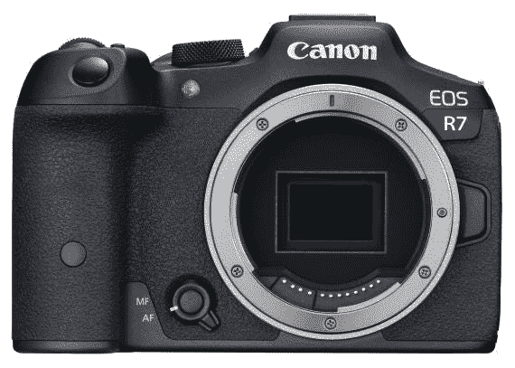

# 佳能推出带射频支架的 APS-C:带 32 MPx 的新 EOS R7

> 原文：<https://medium.com/codex/canon-launches-aps-c-with-rf-mount-new-eos-r7-with-32-mpx-e65f3baa2b6?source=collection_archive---------30----------------------->

佳能推出了新的带 RF 支架的 APS-C 相机，这将不再只是全画幅相机。新 EOS R7 获得了 32MPx APS-C 传感器，非常有效的机械稳定，也可以处理 60 fps 的 4K 视频序列。

资料来源:Canon.com

虽然许多人不愿意相信佳能可以在 APS-C 级中从 EF-M 转换到 RF 挂载，并拥有两个 APC-S CSC 系统(一个…